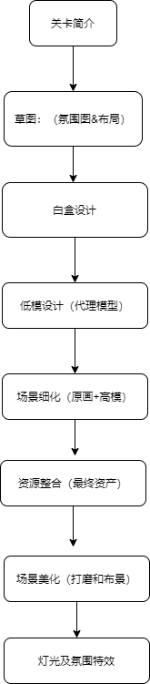
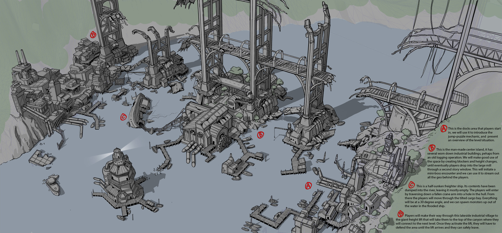
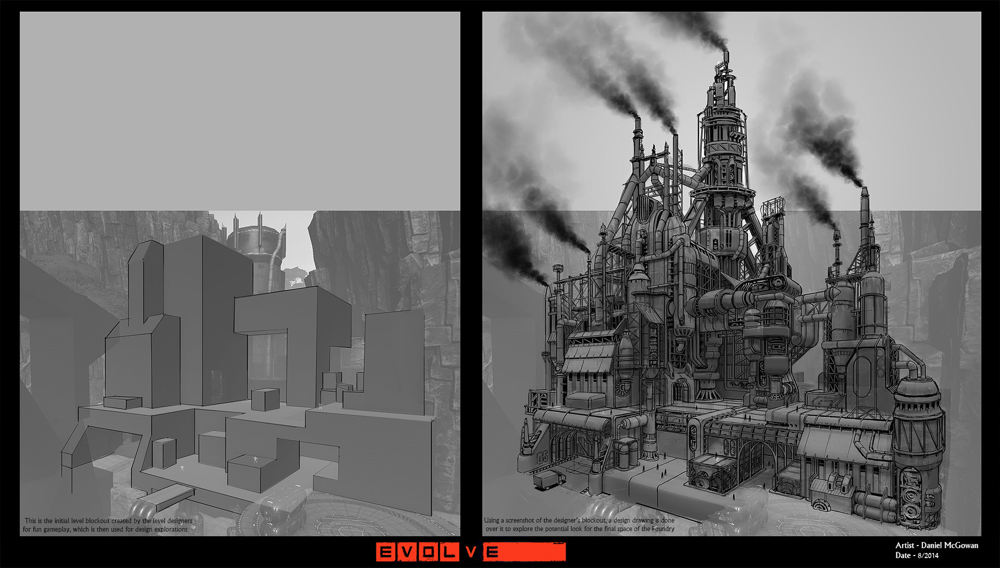
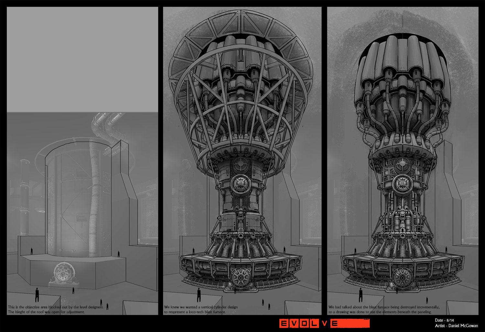
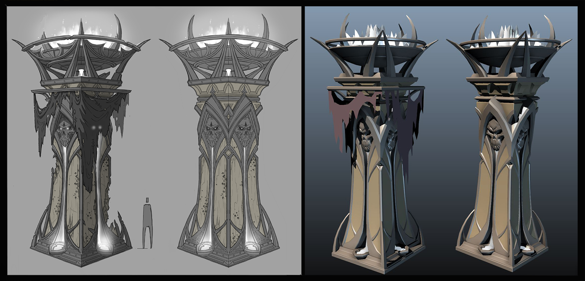
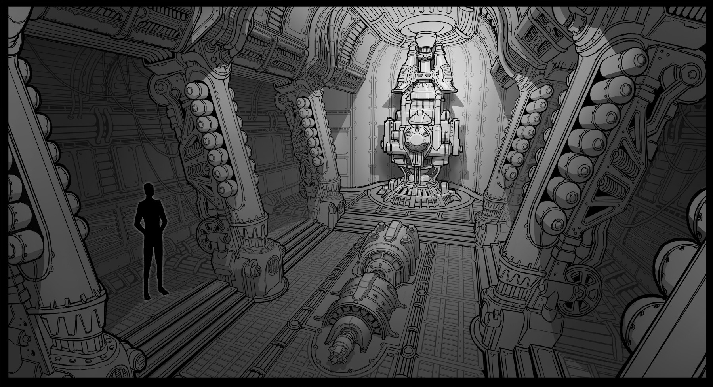
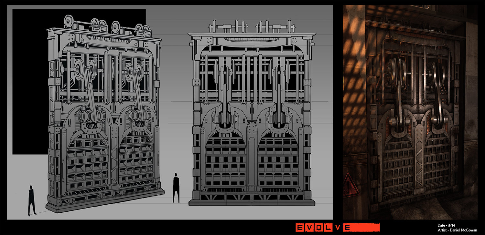
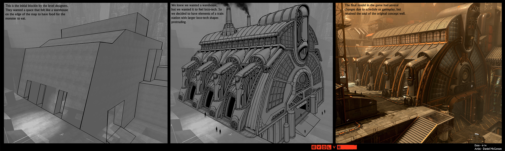
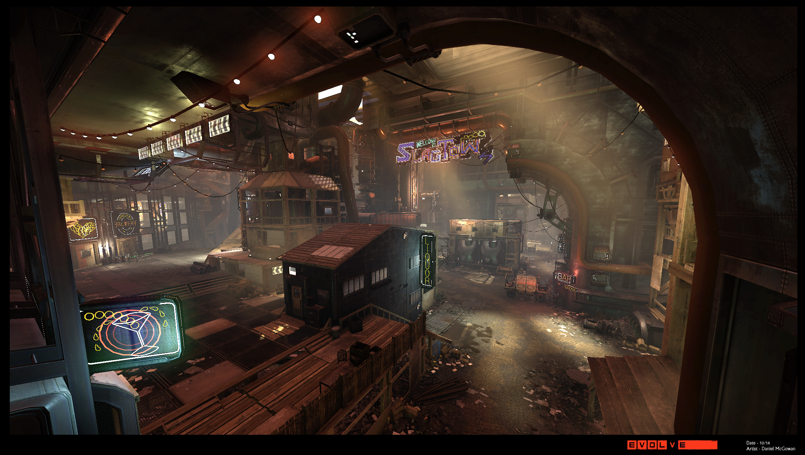
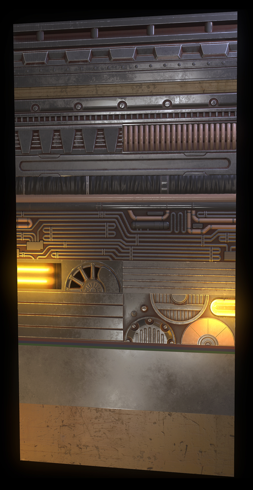

# 3D 游戏环境设计流程

## 1. 概念简介

Environment Art 环境艺术：  
3D 游戏中的环境艺术，是一个大范围的统称，可以简单理解为所有关卡设置的集合，所有关卡合在一起，就是整个游戏环境。

关卡：一个关卡 level，在 Unity 中，可以通常用一个场景 Scene 来表示

## 2. 流程简介

## 3. 各步骤说明：

### 3.1 关卡简介（文字概要设计）

关卡的文字概念设计

这可以是作者的故事或目标的描述，需要在关卡的游戏过程中发生。有时级别简报就像一两句话一样简单。关卡简介通常在关卡启动会议期间呈现给概念美术师、关卡设计师和环境美术师。一个好的关卡简介足以让团队兴奋，但也足以让美工们探索一些更大的想法。它还有助于为这个新关卡与其前后关卡的联系方式提供背景信息。

### 3.2 草图（氛围图&布局图）

在级别启动会议之后可以采取两个主要方向。一个是创建一些关键艺术，另一个是创建一些高级布局。如果他们有资源/时间，一些团队实际上会两者兼而有之。关键艺术通常是精美的画作，清楚地定义了情绪和调色板以及一些设计。他们还让团队兴奋，并帮助每个人朝着同一个愿景前进。高级布局旨在定义游戏玩法的关卡节拍和可能的想法。

### 3.3 白盒设计

关卡设计师会用简单的几何体制作关卡来测试空间以及游戏机制，因为便于验证和修改。在这个阶段美术是可以参加进来及早发现一些问题的，下面是白盒以及对应的原画设计图：

### 3.4 低模设计（代理阶段）

就是简单模型替代几何体，模型使用的多边形个数较少，但已经可以看出较为清晰的轮廓和外观

代理可以让团队开始跟踪他们需要多少资产才能最终完成并阻止模块化集膨胀过大。如果代理对概念是准确的，那么世界构建者此时也可以开始拨入作品。一个好的代理侧重于轮廓、准确的比例和清晰的材料分组。

下面左边是原画，右边是低模

### 3.5 场景细化（原画细化+高模建模）

细致的原画设计出来后，可以辅助 3D 美工，将低模细化为高模

这个过程通常和上面的过程交错进行

下面就是细化过的原画：

下图左边是原画，右侧是高模

### 3.6 资源整合（最终资产）

所有的场景资源在这个阶段进行融合

流程:

### 3.7 场景美化（打磨+布景）

锦上添花的阶段，丰富和完善场景，让其更加生动

### 3.8 灯光及特效

灯光和特效，进一步烘托场景所需要的氛围，进而影响玩家在玩游戏时的心情，增强代入感

### 3.9 模块化资源

将可以重复使用的资源模块化，可以极大提升整个环境的创建速度

 
这个流程仅仅是比较通用的一种方式，并非铁律，不同团队可以根据自己的特点进行调整，以此为参考即可。
 

 

> 参考资料：
> [Gamedev 中的环境艺术流程](https://80.lv/articles/the-stages-of-environment-art-in-gamedev/)
