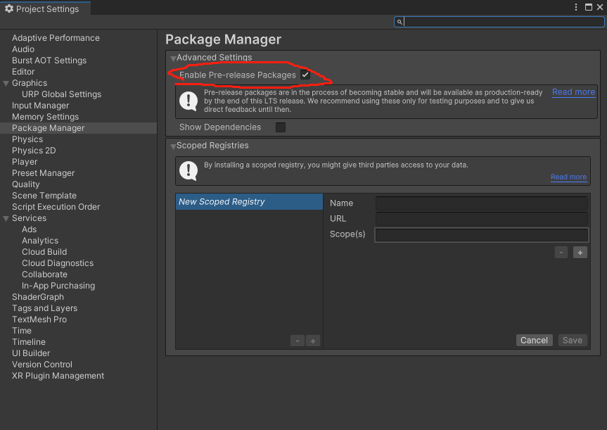
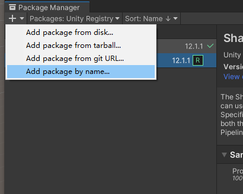
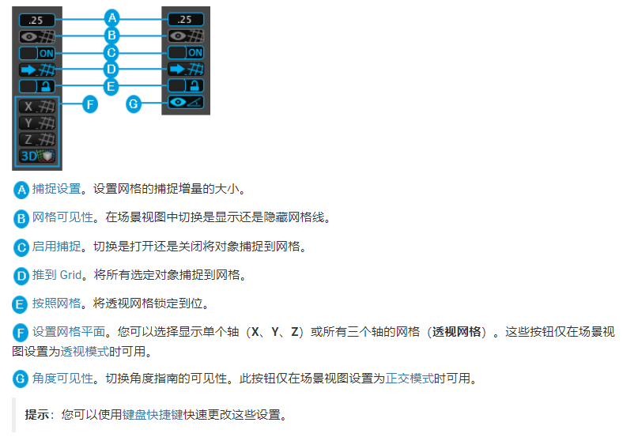

# ProGrids

> 参考资料：
>
> [ProGrids 官方文档](https://docs.unity3d.com/Packages/com.unity.ProGrids@3.0/manual/index.html)

## 1. 简介

高级网格工具，比 Unity 中默认的网格系统好用很多

方便在构建场景环境时，方便定位、对齐、移动。是 ProBuilder 的好基友。

## 2. 安装

### 2.1 通过包管理器

ProGrids 最新版没有正式版，所以必须在 Package Manager 的配置中，打开允许预览版的选项，然后再搜索 ProGridss

### 2.2 直接安装

如果通过包管理器怎么也搜不到，可以采用直接安装的方式：

windows -> package manager -> 左上角 + -> Add package by name -> 输入包名 com.unity.ProGrids -> 确定

## 3. 用法

一般配合 ProBuilder 使用，即使不用 ProBuilder， 在设置场景，辅助定位时，也很方便。

