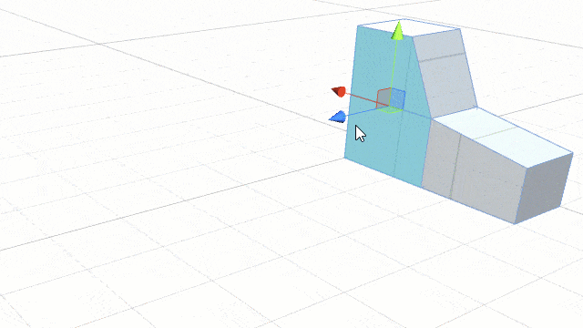
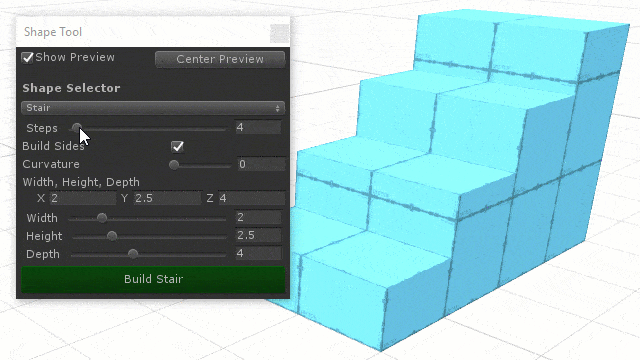
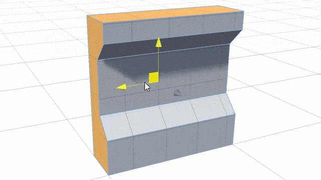
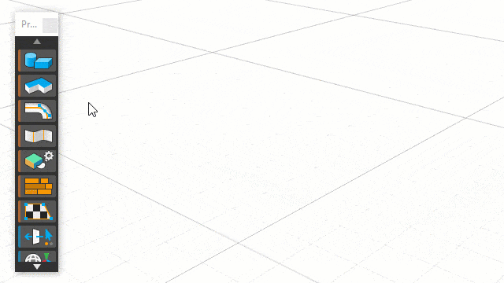
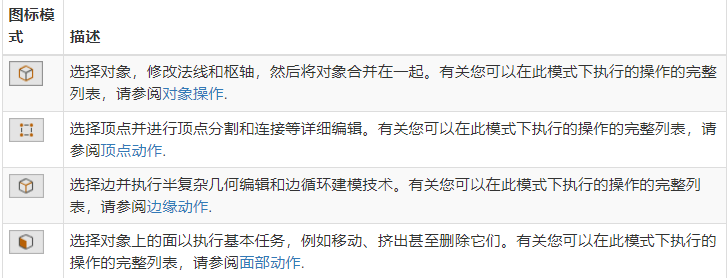

# ProBuilder 用法简介

> 参考资料：
>
> - [probuilder 介绍](https://unity.com/cn/features/probuilder)
> - [博客文章：probuild & polybrush 简介](https://blog.unity.com/technology/probuilder-joins-unity-offering-integrated-in-editor-advanced-level-design?_ga=2.131635149.319662757.1639364593-522971275.1624332126)
> - [Probuilder 官方文档](https://docs.unity3d.com/Packages/com.unity.probuilder@5.0/manual/index.html)

## 1. ProBuilder 简介

ProBuilder 是 Unity 从 2018 版本开始内嵌的一个低模建模工具，可以进行基本的 3D 建模和关卡设计。

功能举例： 快速构建原型结构、复杂地形特征、车辆和武器，或制作自定义碰撞几何体、触发区域或导航网格

核心功能：

- 挤出和插入

  

- 程序化形状

  

- 场景中的 UV 控制
  
- 无限可编辑的形状
  

## 2. 安装

一般项目模板中，并不默认包含 ProBuilder，需要在 Package Manager 中手动安装

如果您使用的是通用渲染管线(URP) 或高清晰度渲染管线(HDRP)，则还需要导入正确显示顶点颜色和纹理所需的相应 URP 或 HDRP 着色器。

## 3. 编辑模式工具栏

ProBuilder 使用编辑模式来定义您正在选择和编辑的内容。

快捷键：

- Escape 从任何其他模式切换到对象模式。
- G 在对象和元素模式之间切换。例如，如果您处于顶点模式，按 G 一次返回对象模式，再按一次切换回顶点模式。
- H 在 Element 模式（Vertex、Edge 和 Face）之间切换。

## 4. ProBuilder 工具栏

您可以从 Unity 的顶部菜单打开 ProBuilder 工具栏：Tools > ProBuilder > ProBuilder Window。

工具栏按颜色分类：

- 橙色: 打开不同的工具窗口
- 蓝色： 设置或更改选择操作
- 绿色： 影响整个对象的网格编辑
- 红色： 元素特殊网格编辑（在 Vertex、Edge 和 Face 几何体上）

工具栏显示模式：文字或图标

