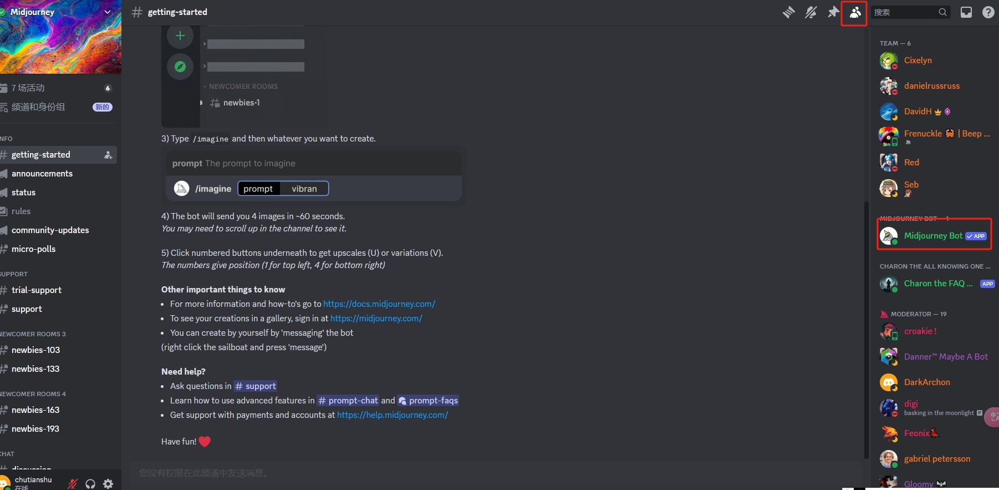
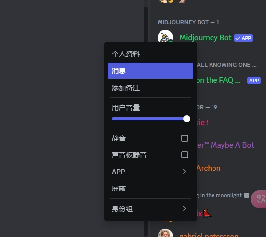
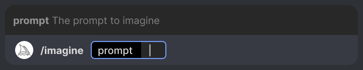
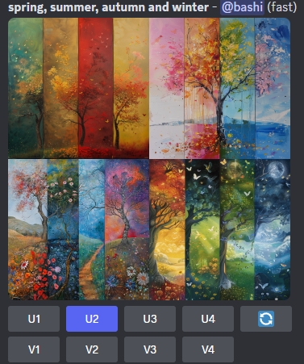
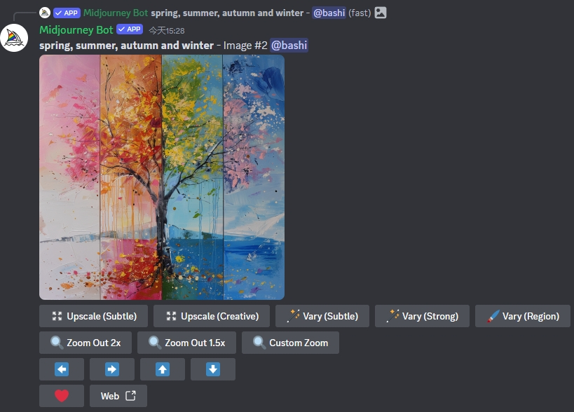

# 基本用法

## 1. 注册 Midjourney

https://Midjourney.com/account 注册账号

## 2. 购买 Midjourney 服务

[Midjourney服务购买](https://docs.midjourney.com/plans)

> 建议：
> 可以先购买一个月的 “Basic Plan”，也就是基础版，支持支付宝

## 3. Midjourney 和 Discord 关系

早期 MidJourney 为了快速发展，并没有开发自己的应用，把全部的精力都放在 AI 算法、模型本身上了。

所以，MJ 将 UI 托付给了 Discord ，借由 Discord 频道中 Robot 的能力，搭建快捷命令，而 MidJourney 只需要负责 Web API 即可。 

## 4. 加入 Midjourney 的 Discord 服务器

 http://discord.gg/midjourney 

## 5. 使用命令生成图片

* 选中一个 newbie-XXX 频道（或者任意其他频道），在右侧上方，点击“显示成员名单”按钮
  
* 右键点击 Midjourney Bot，选择 “消息”，进入和 mj 机器人的私聊
  
* 使用 /imagine 命令，填入 prompt ，生成图片, 首次的话，需要 Accept ToS（同意遵守协议）
  

prompt : Midjourney Bot 最适合使用描述您想要查看的内容的简单简短短语。避免使用一长串的请求和说明。

## 6. 选择图片

  选中生成图片下面的 U1-4 ，即选择生成图片中的1-4号中的任一，如果不满意，点击 刷新重新生成；如果选择 V1-4 ,是根据生成的 1-4 号 生成变体 —— 即根据所选图像，再生成4个相关图像，保持与所选图像一般的样式和构图

  

## 7. 增强或更改图片

  选中一个图像后，还可以对其进行进一步调整

  
* Vary 变体：  
   分 Strong 强 和 Subtle 弱 两种选择，即对当前图片再进行变化，生成4个新图，类似与上面提到的 V1-4 按钮  
   Region 功能超强，可以选取并用提示词更改图片某个区域
* Upscale 升频：  
  默认 1024*1024，使用 Upscale 可以将图片分辨率扩大一倍到 2048*2048  
  Subtle 细节与原始图像非常相似；Creative 会向图像添加新的细节。
* Zoom Out 扩展：  
  扩展和上面的 Upscale 不同，会增加新的扩展内容到图像中
* 上下左右：  
  方向键和 zoom out 功能类似，只不过是向单个方向扩展
* Web ：
  在 Midjourney 的个人画廊 web 应用中，查看图片

 

 

> 参考资料: 
>
> * [https://docs.midjourney.com/docs](https://docs.midjourney.com/docs)