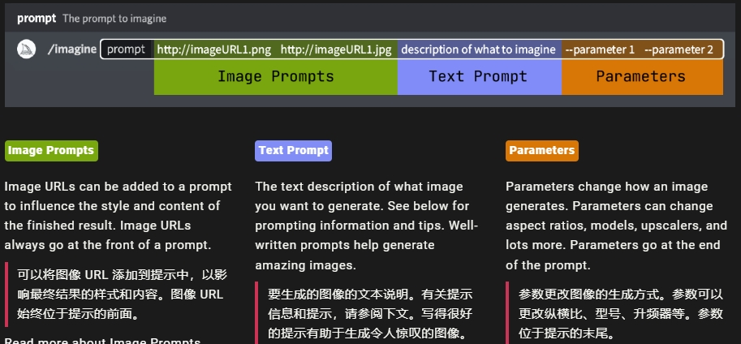

# Prompt 提示词

提示是 Midjourney Bot 解释以生成图像的简短文本短语。Midjourney Bot 将提示中的单词和短语分解为更小的部分，称为令牌，将其与其训练数据进行比较，然后用于生成图像。精心制作的提示可以帮助制作独特而令人兴奋的图像。

## 1. Midjourney Basic Prompt 基本提示词

简短明确的短语拼接。不需要语法

虽然 Midjourney v6 能更好的接收人类的自然语言，但 Midjourney 本身算法更适合使用简短明确的单词，而非包含复杂语法的语句

### 1.1 提示词法则

选词越精确越好

* 选择精准的用词，越具体的越好：  
    比如 Instead of big, try tiny, huge, gigantic, enormous, or immense；用复数时，一定要指定数量，即使没有具体的数量，也要有较为准确的数量描述；
* 只包含想要的东西，不想要的，可以通过 --no 参数设置，不需要在提示词中加 no xxx
* 提示词宜短不宜长，更少的细节意味着更多的变化，但更少的控制，提示词中只应该包含最重要的元素

### 1.2 提示词核心内容：

应该以下面几种核心内容，来构建自己的提示词

* Subject: person, animal, character, location, object  
  主题：人、动物、人物、位置、对象 等
* Medium: photo, painting, illustration, sculpture, doodle, tapestry  
  媒介： 照片， 绘画， 插画， 雕塑， 涂鸦， 挂毯
* Environment: indoors, outdoors, on the moon, underwater, in the city  
  环境：室内、室外、月球、水下、城市
* Lighting: soft, ambient, overcast, neon, studio lights  
  灯光：柔和、环境、阴天、霓虹灯、演播室灯
* Color: vibrant, muted, bright, monochromatic, colorful, black and white, pastel  
  颜色：鲜艳、柔和、明亮、单色、色彩缤纷、黑白、粉彩
* Mood: sedate, calm, raucous, energetic  
  情绪：沉稳、平静、喧闹、精力充沛
* Composition: portrait, headshot, closeup, birds-eye view  
  构图：肖像、头像、特写、鸟瞰图
* 摄像机角度等

## 2. Advanced Prompts 高级提示

更高级的提示可以包括一个或多个图像 URL、多个文本短语以及一个或多个参数

