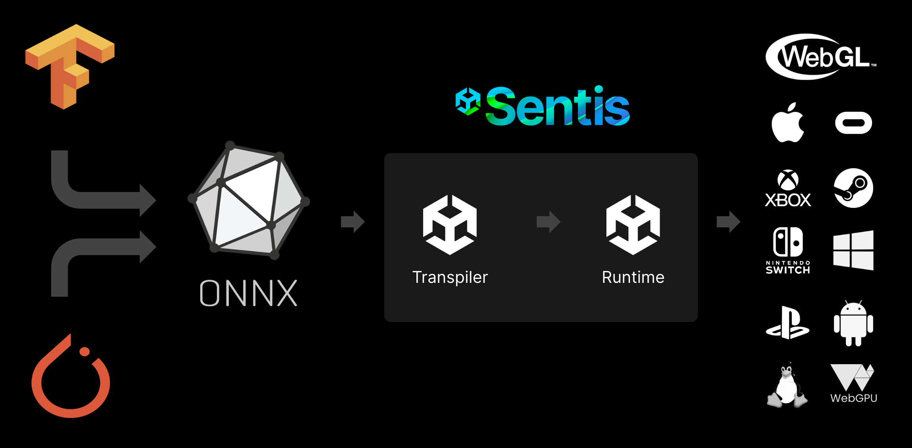
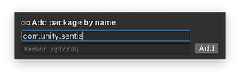

# 01 - Unity Sentis 入门

## 1. Unity Sentis 简介

### 1.1 概念
Sentis 是一个用于人工智能模型的本地推理引擎（神经网络推理库），它利用终端用户设备上的计算，而不是云服务器。它可以在任何可以部署 Unity 运行时的地方运行。

可以使用 Sentis 将训练有素的神经网络模型导入 Unity，然后在 Unity 支持的任何平台和编辑器中本地实时运行这些模型。您可以选择在 GPU 或 CPU 上运行模型。

它取代了 Barracuda（Unity 上一个本地神经网络库），解决了我们在 Barracuda 处于早期原型阶段时收到的许多反馈。最重要的是，Sentis 可以以游戏速度运行许多神经网络。可用于无限制的本地推理。

### 1.2 功能

Sentis 有哪些功能？

Sentis 允许您将 ONNX 格式 的人工智能/ML 神经网络模型（来自 TensorFlow、PyTorch 和其他人工智能中心）导入 Unity 编辑器，然后在所有 Unity 支持平台上的用户设备上实时优化和运行推理。



Sentis 支持 opset 版本介于 7 和 15 之间的大多数 ONNX 格式模型。有关详细信息，请参阅支持的 ONNX 操作符。

您可以在 Unity 运行时（用于游戏）或 Unity 编辑器（用于游戏创建）中完成这项工作，而无需使用昂贵的 GPU 云服务器。Sentis 速度快，避免了云计算成本，并允许进行私有神经网络推断。最终，Sentis 将使 Unity 开发人员能够利用人工智能领域令人难以置信的创新，而这在以前是不可能实现的。

可能的使用案例有很多，下面列出来一些经过 Unity 开发者已经实现的，希望 Sentis 的用户可以发挥出更多的创意 ：

1. 图像升级：放大低分辨率图像、模型、纹理等。
2. 风格转换：将场景的外观或图像效果转换为新的风格
3. 非游戏角色（NPC）：自动生成人物对话
4. 语音识别（NLP）：解释现场语音 5.
5. 人体/物体检测: 使用摄像头检测物体
6. 深度估计: 使用摄像头检测深度
7. 图像、视频和 3D 模型分类：检测屏幕上的物体
8. 手写分类：检测手写字母、符号或数字
9. 创造独一无二的玩家体验：生成无限独特的游戏场景
10. 动画: 绑定自动生成的姿势
11. 模拟助手： 用神经网络逼近复杂功能（Approximate a complicated function ）？，驱动游戏逻辑
12. 时间序列：异常检测、预测/预报

## 2. Sentis Quick Start 快速上手

### 2.1 安装 Sentis

1. 从 Unity Hub 下载 Unity 2023.2。   
   最新的Sentis 1.3.0 适用于 2023.2 以上版本，而之前的 Sentis 版本适用于 Unity 2021.3 以上版本。
2. 创建新的 Unity 项目或打开现有项目。
3. 进入Window > Package Manager，然后点击 + 图标，选择 "Add package by name… "并输入 "com.unity.sentis"  
    
4. 按添加按钮安装软件包  
   

### 2.2 使用 Sentis

使用 Sentis 在 Unity 中运行神经网络模型，通常需要如下步骤：

1. 使用 Unity.Sentis 命名空间。
2. 加载神经网络模型文件。
3. 为模型创建输入。
4. 创建推理引擎（工作站）。
5. 使用输入运行模型，推理出结果。
6. 获取结果

## 3. 关于 ONNX 神经网络模型

### 3.1  什么是 ONNX Model

ONNX 是一种用于表示机器学习模型的开放格式。ONNX 定义了一组通用算子（机器学习和深度学习模型的构件）和一种通用文件格式，使人工智能开发人员能够在各种框架、工具、运行时和编译器中使用模型。ONNX 模型现已经成为一种广泛流行的开放标准格式。

ONNX 模型主要可以应用在以下方面：

### Vision 视觉
* 图像分类
* 物体检测与图像分割
* 身体、面部和手势分析
* 图像处理
### Language 语言
* 机器理解
* 机器翻译
* 语言建模
### 其他
* 视觉问题解答与对话
* 语音和音频处理
* 其他有趣的模型

### 3.2  加载 ONNX 神经网络模型

Sentis 可以导入开放神经网络交换 [ONNX](https://onnx.ai/) 格式的模型文件。要加载模型，请按照以下步骤操作：

1. 从机器学习框架中将模型导出为 ONNX 格式，或从互联网上下载 ONNX 模型（推荐：[ONNX Modle ZOO](https://github.com/onnx/models)）。
2. 将模型文件添加到 "项目 "窗口的 "资产 "文件夹中。
3. 在脚本中创建运行时模型:  

``` C# 
using Unity.Sentis;
.....

//生成模型资源对象
ModelAsset modelAsset = Resources.Load("model-file-in-assets-folder") as ModelAsset;
//创建运行时模型对象
runtimeModel = ModelLoader.Load(modelAsset);

//使用张量 API 为模型创建包含数据的张量。您可以将数组或纹理转换为张量。
//获取纹理图片作为输入
Texture2D inputTexture = Resources.Load("image-file") as Texture2D;
// 下面是将图片纹理转换为张量 Convert a texture to a tensor
TensorFloat inputTensor = TextureConverter.ToTensor(inputTexture);

//创建推理引擎(a worker):
//在 Sentis 中，worker 就是推理引擎。您可以创建一个 Worker，将模型分解为可执行的任务，在 GPU 或 CPU 上运行这些任务，并输出结果
// 这条代码使用 Sentis 计算着色器创建一个在 GPU 上运行的 Worker：
Worker worker = WorkerFactory.CreateWorker(BackendType.GPUCompute, runtimeModel);

// 运行模型
worker.Execute(inputTensor);

// 使用 worker 对象的 PeekOutput()方法 获取结果，保存为张量类型
TensorFloat outputTensor = worker.PeekOutput() as TensorFloat;
```

>扩展阅读：
> [一分钟快速了解张量Tensor](https://easyai.tech/ai-definition/tensor/)

## 4. 完整示例

下面的示例对一个手写数字进行了分类。

1. 准备工作：从 ONNX Model Zoo 下载手写识别 ONNX 模型文件，例如 MNIST 手写数字识别模型 mnist-8.onnx，并将其拖入项目窗口的 Assets 文件夹。

2. 将以下脚本附加到场景中的一个 GameObject。
``` C#
using UnityEngine;
using Unity.Sentis;
using Unity.Sentis.Layers;

public class ClassifyHandwrittenDigit : MonoBehaviour
{
    public Texture2D inputTexture;
    public ModelAsset modelAsset;
    Model runtimeModel;
    IWorker worker;
    public float[] results;

    void Start()
    {
        // Create the runtime model
        runtimeModel = ModelLoader.Load(modelAsset);

        // Add softmax layer to end of model instead of non-softmaxed output
        string softmaxOutputName = "Softmax_Output";
        runtimeModel.AddLayer(new Softmax(softmaxOutputName, runtimeModel.outputs[0]));
        runtimeModel.outputs[0] = softmaxOutputName;

        // Create input data as a tensor
        using Tensor inputTensor = TextureConverter.ToTensor(inputTexture, width: 28, height: 28, channels: 1);

        // Create an engine
        worker = WorkerFactory.CreateWorker(BackendType.GPUCompute, runtimeModel);

        // Run the model with the input data
        worker.Execute(inputTensor);

        // Get the result
        using TensorFloat outputTensor = worker.PeekOutput() as TensorFloat;

        // Move the tensor data to the CPU before reading it
        outputTensor.MakeReadable();

        results = outputTensor.ToReadOnlyArray();
    }

    void OnDisable()
    {
        // Tell the GPU we're finished with the memory the engine used
        worker.Dispose();
    }
}
```
3. 将模型资产拖入游戏对象检查器窗口中的 modelAsset 字段
4. 下载下面的 digit.png 图片并将其拖入项目窗口的 Assets 文件夹。在导入设置中将 "Non-Power of 2"设置为 "None"，然后单击 "Apply"。  
   
5. 将 digit.png 拖入游戏对象 Inspector 窗口中的 inputTexture（输入纹理）字段
6. 点击播放。在 GameObject 的 "检查器 "窗口中，结果数组的每一项都显示了模型预测图像是数字的程度。例如，数组的第 0 项表示模型预测图像是手写 0 的程度。

<br>
<hr>
<br>

> 参考资料：
> * [Sentis 官方索引页](https://unity.com/products/sentis)
> * [Sentis Quick Start](https://discussions.unity.com/t/about-sentis-beta/260899)
> * [Sentis 官方文档](https://docs.unity3d.com/Packages/com.unity.sentis@1.3/manual/index.html)
> * [Sentis 官方论坛](https://discussions.unity.com/c/ai-beta/sentis/10)
> * [实例：Unity Sentis project sample: Build an escape room with a digit detection AI model](https://www.youtube.com/watch?v=IofX0CAYdmU&t=10s)