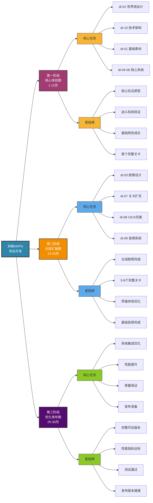

# dt-00-计划任务总纲

## 文档信息
- **文档编号**: dt-00
- **文档名称**: 计划任务总纲
- **版本**: v1.0
- **创建日期**: 2025-09-10
- **负责人**: 项目管理团队
- **审核状态**: 待审核

## 文档概述
本文档为宋朝背景2D像素ARPG游戏项目的总体计划任务指导纲领，旨在为整个项目的规划、执行、监控和交付提供全面的指导框架。整合了项目分析结果、实施策略、管理建议和最佳实践，确保项目能够高效、有序地推进。

## 项目总体概述

### 项目背景
本项目是一个以宋朝为背景的2D像素风格动作角色扮演游戏，融合了历史元素与神话传说，玩家将扮演现代穿越者回到宋朝，在复杂的政治、江湖和神话环境中展开冒险。

### 项目规模评估（优化后）
- **总任务数量**: 400-500 个独立任务（缩减50%）
- **预估开发工时**: 1,600-2,000 小时
- **建议开发周期**: 30个月（分3个主要阶段）
- **推荐团队规模**: 8-12 名专业人才
- **投资级别**: 中等规模项目，预算约80-100万美元

### 核心特色
- **历史还原**: 精确还原宋朝历史文化背景
- **像素艺术**: 高质量2D像素风格视觉呈现
- **深度剧情**: 多分支、多结局的复杂叙事系统
- **战斗系统**: 流畅且富有策略性的ARPG战斗
- **角色成长**: 多样化的角色发展路径

## 任务系统架构

### 文档结构体系
项目采用10个核心模块文档（dt-01至dt-10），每个模块包含：
- **4级任务层级**: 1 → 1-1 → 1-1-1 → 1-1-1-1
- **任务编号系统**: 唯一标识每个任务
- **责任分配**: 明确的任务负责人
- **依赖关系**: 完整的任务依赖链
- **时间估算**: 详细的工时预估
- **优先级排序**: 科学的优先级划分

### 模块功能概述

#### dt-01-素材设计开发
- **核心职责**: 游戏所有视觉和音频资源的创建
- **关键产出**: 2D像素美术、角色精灵、环境素材、特效、音效
- **依赖关系**: 依赖dt-02的世界观设定

#### dt-02-世界观设计开发  
- **核心职责**: 构建完整的游戏世界观和背景故事
- **关键产出**: 历史背景、地理设定、势力分布、文化体系
- **依赖关系**: 基础模块，无前置依赖

#### dt-03-剧情设计开发
- **核心职责**: 设计游戏的主线剧情、支线任务和角色故事
- **关键产出**: 剧本、对话、分支剧情、隐藏剧情
- **依赖关系**: 依赖dt-02的世界观设定

#### dt-04-核心玩法设计与实现
- **核心职责**: 实现游戏的基础玩法机制
- **关键产出**: 角色控制、探索系统、交互机制、经济系统
- **依赖关系**: 依赖dt-01和dt-02

#### dt-05-战斗系统设计与实现
- **核心职责**: 开发战斗相关的所有系统
- **关键产出**: 战斗机制、技能系统、敌人AI、战斗平衡
- **依赖关系**: 依赖dt-04的核心玩法

#### dt-06-角色成长系统设计与实现
- **核心职责**: 设计角色发展和进步的系统
- **关键产出**: 等级系统、技能树、装备系统、属性成长
- **依赖关系**: 依赖dt-04和dt-05

#### dt-07-关卡设计与实现
- **核心职责**: 创建游戏关卡和场景
- **关键产出**: 关卡布局、场景设计、敌人配置、谜题设计
- **依赖关系**: 依赖dt-02、dt-04、dt-05、dt-06

#### dt-08-UIUX系统设计与实现
- **核心职责**: 设计用户界面和交互体验
- **关键产出**: 界面设计、交互系统、适配方案、本地化
- **依赖关系**: 依赖dt-04、dt-05、dt-06、dt-07

#### dt-09-音效系统设计与实现
- **核心职责**: 实现音频系统和音效制作
- **关键产出**: 背景音乐、音效、语音、音频引擎
- **依赖关系**: 依赖dt-01和dt-05

#### dt-10-技术架构与引擎配置
- **核心职责**: 构建技术基础设施
- **关键产出**: 引擎配置、系统架构、性能优化、质量保证
- **依赖关系**: 基础技术模块，需要早期启动

## 开发阶段规划（优化后）

### 第一阶段：核心体验期（第1-12个月）
**核心目标**: 建立核心游戏体验，验证玩法可行性

#### 关键任务
1. **dt-02-世界观设计开发**: 完成精简世界观框架
2. **dt-10-技术架构与引擎配置**: 建立轻量技术架构
3. **dt-01-素材设计开发**: 制作核心角色和基础场景素材
4. **dt-04-06 核心系统**: 实现基础玩法、战斗和成长系统

#### 里程碑
- 核心玩法原型可玩验证
- 战斗系统基础功能完成
- 基础角色成长机制实现
- 首个完整关卡可体验
- AI工具应用验证完成

### 第二阶段：内容扩展期（第13-24个月）
**核心目标**: 扩展游戏内容，完善系统深度

#### 关键任务
1. **dt-03-剧情设计开发**: 开发主线剧情（5-6小时游戏时间）
2. **dt-07-关卡设计与实现**: 创建5-8个完整关卡
3. **dt-08-UIUX系统设计与实现**: 完善用户界面和交互体验
4. **dt-09-音效系统设计与实现**: 完成基础音频系统

#### 里程碑
- 主线剧情完整可体验
- 5-8个高质量关卡完成
- 界面体验优化完成
- 基础音频系统就绪
- AI工具应用标准化

### 第三阶段：优化发布期（第25-30个月）
**核心目标**: 整合优化，准备发布

#### 关键任务
1. **系统集成优化**: 所有系统整合和性能优化
2. **质量保证**: 完整测试和问题修复
3. **用户体验优化**: 基于反馈改进游戏体验
4. **发布准备**: 最终版本准备和文档整理

#### 里程碑
- 完整可玩版本完成
- 性能指标达标（60FPS+）
- 测试通过率>95%
- 发布版本准备就绪
- AI开发流程文档化

## 项目实施策略

### 任务管理策略

#### 层级责任分工
- **Level 1（模块级）**: 模块负责人负责整体规划和协调
- **Level 2（子系统级）**: 高级开发者负责子系统实现
- **Level 3（功能级）**: 专业人员负责具体功能开发
- **Level 4（任务级）**: 执行者负责具体任务完成

#### 任务状态管理
- **待开始**: 任务已规划，等待开始执行
- **进行中**: 任务正在执行中
- **已完成**: 任务已成功完成
- **已阻塞**: 任务因依赖或其他原因被阻塞
- **已取消**: 任务被取消不再执行

#### 进度跟踪机制
1. **每日更新**: 任务执行者更新任务状态
2. **每周回顾**: 模块负责人检查进度
3. **月度评估**: 项目管理层整体评估
4. **季度规划**: 调整下季度计划

### 资源管理策略

#### 人力资源配置（优化后）
- **核心管理层**: 项目经理、技术总监、创意总监（3人）
- **模块负责人**: 核心模块负责人（5-6人，部分模块合并）
- **开发团队**: 程序员、美术师、设计师（5-8人）
- **质量保证**: 测试人员、质量分析师（2-3人）
- **AI工具专家**: AI工具应用顾问（1人，外部合作）

#### 时间资源分配
- **规划阶段**: 占总时间15%
- **开发阶段**: 占总时间60%
- **测试阶段**: 占总时间20%
- **发布准备**: 占总时间5%

#### 财务资源规划（优化后）
- **总预算**: 约80-100万美元（30个月）
- **人力成本**: 占总预算50-60%（8-12人团队）
- **技术成本**: 占总预算15-20%（包括AI工具订阅）
- **市场成本**: 占总预算10-15%（专注于独立游戏市场）
- **应急储备**: 占总预算10-15%（考虑到AI工具不确定性）

### 质量管理策略

#### 质量标准体系
- **代码质量**: 遵循编程规范，代码覆盖率>80%
- **美术质量**: 符合美术风格指南，视觉一致性
- **设计质量**: 用户体验良好，游戏性充分
- **性能质量**: 目标平台流畅运行，帧率稳定

#### 质量控制流程
1. **需求审查**: 确保需求清晰完整
2. **设计审查**: 设计方案评审
3. **实现审查**: 代码和实现质量检查
4. **测试验证**: 全面测试和问题修复
5. **发布审查**: 发布前最终检查

#### 质量度量指标
- **任务完成率**: 计划任务完成比例
- **缺陷密度**: 每千行代码缺陷数量
- **用户满意度**: 测试用户反馈评分
- **性能指标**: 帧率、加载时间、内存占用

### 风险管理策略

#### 风险识别与分类
- **技术风险**: 技术难度、性能问题、兼容性
- **进度风险**: 延期风险、依赖风险、资源风险
- **质量风险**: 功能缺陷、体验问题、性能不达标
- **市场风险**: 竞争变化、用户需求变化

#### 高风险项目重点关注
1. **dt-05-战斗系统**: 战斗机制复杂，影响核心体验
2. **dt-03-剧情系统**: 分支剧情复杂，实现难度大
3. **dt-10-技术架构**: 技术选型影响整个项目

#### 风险缓解措施
1. **技术预研**: 提前进行技术可行性验证
2. **原型开发**: 核心系统早期原型验证
3. **分阶段实施**: 复杂功能分步实现
4. **持续监控**: 定期风险评估和应对

#### AI工具专项风险管理
1. **技术验证风险**: AI工具在实际游戏开发中效果未知
   - **缓解措施**: 第一阶段进行AI工具验证，建立效果评估体系
   - **备用方案**: 准备传统开发流程，确保可回退

2. **质量一致性风险**: AI生成内容质量不稳定
   - **缓解措施**: 建立AI内容质量标准和人工审核流程
   - **质量控制**: 关键内容由专业人员审核和优化

3. **工具依赖风险**: 过度依赖特定AI工具
   - **缓解措施**: 建立多工具备选方案，避免单一依赖
   - **技术自主**: 保持核心技术的自主掌控能力

4. **成本控制风险**: AI工具订阅成本超出预算
   - **缓解措施**: 建立AI工具使用预算监控机制
   - **效率评估**: 定期评估AI工具投入产出比

## 团队组织架构

### 核心管理层
- **项目经理**: 负责整体项目规划和执行
- **技术总监**: 负责技术决策和架构设计
- **创意总监**: 负责创意方向和质量把控
- **制作总监**: 负责资源协调和进度管理

### 模块负责人团队
每个dt文档配备专门的模块负责人：
- **dt-01负责人**: 资深美术总监
- **dt-02负责人**: 首席编剧/世界观设计师
- **dt-03负责人**: 剧情系统设计师
- **dt-04负责人**: 核心玩法设计师
- **dt-05负责人**: 战斗系统设计师
- **dt-06负责人**: 系统设计师
- **dt-07负责人**: 关卡设计师
- **dt-08负责人**: UI/UX设计师
- **dt-09负责人**: 音频总监
- **dt-10负责人**: 技术总监

### 执行团队结构
- **程序开发组**: 引擎程序员、游戏逻辑程序员、工具程序员
- **美术创作组**: 像素艺术家、动画师、UI设计师、特效师
- **设计创作组**: 游戏设计师、关卡设计师、系统设计师
- **音频制作组**: 作曲家、音效师、配音导演
- **质量保证组**: 测试工程师、QA分析师

## 工具与技术栈推荐

### 项目管理工具
- **任务管理**: Jira、Trello、Asana
- **文档管理**: Confluence、Notion、SharePoint
- **版本控制**: Git、GitHub、GitLab、Bitbucket
- **持续集成**: Jenkins、GitHub Actions、CircleCI

### 开发工具链
- **游戏引擎**: Unity、Unreal Engine、Godot
- **编程语言**: C#（Unity）、C++（Unreal）、GDScript（Godot）
- **美术工具**: Aseprite、Photoshop、Spine、After Effects
- **音频工具**: FMOD、Wwise、Audacity、Pro Tools
- **建模工具**: Blender、Maya、3ds Max

### 质量保证工具
- **测试管理**: TestRail、Zephyr、Qase
- **缺陷跟踪**: Bugzilla、Redmine、Mantis
- **性能分析**: Unity Profiler、Unreal Insights、PerfDog
- **自动化测试**: Selenium、Appium、Unity Test Framework

## 开发流程规范

### 敏捷开发方法论
- **开发模式**: Scrum敏捷开发
- **迭代周期**: 2-3周一个Sprint
- **角色配置**: Scrum Master、Product Owner、Development Team
- **核心活动**: Sprint Planning、Daily Standup、Sprint Review、Retrospective

### Sprint规划流程
1. **需求梳理**: 明确Sprint目标和需求
2. **任务分解**: 将需求分解为具体任务
3. **工作量评估**: 评估任务复杂度和时间
4. **承诺确认**: 团队确认Sprint承诺
5. **计划执行**: 按计划执行任务

### 日常开发流程
- **每日站会**: 15分钟，同步进度和问题
- **任务执行**: 按优先级执行任务
- **问题跟踪**: 及时记录和解决问题
- **进度更新**: 实时更新任务状态
- **沟通协作**: 保持团队沟通顺畅

### 代码管理规范
- **分支策略**: Git Flow或GitHub Flow
- **代码审查**: 所有代码需要审查
- **持续集成**: 自动化构建和测试
- **部署流程**: 自动化部署到测试环境

## 质量保证体系

### 多层次测试策略
- **单元测试**: 针对函数和方法的测试
- **集成测试**: 针对模块集成的测试
- **系统测试**: 针对整个系统的测试
- **验收测试**: 针对用户需求的测试

### 测试类型覆盖
- **功能测试**: 验证功能正确性
- **性能测试**: 验证性能指标
- **兼容性测试**: 验证平台兼容性
- **用户体验测试**: 验证用户满意度
- **回归测试**: 验证修改不引入新问题

### 缺陷管理流程
1. **缺陷发现**: 测试中发现问题
2. **缺陷报告**: 详细记录缺陷信息
3. **缺陷分析**: 分析缺陷原因和影响
4. **缺陷修复**: 开发人员修复缺陷
5. **缺陷验证**: 验证修复效果
6. **缺陷关闭**: 确认问题解决

## 沟通协作机制

### 会议管理体系
- **每日站会**: 15分钟，团队同步
- **周例会**: 1小时，进度回顾
- **月度会议**: 2小时，整体评估
- **季度会议**: 半天，战略规划
- **项目评审**: 不定期，重大决策

### 沟通渠道建设
- **即时沟通**: Slack、Microsoft Teams、钉钉
- **邮件沟通**: 公司邮件系统
- **文档协作**: 云端文档平台
- **项目管理**: 项目管理系统

### 知识管理体系
- **文档库**: 项目文档集中管理
- **知识库**: 技术知识和经验分享
- **培训体系**: 新人培训和技能提升
- **最佳实践**: 开发规范和标准

## 监控与报告机制

### 进度监控体系
- **任务完成率**: 监控任务完成情况
- **里程碑达成**: 监控关键节点完成
- **预算执行**: 监控财务支出情况
- **资源利用**: 监控资源使用效率

### 质量监控指标
- **缺陷密度**: 监控缺陷数量
- **测试覆盖率**: 监控测试覆盖情况
- **用户反馈**: 监控用户满意度
- **性能指标**: 监控系统性能

### 风险监控机制
- **风险识别**: 定期识别新风险
- **风险评估**: 评估风险影响程度
- **风险应对**: 制定应对措施
- **风险跟踪**: 跟踪风险处理情况

### 报告体系
- **日报**: 个人工作日报
- **周报**: 模块进度周报
- **月报**: 项目整体月报
- **季报**: 项目状态季报
- **年度报告**: 项目年度总结

## 成功标准与评估

### 项目成功标准
- **按时交付**: 按计划时间完成项目
- **预算控制**: 在预算范围内完成
- **质量达标**: 质量指标达到要求
- **用户满意**: 用户反馈良好
- **商业成功**: 实现商业目标

### 阶段性成功指标
- **阶段一**: 世界观和技术架构完成
- **阶段二**: 核心系统可运行
- **阶段三**: 内容丰富完整
- **阶段四**: 产品发布就绪

### 团队绩效评估
- **任务完成**: 个人任务完成情况
- **质量贡献**: 工作质量水平
- **团队协作**: 团队合作表现
- **创新贡献**: 创新和改进贡献
- **成长进步**: 个人能力提升

## 持续改进机制

### 经验总结与分享
- **Sprint回顾**: 每个Sprint结束后总结
- **项目回顾**: 定期项目整体回顾
- **经验分享**: 团队内经验分享
- **最佳实践**: 总结最佳实践

### 流程优化
- **流程审查**: 定期审查开发流程
- **效率提升**: 提升开发效率
- **质量改进**: 改进质量体系
- **工具优化**: 优化工具链

### 知识沉淀
- **文档完善**: 持续完善文档
- **培训体系**: 建立培训体系
- **标准制定**: 制定工作标准
- **知识传承**: 确保知识传承

## 附录

### 术语表
- **dt文档**: Development Task文档，开发任务文档
- **Sprint**: 敏捷开发中的迭代周期
- **模块负责人**: 负责特定dt文档的管理者
- **里程碑**: 项目中的关键节点
- **依赖关系**: 任务之间的前置关系

### 模板文档
- **任务模板**: 标准任务定义模板
- **报告模板**: 各类报告模板
- **评估模板**: 质量评估模板
- **计划模板**: 项目计划模板

### 参考资源
- **项目管理指南**: 项目管理最佳实践
- **技术文档**: 技术规范和标准
- **设计指南**: 设计规范和标准
- **质量标准**: 质量评估标准

---

**文档维护**: 本文档需要根据项目进展进行持续更新和维护，确保其始终反映项目的最新状态和需求。

**版本控制**: 所有修改需要记录版本变更历史，确保文档变更的可追溯性。

**审批流程**: 本文档需要经过核心管理层审批，确保所有相关人员都理解和同意其中的内容。