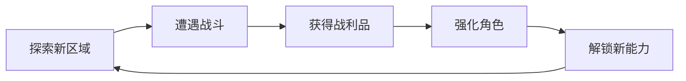

# 东方ARPG游戏机制设计文档

## 一、目标受众分析

- 主要年龄段：18-35岁
- 游戏偏好：
  * 喜欢动作角色扮演游戏（ARPG）
  * 对东方文化和像素艺术感兴趣
  * 追求有深度的游戏体验
- 游戏习惯：
  * 单次游戏时长：30-120分钟
  * 游戏频率：每周3-5次
  * 偏好探索性和技术性并存的游戏体验

## 二、游戏规模规划

- 主线剧情时长：15-20小时
- 支线内容时长：8-12小时
- 内容比重分配：
  * 战斗内容：45%
  * 探索内容：30%
  * 剧情内容：25%

## 三、难度曲线设计

1. 入门门槛
   - 新手教程区域（30分钟）
   - 基础机制分步解锁
   - 引导式任务设计
   - 保护性难度调整

2. 进阶难度
   - 随技能解锁逐步提升
   - 每个主要区域增加10-15%难度
   - 可选精英怪物提供额外挑战
   - 支线任务设置更高难度要求

3. 挑战内容
   - 隐藏Boss战（高于当前区域30%难度）
   - 可选的挑战副本
   - 连续战斗竞技场
   - 限时挑战任务

4. 难度调节
   - 动态难度系统自动调整
   - 可选择的游戏难度模式
   - 装备推荐等级指引
   - 失败惩罚机制柔和设计

## 四、核心玩法循环

1. 主循环

2. 战斗循环
   - 基础攻击系统
     * 轻击（快速、连击）
     * 重击（蓄力、破防）
     * 技能攻击（元素相生相克）
     * 闪避/格挡机制
   
   - Combo系统
     * 3段基础连击
     * 技能衔接加成
     * 元素融合效果
     * 空中连击选项

3. 探索循环
   - 区域探索
     * 地图探索度系统
     * 隐藏区域发现
     * 环境谜题解决
     * 收集要素寻找
   
   - 奖励机制
     * 宝箱开启
     * 材料采集
     * 隐藏任务触发
     * 特殊NPC遭遇

4. 成长循环
   - 等级提升
     * 基础属性成长
     * 技能点获取
     * 新技能解锁
   - 装备强化
     * 装备收集
     * 强化升级
     * 套装效果
   - 技能成长
     * 技能熟练度
     * 技能组合解锁
     * 特殊效果强化

## 五、独特卖点设计

1. 创新特性：东方元素相生相克系统
   - 金木水火土五行元素体系
   - 元素相生相克伤害加成
   - 环境元素交互效果
   - 元素融合技能系统

2. 差异化设计：气力值战斗系统
   - 气力值影响所有战斗行动
   - 气力管理成为战术考量
   - 不同武器和技能消耗不同气力值
   - 气力恢复机制多样化

3. 玩家粘性机制
   - 收集系统
     * 武器收集图鉴
     * 怪物图鉴
     * 成就系统
     * 装备套装搭配
   
   - 挑战内容
     * 竞技场排名
     * 限时挑战
     * 每日任务
     * 随机生成的地下城

## 六、战斗系统核心设计

1. 基础动作设计
   - 移动系统
     * 八方向自由移动
     * 冲刺/闪避
     * 翻滚回避
   
   - 攻击系统
     * 轻攻击（0.5秒/次）
     * 重攻击（1.2秒蓄力）
     * 技能攻击（个性化冷却）

2. 连击设计
   - 基础连击
     * 3段轻攻击连击
     * 2段重攻击连击
     * 轻重混合连击
   
   - 进阶连击
     * 空中连击
     * 技能衔接
     * 武器切换连击
     * 元素附魔连击

3. 元素系统
   - 五行元素
     * 金：增加破防和暴击
     * 木：持续恢复和中毒
     * 水：减速和结冰
     * 火：爆发伤害和灼烧
     * 土：增加防御和束缚
   
   - 元素相互作用
     * 相生效果（伤害提升20%）
     * 相克效果（伤害提升50%）
     * 元素融合特效
     * 环境元素互动

## 七、反馈系统设计

1. 打击感反馈
   - 视觉反馈
     * 打击特效
     * 受击震动
     * 伤害数字
     * 击退效果
   
   - 音效反馈
     * 攻击音效
     * 受击音效
     * 元素效果音
     * 连击音效

2. 战斗节奏控制
   - 攻击前摇：0.1-0.3秒
   - 攻击后摇：0.2-0.4秒
   - 技能施放时间：0.5-1.5秒
   - 连击窗口期：0.8秒

3. 动态难度调整
   - 玩家数据分析
     * 死亡频率
     * 连击成功率
     * 技能使用效率
     * 伤害输出统计
   
   - 调整参数
     * 敌人攻击频率
     * 敌人生命值
     * 掉落率
     * 经验获取率

## 八、成长系统框架

1. 等级系统
   - 等级上限：50级
   - 经验曲线：前期快速，后期放缓
   - 等级奖励：
     * 基础属性提升
     * 技能点获取
     * 新功能解锁
   
2. 技能树设计
   - 三大分支
     * 武术系：近战物理输出
     * 法术系：元素伤害输出
     * 气功系：辅助和控制
   
   - 技能解锁机制
     * 等级要求
     * 前置技能
     * 技能点消耗
     * 特殊解锁条件

3. 装备系统
   - 装备槽位
     * 武器
     * 护甲
     * 饰品
     * 法器
   
   - 属性系统
     * 基础属性
     * 特殊效果
     * 元素亲和
     * 套装效果

## 九、UI/UX设计建议

1. 界面布局
   - 战斗界面
     * 生命气力条
     * 技能快捷栏
     * 小地图
     * 状态图标
   
   - 菜单界面
     * 角色属性
     * 装备管理
     * 技能树
     * 任务追踪

2. 信息反馈
   - 战斗信息
     * 伤害数字
     * 状态图标
     * 连击计数
     * 元素效果
   
   - 探索信息
     * 地图进度
     * 收集提示
     * 任务标记
     * 互动提示

## 十、AI对话交互系统

1. NPC个性化对话系统
   - 记忆系统
     * 记录与玩家的历史对话
     * 追踪玩家的行为选择
     * 保存关键剧情进展
     * 记录任务完成状态
   
   - 情感模型
     * 基于历史互动的好感度
     * NPC心情状态变化
     * 性格特征影响对话
     * 动态表情系统

2. 智能对话生成
   - 上下文感知
     * 当前任务进度
     * 玩家行为历史
     * 时间和地点因素
     * 世界事件影响
   
   - 对话变体系统
     * 多样化问候语
     * 动态对话选项
     * 基于关系的回应
     * 情境相关对白

3. 对话分支设计
   - 动态分支系统
     * 基于玩家属性的选项
     * 技能相关对话
     * 任务状态影响
     * 声望系统互动
   
   - 对话影响力
     * 影响NPC态度
     * 触发隐藏任务
     * 改变剧情走向
     * 获取独特奖励

4. AI互动深度
   - 个性化任务系统
     * 基于玩家行为生成任务
     * 动态调整任务难度
     * 个性化任务奖励
     * 关联任务链生成
   
   - 社交网络模拟
     * NPC之间的关系网络
     * 信息传播系统
     * 阵营关系变化
     * 随机事件触发

5. 交互反馈系统
   - 即时反馈
     * 动态表情变化
     * 语气词调整
     * 姿态动画响应
     * 环境音效配合
   
   - 长期影响
     * 声望系统变化
     * 商店价格调整
     * 任务难度适应
     * 特殊对话解锁

6. 技术实现框架
   - 对话生成模型
     * 基于规则的基础对话
     * 机器学习动态生成
     * 情境相关过滤
     * 个性化调整
   
   - 数据管理
     * 对话历史存储
     * 关系网络更新
     * 任务状态追踪
     * 玩家行为分析

7. 优化机制
   - 性能优化
     * 对话生成缓存
     * 局部更新机制
     * 资源动态加载
     * 内存优化管理
   
   - 质量控制
     * 对话审核系统
     * 异常检测机制
     * 用户反馈收集
     * 实时调整参数
