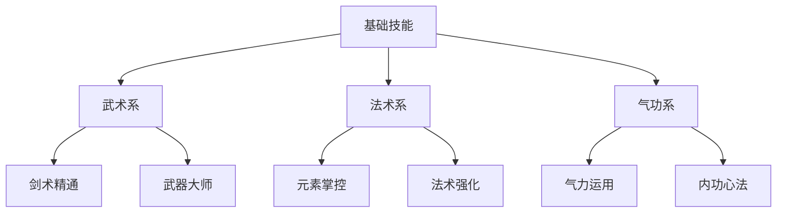

# 东方ARPG角色成长系统设计

## 一、核心属性体系

1. 主要属性设计
   - 生命值（HP）
     * 基础值：1000
     * 每级成长：50
     * 装备加成：100-500
     * 技能提升：5%-20%
   
   - 气力值（SP）
     * 基础值：200
     * 每级成长：10
     * 装备加成：20-100
     * 恢复速度：10/秒

   - 元素能量（EP）
     * 基础值：100
     * 每级成长：5
     * 装备加成：10-50
     * 技能消耗：10-50

2. 战斗属性
   - 物理攻击
     * 基础值：50
     * 每级成长：5
     * 武器倍率：1.2-2.0
     * 暴击系数：1.5-2.5
   
   - 法术攻击
     * 基础值：40
     * 每级成长：6
     * 元素倍率：1.3-2.2
     * 法术穿透：5%-20%

   - 防御力
     * 基础值：30
     * 每级成长：3
     * 装备加成：10-100
     * 减伤系数：10%-50%

3. 特殊属性
   - 暴击属性
     * 暴击率：5%-30%
     * 暴击伤害：150%-250%
     * 暴击抗性：5%-25%
   
   - 速度属性
     * 移动速度：100%
     * 攻击速度：100%
     * 施法速度：100%
     * 闪避速度：100%

   - 元素属性
     * 元素精通：0-100
     * 元素伤害加成：0%-50%
     * 元素抗性：0%-75%
     * 元素反应效率：100%-200%

## 二、等级系统设计

1. 经验值机制
   - 获取方式
     * 击杀敌人：10-100经验
     * 完成任务：100-1000经验
     * 探索发现：50-200经验
     * 特殊事件：200-500经验
   
   - 经验计算
     * 基础经验值
     * 等级差异系数
     * 难度加成
     * 连击奖励

2. 等级提升收益
   - 基础属性提升
     * HP/SP/EP增长
     * 攻防属性成长
     * 特殊属性提升
   
   - 能力解锁
     * 技能点获取
     * 特性解锁
     * 装备限制解除
     * 功能开放

3. 等级上限设定
   - 阶段划分
     * 新手期：1-20级
     * 成长期：21-40级
     * 成熟期：41-45级
     * 巅峰期：46-50级
   
   - 突破机制
     * 等级突破任务
     * 属性质变提升
     * 特殊能力获得
     * 外观改变效果

## 三、技能树系统

1. 技能点获取
   - 获取途径
     * 等级提升：1点/级
     * 主线任务：5-10点
     * 特殊成就：1-3点
     * 隐藏挑战：3-5点
   
   - 重置机制
     * 一级重置（免费）
     * 二级重置（材料）
     * 完全重置（道具）

2. 技能树结构

3. 分支详解
   - 武术系
     * 剑术精通
       - 基础剑法强化
       - 高级剑术解锁
       - 特殊技巧掌握
       - 剑气凝聚技能
     
     * 武器大师
       - 武器熟练度提升
       - 切换技能强化
       - 特殊武器解锁
       - 武器技能组合

   - 法术系
     * 元素掌控
       - 元素亲和提升
       - 元素反应强化
       - 新元素解锁
       - 元素爆发特性
     
     * 法术强化
       - 法术伤害提升
       - 施法时间缩短
       - 法术范围扩大
       - 特殊效果增强

   - 气功系
     * 气力运用
       - 气力值上限提升
       - 气力恢复加速
       - 气力消耗降低
       - 气力爆发技能
     
     * 内功心法
       - 基础属性强化
       - 被动技能增强
       - 状态抗性提升
       - 特殊buff获得

## 四、装备系统

1. 装备槽位设计
   - 武器栏
     * 主武器
     * 副武器
     * 法器
   
   - 防具栏
     * 头部防具
     * 身体防具
     * 手部防具
     * 腿部防具
   
   - 饰品栏
     * 项链
     * 戒指
     * 护符
     * 特殊饰品

2. 装备品质划分
   - 品质等级
     * 普通（白色）：基础属性
     * 精良（绿色）：1-2条特殊属性
     * 稀有（蓝色）：2-3条特殊属性
     * 史诗（紫色）：3-4条特殊属性
     * 传说（金色）：4-5条特殊属性
     * 神器（红色）：5-6条特殊属性+特效

   - 属性词条
     * 固定属性词条
     * 随机属性词条
     * 特殊效果词条
     * 套装效果词条

3. 强化系统
   - 基础强化
     * 强化等级：+1到+10
     * 成功率：100%-50%
     * 材料需求：递增
     * 属性提升：线性增长
   
   - 进阶强化
     * 强化等级：+11到+15
     * 成功率：45%-20%
     * 失败惩罚：降级
     * 属性提升：指数增长

   - 完美强化
     * 强化等级：+16到+20
     * 成功率：15%-5%
     * 失败惩罚：装备破碎
     * 属性提升：质变提升

4. 套装系统
   - 套装效果
     * 2件套效果
     * 4件套效果
     * 6件套效果
     * 完整套装特效
   
   - 混搭设计
     * 不同套装组合
     * 特殊搭配效果
     * 元素属性联动
     * 职业特性加成

## 五、成就系统

1. 成就类型
   - 战斗成就
     * 连击达成
     * BOSS击杀
     * 伤害记录
     * 特殊击杀方式
   
   - 收集成就
     * 装备收集
     * 道具收集
     * 材料收集
     * 图鉴完成度

   - 探索成就
     * 地图探索
     * 隐藏发现
     * 解密完成
     * 特殊事件

2. 成就奖励
   - 直接奖励 
     * 属性点数
     * 技能点数
     * 特殊道具
     * 称号获得
   
   - 成就点数
     * 点数获取
     * 商店兑换
     * 特殊解锁
     * 额外功能

3. 称号系统
   - 称号分类
     * 战斗称号
     * 收集称号
     * 探索称号
     * 特殊称号
   
   - 称号效果
     * 属性加成
     * 外观特效
     * 特殊能力
     * 独特动画

## 六、养成反馈系统

1. 即时反馈
   - 数值增长
     * 属性提升飘字
     * 等级提升特效
     * 技能解锁提示
     * 成就达成通知
   
   - 视觉反馈
     * 角色外观变化
     * 技能特效升级
     * 装备光效强化
     * 称号特效展示

2. 长期激励
   - 成长历程记录
     * 属性成长曲线
     * 装备进化记录
     * 技能熟练度
     * 成就完成度
   
   - 里程碑奖励
     * 等级里程碑
     * 收集里程碑
     * 成就里程碑
     * 特殊事件里程碑

3. 养成计划
   - 规划系统
     * 技能规划模拟
     * 属性配装模拟
     * 材料需求计算
     * 目标完成度追踪
   
   - 养成建议
     * 新手推荐路线
     * 职业发展建议
     * 装备搭配推荐
     * 技能加点方案
