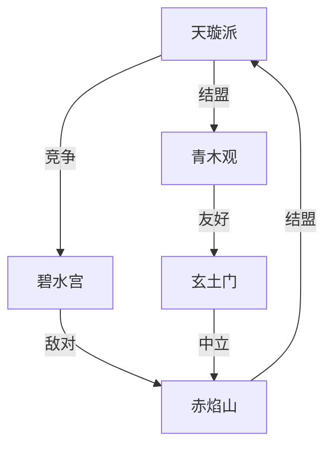

# 东方ARPG世界观与剧情设计

## 一、世界背景设定

1. 世界起源
   - 开天辟地
     * 混沌初开，阴阳二气交汇
     * 五行元素形成世界基础
     * 天地灵气孕育万物
     * 人族修行，掌握元素之力
   
   - 上古时代
     * 仙人开辟修行体系
     * 人妖共存的和平年代
     * 五大仙门的建立
     * 灵气充沛的黄金时期

2. 重要历史事件
   - 天地异变
     * 灵气浓度骤降
     * 妖魔开始侵扰人间
     * 修行难度提升
     * 五大仙门势力变迁
   
   - 元素战争
     * 元素失衡引发动乱
     * 各派争夺灵气资源
     * 修行界秩序崩塌
     * 新旧势力更迭

3. 当前世界状态
   - 地理环境
     * 五大主要区域
     * 特殊地理位置
     * 灵脉分布
     * 险地与秘境
   
   - 世界规则
     * 元素规律
     * 修行体系
     * 世界禁忌
     * 特殊现象

## 二、文化与势力设计

1. 主要势力
   - 五大仙门
     * 天璇派：主修金系，擅长御剑术
     * 青木观：主修木系，精通丹药
     * 碧水宫：主修水系，善用幻术
     * 赤焰山：主修火系，炼器为主
     * 玄土门：主修土系，阵法见长

   - 其他势力
     * 散修联盟
     * 江湖门派
     * 妖族势力
     * 商会组织

2. 势力关系网络

3. 文化特色
   - 修行文化
     * 拜师学艺制度
     * 功法传承方式
     * 修行境界划分
     * 江湖规矩

   - 民俗习惯
     * 年节庆典
     * 民间传说
     * 饮食特色
     * 服饰特点

## 三、魔法体系

1. 五行元素体系
   - 金系
     * 属性：锐利、坚韧
     * 特点：破防、穿透
     * 克制：木系
     * 助益：水系
   
   - 木系
     * 属性：生机、柔韧
     * 特点：治疗、毒素
     * 克制：土系
     * 助益：火系
   
   - 水系
     * 属性：流动、变化
     * 特点：控制、法术
     * 克制：火系
     * 助益：木系
   
   - 火系
     * 属性：爆发、激烈
     * 特点：伤害、灼烧
     * 克制：金系
     * 助益：土系
   
   - 土系
     * 属性：厚重、稳固
     * 特点：防御、束缚
     * 克制：水系
     * 助益：金系

2. 修行境界
   - 基础境界
     * 练气期：开启灵脉
     * 筑基期：凝聚元素
     * 金丹期：形成金丹
     * 元婴期：元婴出世
   
   - 高阶境界
     * 化神期：掌控法则
     * 炼虚期：超脱凡俗
     * 合体期：天人合一
     * 大乘期：长生不老

3. 修行限制
   - 资质要求
     * 灵根品质
     * 悟性要求
     * 体质限制
     * 年龄限制
   
   - 修行代价
     * 寿元消耗
     * 心境考验
     * 走火入魔
     * 天劫考验

## 四、主线剧情设计

1. 核心故事架构
   - 第一章：觉醒
     * 主角发现修行天赋
     * 加入仙门历练
     * 初识世界真相
     * 结识重要人物
   
   - 第二章：成长
     * 仙门试炼
     * 江湖历练
     * 势力冲突
     * 实力提升
   
   - 第三章：危机
     * 灵气异变
     * 妖魔入侵
     * 同门背叛
     * 寻找真相
   
   - 第四章：觉醒
     * 探索秘密
     * 正邪对决
     * 世界异变
     * 最终抉择

2. 支线任务体系
   - 仙门任务
     * 每日修行
     * 宗门委托
     * 秘境探索
     * 门派竞争
   
   - 江湖任务
     * 镖局护送
     * 除妖任务
     * 寻宝探险
     * 恩怨情仇
   
   - 隐藏任务
     * 古墓探索
     * 奇遇机缘
     * 隐世高人
     * 失落秘术

3. 关键人物设计
   - 主角
     * 背景：散修出身
     * 性格：坚毅执着
     * 特点：元素亲和
     * 成长：逆境崛起
   
   - 重要NPC
     * 师尊：指引者
     * 挚友：并肩作战
     * 对手：良性竞争
     * 反派：终极对手

## 五、剧情呈现方式

1. 叙事方式
   - 主线演出
     * 过场动画
     * 重要对话
     * 关键决策
     * 剧情战斗
   
   - 环境叙事
     * 场景布置
     * 物品描述
     * NPC对话
     * 文字记录

2. 选择系统
   - 对话选择
     * 性格倾向
     * 立场选择
     * 处事方式
     * 情感互动
   
   - 剧情分支
     * 主线分支
     * 结局变化
     * 人物关系
     * 势力倾向

3. 情感设计
   - 人物情感
     * 师徒情
     * 同门情
     * 江湖义
     * 爱恨情仇
   
   - 情感表现
     * 对话系统
     * 剧情演出
     * 任务设计
     * 互动方式

## 六、世界探索设计

1. 区域规划
   - 主要区域
     * 五大仙门
     * 凡人城镇
     * 妖兽领地
     * 秘境禁地
   
   - 探索要素
     * 地图探索
     * 宝藏收集
     * 隐藏剧情
     * 特殊挑战

2. 互动设计
   - 环境互动
     * 机关解密
     * 元素反应
     * 场景破坏
     * 天气影响
   
   - NPC互动
     * 任务对话
     * 情报收集
     * 商贸往来
     * 江湖传闻

3. 探索奖励
   - 直接奖励
     * 宝物道具
     * 功法秘籍
     * 修行资源
     * 特殊装备
   
   - 隐藏奖励
     * 秘境钥匙
     * 隐藏剧情
     * 特殊技能
     * 稀有称号

## 七、世界观统一性检查

1. 设定一致性
   - 规则体系
     * 修行规则
     * 元素法则
     * 世界限制
     * 时间线索
   
   - 文化背景
     * 历史沿革
     * 民俗习惯
     * 势力关系
     * 地理环境

2. 叙事连贯性
   - 剧情逻辑
     * 因果关系
     * 人物动机
     * 事件连接
     * 世界影响
   
   - 设定呈现
     * 信息节奏
     * 细节铺垫
     * 伏笔回收
     * 悬念设计

3. 玩法整合
   - 系统联动
     * 剧情与战斗
     * 探索与收集
     * 成长与任务
     * 互动与奖励
   
   - 体验统一
     * 世界观沉浸
     * 角色代入感
     * 剧情趣味性
     * 探索完整性
