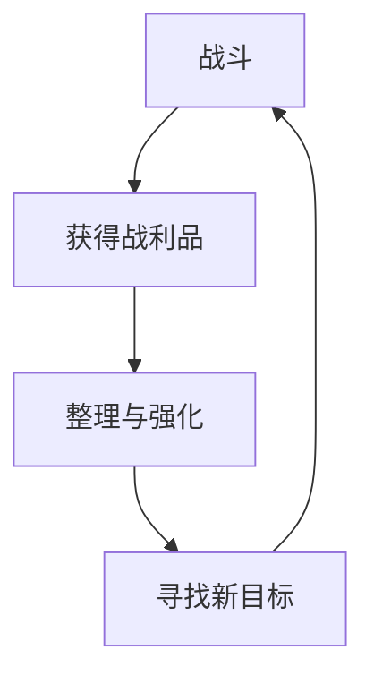
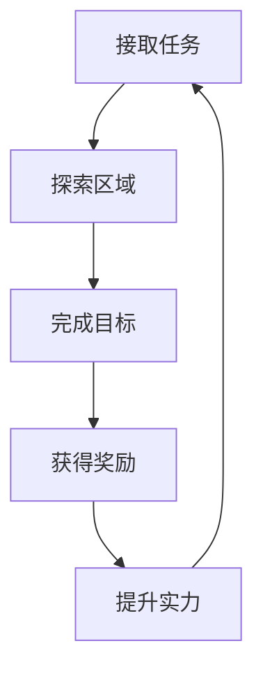
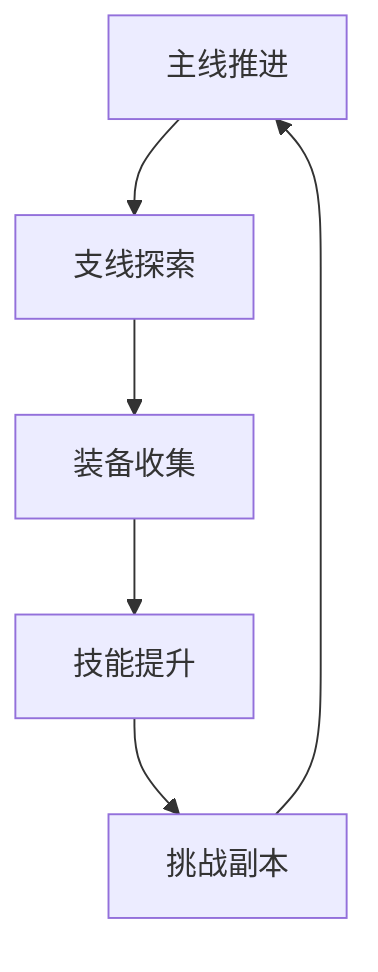

# 东方ARPG游戏节奏设计

## 一、内容节奏控制

1. 主线与支线任务比例
   - 主线任务（70%）
     * 新手引导：2小时
     * 第一章：4-5小时
     * 第二章：5-6小时
     * 第三章：6-7小时
     * 终章：3-4小时
   
   - 支线任务（30%）
     * 仙门日常：2-3小时
     * 江湖委托：3-4小时
     * 隐藏任务：2-3小时
     * 挑战副本：2-3小时

2. 战斗与探索时间分配
   - 战斗内容（45%）
     * 主线战斗：25%
     * 支线战斗：10%
     * 随机遭遇：5%
     * 挑战内容：5%
   
   - 探索内容（30%）
     * 地图探索：15%
     * 解密内容：5%
     * 收集要素：5%
     * 互动内容：5%
   
   - 剧情内容（25%）
     * 主线剧情：15%
     * 支线剧情：5%
     * NPC互动：3%
     * 环境叙事：2%

3. 游戏难度递进曲线
   - 新手阶段（1-10级）
     * 难度：★☆☆☆☆
     * 重点：基础教学
     * 惩罚：极轻
     * 奖励：丰厚
   
   - 成长阶段（11-30级）
     * 难度：★★☆☆☆
     * 重点：机制熟悉
     * 惩罚：较轻
     * 奖励：适中
   
   - 进阶阶段（31-40级）
     * 难度：★★★☆☆
     * 重点：技能运用
     * 惩罚：中等
     * 奖励：平衡
   
   - 挑战阶段（41-50级）
     * 难度：★★★★☆
     * 重点：综合考验
     * 惩罚：较重
     * 奖励：丰富

## 二、玩家体验曲线

1. 新手引导设计
   - 第一阶段（30分钟）
     * 基础操作教学
     * 战斗系统入门
     * 剧情背景介绍
     * 初始装备获得
   
   - 第二阶段（60分钟）
     * 技能系统解锁
     * 任务系统开放
     * 探索机制引导
     * 社交系统介绍
   
   - 第三阶段（30分钟）
     * 进阶战斗技巧
     * 元素系统教学
     * 成长系统解锁
     * 挑战内容预览

2. 技能解锁节奏
   - 基础技能（1-10级）
     * 普通攻击连击
     * 基础元素技能
     * 闪避与格挡
     * 简单组合技
   
   - 进阶技能（11-30级）
     * 元素组合技
     * 武器特殊技
     * 战术技能
     * 位移技能
   
   - 高级技能（31-50级）
     * 终极技能
     * 秘传技能
     * 觉醒能力
     * 特殊连携

3. 奖励发放节奏
   - 即时奖励
     * 战斗掉落：30秒/次
     * 成就达成：5分钟/次
     * 任务完成：15分钟/次
     * 探索发现：3分钟/次
   
   - 阶段性奖励
     * 等级提升：40分钟/次
     * 主线剧情：60分钟/次
     * 区域解锁：90分钟/次
     * 特殊事件：120分钟/次
   
   - 长期奖励
     * 收集完成：每周1-2次
     * 特殊成就：每月2-3次
     * 限时活动：每月1次
     * 季节更新：每季度1次

## 三、游戏循环设计

1. 短期循环（3-5分钟）

2. 中期循环（15-20分钟）

3. 长期循环（2-3小时）

4. 额外激励循环
   - 每日内容
     * 日常任务
     * 修行试炼
     * 材料采集
     * 江湖传闻
   
   - 每周内容
     * 周常任务
     * 秘境探索
     * 竞技挑战
     * 商会委托
   
   - 月度内容
     * 月度BOSS
     * 限时活动
     * 特殊副本
     * 排名奖励

## 四、内容解锁规划

1. 区域开放节奏
   - 初始区域
     * 新手村
     * 初始主城
     * 附近野外
     * 训练场地
   
   - 中期区域
     * 五大仙门
     * 主要城镇
     * 危险区域
     * 隐藏地图
   
   - 后期区域
     * 秘境空间
     * 古代遗迹
     * 禁地迷宫
     * 天界入口

2. 功能解锁顺序
   - 基础功能（1-10级）
     * 战斗系统
     * 任务系统
     * 背包系统
     * 地图系统
   
   - 进阶功能（11-30级）
     * 技能树系统
     * 装备强化
     * 元素组合
     * 成就系统
   
   - 高级功能（31-50级）
     * 秘境系统
     * 炼器系统
     * 阵法系统
     * 宗门系统

3. 成长速度控制
   - 等级提升速度
     * 1-10级：1级/30分钟
     * 11-20级：1级/60分钟
     * 21-30级：1级/90分钟
     * 31-40级：1级/120分钟
     * 41-50级：1级/180分钟
   
   - 装备获取速度
     * 普通装备：大量
     * 精良装备：较多
     * 稀有装备：适中
     * 史诗装备：较少
     * 传说装备：稀少
   
   - 技能获取速度
     * 基础技能：快速
     * 进阶技能：适中
     * 高级技能：缓慢
     * 秘传技能：稀有

## 五、体验优化设计

1. 节奏调节机制
   - 动态难度调整
     * 连续失败调整
     * 装备等级检查
     * 技能熟练度计算
     * AI行为适应
   
   - 进度追赶系统
     * 经验加成
     * 掉落提升
     * 任务奖励增加
     * 特殊道具支援

2. 休息节点设置
   - 自然休息点
     * 主城区域
     * 传送点
     * 营地
     * 安全区域
   
   - 强制休息点
     * 主线剧情
     * 重要战斗
     * 特殊事件
     * 教学关卡

3. 防疲劳设计
   - 游戏机制
     * 体力值系统
     * 日常任务限制
     * 副本次数限制
     * 奖励递减
   
   - 激励机制
     * 休息经验加成
     * 累计登录奖励
     * 回归玩家福利
     * 限时活动奖励

## 六、平衡性检查清单

1. 难度平衡
   - 战斗系统
     * 敌人属性设计
     * 技能伤害数值
     * 资源消耗量
     * 奖励掉落率
   
   - 任务难度
     * 完成时间
     * 挑战程度
     * 失败惩罚
     * 奖励价值

2. 资源平衡
   - 经济系统
     * 货币获取速度
     * 消费点设置
     * 通货膨胀控制
     * sink设计
   
   - 材料系统
     * 获取途径
     * 消耗设计
     * 稀有度划分
     * 用途规划

3. 进度平衡
   - 等级系统
     * 升级曲线
     * 属性成长
     * 能力解锁
     * 装备需求
   
   - 探索系统
     * 地图开放
     * 内容解锁
     * 收集完成度
     * 成就达成率
