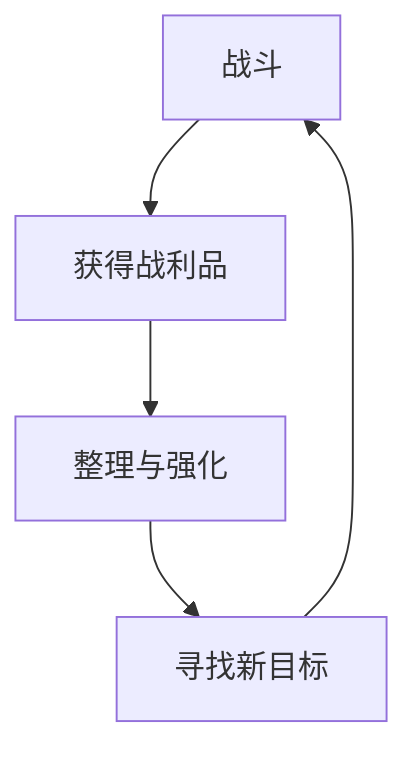
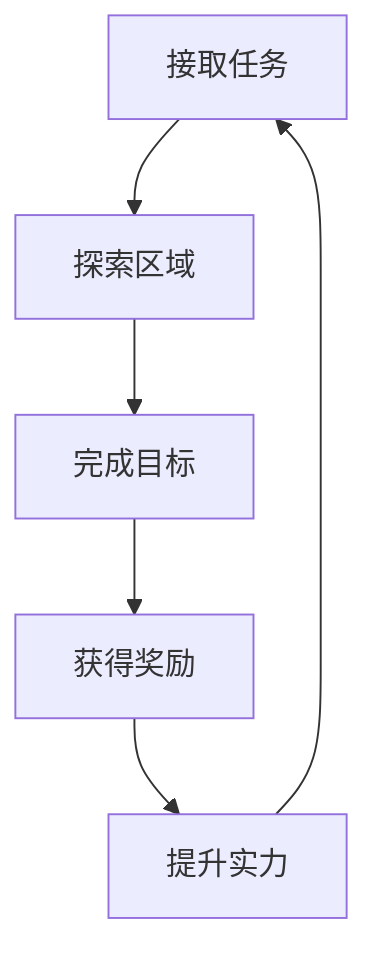
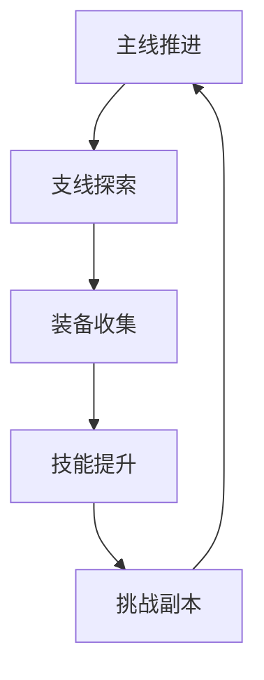

# 宋朝历史与传说融合ARPG游戏节奏设计

## 一、内容节奏控制

1. 主线与支线任务比例
   - **主线任务（70%）**
     * 新手引导：2小时（120分钟）
       - 基础操作：30分钟
       - 战斗教学：45分钟
       - 历史背景介绍：30分钟
       - 系统解锁：15分钟
       - 技术实现：`TutorialManager`、`ProgressTracker`
     
     * 第一章：靖康之耻（4-5小时，270分钟）
       - 主线剧情：180分钟
       - 历史战役：60分钟
       - 探索内容：30分钟
       - 技术实现：`ChapterManager`、`HistoricalEventSystem`
     
     * 第二章：群雄并起（5-6小时，330分钟）
       - 主线剧情：200分钟
       - 英雄招募：90分钟
       - 探索内容：40分钟
       - 技术实现：`StorylineManager`、`HeroRecruitmentSystem`
     
     * 第三章：风云际会（6-7小时，390分钟）
       - 主线剧情：240分钟
       - 传说英雄：120分钟
       - 探索内容：30分钟
       - 技术实现：`CrisisManager`、`LegendaryHeroSystem`
     
     * 第四章：天下归一（3-4小时，210分钟）
       - 最终决战：120分钟
       - 剧情收尾：60分钟
       - 结局选择：30分钟
       - 技术实现：`FinalBattleManager`、`EndingSystem`
   
   - **支线任务（30%）**
     * 英雄传说：2-3小时（150分钟）
       - 武林篇：60分钟
       - 历史篇：60分钟
       - 传说篇：30分钟
       - 技术实现：`HeroLegendSystem`、`StoryBranchManager`
     
     * 江湖委托：3-4小时（210分钟）
       - 护送任务：90分钟
       - 除妖任务：60分钟
       - 寻宝探险：60分钟
       - 技术实现：`WorldQuestSystem`、`RandomEventManager`
     
     * 历史事件：2-3小时（150分钟）
       - 历史遗迹探索：90分钟
       - 奇遇机缘：60分钟
       - 技术实现：`HistoricalEventSystem`、`SecretAreaManager`
     
     * 挑战副本：2-3小时（150分钟）
       - 历史战役副本：90分钟
       - 武林大会：60分钟
       - 技术实现：`DungeonSystem`、`ArenaManager`

2. **战斗与探索时间分配**
   - **战斗内容（40%）**
     * 主线战斗：25%（约7.5小时）
       - 普通战斗：4.5小时
       - 精英战斗：2小时
       - BOSS战斗：1小时
       - 技术实现：`CombatManager`、`EnemySpawner`、`BattleStatistics`
     
     * 支线战斗：10%（约3小时）
       - 历史战役：1.5小时
       - 江湖冲突：1小时
       - 随机挑战：0.5小时
       - 技术实现：`SideQuestCombat`、`HistoricalBattleSystem`
     
     * 随机遭遇：5%（约1.5小时）
       - 野外遭遇：1小时
       - 特殊事件：0.5小时
       - 技术实现：`RandomEncounterSystem`、`EventTrigger`
     
     * 挑战内容：5%（约1.5小时）
       - 武林大会：1小时
       - 特殊副本：0.5小时
       - 技术实现：`ChallengeManager`、`ArenaSystem`
   
   - **探索内容（30%）**
     * 地图探索：15%（约4.5小时）
       - 历史区域发现：2小时
       - 路径探索：1.5小时
       - 秘密区域：1小时
       - 技术实现：`ExplorationTracker`、`MapRevealSystem`
     
     * 解密内容：5%（约1.5小时）
       - 历史机关解密：1小时
       - 武学谜题：0.5小时
       - 技术实现：`PuzzleSystem`、`MechanismManager`
     
     * 收集要素：5%（约1.5小时）
       - 历史文物收集：1小时
       - 武学秘籍发现：0.5小时
       - 技术实现：`CollectionSystem`、`TreasureManager`
     
     * 互动内容：5%（约1.5小时）
       - 环境互动：1小时
       - 物品交互：0.5小时
       - 技术实现：`InteractionSystem`、`ObjectManager`
   
   - **剧情内容（20%）**
     * 主线剧情：15%（约4.5小时）
       - 过场动画：2小时
       - 对话剧情：2小时
       - 剧情选择：0.5小时
       - 技术实现：`StoryManager`、`DialogueSystem`、`CutscenePlayer`
     
     * 支线剧情：5%（约1.5小时）
       - 英雄故事：1小时
       - 历史背景：0.5小时
       - 技术实现：`SideStoryManager`、`CharacterArc`
     
     * NPC互动：3%（约0.9小时）
       - 日常对话：0.6小时
       - 任务对话：0.3小时
       - 技术实现：`NPCDialogueSystem`、`RelationshipManager`
     
     * 环境叙事：2%（约0.6小时）
       - 历史场景细节：0.4小时
       - 文字描述：0.2小时
       - 技术实现：`EnvironmentalNarrative`、`LoreSystem`
   
   - **策略内容（10%）**
     * 英雄管理：5%（约1.5小时）
       - 英雄招募：0.8小时
       - 英雄培养：0.7小时
       - 技术实现：`HeroManagementSystem`、`RecruitmentManager`
     
     * 势力管理：5%（约1.5小时）
       - 城池建设：0.8小时
       - 外交关系：0.7小时
       - 技术实现：`FactionManagementSystem`、`DiplomacyManager`
       

3. **游戏难度递进曲线**
   - **新手阶段（1-10级）**
     * 难度：★☆☆☆☆（难度系数：0.3-0.5）
     * 重点：基础教学
       - 操作熟悉度：100%引导
       - 失败容错率：90%
       - 提示频率：每30秒
     * 惩罚：极轻
       - 死亡惩罚：无经验损失
       - 装备损耗：0%
       - 复活时间：即时
     * 奖励：丰厚
       - 经验倍率：200%
       - 掉落率：150%
       - 特殊奖励：新手礼包
     * 技术实现：`TutorialDifficultyManager`、`NewbieProtection`
   
   - **成长阶段（11-30级）**
     * 难度：★★☆☆☆（难度系数：0.5-0.7）
     * 重点：机制熟悉
       - 操作熟悉度：70%引导
       - 失败容错率：70%
       - 提示频率：每60秒
     * 惩罚：较轻
       - 死亡惩罚：5%经验损失
       - 装备损耗：10%
       - 复活时间：5秒
     * 奖励：适中
       - 经验倍率：120%
       - 掉落率：110%
       - 特殊奖励：武学秘籍
     * 技术实现：`GrowthDifficultyManager`、`MartialArtsGuidance`
   
   - **进阶阶段（31-40级）**
     * 难度：★★★☆☆（难度系数：0.7-0.9）
     * 重点：武学运用
       - 操作熟悉度：30%引导
       - 失败容错率：50%
       - 提示频率：每120秒
     * 惩罚：中等
       - 死亡惩罚：10%经验损失
       - 装备损耗：20%
       - 复活时间：10秒
     * 奖励：平衡
       - 经验倍率：100%
       - 掉落率：100%
       - 特殊奖励：稀有装备
     * 技术实现：`AdvancedDifficultyManager`、`CombatAnalyzer`
   
   - **挑战阶段（41-50级）**
     * 难度：★★★★☆（难度系数：0.9-1.2）
     * 重点：综合考验
       - 操作熟悉度：无引导
       - 失败容错率：30%
       - 提示频率：无
     * 惩罚：较重
       - 死亡惩罚：15%经验损失
       - 装备损耗：30%
       - 复活时间：15秒
     * 奖励：丰富
       - 经验倍率：80%
       - 掉落率：120%
       - 特殊奖励：传说装备
     * 技术实现：`ChallengeDifficultyManager`、`EliteContentSystem`

## 二、玩家体验曲线

1. **新手引导设计**
   - **第一阶段（30分钟）**
     * 基础操作教学（10分钟）
       - 移动控制：WASD键位
       - 视角控制：鼠标操作
       - 交互操作：F键使用
       - 界面导航：ESC菜单
       - 技术实现：`BasicControlTutorial`、`InputGuide`
     
     * 战斗系统入门（10分钟）
       - 普通攻击：左键点击
       - 闪避技巧：右键操作
       - 生命值管理：血量观察
       - 敌人识别：威胁判断
       - 技术实现：`CombatTutorial`、`BattleGuide`
     
     * 剧情背景介绍（5分钟）
       - 世界观设定：宋朝历史
       - 角色身份：武林人士
       - 当前处境：初入江湖
       - 目标设定：寻找师门
       - 技术实现：`StoryIntroduction`、`WorldLoreSystem`
     
     * 初始装备获得（5分钟）
       - 武器装备：新手剑
       - 防具装备：布衣
       - 消耗道具：回血丹
       - 装备操作：穿戴方法
       - 技术实现：`EquipmentTutorial`、`InventoryGuide`
   
   - **第二阶段（60分钟）**
     * 技能系统解锁（20分钟）
       - 技能获得：升级解锁
       - 技能装备：快捷键设置
       - 技能升级：经验投入
       - 技能组合：连招教学
       - 技术实现：`SkillSystemTutorial`、`AbilityManager`
     
     * 任务系统开放（15分钟）
       - 任务接取：NPC对话
       - 任务追踪：目标指引
       - 任务完成：奖励获得
       - 任务类型：主线支线
       - 技术实现：`QuestTutorial`、`MissionGuide`
     
     * 探索机制引导（15分钟）
       - 地图系统：区域显示
       - 收集要素：材料获取
       - 隐藏内容：秘密发现
       - 传送点：快速移动
       - 技术实现：`ExplorationTutorial`、`MapGuide`
     
     * 社交系统介绍（10分钟）
       - NPC互动：对话选择
       - 好感度：关系建立
       - 商店系统：买卖交易
       - 信息收集：情报获取
       - 技术实现：`SocialTutorial`、`NPCInteractionGuide`
   
   - **第三阶段（30分钟）**
     * 进阶战斗技巧（10分钟）
       - 连击系统：组合攻击
       - 时机把握：完美闪避
       - 弱点攻击：致命一击
       - 战术运用：环境利用
       - 技术实现：`AdvancedCombatTutorial`、`TacticalGuide`
     
     * 元素系统教学（10分钟）
       - 武学属性：金木水火土
       - 相生相克：元素反应
       - 元素技能：法术释放
       - 元素组合：复合效果
       - 技术实现：`ElementalTutorial`、`MagicSystemGuide`
     
     * 成长系统解锁（5分钟）
       - 等级提升：经验积累
       - 属性分配：点数投入
       - 装备强化：材料消耗
       - 技能进阶：修炼提升
       - 技术实现：`ProgressionTutorial`、`GrowthGuide`
     
     * 挑战内容预览（5分钟）
       - 副本系统：团队挑战
       - 竞技场：PVP对战
       - 世界BOSS：大型战斗
       - 限时活动：特殊奖励
       - 技术实现：`ChallengePreview`、`EndgameIntroduction`

2. **技能解锁节奏**
   - **基础技能（1-10级）**
     * 普通攻击连击（1-3级）
       - 二连击：1级解锁
       - 三连击：2级解锁
       - 四连击：3级解锁
       - 伤害倍率：100%/110%/120%/130%
       - 技术实现：`ComboSystem`、`AttackChain`
     
     * 基础元素技能（3-7级）
       - 火球术：3级解锁
       - 水盾术：4级解锁
       - 土墙术：5级解锁
       - 风刃术：6级解锁
       - 金刚术：7级解锁
       - 技术实现：`ElementalSkillTree`、`BasicMagic`
     
     * 闪避与格挡（5-8级）
       - 侧身闪避：5级解锁
       - 后跳闪避：6级解锁
       - 武器格挡：7级解锁
       - 完美格挡：8级解锁
       - 技术实现：`DefenseSystem`、`EvasionMechanics`
     
     * 简单组合技（8-10级）
       - 火+风：爆炸冲击
       - 水+土：泥沼陷阱
       - 金+火：熔金利刃
       - 技术实现：`ElementalCombo`、`BasicCombination`
   
   - **进阶技能（11-30级）**
     * 元素组合技（11-20级）
       - 双元素融合：11级解锁
       - 三元素组合：15级解锁
       - 元素循环：18级解锁
       - 元素爆发：20级解锁
       - 伤害倍率：150%-300%
       - 技术实现：`AdvancedElementalSystem`、`ElementalFusion`
     
     * 武器特殊技（15-25级）
       - 剑气斩：15级解锁
       - 刀光闪：18级解锁
       - 枪影刺：20级解锁
       - 棍风扫：22级解锁
       - 拳劲爆：25级解锁
       - 技术实现：`WeaponSkillSystem`、`SpecialAttacks`
     
     * 战术技能（20-28级）
       - 战场感知：20级解锁
       - 弱点识别：23级解锁
       - 连击加速：25级解锁
       - 反击时机：28级解锁
       - 技术实现：`TacticalSystem`、`CombatIntelligence`
     
     * 位移技能（25-30级）
       - 瞬步：25级解锁
       - 影分身：27级解锁
       - 空间跳跃：30级解锁
       - 技术实现：`MovementSkills`、`TeleportationSystem`
   
   - **高级技能（31-50级）**
     * 终极技能（35-45级）
       - 五行归一：35级解锁
       - 天地同寿：40级解锁
       - 万法归宗：45级解锁
       - 冷却时间：300秒/240秒/180秒
       - 技术实现：`UltimateSkillSystem`、`PowerfulAbilities`
     
     * 秘传技能（40-48级）
       - 门派秘技：40级解锁
       - 古法传承：43级解锁
       - 禁忌之术：46级解锁
       - 神通显化：48级解锁
       - 技术实现：`SecretArts`、`ForbiddenTechniques`
     
     * 觉醒能力（45-50级）
       - 元素觉醒：45级解锁
       - 武道觉醒：47级解锁
       - 心境觉醒：49级解锁
       - 天人合一：50级解锁
       - 技术实现：`AwakeningSystem`、`TranscendentAbilities`
     
     * 特殊连携（48-50级）
       - 师兄弟连携：48级解锁
       - 五行大阵：49级解锁
       - 天地共鸣：50级解锁
       - 技术实现：`CooperationSkills`、`FormationSystem`

3. **奖励发放节奏**
   - **即时奖励**
     * 战斗掉落：30秒/次
       - 普通怪物：铜币5-15、经验10-30
       - 精英怪物：银币1-3、经验50-100
       - BOSS怪物：金币1、经验200-500
       - 掉落概率：100%/80%/60%
       - 技术实现：`LootSystem`、`DropCalculator`
     
     * 成就达成：5分钟/次
       - 战斗成就：连击达成、完美闪避
       - 探索成就：区域发现、收集完成
       - 社交成就：好感度提升、任务完成
       - 奖励内容：经验+50、称号、特殊道具
       - 技术实现：`AchievementSystem`、`RewardManager`
     
     * 任务完成：15分钟/次
       - 主线任务：经验100-500、金币10-50
       - 支线任务：经验50-200、银币5-20
       - 日常任务：经验30-100、铜币20-50
       - 完成概率：95%/85%/100%
       - 技术实现：`QuestRewardSystem`、`TaskCompletion`
     
     * 探索发现：3分钟/次
       - 宝箱发现：装备、道具、金币
       - 秘密区域：稀有材料、特殊装备
       - 隐藏NPC：独特任务、珍贵信息
       - 发现概率：70%/30%/10%
       - 技术实现：`ExplorationReward`、`DiscoverySystem`
   
   - **阶段性奖励**
     * 等级提升：40分钟/次
       - 属性点：每级+5点自由分配
       - 技能点：每级+1点技能投入
       - 生命值：每级+20点基础生命
       - 法力值：每级+15点基础法力
       - 技术实现：`LevelUpSystem`、`AttributeManager`
     
     * 主线剧情：60分钟/次
       - 剧情奖励：大量经验、特殊装备
       - 技能解锁：新技能、技能升级
       - 区域开放：新地图、传送点
       - 奖励价值：等级经验的50%-100%
       - 技术实现：`StoryRewardSystem`、`ProgressionManager`
     
     * 区域解锁：90分钟/次
       - 探索奖励：地图完成度、收集品
       - 功能解锁：新商店、新NPC
       - 挑战开放：副本、竞技场
       - 声望奖励：区域声望+100-500
       - 技术实现：`AreaUnlockSystem`、`RegionManager`
     
     * 特殊事件：120分钟/次
       - 世界事件：全服奖励、限时内容
       - 个人里程碑：成长节点、特殊称号
       - 节日活动：节日道具、纪念品
       - 稀有度：传说级装备、独特技能
       - 技术实现：`EventRewardSystem`、`MilestoneManager`
   
   - **长期奖励**
     * 收集完成：每周1-2次
       - 材料收集：套装图纸、强化石
       - 图鉴完成：知识点数、学者称号
       - 宝物收集：传家宝、古董装备
       - 完成度要求：80%-100%
       - 技术实现：`CollectionReward`、`CompletionTracker`
     
     * 特殊成就：每月2-3次
       - 战斗大师：连胜记录、完美战斗
       - 探索专家：全地图探索、秘密发现
       - 社交达人：好友数量、声望等级
       - 奖励等级：史诗级、传说级
       - 技术实现：`SpecialAchievement`、`MasterySystem`
     
     * 限时活动：每月1次
       - 节庆活动：春节、中秋、端午
       - 竞技赛事：武道大会、元素竞技
       - 世界危机：魔族入侵、天灾降临
       - 独特奖励：限定皮肤、专属称号
       - 技术实现：`EventManager`、`LimitedTimeReward`
     
     * 季节更新：每季度1次
       - 内容更新：新区域、新剧情
       - 系统优化：平衡调整、功能增强
       - 赛季奖励：赛季排名、专属奖励
       - 版本福利：回归奖励、更新补偿
       - 技术实现：`SeasonalContent`、`VersionReward`

## 三、游戏循环设计

1. **短期循环（3-5分钟）**

   - **战斗阶段（1-2分钟）**
     * 敌人遭遇：随机/固定刷新
     * 战斗时长：30-120秒
     * 难度设定：当前等级±2级
     * 技术实现：`CombatEncounter`、`BattleTimer`
   
   - **战利品获得（30秒）**
     * 掉落计算：基础概率+幸运值
     * 物品分类：装备/消耗品/材料
     * 稀有度分布：普通70%/精良20%/稀有8%/史诗2%
     * 技术实现：`LootGenerator`、`RarityCalculator`
   
   - **整理强化（1-2分钟）**
     * 背包管理：自动整理/手动分类
     * 装备对比：属性显示/推荐提示
     * 快速强化：一键强化/批量处理
     * 技术实现：`InventoryManager`、`EquipmentComparator`
   
   - **目标寻找（30秒）**
     * 任务指引：自动导航/目标标记
     * 地图显示：敌人分布/资源点
     * 推荐系统：适合等级/奖励价值
     * 技术实现：`NavigationSystem`、`TargetRecommender`

2. **中期循环（15-20分钟）**

   - **任务接取（2-3分钟）**
     * 任务类型：主线/支线/日常/隐藏
     * 难度评估：推荐等级/预计时间
     * 奖励预览：经验/金币/装备/声望
     * 技术实现：`QuestBoard`、`TaskEvaluator`
   
   - **区域探索（8-10分钟）**
     * 地图探索：区域发现/路径规划
     * 收集要素：材料采集/宝箱开启
     * 随机事件：奇遇触发/特殊NPC
     * 技术实现：`ExplorationSystem`、`RandomEventTrigger`
   
   - **目标完成（3-5分钟）**
     * 任务进度：实时更新/阶段提示
     * 完成条件：击败敌人/收集物品/到达地点
     * 额外目标：隐藏条件/完美完成
     * 技术实现：`ObjectiveTracker`、`CompletionValidator`
   
   - **奖励获得（1分钟）**
     * 基础奖励：经验/金币/物品
     * 评级奖励：完成度/时间/伤害
     * 连锁奖励：连续完成/系列任务
     * 技术实现：`RewardCalculator`、`BonusSystem`
   
   - **实力提升（1-2分钟）**
     * 等级提升：属性增长/技能解锁
     * 装备更新：穿戴/强化/镶嵌
     * 技能学习：新技能/技能升级
     * 技术实现：`ProgressionSystem`、`PowerGrowth`

3. **长期循环（2-3小时）**

   - **主线推进（40-60分钟）**
     * 剧情发展：章节推进/角色成长
     * 世界变化：区域解锁/势力变动
     * 能力觉醒：新技能/新系统
     * 技术实现：`StoryProgression`、`WorldStateManager`
   
   - **支线探索（30-45分钟）**
     * 世界任务：区域委托/随机事件
     * 角色故事：NPC剧情/关系发展
     * 隐藏内容：秘密区域/古老传说
     * 技术实现：`SideContentManager`、`WorldQuestSystem`
   
   - **装备收集（20-30分钟）**
     * 套装收集：套装效果/收集进度
     * 稀有装备：BOSS掉落/特殊奖励
     * 装备打造：材料收集/工艺制作
     * 技术实现：`EquipmentCollection`、`CraftingSystem`
   
   - **技能提升（15-20分钟）**
     * 技能修炼：熟练度提升/境界突破
     * 秘籍学习：古籍研读/师父传授
     * 元素感悟：自然领悟/实战体验
     * 技术实现：`SkillMastery`、`EnlightenmentSystem`
   
   - **挑战副本（15-25分钟）**
     * 试炼副本：个人挑战/技能考验
     * 团队副本：多人协作/策略配合
     * 竞技场：PVP对战/排名竞争
     * 技术实现：`DungeonChallenge`、`CompetitiveMode`

4. **额外激励循环**
   - **每日内容**
     * 日常任务：3-5个/天
       - 修行试炼：基础修炼/元素感悟
       - 材料采集：草药/矿石/灵石
       - 江湖传闻：信息收集/NPC委托
       - 完成奖励：经验+20%、金币+15%
       - 技术实现：`DailyQuestManager`、`StreakBonus`
   
   - **每周内容**
     * 周常任务：大型任务链
       - 秘境探索：特殊副本/隐藏区域
       - 竞技挑战：排位赛/锦标赛
       - 商会委托：贸易任务/护送任务
       - 完成奖励：稀有装备/特殊称号
       - 技术实现：`WeeklyEventManager`、`CompetitionSystem`
   
   - **月度内容**
     * 大型活动：服务器级别事件
       - 月度BOSS：世界BOSS/团队挑战
       - 限时活动：节庆活动/特殊事件
       - 特殊副本：高难度/独特机制
       - 排名奖励：个人/公会/服务器排行
       - 技术实现：`MonthlyEventSystem`、`RankingManager`

## 四、内容解锁规划

1. 区域开放节奏
   - 初始区域
     * 新手村
     * 初始主城
     * 附近野外
     * 训练场地
   
   - 中期区域
     * 五大仙门
     * 主要城镇
     * 危险区域
     * 隐藏地图
   
   - 后期区域
     * 秘境空间
     * 古代遗迹
     * 禁地迷宫
     * 天界入口

2. 功能解锁顺序
   - 基础功能（1-10级）
     * 战斗系统
     * 任务系统
     * 背包系统
     * 地图系统
   
   - 进阶功能（11-30级）
     * 技能树系统
     * 装备强化
     * 元素组合
     * 成就系统
   
   - 高级功能（31-50级）
     * 秘境系统
     * 炼器系统
     * 阵法系统
     * 宗门系统

3. 成长速度控制
   - 等级提升速度
     * 1-10级：1级/30分钟
     * 11-20级：1级/60分钟
     * 21-30级：1级/90分钟
     * 31-40级：1级/120分钟
     * 41-50级：1级/180分钟
   
   - 装备获取速度
     * 普通装备：大量
     * 精良装备：较多
     * 稀有装备：适中
     * 史诗装备：较少
     * 传说装备：稀少
   
   - 技能获取速度
     * 基础技能：快速
     * 进阶技能：适中
     * 高级技能：缓慢
     * 秘传技能：稀有

## 五、体验优化设计

1. **节奏调节机制**
   - **动态难度调整**
     * 连续失败调整：失败3次后敌人血量-10%
     * 装备等级检查：装备落后2级以上提供装备
     * 技能熟练度计算：技能使用频率影响推荐
     * AI行为适应：根据玩家习惯调整敌人策略
     * 技术实现：`DifficultyScaler`、`AdaptiveAI`
   
   - **进度追赶系统**
     * 经验加成：落后玩家经验+50%
     * 掉落提升：装备掉落率+30%
     * 任务奖励增加：任务经验+25%
     * 特殊道具支援：新手礼包/追赶道具
     * 技术实现：`CatchUpSystem`、`ProgressBooster`

2. **休息节点设置**
   - **自然休息点**
     * 主城区域：完整功能/社交中心
     * 传送点：快速移动/存档功能
     * 营地：临时休息/补给站
     * 安全区域：无战斗/恢复区域
     * 分布密度：每15分钟路程1个
     * 技术实现：`SafeZoneManager`、`RestPointSystem`
   
   - **强制休息点**
     * 主线剧情：章节间隔/剧情节点
     * 重要战斗：BOSS战前后/关键战斗
     * 特殊事件：重大选择/转折点
     * 教学关卡：新系统学习/技能教学
     * 技术实现：`MandatoryRestSystem`、`StoryPacing`

3. **防疲劳设计**
   - **游戏机制**
     * 体力值系统：每日100点/自然恢复
     * 日常任务限制：每日3-5个任务
     * 副本次数限制：每日3次/周常5次
     * 奖励递减：连续游戏3小时后奖励-20%
     * 技术实现：`StaminaSystem`、`PlaytimeLimiter`
   
   - **激励机制**
     * 休息经验加成：离线8小时后经验+15%
     * 累计登录奖励：连续登录7天获得大奖
     * 回归玩家福利：离线7天以上获得回归礼包
     * 限时活动奖励：参与活动获得独特奖励
     * 技术实现：`IncentiveSystem`、`RetentionManager`

## 六、平衡性检查清单

1. **难度平衡**
   - **死亡率控制**
     * 目标死亡率：新手区<5%、普通区10-15%、困难区20-25%
     * 连续死亡：同一地点死亡3次触发难度调整
     * 死亡分析：死亡原因统计/热点区域标记
     * 调整机制：敌人数值±10%、AI行为调整
     * 技术实现：`DeathRateMonitor`、`DifficultyAdjuster`
   
   - **通关时间统计**
     * 关卡时长：目标时间±30%为正常范围
     * 卡关检测：超过目标时间200%标记为过难
     * 速通检测：低于目标时间50%标记为过易
     * 数据收集：完成时间/尝试次数/路径选择
     * 技术实现：`CompletionTimeTracker`、`ProgressAnalyzer`
   
   - **玩家反馈收集**
     * 反馈渠道：游戏内评分/论坛/客服
     * 反馈分类：难度/趣味性/公平性/流畅度
     * 反馈权重：活跃玩家>新玩家>流失玩家
     * 处理机制：定期汇总/优先级排序/改进计划
     * 技术实现：`FeedbackCollector`、`PlayerVoiceAnalyzer`
   
   - **数据分析调整**
     * 分析周期：每周数据回顾/每月深度分析
     * 关键指标：完成率/重试率/流失率/满意度
     * 调整策略：小幅调整/A/B测试/灰度发布
     * 效果验证：调整后数据对比/玩家反馈跟踪
     * 技术实现：`DataAnalytics`、`BalanceAdjustment`

2. **资源平衡**
   - **获得与消耗比例**
     * 金币系统：获得100%、消耗85%（15%积累）
     * 经验系统：获得100%、消耗100%（平衡消耗）
     * 材料系统：获得100%、消耗90%（10%储备）
     * 特殊货币：获得100%、消耗95%（5%积累）
     * 技术实现：`ResourceBalancer`、`EconomyMonitor`
   
   - **稀有度分布**
     * 普通物品：70%（日常使用/基础需求）
     * 精良物品：20%（进阶需求/小幅提升）
     * 稀有物品：8%（重要提升/收集价值）
     * 史诗物品：2%（显著提升/长期目标）
     * 传说物品：0.1%（极致体验/终极目标）
     * 技术实现：`RarityDistributor`、`LootTableManager`
   
   - **通胀控制**
     * 价格监控：物品价格波动±20%为正常
     * 供需平衡：供给量与需求量比例1:1.2
     * 货币回收：税收/修理费/传送费等消耗机制
     * 价值锚定：核心物品价格保持稳定
     * 技术实现：`InflationController`、`MarketStabilizer`
   
   - **价值体系维护**
     * 价值层次：装备/技能/材料价值清晰分层
     * 获得难度：价值与获得难度成正比
     * 使用价值：所有物品都有明确用途
     * 淘汰机制：低级物品逐步退出主流
     * 技术实现：`ValueSystemManager`、`ItemLifecycle`

3. **进度平衡**
   - **等级提升速度**
     * 1-10级：每级30分钟（新手快速成长）
     * 11-30级：每级60分钟（稳定成长期）
     * 31-40级：每级90分钟（进阶挑战期）
     * 41-50级：每级120分钟（终极挑战期）
     * 技术实现：`LevelProgressionManager`、`ExperienceCurve`
   
   - **内容解锁节奏**
     * 核心功能：前10级全部解锁
     * 进阶功能：11-30级逐步解锁
     * 高级功能：31-40级解锁
     * 终极功能：41-50级解锁
     * 解锁间隔：每2-3级解锁新功能
     * 技术实现：`ContentUnlockManager`、`FeatureGating`
   
   - **技能获得时机**
     * 基础技能：1-10级（战斗基础）
     * 元素技能：5-20级（元素入门）
     * 组合技能：15-35级（技能进阶）
     * 终极技能：30-50级（技能大成）
     * 技术实现：`SkillUnlockSystem`、`AbilityProgression`
   
   - **装备更新频率**
     * 武器更新：每5级更换主武器
     * 防具更新：每3级更换防具
     * 饰品更新：每7级更换饰品
     * 套装获得：每10级获得套装
     * 技术实现：`EquipmentProgression`、`GearUpgradeManager`
