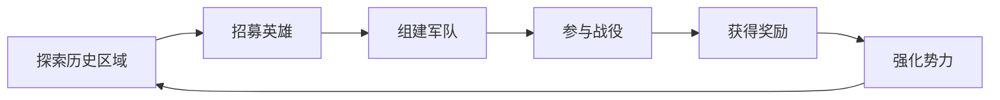

# 游戏设计总文档

## 一、核心玩法设计

### 游戏定位与基调
**核心基调**：本游戏是一款以宋朝为历史背景，融合了大量中国武侠、神话元素的**高幻想ARPG**。虽然包含了历史人物与事件，但核心玩法、角色能力和剧情走向将优先服务于"有趣好玩"的幻想体验，而非严格遵循历史。游戏的核心循环包含ARPG战斗、英雄收集与养成、以及轻度的势力策略玩法。

**关于范围**：文档中提及的英雄、物品、任务数量（如200+英雄）是项目的长远目标，用于指导整体架构设计。对于1.0版本，将选取其中最具代表性的部分进行实现，以确保在有限的开发周期内完成一个高质量的核心体验。

### 目标受众分析
- **主要年龄段**：18-35岁
- **游戏偏好**：
  * 喜欢动作角色扮演游戏（ARPG）
  * 对宋朝历史和中国传统文化感兴趣
  * 追求有深度的游戏体验和策略性
- **游戏习惯**：
  * 单次游戏时长：30-120分钟
  * 游戏频率：每周3-5次
  * 偏好探索性和策略性并存的游戏体验

### 游戏规模规划
- **主线剧情时长**：15-20小时（四章结构）
- **支线内容时长**：8-12小时（英雄传说、历史事件）
- **内容比重分配**：
  * 战斗内容：40%
  * 探索内容：30%
  * 剧情内容：20%
  * 策略内容：10%

### 难度曲线设计
1. **入门门槛**
   - 新手教程区域（30分钟，汴京新手村）
   - 基础机制分步解锁（移动、攻击、技能）
   - 引导式任务设计（历史事件引导）
   - 保护性难度调整（新手保护期）

2. **进阶难度**
   - 随英雄招募逐步提升
   - 每个主要区域增加10-15%难度
   - 可选精英怪物提供额外挑战
   - 支线任务设置更高难度要求

3. **挑战内容**
   - 历史战役副本（高于当前区域30%难度）
   - 武林大会挑战
   - 连续战斗竞技场
   - 限时挑战任务

4. **难度调节**
   - 动态难度系统自动调整
   - 可选择的游戏难度模式
   - 英雄推荐等级指引
   - 失败惩罚机制柔和设计

### 核心玩法循环
1. **主循环**


2. **战斗循环**
   - **基础攻击系统**
     * 轻击（快速、连击）
     * 重击（蓄力、破防）
     * 技能攻击（武学招式）
     * 闪避/格挡机制
   
   - **英雄连携系统**
     * 历史名将统帅加成
     * 武林高手技能配合
     * 传说英雄特殊能力
     * 谋士文臣策略支援

3. **探索循环**
   - **历史区域探索**
     * 地图探索度系统
     * 历史遗迹发现
     * 环境谜题解决
     * 收集要素寻找
   
   - **奖励机制**
     * 宝箱开启
     * 材料采集
     * 历史任务触发
     * 特殊NPC遭遇

4. **成长循环**
   - **英雄成长**
     * 基础属性成长
     * 技能树发展
     * 装备品质提升
     * 专属能力解锁

## 二、战斗系统设计

### 基础战斗机制

#### 1.1 普通攻击连击

1. **轻攻击连击**
   - 3段连击组合（动画时长：0.4s, 0.45s, 0.6s）
   - 每段攻击间隔0.5秒
   - 连击窗口1.2秒（可通过武学技能缩短至0.8秒）
   - 伤害倍率：100% → 110% → 130%
   - 最后一击有击退效果（距离2米，硬直0.3秒）
   - **技术实现**：AnimationEvent触发伤害判定，使用Collider2D检测命中

2. **重攻击系统**
   - 蓄力时间1.2秒（可通过装备减少至0.8秒）
   - 伤害倍率200%（满蓄力250%）
   - 破防效果+50%（无视敌人50%防御）
   - 消耗内力值20点
   - 可打断敌人动作（打断优先级：高）
   - **蓄力机制**：按住攻击键蓄力，松开释放
   - **技术实现**：ChargeAttack组件，使用协程管理蓄力状态

3. **空中攻击**
   - 跳跃攻击伤害120%
   - 空中连击最多3段（每段伤害递增10%）
   - 落地攻击范围伤害（3米半径，伤害衰减）
   - 空中攻击不消耗额外内力
   - **空中时间限制**：最多滞空2秒
   - **技术实现**：AerialCombat组件，检测地面距离和滞空时间

#### 1.2 闪避格挡系统

1. **闪避机制**
   - 闪避距离3米（可通过轻功提升至4.5米）
   - 无敌帧0.2秒（熟练度提升可达0.3秒）
   - 冷却时间1秒（连续闪避冷却递增：1s→1.5s→2s）
   - 消耗内力15点（轻装备-5点，重装备+5点）
   - 完美闪避触发慢动作（0.5秒，敌人攻击前0.1秒内闪避）
   - **方向性闪避**：8个方向，后撤距离+20%
   - **技术实现**：DodgeSystem组件，使用射线检测避免穿墙

2. **格挡系统**
   - 格挡减伤70%（盾牌+10%，双手武器-10%）
   - 完美格挡减伤95%（并反弹10%伤害给攻击者）
   - 完美格挡窗口0.3秒（敌人攻击命中前0.3秒内格挡）
   - 格挡消耗内力10点（重攻击格挡消耗20点）
   - 连续格挡效果递减（第2次70%→60%，第3次60%→50%）
   - **格挡角度限制**：前方120度范围内有效
   - **技术实现**：BlockSystem组件，使用角度计算和时间窗口检测

3. **反击机制**
   - 完美格挡后可反击（自动进入反击状态）
   - 反击伤害150%（武学熟练度影响：+0-50%）
   - 反击窗口1秒（技能可延长至1.5秒）
   - 反击必定暴击（暴击伤害200%）
   - 反击不消耗内力（但有独立冷却3秒）
   - **连锁反击**：反击成功后可触发第二次反击
   - **技术实现**：CounterAttack组件，状态机管理反击时机

#### 1.3 硬直与霸体

1. **硬直系统**
   - 受击硬直时间0.3秒（轻攻击）/0.6秒（重攻击）
   - 硬直累积机制：连续受击硬直时间叠加（最多1.5秒）
   - 硬直期间无法行动（但可消耗内力强制取消，消耗30点）
   - 连击可延长硬直时间（每次命中+0.1秒）
   - 部分武学可减少硬直（韧性武学-50%硬直时间）
   - **硬直恢复**：脱离战斗3秒后硬直抗性+50%
   - **技术实现**：StunSystem组件，使用计时器和状态标记

2. **霸体机制**
   - 霸体状态免疫硬直和击退
   - 霸体持续时间有限（3-10秒，根据武学/装备）
   - 重攻击可破除霸体（需要连续3次重攻击）
   - 霸体有血量机制（100-500点霸体值）
   - 霸体破除后进入虚弱状态（防御-30%，持续5秒）
   - **霸体等级**：1-3级，高等级霸体需要更强攻击破除
   - **技术实现**：ArmorSystem组件，独立血量条和破除判定

## 三、角色成长系统
（此部分保持不变，但具体实现需对接新的“伙伴与军队系统”）

...

## 四、世界观和剧情设计

### 借助AI构建游戏世界

1. 世界观设计提示词（已更新）：
```
角色：游戏世界观设计师
背景：创作2D ARPG的，融合宋朝历史、武侠、神话的多元宇宙世界观
目标：构建一个拥有双重界域、信仰力法则、并允许玩家高度自由选择的宏大世界。

请设计以下内容：

1. 核心世界观
   - 多元宇宙设定：存在多个物质界，可通过特定方式穿梭。我们的故事主舞台是“大宋界”。
   - 双重界域：存在“物质界”与“精神界”，后者是前者的意识投影，互相影响。
   - 信仰力法则：精神界生物的力量来自物质界的信仰，信仰分为数量（广度）和质量（深度）。这应是驱动势力冲突的核心暗线。

2. 玩家角色设定
   - 身份背景：来自现代科技世界的普通人，意外穿越到“大宋界”。
   - 核心特点：不受此世界天命、因果、信仰束缚的“异乡人”，拥有极高可塑性。
   - 阵营系统：设计一个类似D&D的善恶/秩序阵营系统，玩家的行为会动态影响自身阵营，并改变NPC和世界的反应。

3. 地理环境与势力分布
   - 地理设定：以北宋末、南宋初的中国为蓝本，包含中原、江南、燕云、西域、梁山等区域。
   - 主要势力阵营：
     * 朝廷正统：北宋与南宋朝廷。
     * 异族入侵：金、西夏等，他们有自己的信仰体系。
     * 江湖势力：丐帮、全真教等武林门派。
     * 义军起义：梁山泊等民间反抗力量。
     * 界外来客：从其他宇宙穿越而来的个人或组织，作为不确定因素。

4. 英雄系统分类
   - 玩家角色：独特的成长线，可自由选择发展方向。
   - 历史名将：岳飞、韩世忠等。
   - 武林高手：郭靖、杨过等。
   - 传说英雄：哪吒、关羽、孙悟空等（设定为来自其他宇宙的强大存在）。
   - 谋士文臣：诸葛亮、范仲淹等。
```

2. 剧情设计提示词（已更新）：
```
角色：游戏剧情设计师
背景：设计一个以“异乡人”玩家为主角的，高自由度的多元宇宙ARPG故事线。
目标：创造一个玩家选择能真实影响世界走向的，融合历史与神话的史诗故事。

请设计以下内容：

1. 主线剧情：凡界回响
   - 第一章：异客西来
     * 玩家穿越到北宋末年，在靖康之耻的混乱中求生，并了解世界的核心规则（多元宇宙、信仰力）。
   - 第二章：群雄并起
     * 玩家开始建立自己的声望和势力，招募伙伴，建立军队，自由选择初步阵营。
   - 第三章：界域交错
     * 多元宇宙的英雄和枭雄开始频繁介入“大宋界”，玩家获得探索其他宇宙的机会，信仰战争初现端倪。
   - 第四章：天命在我
     * 天下大决战，玩家的选择将导向多种结局（如统一天下、回归故里、成为新神等）。

2. 支线剧情：英雄传说
   - 保持武林篇、历史篇、传说篇的设定。
   - “传说篇”英雄的获取方式，需设计为通过探索异界、完成神谕任务等方式达成。

3. 随机事件系统
   - 将“时空裂隙”事件改为“界域通道”、“异界来客求助”、“精神界异动”、“信仰奇迹”等更符合新世界观的事件。
```

## 五、伙伴与军队系统设计 (新增)

### AI辅助设计伙伴与军队机制

1. 系统设计提示词：
```
角色：游戏系统设计师
背景：为一款高自由度ARPG设计伙伴与军队系统。
目标：创造一个既有深度、又能给予玩家成就感的招募与养成系统。

请设计以下系统：

1. 伙伴系统 (Companion System)
   - 招募机制：不同伙伴有不同招募条件（剧情进展、阵营声望、特定任务、金钱雇佣、战斗折服等）。
   - 养成机制：等级、装备、技能树、好感度系统、专属剧情任务。
   - 互动机制：伙伴会根据玩家的阵营和行为做出评论，好感度高时会提供帮助或赠礼。

2. 军队系统 (Army System)
   - 单位分类：设计不同的兵种（步兵、骑兵、弓兵、特殊兵种），有相互克制关系。
   - 养成机制：军队可以通过训练升级，学习新的“阵法”（提供战斗buff），并可以通过消耗资源来提升装备。
   - 指挥机制：在大型战斗中，玩家可以指挥军队作战，军队的强度和阵法将直接影响战局。
```

## 六、游戏节奏设计
（原“五、游戏节奏设计”，序号顺延）
...

## 七、关卡设计原则
（原“六、关卡设计原则”，序号顺延）
...

## 八、GDD文档模板
（原“七、GDD文档模板”，序号顺延）
...

## 九、下一步行动计划
（原“八、下一步行动计划”，序号顺延）
...

## 十、AI工具使用指南

### 10.1 AI工具集成总览

本项目采用AI驱动的开发方法，将AI工具深度整合到游戏开发的各个环节。通过系统化的AI工具使用，显著提升开发效率、创意质量和实现效果。

#### 核心AI工具栈

**设计与规划工具**
- **Claude Code**: 游戏设计文档生成、系统设计、剧情创作、代码实现
- **Google nano**: 概念艺术生成、氛围图设计、创意发散
- **MCP Tools**: 项目管理、文件系统操作、扩展功能支持

**美术与音频工具**
- **ComfyUI**: 像素风格美术资源生成、图像处理工作流
- **Google banana**: 视觉内容生成和创意设计
- **Veo 3**: 动态内容生成、视频制作、动画序列
- **Google Audio Generation**: 音效和背景音乐生成

**质量保证工具**
- **Claude Code**: 代码审查、测试生成、质量评估
- **MCP Testing Tools**: 自动化测试框架和结果分析
- **自定义质量脚本**: 专门的质量检查和验证流程

### 10.2 设计阶段AI应用

#### 10.2.1 游戏概念设计

**世界观构建AI工作流**
```prompt
角色：资深游戏世界观设计师
背景：为宋朝背景的ARPG游戏构建多元宇宙世界观
目标：创造融合历史、武侠、神话的深度游戏世界

要求：
1. 设计双重界域（物质界/精神界）的核心规则
2. 建立信仰力法则的力量体系
3. 创造跨宇宙的英雄角色设定
4. 设计势力分布和冲突机制

输出格式：
- 世界观核心概念说明
- 势力关系图谱
- 英雄角色设计模板
- 世界规则和技术实现建议
```

**系统设计AI工作流**
```prompt
角色：游戏系统设计专家
背景：设计2D ARPG的核心战斗和成长系统
目标：创造深度和可玩性并重的游戏机制

请设计：
1. 战斗系统核心机制
2. 角色成长路径
3. 装备和技能系统
4. 经济和奖励循环

技术要求：
- 考虑Unity 2D实现
- 设计可扩展的架构
- 平衡性和深度兼顾
- 支持后续内容扩展
```

#### 10.2.2 剧情和对话生成

**主线剧情AI工作流**
```prompt
角色：游戏编剧和叙事设计师
背景：为宋朝ARPG设计分支剧情线
目标：创造玩家选择真实影响世界的故事

设计要素：
1. 四章式主线剧情结构
2. 多分支剧情走向
3. 历史人物的角色塑造
4. 道德选择和后果系统

特色要求：
- 融合真实历史事件
- 加入神话传说元素
- 体现宋朝文化特色
- 支持不同阵营路线
```

**NPC对话AI工作流**
```prompt
角色：对话设计师和角色扮演专家
背景：为游戏中的历史人物和原创角色设计对话
目标：创造有个性、有深度的NPC互动

对话类型：
- 日常问候和闲聊
- 剧情关键对话
- 支线任务触发
- 阵营相关反应

技术考虑：
- 支持对话树系统
- 条件触发机制
- 语音配音适配
- 本地化友好设计
```

### 10.3 开发阶段AI应用

#### 10.3.1 Unity开发辅助

**C#代码生成**
```prompt
角色：Unity开发专家
背景：为2D ARPG游戏实现核心系统
目标：编写高质量、可维护的游戏代码

系统需求：[具体系统描述]
技术要求：
- 遵循Unity最佳实践
- 使用ScriptableObject配置数据
- 实现事件驱动架构
- 支持编辑器扩展

代码标准：
- 清晰的命名规范
- 完整的注释文档
- 错误处理机制
- 性能优化考虑
```

**动画系统实现**
```prompt
角色：Unity动画专家
背景：实现2D像素风格的战斗动画系统
目标：创建流畅、响应迅速的动画体验

动画需求：
- 角色移动和攻击动画
- 技能特效动画
- 受击和死亡动画
- UI交互动画

技术实现：
- 使用Unity 2D Animation
- 动画状态机设计
- Animation事件触发
- 性能优化策略
```

#### 10.3.2 美术资源生成

**像素角色设计**
```prompt
角色：像素美术设计师
背景：为宋朝ARPG设计2D像素角色
目标：创造符合历史风格和游戏需求的像素美术

角色类型：[具体角色描述]
设计要求：
- 16-bit像素风格
- 8方向移动动画
- 战斗动作序列
- 装备变化系统

技术规格：
- 基础尺寸：64x64像素
- 动画帧率：12-15fps
- 色彩限制：32色调色板
- 文件格式：PNG透明背景
```

**环境素材生成**
```prompt
角色：环境美术设计师
背景：设计宋朝风格的游戏环境
目标：创造沉浸式的历史氛围

场景元素：
- 建筑物和街道
- 自然景观和地形
- 室内场景布置
- 道具和装饰品

风格要求：
- 历史准确性参考
- 像素艺术风格统一
- 模块化设计支持
- 性能优化考虑
```

### 10.4 质量保证AI应用

#### 10.4.1 代码质量检查

**AI代码审查清单**
- [ ] 代码结构合理性
- [ ] 性能潜在问题
- [ ] 错误处理完整性
- [ ] 命名规范遵循
- [ ] 注释文档完整性
- [ ] 架构设计合理性
- [ ] 扩展性考虑
- [ ] 测试覆盖率

#### 10.4.2 设计一致性检查

**AI设计审查工作流**
```prompt
角色：游戏设计审查专家
背景：审查游戏设计的一致性和完整性
目标：确保各系统间的协调和平衡

审查内容：
1. 游戏机制一致性
2. 数值平衡性检查
3. 用户体验流程验证
4. 技术实现可行性
5. 内容完整性评估

输出要求：
- 发现的问题列表
- 改进建议和方案
- 优先级排序
- 实施时间估算
```

### 10.5 项目管理AI集成

#### 10.5.1 任务分解和规划

**AI任务管理辅助**
```prompt
角色：项目管理专家
背景：为游戏开发项目制定详细计划
目标：将开发任务分解为可执行的子任务

项目阶段：[具体阶段描述]
任务要求：
- 4级任务层级分解
- 依赖关系明确
- 时间估算合理
- 资源分配优化
- 风险识别和应对

输出格式：
- 任务树状结构
- 时间轴规划
- 里程碑设定
- 资源需求分析
```

#### 10.5.2 进度跟踪和报告

**AI进度分析**
- 自动化进度数据收集
- 任务完成率统计分析
- 延期风险预警
- 资源使用效率评估
- 质量指标监控

### 10.6 最佳实践和注意事项

#### 10.6.1 AI工具使用原则

**高效使用AI的黄金法则**
1. **明确的目标设定**: 清晰定义AI需要完成的任务
2. **充分的背景信息**: 提供完整的项目背景和约束条件
3. **结构化的输出要求**: 明确指定输出格式和质量标准
4. **迭代优化过程**: 多轮对话逐步完善结果
5. **人工审核把关**: AI输出必须经过专业人员审核

#### 10.6.2 常见陷阱和解决方案

**AI使用的挑战**
1. **输出过于通用**: 解决方案 - 提供更具体的项目背景和要求
2. **技术准确性不足**: 解决方案 - 结合专业知识进行验证和修正
3. **缺乏创意性**: 解决方案 - 在提示词中加入创意要求和创新约束
4. **一致性问题**: 解决方案 - 建立统一的AI工作流程和模板

#### 10.6.3 团队协作建议

**AI工具团队整合策略**
1. **培训和学习**: 团队成员AI工具使用培训
2. **标准化流程**: 建立统一的AI工具使用规范
3. **知识共享**: AI工具使用经验和技巧分享
4. **持续改进**: 定期评估AI工具效果并优化流程

### 10.7 未来发展方向

#### 10.7.1 新兴AI技术整合

**前沿AI技术应用**
- **AI代码生成**: 更高级的代码自动生成能力
- **AI动画生成**: 自动化2D动画生成技术
- **AI测试自动化**: 智能化的游戏测试和验证
- **AI数据分析**: 游戏数据和用户行为智能分析

#### 10.7.2 长期发展规划

**AI驱动开发演进**
1. **初期阶段**: 辅助设计和文档生成
2. **中期阶段**: 深度整合到开发和测试流程
3. **成熟阶段**: AI与人工协作的智能化开发体系
4. **未来愿景**: AI辅助的端到端游戏开发平台

---
**免责声明**：本文档由AI辅助生成，仅供学习和参考。实际开发中请根据项目需求进行调整。
---

**AI工具使用说明**: 本文档中的AI工具使用指南基于当前最佳实践，随着AI技术的发展，建议定期更新和优化AI工具使用策略。