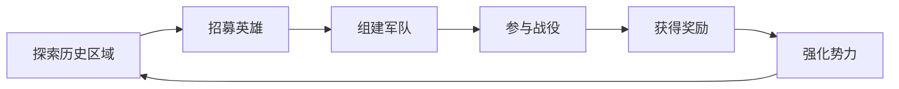

# 宋朝历史与传说融合ARPG游戏机制设计文档

## 设计说明

**核心基调**：本游戏是一款以宋朝为历史背景，融合了大量中国武侠、神话元素的**高幻想ARPG**。虽然包含了历史人物与事件，但核心玩法、角色能力和剧情走向将优先服务于“有趣好玩”的幻想体验，而非严格遵循历史。游戏的核心循环包含ARPG战斗、英雄收集与养成、以及轻度的势力策略玩法。

**关于范围**：文档中提及的英雄、物品、任务数量（如200+英雄）是项目的长远目标，用于指导整体架构设计。对于1.0版本，将选取其中最具代表性的部分进行实现，以确保在有限的开发周期内完成一个高质量的核心体验。

---

## 一、目标受众分析

- 主要年龄段：18-35岁
- 游戏偏好：
  * 喜欢动作角色扮演游戏（ARPG）
  * 对宋朝历史和中国传统文化感兴趣
  * 追求有深度的游戏体验和策略性
- 游戏习惯：
  * 单次游戏时长：30-120分钟
  * 游戏频率：每周3-5次
  * 偏好探索性和策略性并存的游戏体验

## 二、游戏规模规划

- 主线剧情时长：15-20小时（四章结构）
- 支线内容时长：8-12小时（英雄传说、历史事件）
- 内容比重分配：
  * 战斗内容：40%
  * 探索内容：30%
  * 剧情内容：20%
  * 策略内容：10%

## 三、难度曲线设计

1. 入门门槛
   - 新手教程区域（30分钟，汴京新手村）
   - 基础机制分步解锁（移动、攻击、技能）
   - 引导式任务设计（历史事件引导）
   - 保护性难度调整（新手保护期）

2. 进阶难度
   - 随英雄招募逐步提升
   - 每个主要区域增加10-15%难度
   - 可选精英怪物提供额外挑战
   - 支线任务设置更高难度要求

3. 挑战内容
   - 历史战役副本（高于当前区域30%难度）
   - 武林大会挑战
   - 连续战斗竞技场
   - 限时挑战任务

4. 难度调节
   - 动态难度系统自动调整
   - 可选择的游戏难度模式
   - 英雄推荐等级指引
   - 失败惩罚机制柔和设计

## 四、核心玩法循环

1. 主循环

2. 战斗循环
   - 基础攻击系统
     * 轻击（快速、连击）
     * 重击（蓄力、破防）
     * 技能攻击（武学招式）
     * 闪避/格挡机制
   
   - 英雄连携系统
     * 历史名将统帅加成
     * 武林高手技能配合
     * 传说英雄特殊能力
     * 谋士文臣策略支援

3. 探索循环
   - 历史区域探索
     * 地图探索度系统
     * 历史遗迹发现
     * 环境谜题解决
     * 收集要素寻找
   
   - 奖励机制
     * 宝箱开启
     * 材料采集
     * 历史任务触发
     * 特殊NPC遭遇

4. 成长循环
   - 英雄成长
     * 基础属性成长
     * 技能点获取
     * 新技能解锁
   - 势力强化
     * 城池建设
     * 军队招募
     * 装备收集
   - 声望系统
     * 江湖声望
     * 朝廷声望
     * 义军声望
     * 特殊称号

## 五、独特卖点设计

1. 创新特性
   - 历史与传说融合系统
     * 宋朝历史事件触发特殊任务
     * 传说英雄现世机制（时空裂隙）
     * 历史人物与神话英雄互动
     * 多结局分支设计（历史改变）
     * **技术实现**：HistoricalEventSystem类，使用事件驱动架构
   
   - 英雄招募与培养系统
     * 历史名将招募（岳飞、韩世忠等）
     * 武林高手收徒（郭靖、杨过等）
     * 传说英雄召唤（哪吒、关羽等）
     * 英雄关系网络（师徒、结义、敌对）
     * **技术实现**：HeroRecruitmentSystem类，管理招募条件和关系网络

2. 差异化设计
   - 多势力选择系统
     * 朝廷正统路线（忠臣良将）
     * 江湖侠义路线（武林门派）
     * 义军反抗路线（梁山好汉）
     * 独立势力路线（自立为王）
     * **技术实现**：FactionSystem类，管理势力关系和声望系统
   
   - 武学境界系统
     * 武学等级划分（入门、小成、大成、宗师、大宗师）
     * 境界突破机制（需要特定条件和资源）
     * 武学传承系统（师徒传授、秘籍学习）
     * 特殊武学效果（独门绝技、门派特色）
     * **技术实现**：MartialArtsSystem类，管理武学等级和传承

3. 玩家粘性设计
   - 丰富的收集要素
     * 历史文物收集（300+文物，分5个稀有度）
     * 武学秘籍收集（108种武学，分5个等级）
     * 英雄图鉴（200+英雄，包含历史背景）
     * 成就系统（200+成就，分类管理）
     * **技术实现**：CollectionSystem类，使用ScriptableObject存储收集数据
   
   - 社交互动系统
     * 师徒关系（影响武学学习速度+50%）
     * 江湖声望（5个等级，影响商店折扣和任务奖励）
     * 势力排名（周榜、月榜，前10名获得特殊奖励）
     * 切磋交流（PvP模式，胜利获得声望点）
     * **技术实现**：SocialSystem类，集成排行榜和声望管理

## 六、战斗系统核心设计

1. 基础动作设计
   - 移动系统
     * 八方向自由移动（基础速度：5m/s）
     * 轻功系统（消耗内力，速度提升200%，持续0.3秒）
     * 跳跃
     * 翻滚回避（无敌帧0.2秒，移动距离3米）
     * **技术实现**：CharacterController + Rigidbody2D，使用状态机管理移动状态
   
   - 攻击系统
     * 轻攻击（0.5秒/次，基础伤害100%）
     * 重攻击（1.2秒蓄力，伤害200%，破防+50%）
     * 武学技能（冷却时间3-15秒，伤害150-400%）
     * **技术实现**：AttackSystem类，使用动画事件触发伤害判定

2. 连击设计
   - 基础连击
     * 3段轻攻击连击（伤害倍率：1.0x, 1.1x, 1.3x）
     * 2段重攻击连击（伤害倍率：2.0x, 2.5x）
     * 轻重混合连击（最多5段，每段+10%伤害）
     * **连击窗口**：每段攻击后0.8秒内可继续连击
   
   - 武学连击
     * 武学技能连携（最多4技能连携）
     * 门派武学组合（同门派武学+25%伤害）
     * 武器切换连击（切换瞬间+30%暴击率）
     * 内力附魔连击（武学技能后3秒内普攻附带内力效果）
     * **技术实现**：ComboTracker组件，记录连击状态和时间窗口

3. 武学系统
   - 武学分类（每种武学独立等级1-10级）
     * 剑法：破防+10-50%，暴击率+5-25%
     * 拳法：每秒回血1-5%，中毒伤害10-50/秒
     * 刀法：减速20-60%，流血概率5-25%
     * 枪法：爆发伤害+20-100%，击退5-25%
     * 掌法：防御+15-75%，眩晕概率10-50%
   
   - 武学相互作用
     * 相生效果（剑→刀→枪→掌→拳→剑，伤害+20%）
     * 相克效果（剑克拳，拳克掌，掌克枪，枪克刀，刀克剑，伤害+50%）
     * 武学融合特效（双武学同时使用产生特殊效果）
     * 环境武学互动（水边剑法增强，山间掌法加强等）
     * **技术实现**：MartialArtsSystem类，使用矩阵计算武学相克关系

## 七、反馈系统设计

1. 打击感反馈
   - 视觉反馈
     * 打击特效
     * 受击震动
     * 伤害数字
     * 击退效果
   
   - 音效反馈
     * 攻击音效
     * 受击音效
     * 元素效果音
     * 连击音效

2. 战斗节奏控制
   - 攻击前摇：0.1-0.3秒
   - 攻击后摇：0.2-0.4秒
   - 技能施放时间：0.5-1.5秒
   - 连击窗口期：0.8秒

3. 动态难度调整
   - 玩家数据分析
     * 死亡频率
     * 连击成功率
     * 技能使用效率
     * 伤害输出统计
   
   - 调整参数
     * 敌人攻击频率
     * 敌人生命值
     * 掉落率
     * 经验获取率

## 八、成长系统框架

1. 等级系统
   - 等级上限：50级
   - 经验曲线：EXP(n) = 100 * n^1.5（前期快速，后期放缓）
   - 等级奖励：
     * 基础属性提升（HP+50，SP+10，攻击+5，防御+3）
     * 技能点获取（每级1点，突破额外5点）
     * 新功能解锁（特定等级解锁系统功能）
   * **技术实现**：LevelSystem类，使用经验值表和事件系统
   
2. 技能树设计
   - 三大分支（每分支30个技能节点）
     * 武术系：近战物理输出（强调连击和爆发）
     * 法术系：元素伤害输出（强调范围和控制）
     * 气功系：辅助和控制（强调增益和治疗）
   
   - 技能解锁机制
     * 等级要求（1-5级技能每5级解锁一层）
     * 前置技能（树状结构，需要前置技能达到指定等级）
     * 技能点消耗（1级技能1点，5级技能5点）
     * 特殊解锁条件（部分技能需要完成特定任务）
   * **技术实现**：SkillTree类，使用图结构管理技能依赖关系

3. 装备系统
   - 装备槽位（8个槽位）
     * 武器（主手、副手）
     * 护甲（头盔、胸甲、腿甲、靴子）
     * 饰品（项链、戒指）
   
   - 属性系统
     * 基础属性（攻击、防御、生命、气力等）
     * 特殊效果（暴击、吸血、反弹等）
     * 元素亲和（五行元素加成0-100%）
     * 套装效果（2件套、4件套、6件套递进效果）
   * **技术实现**：EquipmentSystem类，使用装备数据表和属性计算器

## 九、UI/UX设计建议

1. 界面布局
   - 战斗界面（1920x1080分辨率适配）
     * 生命气力条（左上角，200x60像素）
     * 技能快捷栏（底部中央，600x80像素）
     * 小地图（右上角，150x150像素）
     * 状态图标（生命条下方，40x40像素/个）
     * **技术实现**：Canvas + UI组件，使用锚点适配不同分辨率
   
   - 菜单界面（全屏覆盖）
     * 角色属性（左侧面板，400x600像素）
     * 装备管理（中央区域，600x600像素）
     * 技能树（右侧面板，500x600像素）
     * 任务追踪（可折叠侧边栏，300x400像素）
     * **技术实现**：多Canvas分层管理，使用DOTween制作动画

2. 信息反馈
   - 战斗信息
     * 伤害数字（飞出动画，颜色区分伤害类型）
     * 状态图标（闪烁提示，倒计时显示）
     * 连击计数（屏幕中央，字体大小随连击数增大）
     * 元素效果（粒子特效+UI图标双重反馈）
     * **技术实现**：DamagePopup组件，使用对象池优化性能
   
   - 探索信息
     * 地图进度（百分比显示，区域完成度）
     * 收集提示（物品图标+数量，自动消失）
     * 任务标记（3D世界空间UI，距离淡化）
     * 互动提示（按键提示，距离检测显隐）
     * **技术实现**：WorldSpaceUI + 距离检测系统

## 十、性能优化考虑

1. 渲染优化
   - 2D精灵批处理（使用Sprite Atlas）
   - 粒子效果LOD系统（距离和性能自适应）
   - UI元素对象池（频繁创建销毁的UI组件）
   - 动态合批优化（相同材质的对象合并渲染）

2. 内存管理
   - 资源异步加载（Addressables系统）
   - 音频压缩优化（根据重要性选择压缩率）
   - 纹理压缩（平台特定格式）
   - 垃圾回收优化（减少临时对象创建）

3. 数据结构优化
   - 技能系统使用ScriptableObject
   - 敌人AI使用行为树（Behavior Tree）
   - 存档系统使用JSON序列化
   - 网络同步使用增量更新

## 十一、AI对话交互系统

1. NPC个性化对话系统
   - 记忆系统
     * 记录与玩家的历史对话
     * 追踪玩家的行为选择
     * 保存关键剧情进展
     * 记录任务完成状态
   
   - 情感模型
     * 基于历史互动的好感度
     * NPC心情状态变化
     * 性格特征影响对话
     * 动态表情系统

2. 智能对话生成
   - 上下文感知
     * 当前任务进度
     * 玩家行为历史
     * 时间和地点因素
     * 世界事件影响
   
   - 对话变体系统
     * 多样化问候语
     * 动态对话选项
     * 基于关系的回应
     * 情境相关对白

3. 对话分支设计
   - 动态分支系统
     * 基于玩家属性的选项
     * 技能相关对话
     * 任务状态影响
     * 声望系统互动
   
   - 对话影响力
     * 影响NPC态度
     * 触发隐藏任务
     * 改变剧情走向
     * 获取独特奖励

4. AI互动深度
   - 个性化任务系统
     * 基于玩家行为生成任务
     * 动态调整任务难度
     * 个性化任务奖励
     * 关联任务链生成
   
   - 社交网络模拟
     * NPC之间的关系网络
     * 信息传播系统
     * 阵营关系变化
     * 随机事件触发

5. 交互反馈系统
   - 即时反馈
     * 动态表情变化
     * 语气词调整
     * 姿态动画响应
     * 环境音效配合
   
   - 长期影响
     * 声望系统变化
     * 商店价格调整
     * 任务难度适应
     * 特殊对话解锁

6. 技术实现框架
   - 对话生成模型
     * 基于规则的基础对话
     * 机器学习动态生成
     * 情境相关过滤
     * 个性化调整
   
   - 数据管理
     * 对话历史存储
     * 关系网络更新
     * 任务状态追踪
     * 玩家行为分析

7. 优化机制
   - 性能优化
     * 对话生成缓存
     * 局部更新机制
     * 资源动态加载
     * 内存优化管理
   
   - 质量控制
     * 对话审核系统
     * 异常检测机制
     * 用户反馈收集
     * 实时调整参数

## 十二、开发里程碑

1. 原型阶段（1-2个月）
   - 基础移动和攻击系统
   - 简单的元素系统
   - 核心战斗循环
   - 基础UI框架

2. Alpha阶段（3-6个月）
   - 完整技能系统
   - 装备和成长系统
   - 3个完整关卡
   - 基础音效和特效

3. Beta阶段（7-10个月）
   - 完整游戏内容
   - 平衡性调优
   - 性能优化
   - 本地化支持

4. 发布阶段（11-12个月）
   - 最终测试和修复
   - 发布准备
   - 营销推广
   - 后续更新计划
