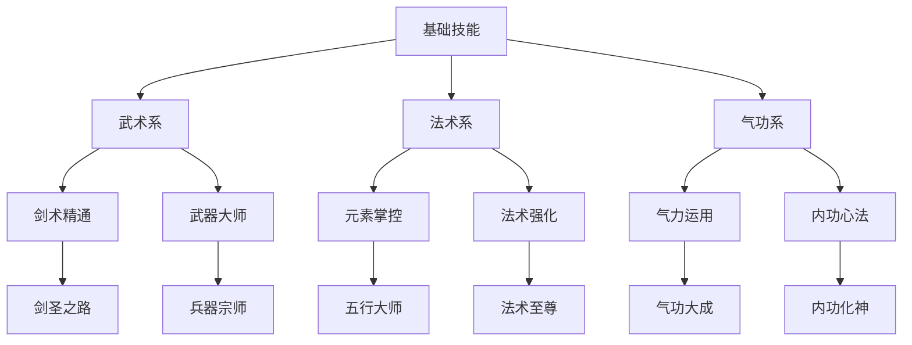

# 宋朝历史与传说融合ARPG角色成长系统设计

## 一、核心属性体系

1. 主要属性设计
   - 生命值（HP）
     * 基础值：1000
     * 每级成长：50（线性增长）
     * 装备加成：100-500（装备等级×10）
     * 武学提升：5%-20%（被动武学提供）
     * **回复机制**：脱战后每秒回复5%最大生命值
     * **技术实现**：HealthSystem组件，支持多种回复方式
   
   - 内力值（MP）
     * **设计说明**：统一的战斗资源，用于施展各种武学和特殊技能。合并了原有的“武学能量”，简化玩家理解。
     * 基础值：200
     * 每级成长：15（线性增长）
     * 装备加成：20-100（特定装备提供）
     * 恢复速度：10/秒（脱战后15/秒，部分武学或装备可提供战斗中恢复的能力）
     * **技术实现**：ManaSystem组件，与武学系统联动

2. 战斗属性
   - 物理攻击
     * 基础值：50
     * 每级成长：5（线性增长）
     * 武器倍率：1.2-2.0（武器品质决定）
     * 暴击系数：1.5-2.5（武学系被动）
     * **伤害计算**：最终伤害 = (物理攻击 × 武学倍率 - 敌人防御) × 随机系数(0.9-1.1)
     * **技术实现**：PhysicalDamageCalculator组件
   
   - 武学攻击
     * 基础值：40
     * 每级成长：6（线性增长）
     * 武学倍率：1.3-2.2（武学境界影响）
     * 武学穿透：5%-20%（无视敌人武学抗性）
     * **伤害计算**：最终伤害 = 武学攻击 × 武学倍率 × (1 - 敌人抗性 × (1 - 穿透率))
     * **技术实现**：MartialArtsDamageCalculator组件

   - 防御力
     * 基础值：30
     * 每级成长：3（线性增长）
     * 装备加成：10-100（护甲提供）
     * 减伤系数：10%-50%（防御力 / (防御力 + 100)）
     * **减伤上限**：最大减伤75%避免完全免疫
     * **技术实现**：DefenseSystem组件，计算减伤效果

3. 特殊属性
   - 暴击属性
     * 暴击率：5%-30%（饰品主要来源）
     * 暴击伤害：150%-250%（武器词缀）
     * 暴击抗性：5%-25%（减少被暴击概率）
     * **暴击判定**：使用伪随机分布避免连续不暴击
     * **技术实现**：CriticalSystem组件，使用PRD算法
   
   - 速度属性
     * 移动速度：100%（基准值5m/s）
     * 攻击速度：100%（影响普攻间隔）
     * 施法速度：100%（影响武学施法时间）
     * 闪避速度：100%（影响闪避动画速度）
     * **速度限制**：战斗中移动速度-20%，负重影响移动速度
     * **技术实现**：SpeedController组件，支持多种速度修正

   - 武学属性
     * 武学精通：0-100（影响武学连携伤害）
     * 武学伤害加成：0%-50%（每10精通提升5%伤害）
     * 武学抗性：0%-75%（减少对应武学伤害）
     * 武学连携效率：100%-200%（精通影响连携触发概率）
     * **武学连携**：剑克拳、拳克掌、掌克枪、枪克刀、刀克剑
     * **技术实现**：MartialArtsSystem组件，处理武学交互

## 二、等级系统设计

1. 经验值机制
   - 获取方式（主要来源分配）
     * 击杀敌人：10-100经验（占总经验70%）
     * 完成任务：100-1000经验（占总经验25%）
     * 探索发现：50-200经验（占总经验5%）
     * 历史事件：200-500经验（额外奖励）
     * **等级差异修正**：EXP = 基础EXP × (1 + (敌人等级-玩家等级) × 0.1)
     * **技术实现**：ExperienceSystem组件，统一经验计算
   
   - 经验计算（防止刷低级怪）
     * 基础经验值（敌人类型决定）
     * 等级差异系数（-7级以上仅10%经验）
     * 难度加成（精英×3，BOSS×10）
     * 连击奖励（连击数×5%，最高50%）
     * **组队加成**：2人80%，3人70%，4人65%
     * **技术实现**：ExpCalculator组件，实时计算修正

2. 等级提升收益
   - 基础属性提升（每级固定收益）
     * HP/MP增长（线性增长）
     * 攻防属性成长（保证数值平衡）
     * 特殊属性提升（暴击率每10级+1%）
     * **属性点分配**：每级额外获得2点自由属性点
     * **技术实现**：LevelUpReward组件，自动分配属性
   
   - 能力解锁（渐进式开放）
     * 武学点获取（1点/级+突破奖励）
     * 特性解锁（被动武学槽位）
     * 装备限制解除（等级需求）
     * 功能开放（5级间隔解锁新系统）
     * **解锁提示**：每次解锁新功能时显示教程
     * **技术实现**：FeatureUnlockSystem组件

3. 等级上限设定
   - 阶段划分（成长节奏控制）
     * 新手期：1-20级（快速成长，1小时/级）
     * 成长期：21-40级（稳定成长，2小时/级）
     * 成熟期：41-45级（缓慢成长，4小时/级）
     * 巅峰期：46-50级（极慢成长，8小时/级）
     * **经验曲线**：EXP(n) = 1000 × n^1.8
     * **技术实现**：ExperienceTable ScriptableObject
   
   - 突破机制（质变成长）
     * 等级突破任务（特定挑战，每10级）
     * 属性质变提升（全属性+20%）
     * 特殊能力获得（解锁2个新武学）
     * 外观改变效果（境界光效升级）
     * **境界名称**：练气→筑基→金丹→元婴→化神
     * **技术实现**：BreakthroughSystem组件，CultivationRealm组件

## 三、武学技能树系统

### 3.1 武学分类

1. 武术技能（物理伤害为主）
   - 剑法系（15个武学，4个等级）
     * 基础剑法：普通斩击（1级武学，120%攻击力，2秒冷却）
     * 进阶剑法：连环三斩（15级武学，80%×3攻击力，8秒冷却）
     * 奥义剑法：剑气纵横（30级武学，300%攻击力，15秒冷却）
     * 传说剑法：万剑归宗（45级武学，150%×10攻击力，60秒冷却）
     * **武学升级**：每级提升20%伤害，减少10%冷却时间
     * **技术实现**：SwordMartialArtsTree类，继承BaseMartialArtsTree
   
   - 拳法系（15个武学，4个等级）
     * 基础拳法：重拳出击（1级武学，100%攻击力+击退，3秒冷却）
     * 进阶拳法：连击风暴（12级武学，60%×5攻击力，10秒冷却）
     * 奥义拳法：震山拳（25级武学，400%攻击力+眩晕，20秒冷却）
     * 传说拳法：千手观音（40级武学，80%×15攻击力，45秒冷却）
     * **特殊效果**：拳法武学有概率触发连击，每次连击伤害递增10%
     * **技术实现**：FistMartialArtsTree类，ComboCounter组件
   
   - 轻功系（12个武学，3个等级）
     * 基础轻功：疾风步（5级武学，瞬移5米，5秒冷却）
     * 进阶轻功：踏雪无痕（20级武学，3秒隐身+50%移速，15秒冷却）
     * 奥义轻功：凌波微步（35级武学，5秒无敌+穿墙，30秒冷却）
     * **内力消耗**：轻功武学消耗10-30点内力
     * **技术实现**：MovementMartialArtsTree类，StealthSystem组件

2. 武学技能（武学伤害为主）
   - 五行武学（每系10个武学）
     * 金系武学：金针术（200%武攻+穿透），金刚护体（减伤50%，10秒）
     * 木系武学：藤蔓缠绕（150%武攻+束缚3秒），生命汲取（治疗50%伤害）
     * 水系武学：冰锥术（180%武攻+减速），治愈之泉（回复30%生命）
     * 火系武学：火球术（220%武攻+灼烧），爆炎术（300%武攻范围）
     * 土系武学：土刺术（160%武攻+击飞），岩石护盾（吸收500伤害）
     * **武学连携**：不同武学组合触发特殊效果，伤害提升50-200%
     * **技术实现**：ElementalMartialArtsTree类，MartialArtsReactionSystem组件
   
   - 辅助武学（8个武学）
     * 治疗武学：治愈术（回复40%生命，3秒施法），群体治疗（范围治疗）
     * 增益武学：力量祝福（攻击+30%，60秒），敏捷祝福（速度+50%，60秒）
     * 控制武学：定身术（眩晕3秒），混乱术（敌人互相攻击5秒）
     * 召唤武学：灵兽召唤（召唤战斗伙伴60秒），元素精灵（辅助攻击）
     * **内力消耗**：辅助武学消耗20-50点内力
     * **技术实现**：SupportMartialArtsTree类，BuffSystem组件

3. 被动武学（永久效果）
   - 属性强化（20个武学）
     * 生命强化：生命值+10%/15%/20%（3级，需求武学点2/4/6）
     * 攻击强化：攻击力+8%/12%/16%（3级，需求武学点2/4/6）
     * 防御强化：防御力+10%/15%/20%（3级，需求武学点2/4/6）
     * 速度强化：移动速度+15%/25%/35%（3级，需求武学点2/4/6）
     * **技术实现**：PassiveMartialArtsManager组件，StatModifier系统
   
   - 特殊能力（15个武学）
     * 暴击精通：暴击率+5%/8%/12%，暴击伤害+20%/30%/40%
     * 武学精通：武学伤害+15%/25%/35%，武学抗性+10%/15%/20%
     * 武器精通：武器伤害+20%/30%/40%，攻击速度+10%/15%/20%
     * 战斗直觉：闪避率+10%/15%/20%，反击概率+5%/8%/12%
     * **解锁条件**：需要前置武学和特定等级
     * **技术实现**：SpecialAbilitySystem组件，CombatIntuition组件

### 3.2 武学学习条件

1. 等级要求（渐进式解锁）
   - 基础武学：1-10级（新手友好，快速上手）
   - 进阶武学：11-25级（核心武学，战斗主力）
   - 奥义武学：26-40级（高级武学，战术核心）
   - 传说武学：41-50级（终极武学，游戏后期）
   - **解锁提示**：达到等级时自动提示可学习武学
   - **技术实现**：MartialArtsUnlockChecker组件，等级监听器

2. 技能点消耗（平衡投入产出）
   - 基础技能：1-3点（低门槛，鼓励尝试）
   - 进阶技能：3-5点（中等投入，明显提升）
   - 奥义技能：5-8点（高投入，显著效果）
   - 传说技能：8-12点（巨大投入，游戏改变者）
   - **技能点获取**：1点/级+突破奖励5点+成就奖励
   - **重置机制**：消耗"洗髓丹"可重置技能点（稀有道具）
   - **技术实现**：SkillPointManager组件，SkillReset功能

3. 前置技能要求（技能树逻辑）
   - 技能树分支（每个分支独立发展）
   - 技能等级要求（前置技能需达到特定等级）
   - 特殊条件完成（击败特定BOSS、完成特殊任务）
   - 师父传授解锁（NPC好感度达到要求）
   - **分支限制**：同时最多激活3个主要分支
   - **技术实现**：SkillPrerequisiteChecker组件，依赖关系图

4. 特殊材料需求（增加获取难度）
   - 技能书获取（商店购买、任务奖励、BOSS掉落）
     * 基础技能书：100-500金币
     * 进阶技能书：1000-3000金币或任务获得
     * 奥义技能书：BOSS掉落或特殊商人
     * 传说技能书：隐藏任务或世界BOSS
   - 修炼材料收集（提升技能等级）
     * 灵石：提升技能伤害（1-100个）
     * 精华：减少技能冷却（1-50个）
     * 符文：增加特殊效果（1-20个）
   - 特殊任务完成（解锁条件）
     * 连击任务：连续命中100次解锁连击技能
     * 生存任务：单次战斗存活10分钟解锁防御技能
     * 击杀任务：击败1000个敌人解锁杀戮技能
   - 师门贡献达标（社交系统）
     * 贡献点数：完成师门任务获得
     * 好感度：与NPC互动提升
     * 声望等级：影响高级技能解锁
   - **技术实现**：MaterialRequirement组件，QuestCondition系统

### 3.3 技能升级机制

1. 技能等级（10级上限）
   - 初级：1-3级（基础效果，学习阶段）
   - 中级：4-6级（效果明显，实用阶段）
   - 高级：7-9级（强力效果，精通阶段）
   - 大师级：10级（极致效果，大师阶段）
   - **升级难度**：每级所需经验递增，后期需要大量投入
   - **技术实现**：SkillLevel组件，经验值系统

2. 升级效果（数值化提升）
   - 伤害提升：每级+15%（1级100% → 10级235%）
   - 冷却减少：每级-8%（1级10秒 → 10级4.3秒）
   - 范围扩大：每级+12%（1级5米 → 10级13.5米）
   - 特效增强：3级/6级/9级解锁新效果
     * 3级：基础特效（击退、减速等）
     * 6级：进阶特效（穿透、连锁等）
     * 9级：高级特效（追踪、分裂等）
   - **平衡考虑**：确保升级收益递减，避免数值膨胀
   - **技术实现**：SkillScaling组件，效果计算器

3. 升级消耗（多种资源）
   - 技能点投入（主要消耗）
     * 1-3级：每级1点
     * 4-6级：每级2点
     * 7-9级：每级3点
     * 10级：5点
   - 修炼时间（离线收益）
     * 每级需要1-10小时修炼时间
     * 可通过"修炼加速符"缩短时间
   - 材料消耗（稀有资源）
     * 灵石：1-100个（等级越高消耗越多）
     * 技能精华：特定技能升级材料
     * 悟性丹：提升升级成功率
   - 实战经验（使用次数）
     * 每个技能需要使用100-1000次才能升级
     * 成功命中和造成伤害提供更多经验
   - **技术实现**：SkillUpgradeSystem组件，ResourceManager

4. 特殊升级（高级机制）
   - 技能融合（组合技能）
     * 两个相关技能达到5级可融合
     * 融合后获得新技能，保留原技能部分效果
     * 例：火球术+冰锥术 → 冰火双煞
     * **技术实现**：SkillFusion组件，融合配方系统
   
   - 变异进化（随机强化）
     * 技能达到7级后有5%概率变异
     * 变异技能获得随机额外效果
     * 例：火球术变异 → 追踪火球
     * **技术实现**：SkillMutation组件，随机效果池
   
   - 传承升华（NPC传授）
     * 特定NPC可传授技能升华版本
     * 需要完成特殊任务和达到好感度
     * 升华技能效果大幅提升
     * **技术实现**：SkillInheritance组件，NPC交互系统
   
   - 顿悟突破（随机事件）
     * 战斗中有极低概率触发顿悟
     * 顿悟时技能直接提升1-2级
     * 概率受悟性属性和使用频率影响
     * **技术实现**：EnlightenmentSystem组件，随机触发器

### 3.4 技能点管理

1. 技能点获取（多样化来源）
   - 获取途径
     * 等级提升：每级1点（主要来源，占60%）
     * 主线任务：5-10点（重要节点奖励）
     * 特殊成就：1-3点（鼓励探索）
     * 隐藏挑战：3-5点（高难度奖励）
     * 师门贡献：每1000贡献兑换1点
     * 竞技场排名：每周根据排名发放1-5点
     * **总计获得**：满级约150点，需合理分配
     * **技术实现**：SkillPointManager组件，多来源统计
   
   - 重置机制（允许重新规划）
     * 一级重置（免费）：每月1次，重置最近10点分配
     * 二级重置（材料）：消耗"忘忧草"，重置单个技能树
     * 完全重置（道具）：消耗"洗髓丹"，重置所有技能点
     * **重置限制**：传说技能重置需要特殊道具
     * **技术实现**：SkillResetSystem组件，重置记录

2. 技能树结构（分支化发展）

3. 分支详解（专精路线）
   - 武术系（物理战斗专精）
     * 剑术精通（剑类武器特化）
       - 基础剑法强化：普通攻击+20%伤害
       - 高级剑术解锁：解锁"御剑术"、"剑气斩"
       - 特殊技巧掌握：剑类武器暴击率+15%
       - 剑气凝聚技能：远程剑气攻击
       - **终极技能**：万剑归宗（45级解锁）
     
     * 武器大师（全武器精通）
       - 武器熟练度提升：所有武器伤害+10%
       - 切换技能强化：武器切换时获得5秒攻速+50%
       - 特殊武器解锁：可装备"神兵"级别武器
       - 武器技能组合：不同武器技能可以连击
       - **终极技能**：兵器风暴（40级解锁）

   - 法术系（元素魔法专精）
     * 元素掌控（元素反应专家）
       - 元素亲和提升：所有元素伤害+25%
       - 元素反应强化：元素反应伤害+100%
       - 新元素解锁：解锁"光"、"暗"元素
       - 元素爆发特性：元素技能有20%概率不消耗法力
       - **终极技能**：五行轮回（50级解锁）
     
     * 法术强化（法术威力专精）
       - 法术伤害提升：所有法术伤害+30%
       - 施法时间缩短：施法速度+40%
       - 法术范围扩大：范围法术半径+50%
       - 特殊效果增强：法术附加效果持续时间+100%
       - **终极技能**：禁咒释放（48级解锁）

   - 气功系（内力修炼专精）
     * 气力运用（气力操控专家）
       - 气力值上限提升：气力上限+100%
       - 气力恢复加速：气力回复速度+200%
       - 气力消耗降低：所有技能气力消耗-50%
       - 气力爆发技能：消耗所有气力造成巨额伤害
       - **终极技能**：气贯长虹（42级解锁）
     
     * 内功心法（被动强化专精）
       - 基础属性强化：生命、攻击、防御+25%
       - 被动技能增强：所有被动技能效果+50%
       - 状态抗性提升：负面状态抗性+60%
       - 特殊buff获得：战斗开始获得"金刚不坏"状态
       - **终极技能**：内功化神（满级解锁）
   * **技术实现**：SkillTreeBranch组件，专精度系统

## 四、装备系统

### 4.1 装备槽位设计

1. 装备槽位设计（12个装备位）
   - 武器栏（3个槽位）
     * 主武器：主要伤害来源，影响普攻和技能
     * 副武器：提供额外属性，某些技能需要
     * 法器：法术伤害加成，元素技能必需
     * **切换机制**：战斗中可快速切换武器
     * **技术实现**：WeaponSlot组件，武器切换系统
   
   - 防具栏（4个槽位）
     * 头部防具：提供防御+特殊抗性
     * 身体防具：主要防御来源+生命值
     * 手部防具：攻击属性+技能加成
     * 腿部防具：移动速度+负重能力
     * **套装搭配**：同系列防具有额外加成
     * **技术实现**：ArmorSlot组件，防御计算系统
   
   - 饰品栏（5个槽位）
     * 项链：法术攻击+元素抗性
     * 戒指×2：特殊属性+暴击相关
     * 护符：状态抗性+特殊效果
     * 特殊饰品：独特效果+收集要素
     * **稀有度高**：饰品获取难度大但效果显著
     * **技术实现**：AccessorySlot组件，特效管理器

2. 装备品质划分（6个品质等级）
   - 品质等级（颜色区分+数值差异）
     * 普通（白色）：基础属性，无词缀，掉落率70%
     * 精良（绿色）：1-2条特殊属性，掉落率20%
     * 稀有（蓝色）：2-3条特殊属性，掉落率7%
     * 史诗（紫色）：3-4条特殊属性，掉落率2.5%
     * 传说（金色）：4-5条特殊属性，掉落率0.4%
     * 神器（红色）：5-6条特殊属性+特效，掉落率0.1%
     * **品质影响**：高品质装备基础属性更高
     * **技术实现**：ItemQuality枚举，品质生成器

   - 属性词条（随机属性系统）
     * 固定属性词条：装备基础属性（攻击、防御等）
     * 随机属性词条：额外属性加成（暴击、速度等）
     * 特殊效果词条：独特能力（吸血、穿透等）
     * 套装效果词条：套装专属属性
     * **词缀权重**：不同词缀出现概率不同
     * **技术实现**：AffixSystem组件，随机生成器

3. 强化系统（装备升级机制）
   - 基础强化（安全区间）
     * 强化等级：+1到+10
     * 成功率：100%-50%（线性递减）
     * 材料需求：强化石×1-10（递增）
     * 属性提升：每级+8%基础属性（线性增长）
     * **失败无损**：失败只消耗材料
     * **技术实现**：EnhancementSystem组件
   
   - 进阶强化（风险区间）
     * 强化等级：+11到+15
     * 成功率：45%-20%（快速递减）
     * 失败惩罚：有概率降级1-2级
     * 属性提升：每级+12%基础属性（指数增长）
     * **保护道具**：可使用保护符防止降级
     * **技术实现**：RiskEnhancement组件

   - 完美强化（极限挑战）
     * **设计说明**：为避免玩家产生大的挫败感，移除了原设计中“装备破碎”的惩罚。失败后装备将最多回退3级，但绝不破碎。
     * 强化等级：+16到+20
     * 成功率：15%-5%（极低成功率）
     * 失败惩罚：强化等级下降1-3级，材料消失。
     * 属性提升：每级+20%基础属性（质变提升）
     * **神器材料**：需要稀有的神级强化石
     * **技术实现**：ExtremeEnhancement组件

4. 套装系统（组合效果）
   - 套装效果（递进式加成）
     * 2件套效果：基础套装加成（属性+15%）
     * 4件套效果：进阶套装加成（特殊技能+1级）
     * 6件套效果：高级套装加成（解锁套装技能）
     * 完整套装特效：视觉特效+独特光环
     * **套装种类**：战士套、法师套、刺客套等
     * **技术实现**：SetBonusManager组件
   
   - 混搭设计（策略搭配）
     * 不同套装组合：2+2+2件不同套装
     * 特殊搭配效果：特定组合有隐藏加成
     * 元素属性联动：元素套装间的相生相克
     * 职业特性加成：适合特定玩法的搭配
     * **搭配推荐**：游戏内提供搭配建议
     * **技术实现**：EquipmentCombination组件

## 五、成就系统

### 5.1 成就分类

1. 成就类型（多维度挑战）
   - 战斗成就（战斗技巧考验）
     * 连击达成：连续命中50/100/200次不中断
     * BOSS击杀：击败各种BOSS（普通/精英/传说）
     * 伤害记录：单次伤害达到1万/5万/10万
     * 特殊击杀方式：使用特定技能/武器击杀敌人
     * 生存挑战：单次战斗存活10/30/60分钟
     * 完美战斗：战斗中不受到任何伤害
     * **技术实现**：CombatAchievement组件，战斗数据统计
   
   - 收集成就（收集要素）
     * 装备收集：收集各品质装备（100/500/1000件）
     * 道具收集：收集稀有道具和材料
     * 材料收集：收集各种制作材料
     * 图鉴完成度：怪物图鉴/装备图鉴完成度
     * 套装收集：收集完整套装（10/25/50套）
     * 神器收藏：收集传说和神器级装备
     * **技术实现**：CollectionTracker组件，收集进度管理

   - 探索成就（世界探索）
     * 地图探索：探索地图完成度（50%/80%/100%）
     * 隐藏发现：发现隐藏地点和秘密区域
     * 解密完成：完成各种谜题和机关
     * 特殊事件：触发随机事件和隐藏剧情
     * 宝箱开启：开启各种宝箱（100/500/1000个）
     * 传送点激活：激活所有传送点
     * **技术实现**：ExplorationTracker组件，地图进度系统

   - 社交成就（互动要素）
     * 师门贡献：完成师门任务获得贡献点
     * NPC好感：与NPC建立友好关系
     * 交易成就：完成玩家间交易
     * 帮助新手：帮助低级玩家完成任务
     * **技术实现**：SocialAchievement组件

2. 成就奖励（多样化激励）
   - 直接奖励（即时获得）
     * 属性点数：1-5点自由属性点
     * 技能点数：1-3点技能点
     * 特殊道具：稀有材料、强化石、特殊装备
     * 称号获得：展示成就的称号
     * 金币奖励：1000-50000金币
     * 经验奖励：大量经验值
     * **技术实现**：AchievementReward组件
   
   - 成就点数（积分系统）
     * 点数获取：每个成就给予5-50点成就点数
     * 商店兑换：成就商店购买特殊物品
     * 特殊解锁：解锁隐藏功能和内容
     * 额外功能：VIP功能、特殊权限
     * 排行榜：成就点数排行榜
     * **技术实现**：AchievementPointSystem组件

3. 称号系统（身份象征）
   - 称号分类（不同类型）
     * 战斗称号："剑圣"、"法神"、"武林盟主"
     * 收集称号："收藏家"、"寻宝者"、"图鉴大师"
     * 探索称号："探险家"、"秘境行者"、"世界旅者"
     * 特殊称号："传说英雄"、"神话缔造者"
     * 限时称号：活动期间获得的特殊称号
     * **稀有度**：称号有普通/稀有/传说等级
   
   - 称号效果（实用价值）
     * 属性加成：全属性+5-20%
     * 外观特效：角色周围光环效果
     * 特殊能力：独特的被动技能
     * 独特动画：特殊的技能释放动画
     * 社交优势：NPC好感度加成
     * **技术实现**：TitleSystem组件，称号效果管理器

## 六、养成反馈系统

### 6.1 即时反馈系统

1. 即时反馈（实时成长感知）
   - 数值增长（可视化提升）
     * 属性提升飘字：+HP、+攻击力等数值飘字
     * 等级提升特效：升级时的光效和音效
     * 技能解锁提示：新技能解锁的动画提示
     * 成就达成通知：成就完成的弹窗和音效
     * 装备获得特效：获得高品质装备的特殊效果
     * 突破成功庆祝：境界突破时的华丽特效
     * **技术实现**：FeedbackManager组件，UI动画系统
   
   - 视觉反馈（外观进化）
     * 角色外观变化：等级提升改变服装和气质
     * 技能特效升级：高级技能有更华丽的特效
     * 装备光效强化：高品质装备发光效果
     * 称号特效展示：称号带来的光环和粒子效果
     * 境界标识：不同修炼境界的视觉标识
     * 武器进化：武器强化后的外观变化
     * **技术实现**：VisualUpgrade组件，特效管理器

2. 长期激励（持续动力）
   - 成长历程记录（成长轨迹）
     * 属性成长曲线：图表显示各属性成长趋势
     * 装备进化记录：记录装备获得和强化历史
     * 技能熟练度：显示各技能使用次数和熟练度
     * 成就完成度：成就系统进度和完成时间
     * 战斗记录：重要战斗的录像回放
     * 里程碑时刻：重要时刻的截图保存
     * **技术实现**：ProgressTracker组件，数据可视化
   
   - 里程碑奖励（阶段性激励）
     * 等级里程碑：10/20/30/40/50级特殊奖励
     * 收集里程碑：收集100/500/1000件装备奖励
     * 成就里程碑：完成10/50/100个成就奖励
     * 特殊事件里程碑：参与限时活动奖励
     * 游戏时长里程碑：累计游戏时间奖励
     * 消费里程碑：累计消费金额奖励
     * **技术实现**：MilestoneSystem组件，奖励发放器

3. 养成计划（规划工具）
   - 规划系统（模拟工具）
     * 技能规划模拟：预览技能点分配效果
     * 属性配装模拟：计算装备搭配后的属性
     * 材料需求计算：计算达成目标所需材料
     * 目标完成度追踪：显示当前目标完成进度
     * 时间预估：估算达成目标所需时间
     * 效率分析：分析不同养成路线的效率
     * **技术实现**：PlanningSystem组件，模拟计算器
   
   - 养成建议（智能推荐）
     * 新手推荐路线：为新玩家推荐最优发展路径
     * 职业发展建议：根据玩法偏好推荐技能
     * 装备搭配推荐：推荐适合当前等级的装备
     * 技能加点方案：提供多种技能加点模板
     * 每日任务推荐：推荐最有价值的日常任务
     * 活动参与建议：推荐参与收益最高的活动
     * **技术实现**：RecommendationEngine组件，AI推荐算法

### 6.2 社交系统

1. 师门系统（传统武侠元素）
   - 师门选择：少林、武当、峨眉、华山等经典门派
   - 师门任务：每日师门任务获得贡献和奖励
   - 师门技能：独特的门派技能和心法
   - 师门排名：贡献排行榜和奖励
   - **技术实现**：SectSystem组件，门派管理器

2. 好友系统（社交互动）
   - 好友添加：添加好友和黑名单管理
   - 好友互动：赠送体力、材料等
   - 好友副本：与好友组队挑战特殊副本
   - 好友排行：好友间的各种排行榜
   - **技术实现**：FriendSystem组件，社交网络

3. 竞技系统（PVP要素）
   - 竞技场：玩家间1v1战斗
   - 排行榜：实力排名和赛季奖励
   - 观战系统：观看高手对战学习技巧
   - 回放系统：保存精彩战斗录像
   - **技术实现**：ArenaSystem组件，PVP匹配器

**技术架构总结**：
- 使用组件化设计，各系统独立且可扩展
- 数据驱动的配置系统，便于数值调整
- 完善的存档系统，支持云存档和本地存档
- 性能优化考虑，支持大量数据的高效处理
- 模块化UI系统，支持多分辨率和平台适配
