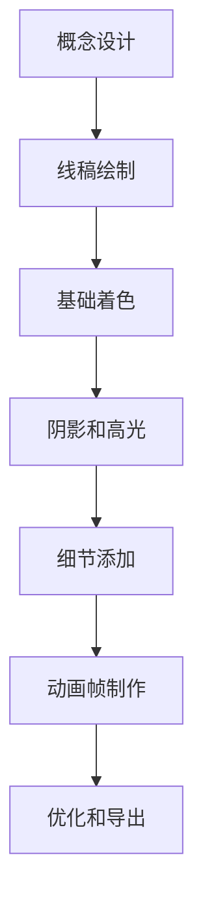

# 像素艺术创作教程 - 从概念到Unity集成

## 文档信息
- **文档编号**: ASSET-01-PIXELART
- **文档名称**: 像素艺术创作教程
- **版本**: v1.0
- **创建日期**: 2025-09-17
- **负责人**: 资产创作团队
- **审核状态**: 待审核

---

## 一、像素艺术概述

### 1.1 什么是像素艺术
像素艺术是一种数字艺术形式，通过有限的颜色和分辨率来创建图像。每个像素都是手动放置的，形成独特的视觉风格。

### 1.2 像素艺术在游戏中的应用
- **角色精灵**: 玩家角色、NPC、敌人
- **环境元素**: 背景、道具、建筑
- **UI元素**: 图标、按钮、面板
- **特效素材**: 粒子效果、技能特效
- **概念艺术**: 游戏概念和风格参考

### 1.3 像素艺术的优势
- **风格独特**: 独特的复古美感
- **性能高效**: 文件小，加载快
- **制作成本**: 相对较低的制作成本
- **跨平台兼容**: 适合各种平台
- **可扩展性**: 易于调整和修改

---

## 二、像素艺术基础

### 2.1 分辨率和比例

#### 2.1.1 常用分辨率
| 用途 | 推荐分辨率 |
|------|------------|
| 小型角色 | 16x16, 24x24, 32x32 |
| 中型角色 | 48x48, 64x64 |
| 大型角色 | 96x96, 128x128 |
| 小道具 | 16x16, 32x32 |
| 中型道具 | 64x64, 128x128 |
| 大型建筑 | 256x256, 512x512 |
| UI图标 | 16x16, 24x24, 32x32 |

#### 2.1.2 像素比例设置
- **1:1** - 标准正方形像素
- **2:1** - 宽屏像素 (SNES风格)
- **1:2** - 高屏像素

### 2.2 颜色理论

#### 2.2.1 颜色限制标准
| 位深度 | 颜色数量 | 适用场景 |
|--------|----------|----------|
| 1位 | 2种颜色 | 极简风格 |
| 4位 | 16种颜色 | 经典8位 |
| 8位 | 256种颜色 | 现代16位 |
| 16位 | 65,536种颜色 | 高质量 |

#### 2.2.2 调色板创建原则
1. **主色调选择**: 2-3种主要颜色
2. **明度变化**: 每种主色调配置3-4个明度级别
3. **对比色**: 1-2种对比色用于强调
4. **中性色**: 黑、白、灰用于过渡

**宋朝ARPG项目调色板示例**:
```yaml
盔甲系列:
  - 主色: (178, 34, 34)     # 深红色
  - 中间色: (139, 69, 19)   # 棕红色
  - 阴影: (101, 67, 33)     # 暗棕色
  - 高光: (255, 99, 71)     # 番茄红

皮肤系列:
  - 基础: (255, 220, 177)   # 浅肤色
  - 阴影: (200, 170, 140)   # 中等肤色
  - 深色: (139, 90, 43)     # 深肤色

环境系列:
  - 石材: (128, 128, 128)   # 灰色
  - 木质: (139, 69, 19)     # 棕色
  - 草地: (34, 139, 34)     # 绿色
```

### 2.3 像素艺术原则

#### 2.3.1 基本原则
1. **保持像素完整性**: 避免抗锯齿和模糊
2. **使用有限的调色板**: 限制颜色数量
3. **清晰的轮廓**: 使用对比色定义边缘
4. **一致的阴影**: 统一的阴影方向和强度
5. **适当的细节**: 避免过度细节导致混乱

#### 2.3.2 常见错误
1. 过度依赖自动工具
2. 使用太多颜色
3. 忽略像素对齐
4. 不一致的阴影
5. 过度复杂的细节
6. 忽视可读性
7. 不合适的分辨率

---

## 三、像素艺术创作工具

### 3.1 专业像素艺术软件

#### 3.1.1 Aseprite (推荐)
**核心功能**:
- 专用像素艺术编辑器
- 图层支持和动画制作
- 调色板管理工具
- 像素完美缩放
- 支持多种格式导出

**基本设置**:
```
新建文档: 32x32 或 64x64 像素
颜色模式: RGBA
背景: 透明
网格: 启用
```

**常用快捷键**:
- `B` - 画笔工具
- `E` - 橡皮擦
- `G` - 油漆桶填充
- `I` - 吸管工具
- `O` - 缩放工具
- `Ctrl+Z` - 撤销
- `Ctrl+S` - 保存

#### 3.1.2 Piskel (免费在线工具)
**特点**:
- 完全免费，在线使用
- 简单易用，适合初学者
- 支持实时预览
- 可导出GIF动画

### 3.2 通用图像编辑软件

#### 3.2.1 Photoshop像素艺术设置
**新建文档设置**:
- 分辨率: 72 PPI
- 颜色模式: RGB
- 背景内容: 透明
- 像素长宽比: 1:1

**首选项设置**:
- 图像插值: 邻近(保留硬边缘)
- 网格显示: 启用
- 对齐网格: 启用

**工具设置**:
- 画笔: 硬边圆笔刷
- 橡皮擦: 硬边
- 油漆桶: 容差0

#### 3.2.2 GIMP像素艺术设置
**新建图像设置**:
- 分辨率: 72 PPI
- 颜色空间: RGB
- 填充: 透明

**首选项设置**:
- 插值: 无
- 网格显示: 启用
- 对齐网格: 启用

---

## 四、像素艺术创作流程

### 4.1 角色精灵创作

#### 4.1.1 角色设计流程


#### 4.1.2 具体创作步骤

**步骤1: 概念设计**
- 确定角色特征: 性别、年龄、职业、性格
- 参考资料收集: 历史图片、相关游戏、艺术风格
- 草图绘制: 多个角度、不同姿势、颜色方案

**步骤2: 线稿绘制**
- 使用1像素宽的线条
- 保持线条清晰和简洁
- 避免过多的细节
- 确保轮廓闭合
- 使用对比色便于识别

**步骤3: 基础着色**
- 使用油漆桶工具填充大面积颜色
- 保持颜色数量有限(通常4-8种)
- 使用对比色创造视觉层次
- 避免渐变，使用纯色块

**着色顺序**:
1. 皮肤颜色
2. 头发颜色
3. 服装主色
4. 服装次色
5. 装饰品颜色
6. 武器/道具颜色

**步骤4: 阴影和高光**

**阴影原则**:
- 确定光源方向(通常左上45度)
- 使用较暗的色调创建立体感
- 保持阴影简洁，避免过度复杂

**高光原则**:
- 在光源方向添加高光
- 使用较亮的色调
- 突出重要特征
- 避免过度使用

**步骤5: 细节添加**

**面部特征**:
- 眼睛(大小、形状、表情)
- 嘴巴(简单线条表示)
- 鼻子(通常用阴影表示)
- 耳朵(根据需要)

**服装细节**:
- 褶皱和纹理
- 扣子和装饰
- 口袋和道具
- 磨损和破旧效果

**步骤6: 动画帧制作**

**动画帧数标准**:
- 待机动画: 4帧
- 行走动画: 8帧
- 跑步动画: 6帧
- 攻击动画: 6帧
- 受伤动画: 4帧

**动画制作技巧**:
- 使用洋葱皮工具查看前后帧
- 保持角色比例一致
- 注意动画节奏和时序
- 循环动画要平滑过渡
- 考虑物理规律(重力、惯性)
- 添加适当的缓冲帧

### 4.2 环境元素创作

#### 4.2.1 建筑物创作流程
1. **确定建筑风格和时代**
2. **绘制建筑轮廓**
3. **添加主要结构**
4. **绘制门窗和细节**
5. **添加阴影和高光**
6. **考虑多个角度**
7. **优化和导出**

**宋朝建筑特征**:
- 屋顶: 弯曲的屋顶线条，装饰性屋脊
- 柱子: 红漆木柱，石质底座
- 窗户: 格子窗，木质框架
- 墙壁: 白墙或砖墙
- 装饰: 雕刻和彩绘

#### 4.2.2 自然环境创作

**树木创作要点**:
- 简化形状，突出季节特征
- 使用有限的绿色调
- 注意树干纹理和树叶形状

**山石创作要点**:
- 使用几何形状，硬朗边缘
- 应用灰褐色调
- 强调纹理和阴影

**水体创作要点**:
- 表现波浪效果和反射
- 使用蓝色调系列
- 添加波纹和泡沫细节

### 4.3 UI元素创作

#### 4.3.1 图标设计原则
- **简洁明了**: 一眼就能识别
- **风格统一**: 与整体游戏风格一致
- **大小适中**: 在各种分辨率下清晰
- **对比度高**: 容易识别
- **意义明确**: 功能一目了然

**常见游戏图标**:
- 生命值: 心形或血滴
- 法力值: 蓝色水滴或星星
- 攻击力: 剑或拳头
- 防御力: 盾牌
- 金币: 硬币或钱袋
- 钥匙: 钥匙形状
- 地图: 地图图标
- 设置: 齿轮图标

#### 4.3.2 按钮和面板设计

**按钮设计要素**:
- 状态变化: 正常、悬停、点击、禁用
- 尺寸标准: 16x16, 32x32, 64x64
- 视觉反馈: 边框高亮、颜色变化、图标变化

**面板设计要素**:
- 类型区分: 窗口、对话框、状态栏
- 样式选择: 实心、边框、透明背景
- 装饰元素: 边框、角落装饰、背景纹理

---

## 五、AI辅助像素艺术创作

### 5.1 ComfyUI工作流程

#### 5.1.1 基本工作流
1. **提示词输入**: 描述想要的内容
2. **模型选择**: 选择适合的像素艺术模型
3. **参数设置**: 分辨率、步数、CFG值
4. **生成图像**: 执行生成过程
5. **后期处理**: 调整和优化

#### 5.1.2 像素艺术提示词模板

**角色提示词结构**:
```
pixel art, [角色描述], [风格特征], [技术要求]
```

**示例**:
```
pixel art, Song Dynasty warrior with traditional armor and sword, 16-bit RPG style, clean lines, limited color palette, transparent background
```

**环境提示词结构**:
```
pixel art, [场景描述], [视角要求], [风格特征]
```

**示例**:
```
pixel art, ancient Chinese temple courtyard, isometric view, 32-bit detailed sprite, traditional architecture, cherry blossom trees
```

### 5.2 AI生成后处理

#### 5.2.1 基本处理步骤
1. **缩放到目标分辨率**
2. **像素化处理**
3. **颜色量化(减少颜色数量)**
4. **清理噪点和杂色**
5. **增强边缘和轮廓**
6. **添加像素艺术效果**
7. **导出为游戏格式**

#### 5.2.2 质量检查要点
- 分辨率正确
- 透明背景
- 颜色数量合适
- 轮廓清晰
- 风格一致
- 无明显错误
- 文件格式正确

### 5.3 批量生成工作流

**批量生成流程**:
1. **准备提示词库**
2. **设置AI生成参数**
3. **批量生成图像**
4. **自动后处理**
5. **质量检查**
6. **人工审核**
7. **导出游戏资源**

---

## 六、像素艺术优化技巧

### 6.1 文件大小优化

#### 6.1.1 优化方法
- **减少颜色数量**: 从256色减少到16色
- **使用索引色彩**: 使用调色板而非RGB
- **压缩格式**: 使用PNG或WebP
- **去除冗余信息**: 删除不必要的元数据
- **合理设置分辨率**: 不使用过高的分辨率

#### 6.1.2 文件格式选择

| 格式 | 优点 | 缺点 | 适用场景 |
|------|------|------|----------|
| PNG | 无损压缩，支持透明 | 文件较大 | 需要高质量的场景 |
| WebP | 高压缩率，支持透明 | 兼容性问题 | 现代游戏 |
| JPEG | 文件小 | 不支持透明，有损压缩 | 背景图像 |

### 6.2 渲染优化

#### 6.2.1 Unity优化设置
**TextureImporter设置**:
- Filter Mode: Point (no filter)
- Compression: None
- Mipmap: Disabled
- Format: RGBA 32-bit

**SpriteRenderer设置**:
- Draw Mode: Simple
- Sprite Mode: Single
- Material: Unlit/Texture

**优化技巧**:
- 使用精灵图集减少Draw Calls
- 禁用不必要的mipmap
- 使用点过滤保持像素锐利
- 合理设置图集大小
- 使用九宫格缩放
- 优化碰撞体

### 6.3 视觉优化

#### 6.3.1 可读性优化
- 使用高对比度的颜色
- 保持线条清晰
- 避免过度复杂的细节
- 使用适当的阴影定义形状
- 保持一致的照明方向
- 使用合适的尺寸
- 考虑不同背景下的可见性

#### 6.3.2 动画优化
- **帧数控制**: 使用最少的帧数表达动作
- **帧率优化**: 使用12-24 FPS足够大多数动画
- **循环优化**: 确保动画循环平滑
- **内存优化**: 使用精灵图集，共享纹理

---

## 七、Unity集成设置

### 7.1 纹理导入设置

#### 7.1.1 基本导入设置
```yaml
Texture Type: Sprite (2D and UI)
Sprite Mode: Single
Pixels Per Unit: 16
Mesh Type: Tight
Compression: None
Filter Mode: Point (no filter)
Mipmap: Disabled
Wrap Mode: Clamp
Format: RGBA 32-bit
```

#### 7.1.2 精灵图集设置
```yaml
Type: Sprite Atlas
Include in Build: true
Tight Packing: Enabled
Rotate: Enabled
Padding: 2
Filter Mode: Point
Compression: None
```

### 7.2 像素完美相机设置

#### 7.2.1 相机配置参数
```yaml
Pixels Per Unit: 16
Reference Resolution: 192
Zoom: Auto (基于屏幕高度)
Orthographic Size: 自动计算
```

#### 7.2.2 像素对齐要求
- 相机位置必须对齐到像素网格
- 游戏对象位置必须对齐到像素网格
- UI元素位置必须对齐到像素网格

### 7.3 材质设置

#### 7.3.1 无光照材质
- Shader: Unlit/Texture
- 不受光照影响
- 保持原始像素颜色

#### 7.3.2 UI材质
- Shader: Unlit/Transparent
- 支持透明度
- 适合UI元素

---

## 八、项目实战案例

### 8.1 宋朝ARPG角色创建

#### 8.1.1 武士角色规格
```yaml
名称: 宋朝禁军武士
分辨率: 64x64
颜色数量: 16色
动画帧:
  待机: 4帧
  行走: 8帧
  攻击: 6帧
  受伤: 4帧
  死亡: 6帧

调色板:
  盔甲: 红色系 (3个明度级别)
  皮肤: 肤色系 (2个明度级别)
  金属: 灰色系 (2个明度级别)
  皮革: 棕色系 (2个明度级别)
```

#### 8.1.2 法师角色规格
```yaml
名称: 宋朝道士法师
分辨率: 64x64
颜色数量: 16色
动画帧:
  待机: 4帧
  行走: 8帧
  施法: 8帧
  受伤: 4帧
  死亡: 6帧

调色板:
  道袍: 蓝色系 (3个明度级别)
  皮肤: 肤色系 (2个明度级别)
  法器: 金色系 (2个明度级别)
  头发: 黑色系 (2个明度级别)
```

### 8.2 环境元素创建

#### 8.2.1 宋朝建筑规格
```yaml
名称: 宋朝官府
分辨率: 256x256
颜色数量: 32色
视角: 等距视角
调色板:
  屋顶: 红褐色系
  墙壁: 米色系
  柱子: 红色系
  门窗: 棕色系
  装饰: 金色系
```

#### 8.2.2 自然环境规格
```yaml
树木规格:
  分辨率: 64x64
  颜色: 绿色系为主
  季节变化: 春夏秋冬四季

山石规格:
  分辨率: 32x32
  颜色: 灰褐色系
  形状: 几何化处理

水体规格:
  分辨率: 64x64
  颜色: 蓝色系
  效果: 波浪和反射
```

### 8.3 UI元素创建

#### 8.3.1 游戏UI规格
```yaml
生命值条:
  尺寸: 64x8
  颜色: 红色系
  类型: 水平进度条

法力值条:
  尺寸: 64x8
  颜色: 蓝色系
  类型: 水平进度条

金币图标:
  尺寸: 16x16
  颜色: 金色系
  类型: 图标

背包按钮:
  尺寸: 32x32
  颜色: 灰色系
  类型: 按钮
```

---

## 九、质量检查和测试

### 9.1 技术质量检查

#### 9.1.1 文件检查清单
```
分辨率检查:
  ✓ 文件分辨率符合要求
  ✓ 像素长宽比正确
  ✓ 边缘对齐正确

颜色检查:
  ✓ 颜色数量符合限制
  ✓ 调色板使用正确
  ✓ 颜色对比度足够

透明度检查:
  ✓ 背景透明
  ✓ 半透明区域正确
  ✓ 边缘过渡平滑

文件格式检查:
  ✓ 文件格式正确(PNG)
  ✓ 文件大小合理
  ✓ 文件命名规范
```

#### 9.1.2 艺术质量检查
```
风格一致性:
  ✓ 与游戏整体风格一致
  ✓ 角色比例协调
  ✓ 颜色搭配和谐

可读性检查:
  ✓ 细节清晰可辨
  ✓ 轮廓线条明确
  ✓ 阴影合理

动画质量:
  ✓ 动画流畅自然
  ✓ 帧率适当
  ✓ 循环平滑
```

### 9.2 Unity内测试

#### 9.2.1 测试要点
- 精灵渲染效果
- 像素对齐情况
- 动画播放流畅度
- 内存使用情况
- 不同分辨率下的表现

#### 9.2.2 性能优化测试
- Draw Call数量
- 纹理内存占用
- 动画性能表现
- 整体帧率稳定性

---

## 十、总结

这个像素艺术创作教程提供了完整的从概念到Unity集成的指南，包含了：

1. **基础知识**: 像素艺术原理、工具使用、设计原则
2. **创作流程**: 角色、环境、UI元素的制作方法
3. **AI辅助**: ComfyUI工作流程、提示词模板、批量处理
4. **优化技巧**: 性能优化、视觉优化、动画优化
5. **Unity集成**: 导入设置、像素完美设置、材质配置
6. **实战案例**: 宋朝ARPG游戏的具体实现规格
7. **质量控制**: 检查清单、测试标准、质量保证

通过这套完整的像素艺术创作体系，开发团队可以高效地制作出高质量的游戏资产，为宋朝ARPG项目提供丰富的视觉内容。

**核心要点**:
- 专注于艺术创作流程而非代码实现
- 强调实用工具使用和操作步骤
- 提供具体的技术规格和参数设置
- 建立完整的质量控制体系
- 确保与Unity游戏引擎的完美集成

---

*本文档将持续更新，根据项目进展添加更多的创作技巧和最佳实践。*