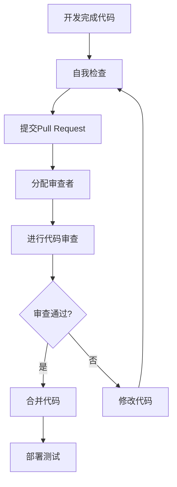

# 代码审查流程文档

## 文档信息
- **文档编号**: QA-02-CODEREVIEW
- **文档名称**: 代码审查流程文档
- **版本**: v1.0
- **创建日期**: 2025-09-17
- **负责人**: 质量保证团队
- **审核状态**: 待审核

---

## 一、代码审查概述

### 1.1 审查目标
- **代码质量**: 确保代码符合编码标准和最佳实践
- **功能正确性**: 验证代码实现符合需求和设计规范
- **性能优化**: 识别和解决性能问题
- **安全性**: 防止安全漏洞和潜在风险
- **可维护性**: 提高代码的可读性和可维护性

### 1.2 审查原则
- **建设性**: 提供建设性的反馈和建议
- **及时性**: 及时进行审查，不阻塞开发进度
- **全面性**: 覆盖所有重要的代码变更
- **一致性**: 统一的审查标准和流程
- **协作性**: 促进团队成员间的知识共享

### 1.3 审查范围
- **新功能代码**: 所有新增功能代码
- **重构代码**: 重要的重构和优化
- **核心系统**: 游戏管理器、战斗系统、角色系统等
- **性能敏感代码**: 渲染、物理、AI等
- **安全相关代码**: 数据存储、网络通信等

---

## 二、代码审查流程

### 2.1 审查流程图


### 2.2 详细流程

#### 2.2.1 开发阶段
```csharp
// 开发人员职责
1. 遵循编码规范
2. 编写单元测试
3. 进行自我检查
4. 编写清晰的提交信息
5. 提供必要的文档和注释

// 自我检查清单
- [ ] 代码符合命名规范
- [ ] 方法长度合理（不超过50行）
- [ ] 类职责单一
- [ ] 异常处理完整
- [ ] 单元测试覆盖率 > 80%
- [ ] 代码有适当的注释
- [ ] 提交信息清晰明确
```

#### 2.2.2 提交阶段
```csharp
// Pull Request模板
## 变更描述
### 变更类型
- [ ] 新功能
- [ ] Bug修复
- [ ] 重构
- [ ] 文档更新
- [ ] 性能优化

### 变更详情
简要描述这个PR的目的和主要变更内容...

### 测试情况
- [ ] 单元测试通过
- [ ] 集成测试通过
- [ ] 手动测试完成
- [ ] 性能测试通过

### 相关Issue
链接相关的Issue或任务...

### 审查者注意事项
请重点关注以下几个方面：
1. 代码结构和设计模式
2. 性能影响
3. 安全性考虑
4. 测试覆盖率
```

#### 2.2.3 审查阶段
```csharp
// 审查者职责
1. 检查代码质量和规范性
2. 验证功能实现的正确性
3. 评估性能影响
4. 检查安全性问题
5. 确保测试覆盖率
6. 提供建设性的反馈

// 审查清单
- [ ] 代码符合项目编码规范
- [ ] 方法职责单一且清晰
- [ ] 异常处理完整
- [ ] 性能考虑充分
- [ ] 安全性检查通过
- [ ] 单元测试覆盖率达标
- [ ] 代码注释清晰完整
- [ ] 变更范围合理
```

---

## 三、代码审查标准

### 3.1 编码规范检查

#### 3.1.1 命名规范
```csharp
// 正确的命名规范
public class PlayerController : MonoBehaviour {  // 类名：PascalCase
    private float moveSpeed;                    // 变量名：camelCase
    public const int MAX_HEALTH = 100;          // 常量：SCREAMING_SNAKE_CASE
    public float CurrentHealth { get; set; }     // 属性：PascalCase

    public void CalculateDamage() { }            // 方法名：PascalCase
    private void UpdatePlayerPosition() { }     // 私有方法：PascalCase
}

// 接口命名
public interface IDamageable {
    float Health { get; }
    void TakeDamage(float damage);
}

// 委托和事件
public delegate void HealthChangedHandler(float newHealth);
public event HealthChangedHandler OnHealthChanged;
```

#### 3.1.2 代码结构规范
```csharp
// 类结构规范
public class WellStructuredClass : MonoBehaviour {
    #region Fields and Properties
    [SerializeField] private float moveSpeed = 5f;
    public float MoveSpeed => moveSpeed;

    private Rigidbody2D _rigidbody;
    public Rigidbody2D Rigidbody => _rigidbody;
    #endregion

    #region Unity Lifecycle
    private void Awake() {
        _rigidbody = GetComponent<Rigidbody2D>();
    }

    private void Update() {
        HandleInput();
    }

    private void FixedUpdate() {
        HandleMovement();
    }
    #endregion

    #region Private Methods
    private void HandleInput() {
        // 输入处理逻辑
    }

    private void HandleMovement() {
        // 移动逻辑
    }
    #endregion

    #region Public Methods
    public void SetSpeed(float newSpeed) {
        moveSpeed = Mathf.Max(0, newSpeed);
    }
    #endregion
}
```

#### 3.1.3 错误处理规范
```csharp
// 正确的错误处理
public class DataManager {
    public bool SaveGame(SaveData data) {
        try {
            if (data == null) {
                throw new ArgumentNullException(nameof(data));
            }

            if (!ValidateData(data)) {
                return false;
            }

            string jsonData = JsonUtility.ToJson(data, true);
            string filePath = GetSaveFilePath(data.saveId);

            File.WriteAllText(filePath, jsonData);
            return true;
        }
        catch (Exception ex) {
            Debug.LogError($"保存游戏失败: {ex.Message}");
            return false;
        }
    }

    private bool ValidateData(SaveData data) {
        if (string.IsNullOrEmpty(data.saveId)) {
            Debug.LogWarning("存档ID不能为空");
            return false;
        }

        return true;
    }
}
```

### 3.2 性能审查标准

#### 3.2.1 性能敏感代码检查
```csharp
// 性能敏感代码示例
public class PerformanceCriticalCode : MonoBehaviour {
    private void Update() {
        // ❌ 错误：在Update中进行频繁的字符串操作
        string debugText = "Player Position: " + transform.position.x + ", " + transform.position.y;
        Debug.Log(debugText);

        // ✅ 正确：使用StringBuilder或减少调用频率
        if (Time.frameCount % 60 == 0) { // 每秒记录一次
            Debug.Log($"Player Position: {transform.position}");
        }
    }

    // ✅ 正确：使用对象池
    public class BulletPool : MonoBehaviour {
        private Queue<GameObject> bulletPool = new Queue<GameObject>();
        private GameObject bulletPrefab;

        public GameObject GetBullet() {
            if (bulletPool.Count > 0) {
                GameObject bullet = bulletPool.Dequeue();
                bullet.SetActive(true);
                return bullet;
            }

            return Instantiate(bulletPrefab);
        }

        public void ReturnBullet(GameObject bullet) {
            bullet.SetActive(false);
            bulletPool.Enqueue(bullet);
        }
    }
}
```

#### 3.2.2 内存管理检查
```csharp
// 正确的内存管理
public class MemoryManager : MonoBehaviour {
    private List<Texture2D> loadedTextures = new List<Texture2D>();

    // ✅ 正确：及时释放资源
    public void LoadTextures(string[] texturePaths) {
        foreach (string path in texturePaths) {
            StartCoroutine(LoadTextureAsync(path));
        }
    }

    private IEnumerator LoadTextureAsync(string path) {
        ResourceRequest request = Resources.LoadAsync<Texture2D>(path);
        yield return request;

        if (request.asset != null) {
            Texture2D texture = request.asset as Texture2D;
            loadedTextures.Add(texture);
        }
    }

    // ✅ 正确：场景卸载时清理资源
    private void OnDestroy() {
        foreach (var texture in loadedTextures) {
            if (texture != null) {
                Resources.UnloadAsset(texture);
            }
        }
        loadedTextures.Clear();
    }
}
```

### 3.3 安全性审查标准

#### 3.3.1 数据安全检查
```csharp
// 安全的数据处理
public class SecureDataManager {
    private string encryptionKey = "SecureKey123!";

    // ✅ 正确：数据加密
    public string EncryptData(string data) {
        if (string.IsNullOrEmpty(data)) {
            throw new ArgumentException("数据不能为空");
        }

        try {
            byte[] dataBytes = Encoding.UTF8.GetBytes(data);
            using (Aes aes = Aes.Create()) {
                aes.Key = Encoding.UTF8.GetBytes(encryptionKey.PadRight(32).Substring(0, 32));
                aes.IV = new byte[16];

                using (MemoryStream ms = new MemoryStream()) {
                    using (CryptoStream cs = new CryptoStream(ms, aes.CreateEncryptor(), CryptoStreamMode.Write)) {
                        cs.Write(dataBytes, 0, dataBytes.Length);
                    }
                    return Convert.ToBase64String(ms.ToArray());
                }
            }
        }
        catch (Exception ex) {
            Debug.LogError($"数据加密失败: {ex.Message}");
            throw;
        }
    }

    // ✅ 正确：输入验证
    public bool ValidateInput(string input, int maxLength = 100) {
        if (string.IsNullOrEmpty(input)) {
            return false;
        }

        if (input.Length > maxLength) {
            return false;
        }

        // 检查SQL注入等安全风险
        if (input.Contains("DROP") || input.Contains("DELETE") || input.Contains("'")) {
            return false;
        }

        return true;
    }
}
```

---

## 四、审查工具和检查清单

### 4.1 静态代码分析工具

#### 4.1.1 ReSharper配置
```xml
<!-- ReSharper配置示例 -->
<CodeInspectionProfile>
    < inspections>
        <inspection tool="ReSharper" severity="WARNING">
            <option name="CheckForNamespaceConsistency" value="true" />
            <option name="CheckForMethodOverloads" value="true" />
            <option name="CheckForParameterOrder" value="true" />
        </inspection>

        <inspection tool="Unity" severity="ERROR">
            <option name="CheckForPerformanceIssues" value="true" />
            <option name="CheckForMemoryLeaks" value="true" />
            <option name="CheckForNullReferences" value="true" />
        </inspection>
    </inspections>
</CodeInspectionProfile>
```

#### 4.1.2 自定义规则检查器
```csharp
// 自定义代码检查器
public class CustomCodeAnalyzer {
    // 检查方法长度
    public bool CheckMethodLength(MethodDeclarationSyntax method, int maxLength = 50) {
        int lineCount = method.GetLocation().GetLineSpan().EndLinePosition.Line -
                       method.GetLocation().GetLineSpan().StartLinePosition.Line + 1;
        return lineCount <= maxLength;
    }

    // 检查圈复杂度
    public int CalculateCyclomaticComplexity(MethodDeclarationSyntax method) {
        int complexity = 1; // 基础复杂度

        // 检查控制结构
        complexity += method.DescendantNodes()
            .Count(node => node is IfStatementSyntax ||
                            node is ForStatementSyntax ||
                            node is WhileStatementSyntax ||
                            node is DoStatementSyntax ||
                            node is SwitchStatementSyntax);

        return complexity;
    }

    // 检查异常处理
    public bool HasProperExceptionHandling(MethodDeclarationSyntax method) {
        return method.DescendantNodes()
            .Any(node => node is TryStatementSyntax);
    }
}
```

### 4.2 代码审查检查清单

#### 4.2.1 通用检查清单
```markdown
## 通用代码审查清单

### 代码质量
- [ ] 代码符合项目编码规范
- [ ] 类和方法命名清晰明确
- [ ] 代码结构合理，职责单一
- [ ] 代码可读性良好
- [ ] 注释清晰且必要

### 功能实现
- [ ] 实现符合需求和设计
- [ ] 逻辑正确且完整
- [ ] 边界情况处理完善
- [ ] 异常处理完整
- [ ] 单元测试覆盖率 > 80%

### 性能考虑
- [ ] 避免不必要的计算和内存分配
- [ ] 使用对象池管理频繁创建销毁的对象
- [ ] 异步操作正确使用
- [ ] 资源加载和释放合理
- [ ] 算法复杂度合理

### 安全性
- [ ] 输入验证完整
- [ ] 数据加密保护
- [ ] 权限检查正确
- [ ] 防止注入攻击
- [ ] 敏感信息保护

### Unity特定
- [ ] Unity生命周期正确使用
- [ ] MonoBehaviour模式正确
- [ ] 序列化字段正确
- [ ] 资源引用正确
- [ ] 场景切换处理合理
```

#### 4.2.2 系统特定检查清单
```markdown
## 战斗系统审查清单
- [ ] 伤害计算公式正确
- [ ] 状态效果应用合理
- [ ] 动画状态机配置正确
- [ ] 碰撞检测准确
- [ ] 性能指标达标

## 角色系统审查清单
- [ ] 属性计算准确
- [ ] 等级系统正确
- [ ] 技能系统完整
- [ ] 装备系统正确
- [ ] 状态管理合理

## UI系统审查清单
- [ ] UI布局正确
- [ ] 事件处理合理
- [ ] 动画效果流畅
- [ ] 本地化支持
- [ ] 性能优化到位
```

---

## 五、审查反馈和跟踪

### 5.1 反馈模板

#### 5.1.1 建设性反馈模板
```markdown
## 代码审查反馈

### 总体评价
**评分**: ⭐⭐⭐⭐☆ (4/5)
**总体评价**: 代码质量良好，主要功能实现正确，但有几个小的改进点。

### 具体反馈

#### 👍 优点
1. 代码结构清晰，方法职责单一
2. 异常处理完整
3. 单元测试覆盖率高
4. 性能考虑充分

#### 🔧 改进建议
1. **文件**: `PlayerController.cs`
   **行数**: 45-50
   **问题**: 方法过长，建议拆分
   **建议**: 将`HandleInput`方法拆分为更小的方法

2. **文件**: `CombatManager.cs`
   **行数**: 120-125
   **问题**: 硬编码的魔法数字
   **建议**: 使用常量或配置文件

3. **文件**: `DataManager.cs`
   **行数**: 200-205
   **问题**: 异常处理过于宽泛
   **建议**: 捕获特定的异常类型

### 审查结论
**状态**: 需要修改
**预计修改时间**: 1-2小时
**下次审查**: 建议修改后再次审查
```

### 5.2 缺陷跟踪

#### 5.2.1 代码缺陷分类
```csharp
// 缺陷严重级别定义
public enum CodeDefectSeverity {
    Critical,    // 导致系统崩溃或数据丢失
    Major,       // 影响核心功能
    Minor,       // 影响非核心功能
    Cosmetic,    // 仅影响代码质量
    Suggestion   // 改进建议
}

// 缺陷类型定义
public enum CodeDefectType {
    Bug,         // 功能错误
    Performance, // 性能问题
    Security,    // 安全漏洞
    Maintainability, // 可维护性问题
    Standards    // 编码规范问题
}
```

#### 5.2.2 缺陷修复跟踪
```csharp
// 缺陷跟踪系统
public class CodeDefectTracker {
    public class Defect {
        public string Id { get; set; }
        public string Description { get; set; }
        public CodeDefectSeverity Severity { get; set; }
        public CodeDefectType Type { get; set; }
        public string File { get; set; }
        public int LineNumber { get; set; }
        public string Assignee { get; set; }
        public DateTime CreatedAt { get; set; }
        public DateTime? FixedAt { get; set; }
        public DefectStatus Status { get; set; }
    }

    public enum DefectStatus {
        Open,
        InProgress,
        Resolved,
        Closed,
        Rejected
    }

    public void CreateDefect(Defect defect) {
        // 创建缺陷记录
    }

    public void UpdateDefectStatus(string defectId, DefectStatus status) {
        // 更新缺陷状态
    }

    public List<Defect> GetDefectsByAssignee(string assignee) {
        // 获取指定开发者的缺陷
        return new List<Defect>();
    }
}
```

---

## 六、代码质量度量

### 6.1 质量指标

#### 6.1.1 代码质量评分系统
```csharp
// 代码质量评分计算器
public class CodeQualityScorer {
    public CodeQualityScore CalculateScore(CodeAnalysisResult analysis) {
        var score = new CodeQualityScore();

        // 计算各项指标得分
        score.CodingStandardsScore = CalculateCodingStandardsScore(analysis);
        score.TestCoverageScore = CalculateTestCoverageScore(analysis);
        score.PerformanceScore = CalculatePerformanceScore(analysis);
        score.SecurityScore = CalculateSecurityScore(analysis);
        score.MaintainabilityScore = CalculateMaintainabilityScore(analysis);

        // 计算总分
        score.TotalScore = CalculateTotalScore(score);

        return score;
    }

    private float CalculateCodingStandardsScore(CodeAnalysisResult analysis) {
        float violationsCount = analysis.CodingStandardsViolations.Count;
        float maxViolations = 10; // 最大允许违规数
        return Math.Max(0, 100 - (violationsCount / maxViolations * 100));
    }

    private float CalculateTestCoverageScore(CodeAnalysisResult analysis) {
        return analysis.TestCoverage;
    }

    private float CalculatePerformanceScore(CodeAnalysisResult analysis) {
        float performanceIssuesCount = analysis.PerformanceIssues.Count;
        float maxIssues = 5; // 最大允许性能问题数
        return Math.Max(0, 100 - (performanceIssuesCount / maxIssues * 100));
    }

    private float CalculateSecurityScore(CodeAnalysisResult analysis) {
        float securityIssuesCount = analysis.SecurityIssues.Count;
        float maxIssues = 3; // 最大允许安全问题数
        return Math.Max(0, 100 - (securityIssuesCount / maxIssues * 100));
    }

    private float CalculateMaintainabilityScore(CodeAnalysisResult analysis) {
        float complexity = analysis.AverageCyclomaticComplexity;
        float maxComplexity = 15; // 最大允许复杂度
        return Math.Max(0, 100 - (complexity / maxComplexity * 100));
    }

    private float CalculateTotalScore(CodeQualityScore score) {
        return (score.CodingStandardsScore * 0.25f +
                score.TestCoverageScore * 0.25f +
                score.PerformanceScore * 0.20f +
                score.SecurityScore * 0.15f +
                score.MaintainabilityScore * 0.15f);
    }
}

public class CodeQualityScore {
    public float TotalScore { get; set; }
    public float CodingStandardsScore { get; set; }
    public float TestCoverageScore { get; set; }
    public float PerformanceScore { get; set; }
    public float SecurityScore { get; set; }
    public float MaintainabilityScore { get; set; }
    public QualityGrade Grade => GetGrade(TotalScore);

    private QualityGrade GetGrade(float score) {
        if (score >= 90) return QualityGrade.A;
        if (score >= 80) return QualityGrade.B;
        if (score >= 70) return QualityGrade.C;
        if (score >= 60) return QualityGrade.D;
        return QualityGrade.F;
    }
}

public enum QualityGrade {
    A, B, C, D, F
}
```

### 6.2 质量趋势分析

#### 6.2.1 质量趋势图表
```csharp
// 质量趋势分析器
public class QualityTrendAnalyzer {
    public QualityTrend AnalyzeTrend(List<CodeQualityScore> scores) {
        var trend = new QualityTrend();

        if (scores.Count < 2) {
            trend.Direction = TrendDirection.InsufficientData;
            return trend;
        }

        float totalChange = scores.Last().TotalScore - scores.First().TotalScore;
        float averageChange = totalChange / (scores.Count - 1);

        trend.TotalScoreChange = totalChange;
        trend.AverageChangePerReview = averageChange;
        trend.Direction = GetTrendDirection(averageChange);

        return trend;
    }

    private TrendDirection GetTrendDirection(float averageChange) {
        if (averageChange > 2) return TrendDirection.Improving;
        if (averageChange < -2) return TrendDirection.Degrading;
        return TrendDirection.Stable;
    }
}

public class QualityTrend {
    public TrendDirection Direction { get; set; }
    public float TotalScoreChange { get; set; }
    public float AverageChangePerReview { get; set; }
}

public enum TrendDirection {
    Improving,
    Stable,
    Degrading,
    InsufficientData
}
```

---

## 七、最佳实践和指导

### 7.1 审查最佳实践

#### 7.1.1 有效审查技巧
```markdown
## 有效代码审查技巧

### 审查前准备
1. 了解变更背景和需求
2. 熟悉相关的代码模块
3. 准备好审查清单
4. 安排充足的审查时间

### 审查过程中
1. 先理解整体设计，再关注细节
2. 提供建设性的反馈
3. 解释问题和建议的原因
4. 使用具体的例子说明问题
5. 关注重要的问题，避免过度关注细节

### 反馈技巧
1. 使用"三明治"反馈法
2. 避免个人攻击，关注代码本身
3. 提供改进建议，不仅仅是指出问题
4. 肯定好的实践和改进
5. 保持开放的心态，接受讨论

### 常见问题避免
1. 避免过于关注代码风格
2. 避免对个人编程习惯的偏见
3. 避免在没有理解的情况下提出问题
4. 避免延迟审查，影响开发进度
5. 避免过于严格的审查标准
```

### 7.2 审查效率优化

#### 7.2.1 分层次审查策略
```csharp
// 分层次审查系统
public class TieredCodeReviewSystem {
    public enum ReviewTier {
        Quick,      // 快速审查：小改动、文档更新
        Standard,   // 标准审查：新功能、Bug修复
        Comprehensive // 全面审查：核心系统、重大变更
    }

    public ReviewTier DetermineReviewTier(CodeChange change) {
        // 根据变更复杂度确定审查层级
        if (change.FilesChanged <= 2 && change.LinesAdded <= 50) {
            return ReviewTier.Quick;
        }

        if (change.FilesChanged <= 5 && change.LinesAdded <= 200) {
            return ReviewTier.Standard;
        }

        return ReviewTier.Comprehensive;
    }

    public TimeSpan GetReviewTimeLimit(ReviewTier tier) {
        return tier switch {
            ReviewTier.Quick => TimeSpan.FromHours(1),
            ReviewTier.Standard => TimeSpan.FromHours(4),
            ReviewTier.Comprehensive => TimeSpan.FromHours(8),
            _ => TimeSpan.FromHours(4)
        };
    }

    public int GetRequiredReviewers(ReviewTier tier) {
        return tier switch {
            ReviewTier.Quick => 1,
            ReviewTier.Standard => 2,
            ReviewTier.Comprehensive => 3,
            _ => 2
        };
    }
}
```

---

## 八、总结

这个代码审查流程文档提供了完整的质量保证体系，包含了：

1. **标准化流程**: 从开发到审查的完整流程
2. **详细标准**: 编码规范、性能标准、安全标准
3. **检查清单**: 全面的审查检查清单
4. **工具支持**: 静态分析工具和自定义检查器
5. **质量度量**: 完整的质量评分和趋势分析
6. **最佳实践**: 有效审查的技巧和方法

这个代码审查流程确保代码质量达到高标准，为项目的长期维护和扩展奠定坚实基础。