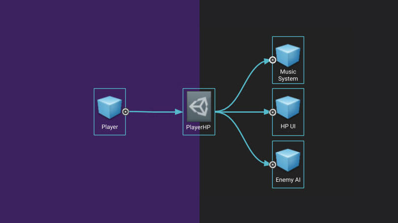
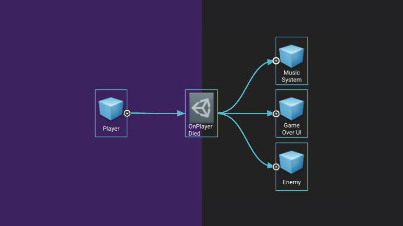

# Scriptable Objects Framework

## 1. 概念

### 1.1 ScriptableObject

ScriptableObject is a serializable Unity class that allows you to store large quantities of shared data independent from script instances. 

ScriptableObject（脚本化对象）是一种 序列化的 Unity 类，允许我们独立于代码实例，去存储和共享大量数据。 

使用 ScriptableObject 可以简化更新和调试；并且可以用其构建一个伸缩性很强的通信层，用来沟通不同的系统，从而增强系统的灵活性，增强组件的重用性。

### 1.2 三种游戏开发规则

### a. 模块化设计理念

* 避免创建相互直接依赖的系统。例如，库存系统应能与游戏中的其他系统进行通信，但不要在它们之间创建硬性引用，因为这会导致很难将系统重新组合为不同的配置和关系。
* 将场景创建为净板：避免在场景之间存在瞬时数据。每次进入一个场景，都应该是一次干净利落的中断和加载。这样，您就可以让场景具有其他场景中不存在的独特行为，而无需进行破解。
* 设置预制件，使其独立运行。您拖入场景中的每个预制件都应尽可能将其功能包含在场景中。这对大型团队的源控制有很大帮助，因为场景是预制件的列表，而预制件则包含各个功能。这样，你的大部分检查都是在预制件层面，从而减少了场景中的冲突。
* 让每个组件专注于解决一个问题。这样就能更容易地将多个组件拼接在一起，构建出新的东西。

### b. 方便更改和编辑部件：

* 尽可能多地使用数据驱动游戏。当你把游戏系统设计成像机器一样处理数据作为指令时，即使游戏正在运行，你也可以高效地对其进行更改。
* 如果你的系统设置得尽可能模块化和组件化，那么包括美工和设计师在内的编辑工作就会变得更加容易。Ryan 说，他的团队在游戏中开发的一些最酷的功能都来自这个过程，他称之为 "突发设计"。
* 你的团队能够在运行时对游戏进行修改是至关重要的。在运行时改变游戏的可能性越大，就越能找到平衡和价值，如果能像脚本对象那样保存运行时的状态，那就太好了。

### c. 便于调试：

* 这一条其实是前两条的子支柱。游戏的模块化程度越高，测试其中任何一个部分就越容易。游戏的可编辑性越强（拥有自己的检查器视图的功能越多），调试就越容易。确保您可以在检查器中查看调试状态，并且在计划好如何调试之前，永远不要认为某个功能已经完成。

## 2. 三种 ScriptableObject 架构

### 2.1 变量架构

使用脚本对象（ScriptableObjects）可以创建的最简单的东西之一就是自包含的、基于资产的变量。下面是浮点变量的示例，但也可扩展到任何其他可序列化的类型。

您团队中的每个人，无论技术水平如何，都可以通过创建一个新的浮点变量资产来定义新的游戏变量。任何 MonoBehaviour 或 ScriptableObject 都可以使用公共 FloatVariable 而不是公共 float 来引用这个新的共享值。

更妙的是，如果一个 MonoBehaviour 更改了 FloatVariable 的值，其他 MonoBehaviours 也能看到该更改。这就在不需要相互引用的系统之间创建了一个消息层。

例子：玩家生命



``` C#

[CreateAssetMenu]
public class FloatVariable : ScriptableObject, ISerializationCallbackReceiver
{
	public float InitialValue;

	[NonSerialized]
	public float RuntimeValue;

    public void OnAfterDeserialize()
    {
            RuntimeValue = InitialValue;
    }

    public void OnBeforeSerialize() { }
    }
    .........
    .........
}

```

### 2.2 事件架构

Ryan 最喜欢在 ScriptableObjects 基础上构建的功能之一是事件系统。事件架构通过在不直接相互了解的系统之间发送消息，帮助将代码模块化。它允许系统响应状态变化，而无需在更新循环中持续监控。

以下代码示例来自一个由两部分组成的事件系统：一个 GameEvent ScriptableObject 和一个 GameEventListener MonoBehaviour。

设计者可以在项目中创建任意数量的 GameEvents，以表示可以发送的重要信息。GameEventListener 会等待特定 GameEvent 的发生，并通过调用 UnityEvent（这并不是一个真正的事件，而更像是一个序列化的函数调用）来做出响应。

例子：玩家死亡事件

处理游戏中玩家死亡就是一个例子。在这一点上，很多执行方式都会发生变化，但很难确定在哪里编写所有逻辑代码。玩家脚本应该触发 Game Over UI 还是音乐变化？敌人是否应该每帧检查玩家是否还活着？事件系统可以让我们避免类似的依赖问题。

当玩家死亡时，玩家脚本会在 OnPlayerDied 事件中调用 Raise。玩家脚本不需要知道哪些系统会关注它，因为它只是一个广播。Game Over UI 会监听 OnPlayerDied 事件并开始制作动画，摄像机脚本会监听该事件并开始淡入黑色，而音乐系统则会通过改变音乐做出响应。我们还可以让每个敌人监听 OnPlayerDied 事件，触发嘲讽动画或状态变化，回到空闲状态。

通过这种模式，我们可以非常容易地为玩家死亡添加新的反应。此外，还可以通过测试代码或检查器中的按钮调用 Raise 来测试对玩家死亡的响应。


``` C#
public class GameEventListener : MonoBehaviour
{
    public GameEvent event;
    public UnityEvent response;

    private void OnEnable()
    {   event.RegisterListener(this); }

    private void OnDisable()
    {   event.UnregisterListener(this); }

    public void OnEventRaised()
    {   response.Invoke(); }
}

[CreateAssetMenu]
public class GameEvent : ScriptableObject
{
	private List<GameEventListener> listeners = 
		new List<GameEventListener>();

    public void Raise()
    {
        for(int i = listeners.Count -1; i >= 0; i--)
            listeners[i].OnEventRaised();
    }

    public void RegisterListener(GameEventListener listener)
    {   listeners.Add(listener); }

    public void UnregisterListener(GameEventListener listener)
    {   listeners.Remove(listener); }

}

```

也可以建立一个 Channel 系统，用 ScriptableObject 存储 Event 信息，来沟通 Action Input 和 实际输入后的相应。—— 参考 open project  

### 2.3 其他系统架构

ScriptableObject 不一定只是数据。你可以在 MonoBehaviour 中实现任何系统，然后看看能否将实现移到 ScriptableObject 中。与其在 DontDestroyOnLoad MonoBehaviour 中使用 InventoryManager，不如将其放在 ScriptableObject 中。

由于它不与场景绑定，因此没有 Transform，也不会获得 Update 函数，但它可以在场景加载之间保持状态，而无需任何特殊的初始化。在需要脚本访问库存时，可以使用库存系统对象的公共引用来代替单例。与使用单例相比，这样可以更方便地交换测试库存或教程库存。

在这里，你可以想象一个玩家脚本引用了库存系统。当玩家生成时，它可以向库存查询所有拥有的物品，并生成任何装备。装备用户界面也可以引用 "库存 "并循环查看物品，以确定要绘制什么。

## 3. Github 开源项目

* [Kassets ScriptableObject Architecture](https://github.com/kadinche/Kassets)
* [Generic ScriptableObject Architecture](https://github.com/SolidAlloy/GenericScriptableArchitecture)
* [ScriptableObject-Architecture](https://github.com/DanielEverland/ScriptableObject-Architecture)
* [criptable-events](https://github.com/chark/scriptable-events)
* [https://github.com/pablothedolphin/Scriptable-Framework](https://github.com/pablothedolphin/Scriptable-Framework)
* [https://github.com/roboryantron/Unite2017](https://github.com/roboryantron/Unite2017)
* [https://www.youtube.com/watch?v=raQ3iHhE_Kk](https://www.youtube.com/watch?v=raQ3iHhE_Kk)


## 4. ScriptableObject 注意点

* ScriptableObject 只适合用来构建 runtime 只读的数据结构和初始数据，不能用于存储；scriptableobject 对象中的数据更改，只能在此次 runtime 中生效，即使写入也不会生效，会在下一次开启时重置。在 Build 后，它其中的数据在每次运行时，都会还原为初始状态。然而，在 editor 开中，可以用 ScriptableObject 来存储数据（使用EditorUtility）。


<br>
<hr>
<br>

> 参考资料：
>
> * [THREE WAYS TO ARCHITECT YOUR GAME WITH SCRIPTABLEOBJECTS](https://unity.com/how-to/architect-game-code-scriptable-objects)