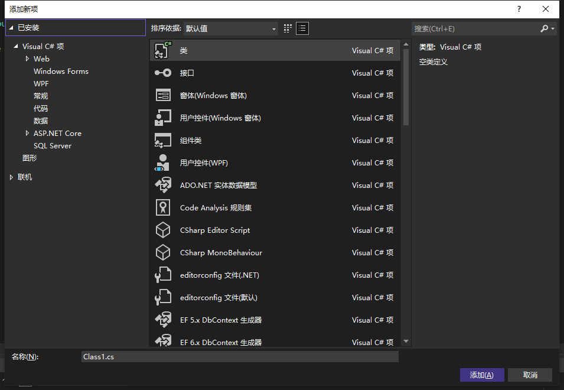
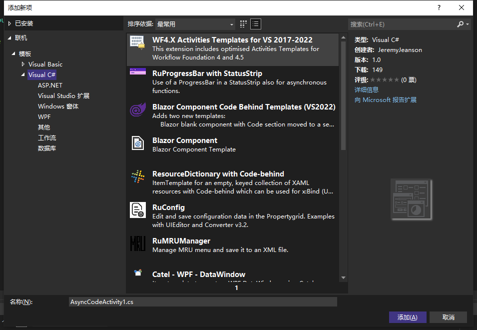
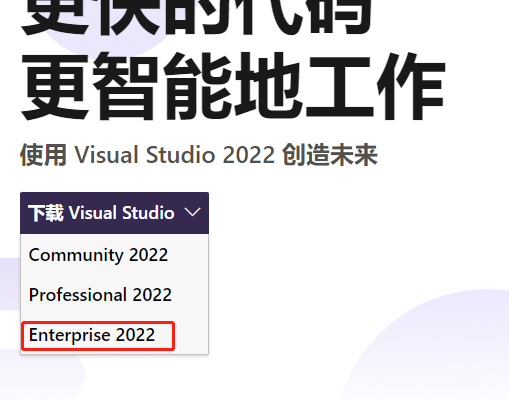
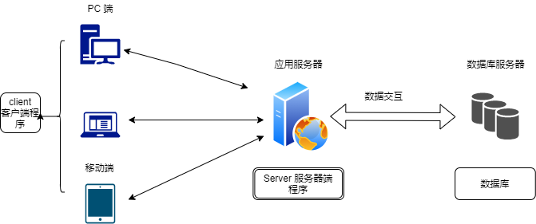

# 1-1 Unity 中类、对象 & 结构

> 注意：
>
> - 变量、分支、循环等基础语法，不再开视频讲解，需要的自行学习，推荐菜鸟教程这样的简单文档即可
> - 本系列中讲述的 C# 主要针对 Unity 开发，而非 .net 桌面或 web 开发，请小伙伴们选好方向，不要搞错了

## 1. Unity 中使用类 Class

### 1.1 新建类

通常来说，新手在 Unity 中新建的脚本就是一个类

> 注意：
>
> - 类名要符合命名规则（Camel 命名法，只能是英文、下滑线或数字的组合，且不能以数字开头）
> - 类名必须和文件名相同，否则 Unity 不认，无法加载该类

visual studio 中新建类不同版本看到的界面不同，主要看当前安装了那些模板



如果有些你需要的模板并未安装，可以使用联机搜索，安装需要的模板



或者不适用 unity 安装 vs ，自行选择企业版 Enterprise，并安装需要的功能模块，下载链接 https://visualstudio.microsoft.com/zh-hans/vs/



```C#
//命名空间引用，不必要的可以删掉
//不加命名空间的话，需要写类的全名
using System.Collections;
using System.Collections.Generic;
using UnityEngine;

public class NewBehaviourScript : MonoBehaviour
{
    // Start is called before the first frame update
    void Start()
    {

    }

    // Update is called once per frame
    void Update()
    {

    }
}

```

### 1.2 命名空间 namespace

类似于 java 中的 包 Package ，只是为了避免类名互相冲突，添加的一个所属地名称。

比如，北京.张三 和 南京.张三 ，前面的所属地就是命名空间

命名空间可以有多层，中间用 . 号隔开

类的全名：所有的命名空间名.类名，如果不写命名空间引用的话，就必须在使用类时，使用全名

> 注意：
>
> - 如果在同一个代码文件中使用同名的不同类，就需要使用类的全名加以区分
> - 另外，使用反射 reflection 时，一般也需要写类的全名

```C#
namespace 命名空间名称
{
    类代码...

}
```

### 1.3 Unity 脚本分类

1. MonoBehavior 派生类脚本

    在游戏中可以作为组件 Component 使用，挂接在 GameObject 上，实现游戏对象的各种功能

   - 生命周期方法多，对象体量较大
   - 一般用来实现游戏对象上的功能，每个游戏对象需要生成单独的实例相对应
   - 可以直接使用 Unity 的序列化
   - 可以直接访问 Unity 项目资源

2. ScriptableObjcet 派生类脚本

    该类对象，可以序列化为资源文件，充当数据来使用；而这个类本身就是数据的模板。

   - 多用作保存数据，可以在多个游戏对象中共享
   - 仅有少量生命周期方法，对象体量较小
   - 可以直接使用 Unity 的序列化
   - 可以直接访问 Unity 项目资源

3. 自定义类、结构体、接口的脚本

- 功能很纯粹，只是为了构建类库体系，实现软件架构（小型项目可以不使用，中大型项目，需要构建程序架构时，就必不可少了）
- 不包含任何 unity 游戏对象的生命周期，无法使用 Unity 的游戏回调函数
- 无法直接访问 Unity 项目资源

4. 派生自其他 Unity 类或接口

5. 派生自第三方类或接口

> 注意：
> * 如果想要对自定义的类（不继承MonoBehavior、ScriptableObjcet）进行 inspector 中的字段展示，只加 public 不行，为类添加可序列化注解：[Serializable]，还必须为要暴露的字段添加序列化注解：[SerializeField]




### 1.4 类的组成

类由数据和操作组成，字段和属性属于数据成员，表示动作、功能的是方法成员

* 字段：类中的数据
* 属性：对字段的封装，类似于 java 中的取值器、赋值器
* 方法：类似于 C、JavaScript 中的函数，其中可以包含多条语句，通过方法名可以调用执行；
* 构造方法：特殊的方法，用来初始化类中字段（数据），如果不写，系统默认生成一个空构造方法，如果写了带参数的，系统就不再提供空构造方法，需要自己手动添加。

``` C#
using UnityEngine;
namespace Assets._Scripts.Entity
{
    //创建类基本格式：
    // 访问修饰符 <可选修饰符，比如 abstract 、final 等> class 类名  {  .....类结构代码  }
    [Serializable]
    public class Student
    {
        //数据成员，描述其物理特征
        [SerializeField]
        //字段 attribute
        private int id;

        //属性 Property
        public int Id
        {
            get { return id; }
            set { id = value; }
        }


        [SerializeField]
        //字段
        private string name;
        //属性
        public string Name { get => name; set => name = value; }

       
        //最简写法，省略字段，只写属性，C#会自动根据该属性生成对应的私有字段
        public int Age { get; set; }


        //带全参的构造方法
        public Student(int id, string name, int age) { 
            this.id = id;
            this.name = name;
            this.Age = age;
        }

        public Student() { }
        //方法成员，描述它的动作
        public void Print() {
            Debug.Log($"当前学生的 id = {this.id} , 名字：{this.name}");
        }
    }
}
```
## 2. 对象 Object

> 参考资料：
>
> - [Unity 底层的 C#运行原理](https://juejin.cn/post/7068624157348462628)
> - [Unity 将来时：IL2CPP 是什么？](https://zhuanlan.zhihu.com/p/19972689)

### 2.1 万物皆对象

不论 Unity 引擎所使用的 C++ ，以及我们编写程序所使用的 C# ，除了静态类外，其他的类都需要实例化为对象之后，才能在内存中运行。

例如，拖抓到 hierarchy 窗口中的那些元素，每个都会生成一个对应的 GameObject 类的对象，而在每个游戏对象中添加的组件，都是 Component 类对象

包括我们书写脚本所继承的 MonoBehavior ，也是间接继承自 Component 类（Component - Behavior - MonoBehaviour ），所以我们自己编写的脚本类，也会实例化为组件对象后，再加载到内存中

如下图，类就是模具，对象就是用类作为模具制作出的实物


### 2.2 对象实例化

```C#
类名 对象名 = new 构造方法(参数列表);
```

通过 new 关键字，进行对象的实例化，在内存中开辟空间，并为对象中的字段赋值

虽然我们在使用脚本时，不需要书写脚本类被实例化的代码，但这个过程是由 unity 引擎来完成了

我们可以这样理解：将脚本拖拽到游戏对象的 inspector 中时，就是实例化的过程。

脚本代码文件在 project 窗口中时，可以把它当做类；而脚本代码在游戏对象的 inspector 中充当组件时，就应该把它当做是已经实例化的对象了

## 3. 结构 Struct

结构类型（或结构类型）是一种可以封装数据和相关功能的值类型。


| 不同之处 | Struct                          | Class                        |
| -------- | ------------------------------- | ---------------------------- |
| 数值类型 | 值类型                          | 引用类型                     |
| 内存空间 | Stack 上                        | Heap 上                      |
| 继承方式 | 只能实现 Interface              | 可继承类，也可实现 Interface |
| NULL     | 不能 NULL，内部数值不赋值都为 0 | 可以 NULL                    |


``` C#
struct Books
{
   private string title;
   private string author;
   private string subject;
   private int book_id;
   public void setValues(string t, string a, string s, int id)
   {
      title = t;
      author = a;
      subject = s;
      book_id =id;
   }
   public void display()
   {
      Console.WriteLine("Title : {0}", title);
      Console.WriteLine("Author : {0}", author);
      Console.WriteLine("Subject : {0}", subject);
      Console.WriteLine("Book_id :{0}", book_id);
   }

}; 
```