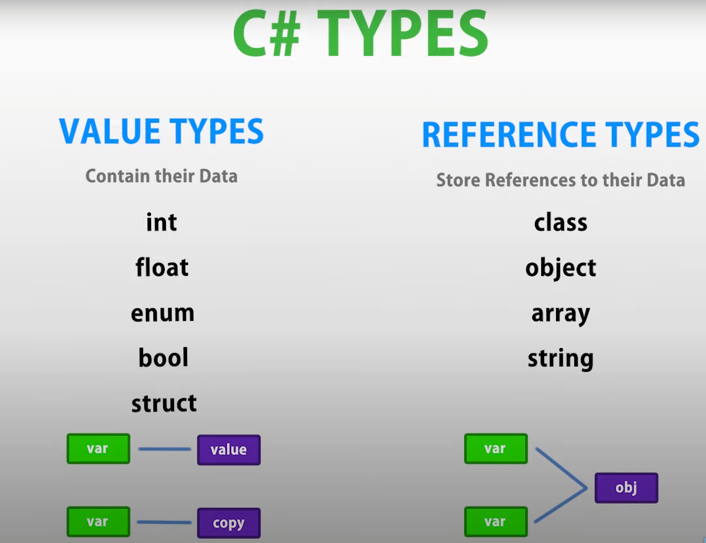

# 1-1 Unity 中类、对象 & 结构

> 注意：
>
> - 变量、分支、循环等基础语法，不再开视频讲解，需要的自行学习，推荐菜鸟教程这样的简单文档即可
> - 本系列中讲述的 C# 主要针对 Unity 开发，而非 .net 桌面或 web 开发，请小伙伴们选好方向，不要搞错了 1

## 1. Unity 中使用类 Class

### 1.1 新建类

通常来说，新手在 Unity 中新建的脚本就是一个类

> 注意：
>
> - 类名要符合命名规则（Camel 命名法，只能是英文、下滑线或数字的组合，且不能以数字开头）
> - 类名必须和文件名相同，否则 Unity 不认，无法加载该类

visual studio 中新建类不同版本看到的界面不同，主要看当前安装了那些模板


如果有些你需要的模板并未安装，可以使用联机搜索，安装需要的模板


或者不适用 unity 安装 vs ，自行选择企业版 Enterprise，并安装需要的功能模块，下载链接 https://visualstudio.microsoft.com/zh-hans/vs/


```C#
//命名空间引用，不必要的可以删掉
//不加命名空间的话，需要写类的全名
using System.Collections;
using System.Collections.Generic;
using UnityEngine;

public class NewBehaviourScript : MonoBehaviour
{
    // Start is called before the first frame update
    void Start()
    {

    }

    // Update is called once per frame
    void Update()
    {

    }
}

```

### 1.2 命名空间 namespace

类似于 java 中的 包 Package ，只是为了避免类名互相冲突，添加的一个所属地名称。

比如，北京.张三 和 南京.张三 ，前面的所属地就是命名空间

命名空间可以有多层，中间用 . 号隔开

类的全名：所有的命名空间名.类名，如果不写命名空间引用的话，就必须在使用类时，使用全名

> 注意：
>
> - 如果在同一个代码文件中使用同名的不同类，就需要使用类的全名加以区分
> - 另外，使用反射 reflection 时，一般也需要写类的全名

```C#
namespace 命名空间名称
{
    类代码...

}
```

### 1.3 Unity 脚本分类

1. MonoBehavior 派生类脚本

- 在游戏中可以作为组件 Component 使用，挂接在 GameObject 上，实现游戏对象的各种功能
- 生命周期方法多，对象体量较大
- 一般用来实现游戏对象上的功能，每个游戏对象需要生成单独的实例相对应
- 可以直接使用 Unity 的序列化
- 可以直接访问 Unity 项目资源

2. ScriptableObjcet 派生类脚本

- 多用作保存数据，可以在多个游戏对象中共享
- 仅有少量生命周期方法，对象体量较小
- 可以直接使用 Unity 的序列化
- 可以直接访问 Unity 项目资源

3. 自定义类、结构体、接口的脚本

- 功能很纯粹，只是为了构建类库体系，实现软件架构（小型项目可以不使用，中大型项目，需要构建程序架构时，就必不可少了）
- 不包含任何 unity 游戏对象的生命周期，无法使用 Unity 的游戏回调函数
- 无法直接访问 Unity 项目资源
- 不可直接使用 Unity 的序列化

4. 派生自其他 Unity 类或接口

5. 派生自第三方类或接口

## 2. 对象 Object

### 2.1 万物皆对象

不论 Unity 引擎所使用的 C++ ，以及我们编写程序所使用的 C# ，除了静态类外，其他的类都需要实例化为对象之后，才能在内存中运行。

例如，拖抓到 hierarchy 窗口中的那些元素，每个都会生成一个对应的 GameObject 类的对象，而在每个游戏对象中添加的组件，都是 Component 类对象

包括我们书写脚本所继承的 MonoBehavior ，也是间接继承自 Component 类（Component - Behavior - MonoBehaviour ），所以我们自己编写的脚本类，也会实例化为组件对象后，再加载到内存中

### 2.2 对象实例化

```C#
类名 对象名 = new 构造方法(参数列表);
```

通过 new 关键字，进行对象的实例化，在内存中开辟空间，并为对象中的字段赋值

虽然我们在使用脚本时，不需要书写脚本类被实例化的代码，但这个过程是由 unity 引擎来完成了

我们可以这样理解：将脚本拖拽到游戏对象的 inspector 中时，就是实例化的过程。

脚本代码文件在 project 窗口中时，可以把它当做类；而脚本代码在游戏对象的 inspector 中充当组件时，就应该把它当做是已经实例化的对象了

## 3. 结构 Struct

## 4. C# 值类型 Value Type 和引用类型 Reference Type

### 4.1 概念

值类型中，存储的是它的数值；而引用类型中，存的是指向它真实数据的地址

### 4.2 分类

- C# 中的值类型有： 基本数据类型、enum、struct
- 引用类型有：class、Object、interface；另外常用的有 array 和 string



### 4.3 赋值

- 值类型赋值，是 copy。即值的拷贝
- 引用类型赋值，是 引用。传递的是地址

```C#
Student stu1 = new Student("小明",19);
Student stu2 = stu1;
stu1.Age=20;
Debug.Log(stu2.Age);
```

### 4.4 ref 引用关键字

## 5. 接口 Interface
