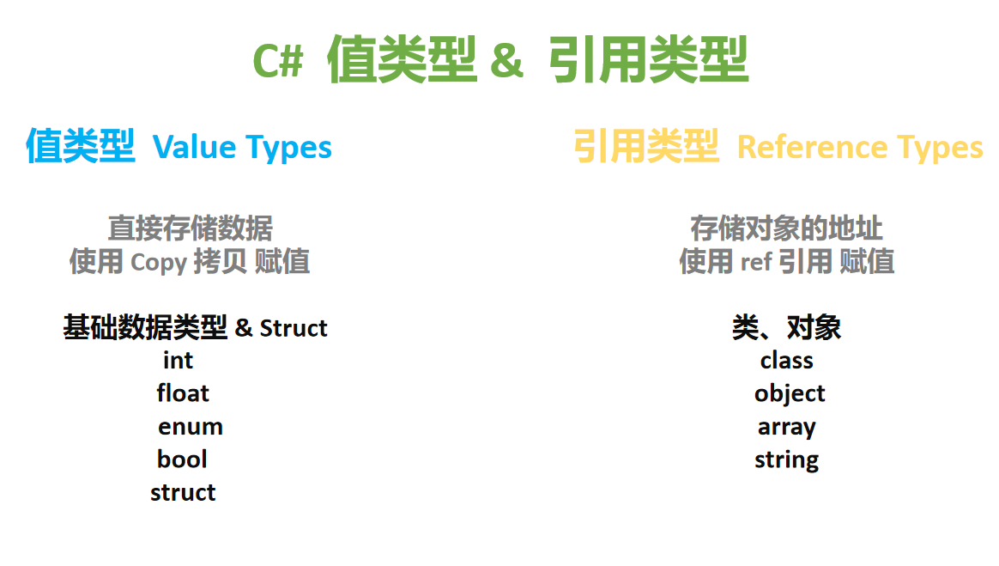
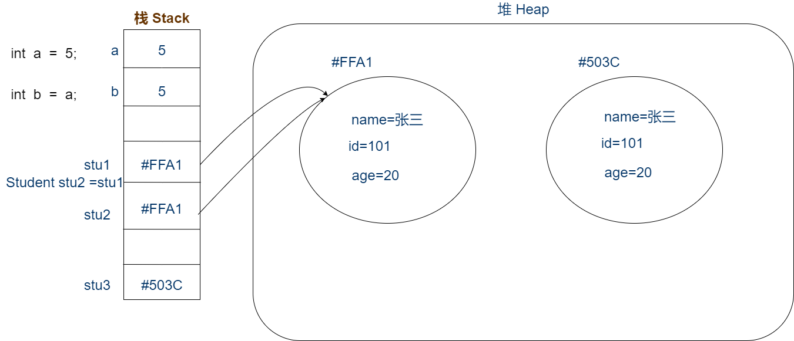

# C# 值类型 Value Type 和引用类型 Reference Type

## 1 概念

值类型中，存储的是它的数值；而引用类型中，存的是指向它真实数据的地址

## 2 分类

- C# 中的值类型有： 基本数据类型、enum、struct
- 引用类型有：class、Object、interface；另外常用的有 array 和 string



## 3 赋值

- 值类型赋值，是 copy。即值的拷贝
- 引用类型赋值，是 引用。传递的是地址

```C#
Student stu1 = new Student("小明",19);
Student stu2 = stu1;
stu1.Age=20;
Debug.Log(stu2.Age);
```

* 内存中栈空间：空间较小、操作（存取）时速度快，用来存放值类型变量，以及引用类型的对象名
* 内存中堆空间：空间大、操作效率低。用来存储引用类型对象名所指向的对象本体



## 4 判断值是否相等

* 值类型使用 == 判断两值是否相等
* 引用类型通过 Equels（）方法判断两对象的值是否相等
* 自定义对象需要覆写 Equels（）方法（通常是继承自 Object 的）

## 5 ref 引用关键字

ref 关键字表示一个值是通过引用传递的。它在四种不同的情况下使用：

- 在方法签名和方法调用中，通过引用将参数传递给方法。
- 在方法签名中，通过引用将值返回给调用者。
- 在成员体中，表示引用返回值存储在本地作为调用者打算修改的引用。或者表示局部变量通过引用访问另一个值。
- 在 struct 声明中，声明 ref struct 或 readonly ref struct。

说白了，就是想要把值类型，按照引用类型的方式来使用时，就可以选择 ref 关键字
