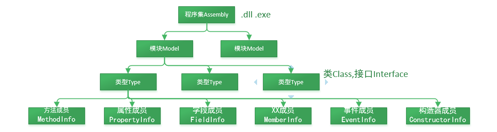

# 继承

## 1. 概念

继承是面向对象的编程的一种基本特性。

继承允许我们根据一个 <font color=green>已有类</font> 来定义另一个 <font color=red>新类</font>，程序员不需要在 <font color=red>新类</font> 中重新编写新的数据成员和成员函数，直接继承了 <font color=green>已有类</font> 的成员即可


借助继承，能够定义可重用（继承）、扩展或修改父类行为的子类。 成员被继承的类称为基类（父类）。 继承基类成员的类称为派生类（子类）。


派生 derive 和 继承 inherit 是指的同一件事，只不过主语宾语方向互换而已。
* 基类（父类） 派生出 派生类（子类）
* 派生类（子类） 继承自 基类（父类）

派生、继承是最快捷的代码重用方式之一，而且合理合法....


使用好继承，可以少奋斗好多年~~

## 2. 语法规则

``` C#
<访问修饰符> class <派生类> : <基类>
{
 ...
}
```

### 2.1 可访问性

虽然除了构造方法外（每个类都必须定义自己的构造方法），基类的其他所有成员都可供派生类继承，但这些成员是否可见取决于它们的可访问性。 成员的可访问性决定了其是否在派生类中可见，如下所述：

* public ： 访问不受限制
* private : 私有成员在子类中不可见，在子类中不能够直接访问；
* protected ： 受保护成员在派生类中可见
* internal：访问限于当前程序集；对于简单的 Unity 项目，可以认为 inernal 就是整个游戏项目内都可访问。
  
> 注意：
> * C#的默认修饰符类、结构的默认修饰符是internal。 类中所有的成员默认修饰符是private。 接口默认修饰符是internal。 接口的成员默认修饰符是public。
> * 并不是只有非私有的成员才能被继承，只要是父类的成员，都会被子类继承，只不过私有的不能直接被访问罢了。

### 2.2 base 关键字

base 关键字用于从派生类中访问基类的成员，可以用来指代基类的对象。

功能：

1. 调用基类上已被其他方法重写的方法。

2. 指定创建派生类实例时应调用的基类构造函数。

> 注意：  
> * 仅允许基类访问在构造函数、实例方法或实例属性访问器中进行。
> * 从静态方法中使用 base 关键字是错误的，因为 base 代表基类的实例。

``` C#
public class ParentClass{

    private int a;
    private string b;

    public ParentClass(int a, string b){
        this.a=a;
        this.b=b;
    }

    public void Method1(){
        Debug.Log("执行父类 ParentClass 定义的方法 Method1 ....");
    }

}
public class ChildClass:Parent{
    private bool c;
    public ChildClass(int a,string b,bool c):base(a,b){
        this.c=c;
    }
    public void Method2(){
        base.Method1();
        Debug.Log("执行子类 ChildClass 定义的方法 Method2 ....");

    }
}


```

### 2.3 C# 程序集 Assembly

程序集包含了两种文件：可执行文件（.exe文件）和 类库文件（.dll文件）。

在VS开发环境中，一个解决方案可以包含多个项目，而每个项目就是一个程序集。由于程序集在编译后并不一定会生成单个文件，而可能会生成多个物理文件，甚至可能会生成分布在不同位置的多个物理文件，所以程序集是一个逻辑单元，而不是一个物理单元。

应用程序结构：包含 应用程序域（AppDomain），程序集（Assembly），模块（Module），类型（Type），成员（EventInfo、FieldInfo、MethodInfo、PropertyInfo） 几个层次。



一个程序运行起来以后，有一个应用程序域（AppDomain），在这个应用程序域（AppDomain）中放了我们用到的所有程序集（Assembly）。我们所写的所有代码都会编译到【程序集】文件（.exe .dll）中，并在运行时以【Assembly对象】方式加载到内存中运行，每个类（Class  Interface）以【Type对象】方式加载到内存，类的成员（方法，字段，属性，事件，构造器）加载到内存也有相应的对象。

### 2.4 virtual 虚成员 和 override 重写

有时，子类想要更改父类中的成员（方法或属性），但又想要保持父类中成员的名称（功能上有变异，但名称不变，可以使用多态），这时就要用到“重写”。

派生类还可以通过提供重写实现代码来重写继承的成员。 

基类成员必须标记有 virtual 关键字，才能重写继承的成员。 默认情况下，基类成员没有 virtual 标记，因此无法被重写。 

如果尝试重写非虚成员，则会生成编译器错误 CS0506：“<member> 无法重写继承的成员 <member>，因为继承的成员没有 virtual、abstract 或 override 标记。”

``` C#
// 基类 Character
public class Character
{
    // 名字
    private string _name;
    public string Name
    {
        get{ return _name; }
        set { _name = value; }
    }

    // 生命值
    private int _hp;
    public int HP { get; set; }

    //攻击力
    private int _ap;
    public int Ap {
        get => _ap; 
        set => _ap=value; 
    }

    [SerializeField]
    private GameObject _pet;

    public GameObject Pet { get => _pet; set => _pet = value; }

    public Character(string name, int hp, int ap)
    {
        _name = name;
        _hp = hp;
        _ap = ap;
    }

    public Character()
    {
    }

    //public abstract void Attack(Character character);
    public virtual void Attack(Character character) {
        Debug.Log("Chararter 类中定义的 Attack 方法");   
    }
}

// 玩家派生类
public class Player : Character { 
    public Player()
    {

    }

    public Player(string name, int hp, int ap) : base(name, hp, ap)
    {
    }

    public override void Attack(Character character)
    {
        character.HP -= this.Ap;
        Debug.Log($"玩家：{this.Name} 攻击 {character.Name}, {character.Name} 掉血 {this.Ap} 点，剩余血量：{character.HP}");
    }
}

// 敌人派生类
public class Enemy : Character { 
    public Enemy()
    {

    }

    public Enemy(string name, int hp, int ap) : base(name, hp, ap)
    {
    }

    public override void Attack(Character character)
    {
        character.HP -= this.Ap;
        Debug.Log($"敌人：{this.Name} 攻击 {character.Name}, {character.Name} 掉血 {this.Ap} 点，剩余血量：{character.HP}");
    }
}

```

## 3. 派生的作用

### 3.1 宏观作用

* 父类中所有成员，都会被派生类所继承，并且可以在派生类中，访问基类中的所有非私有成员，可以有效地重用代码；
* 有效重用代码同时，还可以任意扩充、更改基类功能。不破坏原有类库功能，通过派生类对应用进行功能升级。派生类就像是游戏的DLC

### 3.2 派生所带来的 “ is a ”关系

通常情况下，继承用于表示基类和一个或多个派生类之间的“is a”关系，其中派生类是基类的特定版本；派生类是基类的具体类型。

简单来说，“ 派生类对象 is a 基类对象 ” 这种逻辑是成立的。比如 中国人是基类，北京人是派生类，就可以说 北京人是中国人；反过来则不行。

基类对象，可以用派生类对象来赋值，传参也可以（在使用基类对象定义的形参位置，都可以接收派生类对象的实参）。

为所以有这种语法：

基类 基类对象 = new 派生类构造方法（）;

或

基类对象 = 派生类对象;

"is a" 关系是实现多态的重要规则之一。

> 参考资料：
> * [C# 官方文档 - 继承](https://docs.microsoft.com/zh-cn/dotnet/csharp/fundamentals/tutorials/inheritance)
> * [程序集与反射技术(C#)](https://www.cnblogs.com/czx1/p/201413137070-com.html)
> * [C# 程序集Assembly](https://www.cnblogs.com/luna-hehe/p/10143748.html)