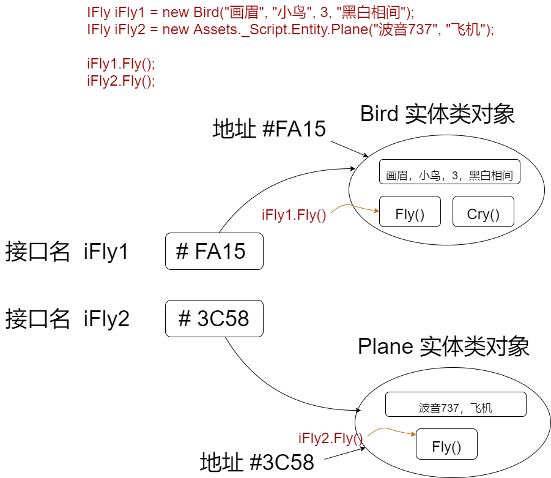

# 抽象类、接口、多态

多一层抽象，系统就多一层灵活，性能会稍减，但以现在硬件条件，影响不大

灵活性的直接影响：程序员少加班

## 1. 抽象类

### 1.1 抽象类概念

定义类时，使用 abstract 关键字，不能够被实例化的类，称为抽象类。

抽象类的用途是提供一个可供多个派生类共享的通用基类定义。

```C#
public abstract class A
{
    // Class members here.
}
```

抽象类也可以定义抽象方法。 方法是将关键字 abstract 添加到方法的返回类型的前面。 例如：

```C#
public abstract class A
{
    public abstract void DoWork(int i);
}
```

### 1.2 抽象方法和虚方法

抽象方法没有实现，所以方法定义后面是分号，而不是常规的方法块。

派生类中，如果要实现基类中的抽象方法，也需要使用 override 关键字

```C#
public class B : A{
    public override void DoWork(int i)
    {
        Debug.Log($"i = {i}");
    }

}
```

抽象类的派实体生类必须实现所有抽象方法。 当抽象类从基类继承虚方法时，抽象类可以使用抽象方法重写该虚方法。 例如：

```C#
// compile with: -target:library
public class D
{
    public virtual void DoWork(int i)
    {
        // Original implementation.
    }
}

public abstract class E : D
{
    public abstract override void DoWork(int i);
}

public class F : E
{
    public override void DoWork(int i)
    {
        // New implementation.
    }
}
```

如果将 virtual 方法声明为 abstract，则该方法对于从抽象类继承的所有类而言仍然是虚方法。 继承抽象方法的类无法访问方法的原始实现，因此在上一示例中，类 F 上的 DoWork 无法调用类 D 上的 DoWork。通过这种方式，抽象类可强制派生类向虚拟方法提供新的方法实现。

### 1.3 抽象属性

C# 的抽象类中，除了抽象方法外，还可以包含抽象属性，即在属性前，加上 abstract 关键字，取值器或赋值器就不能再写实现；派生类中，要实现其属性，也要使用 override 关键字

```C#
public abstract class Person{
    protected int _age;
    protected string _name;

    public abstract int Age {get;}

    public abstract string Name {get;set;}
}

public class Student:Person{
    public override int Age{
        get{ return _age;}
    }
    public override string Name{
        get{return _name;}
        set{_name = value;}
    }

}
```

> 抽象类总结： 
> 1. 可以将不需要创建实体对象的概念类型，设计成抽象类；
> 2. 抽象类中，可以包含抽象的方法和属性，抽象方法只包含方法头，没有方法体；
> 3. 抽象类不能创建实体对象；
> 4. 继承自抽象类的派生类，如果想要创建实体对象，就必须实现抽象基类中的实体成员，比如覆盖父类抽象方法，补全方法体；
> 5. 抽象父类对实体类子类还是有 Is A 关系，即父类对象名，可以引用子类的实体对象。

## 2. 接口

### 2.1 基本概念

从代码结构上来说，接口就是包含方法头和空属性的功能模型，说白了，就像是一个只有外观，没有实际功能的空壳子模型。

接口代表的关系是 CAN DO，即实现了接口的实体类对象，都能够 “DO” 接口中声明的方法，具备了该执行方法的能力

```C#

interface IFly{
    void Fly();
}

public class Bird:IFly{
    private string _name;
    public string Name{
        get{return _name;}
        set{_name=value;}
    }
    public void Fly()
    {
        Debug.Log($"鸟：{this.Name}，在天空飞行.......");
    }
}
```

接口名称必须是有效的 C# 标识符名称。 按照约定，接口名称以大写字母 I 开头。

在类中，对接口中方法的实现类似于对抽象方法的实现，只不过不需要在写 override 关键字

接口包含非抽象 class 或 struct 必须实现的一组相关功能的定义。

接口可以定义 static 方法，此类方法必须具有实现。

从 C# 8.0 开始，接口可为成员定义默认实现。 接口不能声明实例数据，如字段、自动实现的属性或类似属性的事件。

### 2.2 核心要点

- 在 8.0 以前的 C# 版本中，接口类似于只有抽象成员的抽象基类。 实现接口的类或结构必须实现其所有成员。
- 从 C# 8.0 开始，接口可以定义其部分或全部成员的默认实现。 实现接口的类或结构不一定要实现具有默认实现的成员。
- 接口无法直接进行实例化。 其成员由实现接口的任何类或结构来实现。
- 一个类或结构可以实现多个接口。 一个类可以继承一个基类，还可实现一个或多个接口。
- C# 接口中可以包含：方法、属性、事件 这三种成员的声明
- 接口中的方法，只能是 public 的，所以就直接省去访问修饰符
- 接口中的方法，和抽象方法一样，不能写方法体，只有方法头，而且不能加 abstract 修饰


## 3. 多态

Polymorphism（多态性）是一个希腊词，指“多种形态”，多态性具有两个截然不同的方面：

- 在运行时，在方法参数和集合或数组等位置，派生类的对象可以作为基类的对象处理。 在出现此多形性时，该对象的声明类型不再与运行时类型相同。
- 基类可以定义并实现虚方法，派生类可以重写这些方法，即派生类提供自己的定义和实现。 在运行时，客户端代码调用该方法，CLR 查找对象的运行时类型，并调用虚方法的重写方法。 你可以在源代码中调用基类的方法，执行该方法的派生类版本。




类定义：

```C#
public class Shape
{
    // A few example members
    public int X { get; private set; }
    public int Y { get; private set; }
    public int Height { get; set; }
    public int Width { get; set; }

    // Virtual method
    public virtual void Draw()
    {
        Console.WriteLine("Performing base class drawing tasks");
    }
}

public class Circle : Shape
{
    public override void Draw()
    {
        // Code to draw a circle...
        Console.WriteLine("Drawing a circle");
        base.Draw();
    }
}
public class Rectangle : Shape
{
    public override void Draw()
    {
        // Code to draw a rectangle...
        Console.WriteLine("Drawing a rectangle");
        base.Draw();
    }
}
public class Triangle : Shape
{
    public override void Draw()
    {
        // Code to draw a triangle...
        Console.WriteLine("Drawing a triangle");
        base.Draw();
    }
}
```

基于多态原则的使用：

```C#
// Polymorphism at work #1: a Rectangle, Triangle and Circle
// can all be used whereever a Shape is expected. No cast is
// required because an implicit conversion exists from a derived
// class to its base class.
var shapes = new List<Shape>
{
    new Rectangle(),
    new Triangle(),
    new Circle()
};

// Polymorphism at work #2: the virtual method Draw is
// invoked on each of the derived classes, not the base class.
foreach (var shape in shapes)
{
    shape.Draw();
}
/* Output:
    Drawing a rectangle
    Performing base class drawing tasks
    Drawing a triangle
    Performing base class drawing tasks
    Drawing a circle
    Performing base class drawing tasks
*/
```

> 注意：  
> 在 C# 中，每个类型都是多态的，因为包括用户定义类型在内的所有类型都继承自 Object。

白话总结：

基类对象名或接口名，可以获取派生类（is a）或实现了接口的实体类(can do)对象的赋值；用基类对象名或接口名引用的实体类对象，在执行方法时，会按照实体对象本身类中的方法来区别执行，即同一个代码，多种执行效果，也就是所谓的“多态”


> 参考资料：
>
> - [C# 官方文档 抽象类](https://docs.microsoft.com/zh-cn/dotnet/csharp/programming-guide/classes-and-structs/abstract-and-sealed-classes-and-class-members)
> - [C# 官方文档 如何定义抽象属性](https://docs.microsoft.com/zh-cn/dotnet/csharp/programming-guide/classes-and-structs/how-to-define-abstract-properties)
