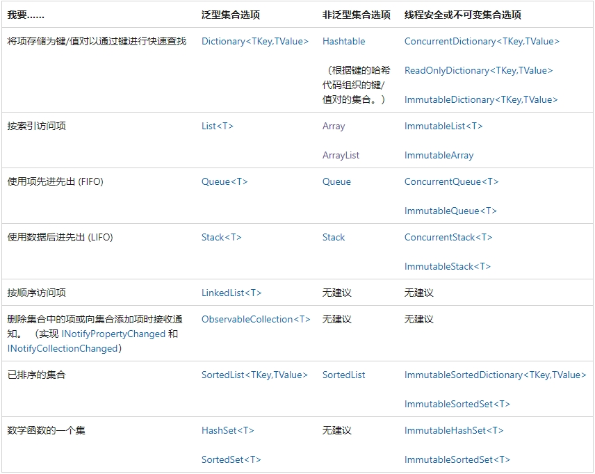
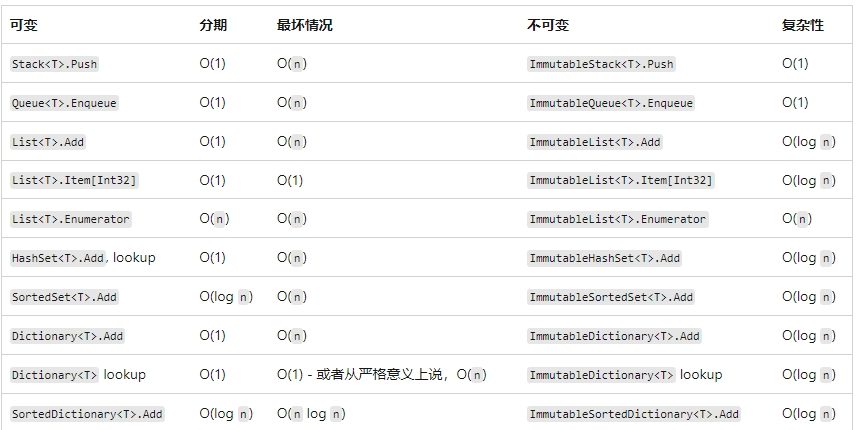
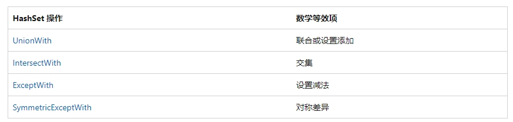

# 3-2 .NET 常用容器类

## 1. System.Collections 和 System.Collections.Generic

System.Collections 包含非泛型容器类

System.Collections.Generic 包含泛型容器类

## 请记住这句话：可能的话，要尽可能优先选用泛型容器！！

### 1.1 泛型容器类 VS 非泛型容器类

* 泛型容器类类型安全
* 泛型容器类比同类型非泛型容器类性能更高，不需要封包、拆包（类型转换）等操作
* 泛型容器类通常包含更多实用功能

### 1.2  两个新的集合类库

自 .NET Framework 4 起，System.Collections.Concurrent 命名空间中的集合可提供高效的线程安全操作，以便从多个线程访问集合项。 System.Collections.Immutable 命名空间（NuGet 包）中的不可变集合类本质上就是线程安全的，因为操作在原始集合的副本上进行且不能修改原始集合。

### 1.3 选择集合依据



### 1.4 集合的算法复杂度

选择集合类时，应该考虑可能牺牲的性能。 使用下表来参考各种可变集合类型在算法复杂性方面与其对应不可变对应项的比较情况。 不可变的集合类型通常性能较低，但却提供了不可变性，这通常是一种非常有效的优点。



## 2. 非泛型集合（容器）类

C# 在未加入泛型之前的容器类，通常在 System.Collections 下，当前的用途，主要是用来兼容旧项目代码


## 3. 泛型集合（容器）类

### 3.1 线性集合

C# 中的线性集合分为三种：List<T> 列表、 Queue<T> 队列、Stack<T> 栈
### 3.1.1 List<T>

你可以把 List<T> 当做是一个泛型的动态数组容器

List<T> 类是类的 ArrayList 泛型等效项。 它通过使用根据需要动态增加大小的数组来实现 IList<T> 泛型接口。

``` C#
using System;
using System.Collections.Generic;

// Simple business object. A PartId is used to identify the type of part
// but the part name can change.
public class Part : IEquatable<Part>
{
    public string PartName { get; set; }

    public int PartId { get; set; }

    public override string ToString()
    {
        return "ID: " + PartId + "   Name: " + PartName;
    }
    public override bool Equals(object obj)
    {
        if (obj == null) return false;
        Part objAsPart = obj as Part;
        if (objAsPart == null) return false;
        else return Equals(objAsPart);
    }
    public override int GetHashCode()
    {
        return PartId;
    }
    public bool Equals(Part other)
    {
        if (other == null) return false;
        return (this.PartId.Equals(other.PartId));
    }
    // Should also override == and != operators.
}

public class Example
{
    public static void Main()
    {
        // Create a list of parts.
        List<Part> parts =
        [
            // Add parts to the list.
            new Part() { PartName = "crank arm", PartId = 1234 },
            new Part() { PartName = "chain ring", PartId = 1334 },
            new Part() { PartName = "regular seat", PartId = 1434 },
            new Part() { PartName = "banana seat", PartId = 1444 },
            new Part() { PartName = "cassette", PartId = 1534 },
            new Part() { PartName = "shift lever", PartId = 1634 },
        ];

        // Write out the parts in the list. This will call the overridden ToString method
        // in the Part class.
        Console.WriteLine();
        foreach (Part aPart in parts)
        {
            Console.WriteLine(aPart);
        }

        // Check the list for part #1734. This calls the IEquatable.Equals method
        // of the Part class, which checks the PartId for equality.
        Console.WriteLine("\nContains(\"1734\"): {0}",
        parts.Contains(new Part { PartId = 1734, PartName = "" }));

        // Insert a new item at position 2.
        Console.WriteLine("\nInsert(2, \"1834\")");
        parts.Insert(2, new Part() { PartName = "brake lever", PartId = 1834 });

        //Console.WriteLine();
        foreach (Part aPart in parts)
        {
            Console.WriteLine(aPart);
        }

        Console.WriteLine("\nParts[3]: {0}", parts[3]);

        Console.WriteLine("\nRemove(\"1534\")");

        // This will remove part 1534 even though the PartName is different,
        // because the Equals method only checks PartId for equality.
        parts.Remove(new Part() { PartId = 1534, PartName = "cogs" });

        Console.WriteLine();
        foreach (Part aPart in parts)
        {
            Console.WriteLine(aPart);
        }
        Console.WriteLine("\nRemoveAt(3)");
        // This will remove the part at index 3.
        parts.RemoveAt(3);

        Console.WriteLine();
        foreach (Part aPart in parts)
        {
            Console.WriteLine(aPart);
        }

        /*

         ID: 1234   Name: crank arm
         ID: 1334   Name: chain ring
         ID: 1434   Name: regular seat
         ID: 1444   Name: banana seat
         ID: 1534   Name: cassette
         ID: 1634   Name: shift lever

         Contains("1734"): False

         Insert(2, "1834")
         ID: 1234   Name: crank arm
         ID: 1334   Name: chain ring
         ID: 1834   Name: brake lever
         ID: 1434   Name: regular seat
         ID: 1444   Name: banana seat
         ID: 1534   Name: cassette
         ID: 1634   Name: shift lever

         Parts[3]: ID: 1434   Name: regular seat

         Remove("1534")

         ID: 1234   Name: crank arm
         ID: 1334   Name: chain ring
         ID: 1834   Name: brake lever
         ID: 1434   Name: regular seat
         ID: 1444   Name: banana seat
         ID: 1634   Name: shift lever

         RemoveAt(3)

         ID: 1234   Name: crank arm
         ID: 1334   Name: chain ring
         ID: 1834   Name: brake lever
         ID: 1444   Name: banana seat
         ID: 1634   Name: shift lever


     */
    }
}
```

> 具体API：[ List<T> API 官方文档](https://learn.microsoft.com/zh-cn/dotnet/api/system.collections.generic.list-1?view=net-8.0)


### 3.1.2 LinkedList<T>

双向链表，对象中的每个 LinkedList<T> 节点的类型为 LinkedListNode<T>，LinkedListNode<T>的Previous属性指向前一节点，Next指向后面的节点，Value 属性获取当前节点所包含的值

> 具体API：[ LinkedList<T> API 官方文档](https://learn.microsoft.com/zh-cn/dotnet/api/system.collections.generic.linkedlist-1?view=net-8.0)

* 如果你需要频繁进行插入和删除操作，并且不需要通过索引来访问元素，那么LinkedList<T>是一个更好的选择。它适用于需要经常修改集合的情况，例如在游戏中管理动态的对象列表。
* 如果你需要通过索引来快速访问和修改元素，并且不需要频繁进行插入和删除操作，那么普通List<T>是一个更好的选择。它适用于需要高效的随机访问和索引操作的情况，例如在游戏中管理静态的对象列表。

### 3.1.3 Queue<T>

> 注意：
>需要临时存储信息时，堆栈和队列非常有用;  
>如果需要按照信息在集合中的存储顺序访问信息，请使用 Queue<T> 。 如果需要按相反顺序访问信息，请使用 Stack<T> 。 

队列 Queue<T> 先进先出：队尾添加新项，队首删除

常用方法：  
* Enqueue ： 将 元素添加到 的 Queue<T>末尾。
* Dequeue ： 从 开头删除最早的 Queue<T>元素。
* Peek ： 返回最旧的元素，该元素位于 的开头，但并不删除


> 具体API：[ Queue<T> 队列 API 官方文档](https://learn.microsoft.com/zh-cn/dotnet/api/system.collections.generic.queue-1?view=net-8.0)

### 3.1.4 Stack<T>

> 注意：
>需要临时存储信息时，堆栈和队列非常有用;  
>如果需要按照信息在集合中的存储顺序访问信息，请使用 Queue<T> 。 如果需要按相反顺序访问信息，请使用 Stack<T> 。 

栈 Stack<T> 后进先出

常用方法：  
* Push ：在 顶部插入元素。
* Pop ： 从 顶部删除元素。
* Peek ： 返回位于顶部的项，并不删除。

### 3.2 键-值 Dictionary 对集合

在C#中，键值对集合类用于存储一组键值对数据，并提供了快速的按键（Key）访问和检索功能。

早期非泛型键值对类为 HashTable，现在最常用的泛型键值对容器为  Dictionary<TKey,TValue>


### 3.2.1 Dictionary<TKey,TValue>

C# 中现在只要涉及到键值对容器，优先选择使用 Dictionary<TKey,TValue>，其效率高，类型安全，使用方便

常用属性：

* Comparer	：获取用于确定字典中的键是否相等的 IEqualityComparer<T>。
* Count	：获取包含在 Dictionary<TKey,TValue> 中的键/值对的数目。
* Item[TKey]: 获取或设置与指定的键关联的值。
* Keys	: 获得一个包含 Dictionary<TKey,TValue> 中的键的集合。
* Values ： 获得一个包含 Dictionary<TKey,TValue> 中的值的集合。

常用方法：

* Add(Tkey,TValue) : 将指定的键和值添加到字典中。
* Clear() :将所有键和值从 Dictionary<TKey,TValue> 中移除。
* ContainsKey(TKey)	: 确定是否 Dictionary<TKey,TValue> 包含指定键。
* ContainsValue(TValue)	: 确定 Dictionary<TKey,TValue> 是否包含特定值。效率比较低，建议尽可能使用前一个方法
* Remove(TKey)	： 从 Dictionary<TKey,TValue> 中移除所指定的键的值。
* Remove(TKey, TValue)	：从 Dictionary<TKey,TValue> 中删除具有指定键的值，并将元素复制到 value 参数。

> 具体API：[ Dictionary<TKey,TValue> 字典 API 官方文档](https://learn.microsoft.com/zh-cn/dotnet/api/system.collections.generic.dictionary-2?view=net-8.0)


### 3.2.2 SortedDictionary<TKey,TValue>

有序字典（键值对）

 SortedDictionary<TKey,TValue> 泛型类是具有 O (log n) 检索的二进制搜索树，其中 n 是字典中的元素数。 在这方面，它类似于 SortedList<TKey,TValue> 泛型类。 这两个类具有相似的对象模型，并且都具有 O (log n) 检索。 这两个类的不同之处在于内存使用情况和插入和删除速度：

* SortedList<TKey,TValue> 使用的内存少于 SortedDictionary<TKey,TValue>。

* SortedDictionary<TKey,TValue>具有更快的未排序数据的插入和删除操作：O (log n) ，而不是 O (n) 。SortedList<TKey,TValue>

* 如果一次性从已排序的数据填充列表， SortedList<TKey,TValue> 比 SortedDictionary<TKey,TValue>快。

> 具体API：[ SortedDictionary<TKey,TValue> 有序字典 API 官方文档](https://learn.microsoft.com/zh-cn/dotnet/api/system.collections.generic.sorteddictionary-2?view=net-8.0)

### 3.2.3 SortedList<TKey,TValue>

表示基于相关的 IComparer<T> 实现按键进行排序的键/值对的集合。

> 具体API：[ SortedList<TKey,TValue> API 官方文档](https://learn.microsoft.com/zh-cn/dotnet/api/system.collections.generic.sortedlist-2?view=net-8.0)

### 3.3 集 set 集合

Set 集：特点是无重复元素、且无序，除了特定的排序集（SortedSet）外

### 3.3.1 HashSet<T> 

HashSet<T> 类实现 ISet<T> 接口。

HashSet<T>类基于数学集的模型，并提供类似于访问或Hashtable集合键的Dictionary<TKey,TValue>高性能集操作。 简单而言， HashSet<T> 类可以视为 Dictionary<TKey,TValue> 没有值的集合。

HashSet<T> 提供许多数学集运算，例如集加法（联合）和集减法。



> 具体API：[ HashSet<T> API 官方文档](https://learn.microsoft.com/zh-cn/dotnet/api/system.collections.generic.hashset-1?view=net-8.0)
### 3.3.2 SortedSet<T>

有序集

SortedSet<T> 对象在插入和删除元素时维护排序顺序，而不会影响性能。 不允许重复元素。 不支持更改现有项的排序值，这可能导致意外行为。

> 具体API：[ SortedSet<T> API 官方文档](https://learn.microsoft.com/zh-cn/dotnet/api/system.collections.generic.sortedset-1?view=net-8.0)


<br>
<hr>
<br>

> 参考资料：
>
> * [集合和数据结构 - 官方文档](https://learn.microsoft.com/zh-cn/dotnet/standard/collections/)
> * [选择一个集合类 - 官方文档](https://learn.microsoft.com/zh-cn/dotnet/standard/collections/selecting-a-collection-class)
> * [C# 集合 - 官方文档](https://learn.microsoft.com/zh-cn/dotnet/csharp/language-reference/builtin-types/collections)
