# 文本设置

## 1. 文本设计

文字是 UI 设计的核心。它是向用户传达信息的主要方式。

设计基本要求：两个清晰———视觉清晰和内容清晰（表意清晰）

进阶要求：美观

* 正面教材：[Airbnb.com](Airbnb.com)
* 反面教材：[Craigslist.com](Craigslist.com)

文本设计具体要注意的点：
* 文本大小：文本应该足够大，以便阅读。
* 文字对比（颜色）：文字应从背景中充分突出。
* 文字字体/字体：文字字体应易于辨认。
* 文本内容：文本应使用屏幕阅读器可以阅读的熟悉单词。

## 2. TextMeshPro

### 2.1 概念

TextMesh Pro 支持两种文本对象。一个用于 Unity 的 UI，另一个用于放置在 3D 场景中

他们的功能基本相同，但有一些本质区别。

> 注意：
> 如果第一次使用 TextMeshPro ,会出现一个 TextMeshPro Import 窗口，点击上面的 Import 按钮即可完成导入，下面的导入按钮还可以导入示例

### UI 文本对象

通过GameObject/UI/TextMeshPro-Text创建一个 UI 文本对象。与 Unity 的所有可见 UI 对象一样，新对象具有Rect Transform和Canvas Renderer组件。它的文本由Text Mesh Pro UGUI组件管理。

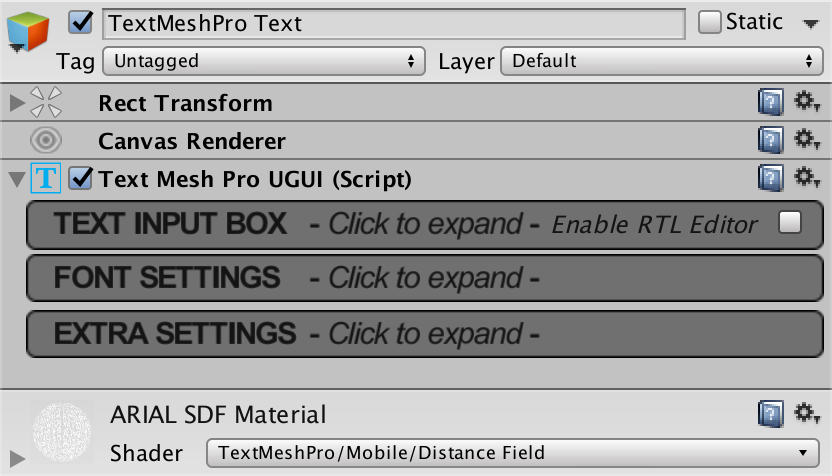

因为UI 解决方案的限制，虽然UI文本对象也具备材质，但并不允许对 UI 对象的材质属性进行动画处理。


### 3D 文本对象

3D 对象是通过GameObject / 3D Object / TextMeshPro-Text创建的。文本本身是扁平的，就像 UI 文本一样，但它单独存在于 3D 场景中，而不是在画布中。

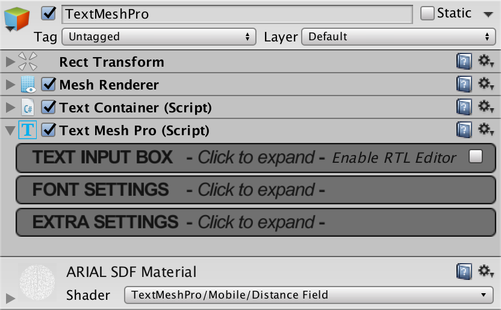

在这种情况下，对象有自己的Mesh Renderer组件。它也有一个合适的材质检查器，并且它的材质属性可以被动画化。

3D 对象没有Canvas Renderer。相反，它们有一个Text Container ，它与Rect Transform组件一起负责文本区域的布局。即使这些是 3D 对象，它们仍然使用替代的矩形变换组件。

3D 文本对象存在一些差异。它不包括边距和射线投射目标设置。

排序层和顺序设置可用于微调对象的渲染顺序。

当使用带有正交相机的相机对齐文本时，应启用正交模式。它指示着色器不使用任何透视校正。

默认情况下，四边形用于显示字符。Enabled Volumetric Setup激活替代模式，在该模式下使用立方体。这允许体积角色渲染，但目前没有着色器支持此功能。

### 2.2 基本属性

1. Text Input 文本框

    输入文字的地方，右上角的复选框 RTL 模式只反转文本，其他一切都保持不变。

    text style : 文本样式，可以在下拉列表中选择一些默认自带的文本样式

    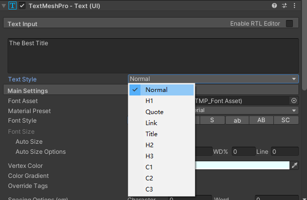

    文本支持输入类似 HTML 的富文本标签 Rich TextTags ，比如 ： 
    ``` html
    <color=#FF0000><B>玩家:</B></color>Xyz
    ```
2. Main Settings 主设置

    类似于word文档，可以选择字体设置、颜色、样式、对齐、间距、自动换行等等

    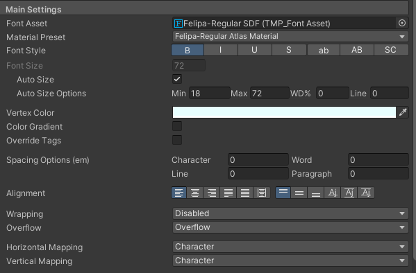

    * Font Asset 字体资源  
    选择设置字体资源文件，如需扩展，可以将下载的字体资源文件拖入 Project 窗口后，在此处选择指定
    * Material Preset  
    每个字体资源都有一个默认材质，但您也可以为其创建自定义材质。您可以使用此下拉菜单快速选择材料变体。    
    预设列表是通过搜索在自己的名称中包含字体资源名称的所有材料来填充的，并使用匹配的字体图集纹理。
   * Font Style  
    字体样式，七个字体样式切换按钮可用于调整整个文本的外观。
   * Font Size  
    字体大小。可以使用固定大小或自动调整大小。  
    启用自动调整大小后，您可以指定最小和最大大小。  
    TextMesh Pro 将通过多次执行布局来确定要使用的尺寸，直到找到最合适的尺寸。最终字体大小显示在字体大小输入字段中。
    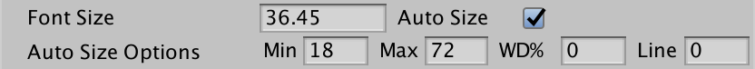  
    WD%字段包含一个百分比，它控制最大字符宽度缩减。这允许字符被水平挤压以使它们更高。这通常只适用于数字。  
    还可以允许降低行高以适应更大的字体大小。您可以通过Line字段控制它。  
    启用自动调整大小后，文本会多次布局以找到合适的大小。所以只有在需要的时候才启用它，对于频繁变化的动态文本避免使用它。如果您的文本没有改变，您可以启用自动调整大小以找到最适合的大小，然后禁用它并手动使用计算出的字体大小。
   * Vertex Color 顶点颜色  
     实际上就是字体颜色，可用下面的复选框启动渐变
   * Color Gradient 颜色渐变  
    使用颜色渐变时，您可以为所有角色精灵的四个角赋予不同的颜色
    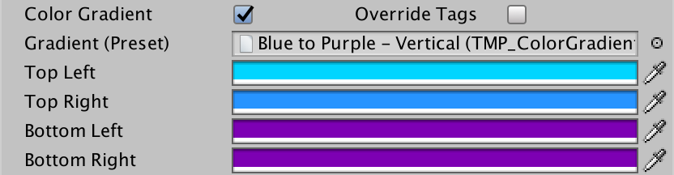
    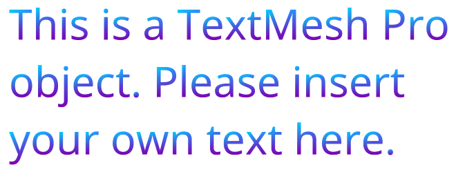
    渐变颜色与统一的顶点颜色相乘。要查看原始渐变，请使用白色统一颜色。  
    启用覆盖标签时，富文本颜色将被忽略。
   * Spacing Options(em) 间距选项  
    设置字符、行和段落之间的间距  
    段落由明确的换行符定义。您可以使用这些设置微调每个对象的文本，而无需调整字体资源。  
    通过使用富文本标签，这些设置也可以在单个文本对象内发生变化。
    
   * Alignment 对齐  
    十种文本对齐模式，分为两组
    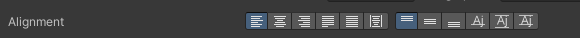
    有四种水平对齐模式可供选择。左、中和右模式控制显示区域内文本上的线条位置。这些模式不会改变行的内容，只会改变它们的水平位置。  
    左对齐：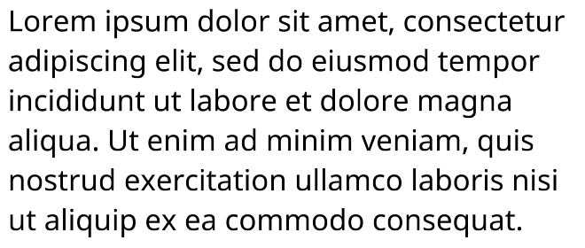
    右对齐：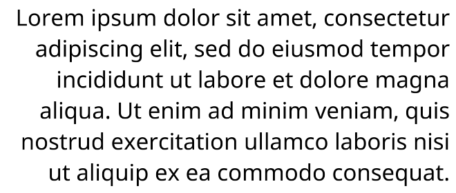
    居中对齐：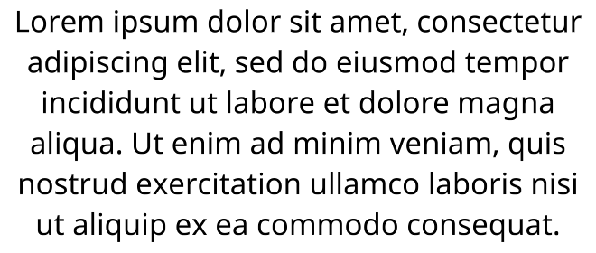
    justify 对齐模式改为拉伸线条，使它们填满显示区域的整个宽度。这是通过增加单词之间和单词内字符之间的距离来完成的。Wrap Mix滑块控制额外字间距与额外字符间距的比率。
    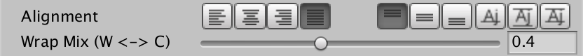  
    只有包裹的行才会被拉伸。所有其他行——带有换行符或在文本末尾的行——将左对齐。
    还有六种垂直对齐模式。顶部、中间和底部模式的工作方式类似于前三种水平对齐模式，但垂直对齐。  
    第四种模式是基线对齐。它定位内容，使第一行文本的基线与显示区域的中间对齐。这在处理单行文本时很有用。  
    这第五种模式是中线对齐。它的行为类似于中间垂直对齐，但它使用文本网格的边界而不是行度量来确定垂直位置。这在狭小的空间中非常有用，否则上升器和下降器会延伸得太远。  
    最后一种模式是顶线对齐。它类似于基线对齐，但它使用第一行的中间，而不是基线。
   * Wrapping 自动换行  
    设置文字超过行宽度时，是否会自动换行
   * Overflow 溢出  
      * 溢出overflow 模式控制当文本不适合显示区域时发生的情况。溢出意味着文本将超出显示区域的边界，但仍将被换行。  
      * 省略ellipsis 模式将截断文本并插入“...”以表示省略了部分文本。
      * 截断truncate 模式只是在文本超出范围时将其截断。  
      * Page 分页模式会将文本分成几页，单独适合显示区域。然后您可以选择要显示的页面。由于页面是分开显示的，因此垂直对齐以每页为基础。您还可以使用富文本手动插入分页符。
      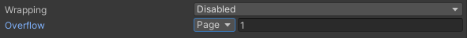
      * 遮罩Masking 会像溢出一样渲染文本，但显示区域之外的所有内容都会被着色器隐藏。这仅适用于 UI 对象，不适用于 3D 对象。  
      * Scroll Rect有类似的用途，但已弃用。  
      * Linked 链接模式，可以链接到另外一个TextMeshPro对象
      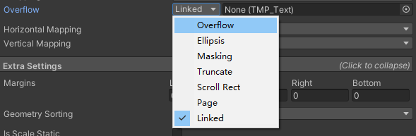
   * Horizontal Mapping 横向UV映射（贴图）
    可以使用支持附加纹理的着色器将图像映射到文本之上。UV 映射选项控制纹理在文本上的拉伸方式。您可以为每个维度使用不同的设置。  
    贴图的wrap mode要设置为repeat，否则会显示不正确。  
      * Character 字符映射模式：在每个字符的精灵上拉伸纹理。所以每个字符都显示相同的图像，并根据其自身的宽高比进行拉伸。
      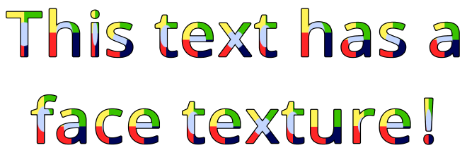
      * Line 行映射模式：在每行的整个宽度或高度上拉伸纹理
      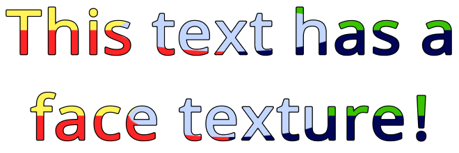
      * Paragraph 段映射模式：在整段文本中拉伸纹理
      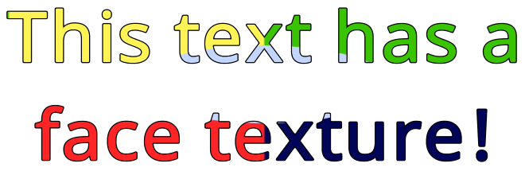
      * Match Aspect ：确保纹理在一个维度上缩放以保持其原始纵横比。这样可以保证纹理不会变形。纹理如何映射到文本上由另一个维度控制，因此您不能将两者都设置为匹配 aspect。
      
      * Line Offset 行偏移量：偏移可用于调整纹理在 X 和 Y 维度上的相对位置。当这些偏移量被添加到纹理坐标时，要在视觉上将纹理朝正方向移动，您必须应用负偏移量。  
      当使用行或段落映射时，还有一个行偏移量，它被添加到每个连续行的 X 偏移量。您可以将其用于倾斜纹理。
      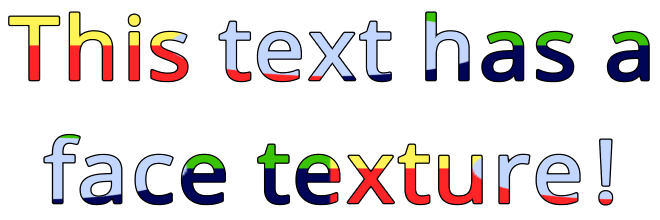
   * Vertical Mapping 纵向UV映射（贴图）  
    同上面横向，只不过方向改为纵向

3. 扩展设置  
  额外设置部分包含一些杂项配置选项。
  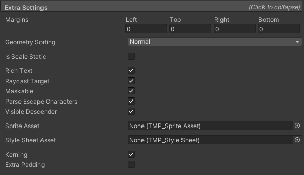

  * Margins 边距
  边距值可用于在文本和内容边界之间添加一些空间。还可以使用负边距，在这种情况下，文本可以超出容器的边界。也可以通过拖动场景视图中黄色矩形的手柄来调整边距。
  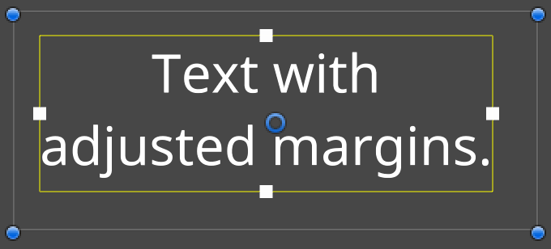
  * Geometry Sorting 几何排序
    设置文本的集合排序方式，用来调整重叠的文字如何显示
  * Is Scale Static 是否缩放静态  
  文本对象或其父对象缩放时，是否影响文字大小
  * Rich Text 富文本  
    是否使用富文本，默认开启，禁用时，标签Tag不会被解析并将显示为纯文本。
  * Raycast Target 投射目标  
    禁用时，UI 在确定鼠标光标与之交互的内容时会忽略文本。
  * Maskable 是否遮盖    
    文字是否被 UI Mask 影响
  * Parse Escape Characters 解析转义字符  
    当启用解析转义字符时，反斜杠转义字符被解释为特殊字符。所以 \n 被解释为换行符， \t 被解释为制表符，等等。请注意，这适用于实际文本，例如用户输入。在代码中，转义字符已被编译器解析。
  * Visible Descender 可视化下降
    可以通过脚本来限制可见的文本字符数。这可以用来慢慢显示文本。使用可见下降控制它如何与底部垂直对齐结合使用。启用后，文本会显示在底部，并随着更多行的重新排列而向上推。禁用时，文本从上到下显示。
  * Sprite Asset 精灵资源
  * Style Sheet Asset 样式资源
  * Kerning and Padding 字间距和填充  
    * Kerning：启用字距调整控制是否使用字体的字距调整数据。这对没有字距调整数据的字体没有影响。  
    * Extra Padding：额外的填充最大化用于渲染角色的精灵的大小。创建几何图形以适合可见文本，但这并不总是完美的。向精灵添加额外的填充以防止字形在其精灵的边界处被切断。

### 2.3 导入字体

通过TextMeshPro 组件中的 Font Asset属性，可以指定不同的字体

导入并使用新字体步骤：

1.  在线浏览你喜欢的开源字体，这些字体可以在你的项目中合法使用。[谷歌字体](https://fonts.google.com/)是一个很好的资源。其他一些国内字体网站：
   * [字体天下](https://www.fonts.net.cn/fonts-zh-1.html)
   * [100字体](https://www.100font.com/)
2. 下载您喜欢的任何字体为 .otf 或 .ttf 文件，然后将它们导入到您的项目中。
3.  从 Unity 的主菜单中，选择Window > TextMeshPro > Font Asset Creator 。  
4.  在 Font Asset Creator 窗口中，将您的字体指定为Source Font File 
5.  如果非英语字体，还需要在 Character Set 字符设置 中指定字符文件：下拉选择Characters from File，然后选择包含所有所需字符的txt文件（需要先导入Unity）
6.  选择Generate Font Atlas ，然后选择Save 。

> 注意：TTF（TrueType Font）是Apple公司和Microsoft公司共同推出的字体文件格式，随着windows的流行，已经变成最常用的一种字体文件表示方式。 而OTF（OpenType Font）是TTF 的升级版，而OTF 是采用的是PostScript 曲线，支持OpenType 高级特性的更高级字体。

### Font Asset Creator 属性(设置中文模式)

* Source Font File: 选择中文字体文件otf 或 ttf。
* Sampling Point Size / Font Size: 字体大小。 默认是Auto Size，会尝试使用字体中的所有字符。数值通常越高越好，一般来说 50 to 70 为宜。注意，过大的数值会导致一些字符采不到。
* Padding: 字体中间隔 (outlines, glow, bevels, etc.) 的大小。一般来说，最好和sampling size 的比例为 1:10。 如sampling size为60时，padding size最好取6。默认为5.
* Packing Method: 创建字体的方式。Fast可用于快速预览效果，Optimum用于创建最终字体。
* Atlas Resolution: 可以理解为分辨率。对于面向手机等移动端的项目，你应该设置为2048x2048。面向电脑端的数值官方没说，通常设置为 4096x4096。
* Character Set: 创建的字体的 字符，也就是说你要创建的TextMeshPro字体中，要包含的所有字符。在我们这里就是所有的中文字符。一般来说常见中文字+英文单词+符号即可。  
  下拉选择Characters from File，然后选择包含所有所需字符的txt文件（需要先导入Unity）。
   这样能够基本满足任何使用场景，但是这样创建的TextMeshPro文件会较大。  
   为了减小文件大小，可以下拉选择Custom Characters，只填入你项目中需要用到的所有字符
* Render Mode: 渲染模式。在仍然支持光栅化位图处显示文本时，除非要在1：1的比率上呈现小字体（即，10pt字体在屏幕上呈现10px），否则使用SDF模式。
* Get Kerning Pairs 获取字距匹配: 可以选择是否使用字体中嵌入的字距信息。
* Generate Font Asset: 生成TextMeshPro中文字体。点击后开始生成文件。完成后保存。然后在你的TextMeshPro组件中选择刚才生成的 .asset 文件即可

> 注意：  
> * Characters from File 不需要用最全的，最好是使用够用的就行，否则生成的字体文件会较大
> * 生成 TextMeshPro 中文字体资源时，不同的字体表现不一样，尽可能选择著名大厂字体，避免 BUG，否则，可能出现各种问题，比如：生成失败、字体不清晰、字体自带背景（背景不透明）等

<br>
<hr>
<br>

> 参考资料：
> * [TextMeshPro官方文档](https://docs.unity3d.com/Packages/com.unity.textmeshpro@4.0/manual/RichTextSprite.html)
> * [TextMeshPro API 文档](https://docs.unity3d.com/Packages/com.unity.textmeshpro@4.0/api/index.html)
> * [TextMeshPro 作者 Zolran youtube 频道](https://www.youtube.com/user/Zolran/videos)
> * [TextMesh Pro: Font Asset Creation 官方教程](https://learn.unity.com/tutorial/textmesh-pro-font-asset-creation)
> * [Unity 中 创建 TextMeshPro 中文字体（含常见汉字 TXT 文件）](https://blog.csdn.net/qq_37454669/article/details/121128100)

<br>
<hr>
<br>

配套视频教程：
[https://space.bilibili.com/43644141/channel/seriesdetail?sid=299912](https://space.bilibili.com/43644141/channel/seriesdetail?sid=299912)

文章也同时同步微信公众号，喜欢使用手机观看文章的可以关注

