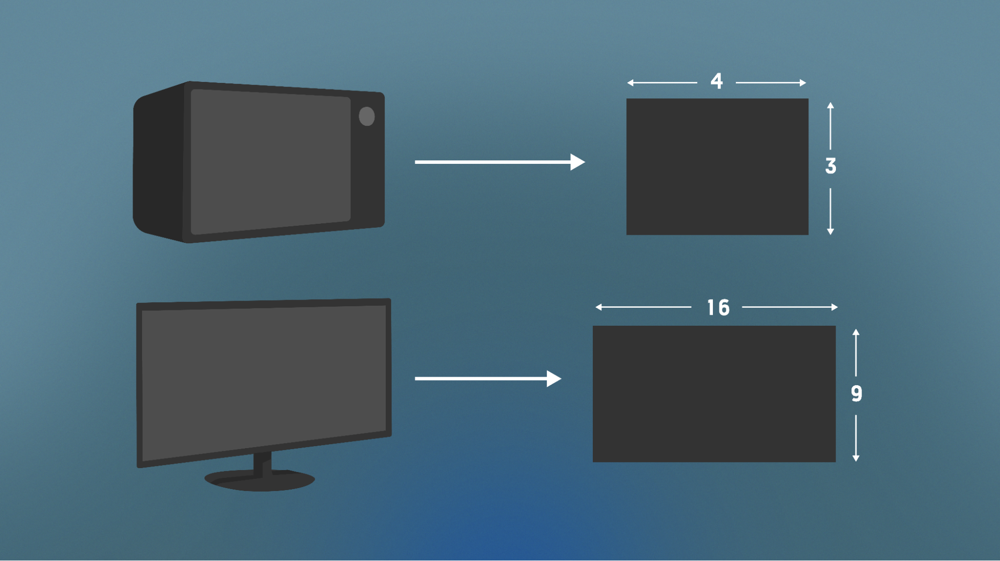
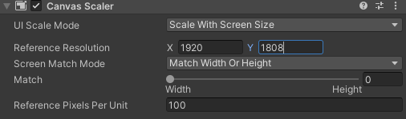
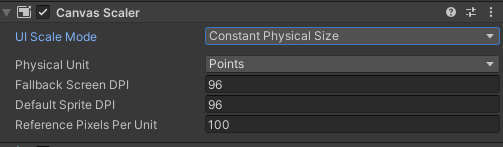
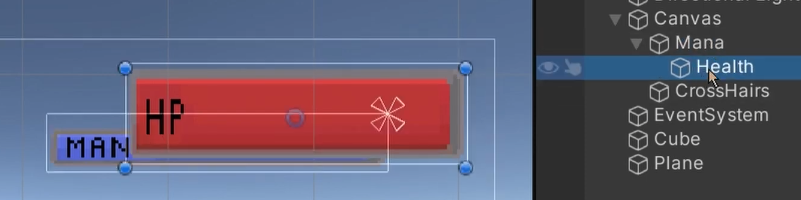
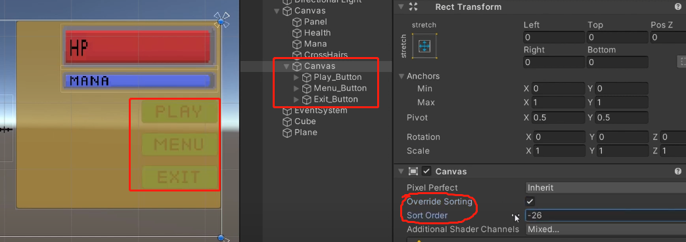

# 画布及相关组件设置

## 1. Render Mode 渲染模式

### 1.1 Screen Space - Overlay 叠加模式

Canvas 自动填充整个屏幕，且一直在最前方，遮盖其他，是最常用的画布渲染模式


在这种模式下，Canvas 被缩放以适合屏幕，然后直接渲染而不参考场景或相机（即使场景中根本没有相机也会渲染 UI）。如果屏幕的大小或分辨率发生变化，则 UI 将自动重新缩放以适应。UI 将绘制在任何其他图形（例如相机视图）之上。

### 1.2 Screen Space - Camera 摄像机模式

Canvas 自动填充指定摄像机的整个屏幕，但其他游戏对象可以在它之前显示，根据和指定摄像机的距离可以调整是否遮挡 Canvas


在这种模式下，Canvas 的渲染就像是在给定相机前面一定距离的平面对象上绘制的一样。UI 的屏幕尺寸不随距离变化，因为它总是重新缩放以完全适合相机视锥体。如果屏幕的大小或分辨率或相机视锥体发生变化，则 UI 将自动重新缩放以适应。任何3D对象
在场景中，比 UI 平面更靠近相机的场景将渲染在 UI 的前面，而平面后面的对象将被遮挡。

### 1.3 World Space 世界坐标模式

Canvas 和其他游戏对象没任何区别，完全按照世界坐标方式显示。


此模式将 UI 渲染为场景中的平面对象。Canvas 的大小可以使用其 Rect Transform 进行设置，但其屏幕大小将取决于相机的视角和距离。其他场景对象可以从 Canvas 后面、穿过或前面经过。

## 2. 管理屏幕尺寸

### 2.1 屏幕横纵比

横纵比（宽高比）描述了屏幕的宽度和高度之间的关系

例如，老式电视和最早的电影使用 4:3 的纵横比。这意味着屏幕有 4 个单位宽和 3 个单位高。然而，现代宽屏电视和大多数新电影使用更宽的 16:9 纵横比，而手机的默认通常为 9：16 或 10：16



### 2.2 锁定项目的纵横比

Unity 允许您选择要用于 Canvas 的纵横比。

Free Aspect: 启用Free Aspect后，Canvas 的形状和大小会随着您调整 Game View 窗口的大小而改变。

## 3. UI Scale Mode 界面缩放模式

Canvas Scaler组件，用于控制画布中的元素整体比例和像素的密度。


这种缩放会影响画布下的所有内容，甚至包括字体大小和图片边框。

### 3.1 Constant Pixel Size 恒定像素大小

无论屏幕大小如何，都使 UI 元素保持相同的像素大小。

相关属性：

* Scale Factor 缩放系数：按此系数缩放画布中的所有 UI 元素
* Reference Pixels Per Unit 每单位参考像素：Unity中一个单位对应的像素数

### 3.2 Scale With Screen Size 随屏幕尺寸缩放

实际游戏开发中，最常使用的缩放模式

屏幕越大,UI 元素越大，UI 随着屏幕尺寸而进行缩放



* Reference Resolution 参考分辨率：	布局设计的分辨率。如果屏幕分辨率较大，则 UI 将按比例放大，如果屏幕分辨率较小，则 UI 将按比例缩小。
* Screen Match Mode	屏幕匹配模式
  * Match Width or Height： 使用宽度、高度作为参考，或介于两者之间的值来缩放画布区域.
  * Expand：水平或垂直扩展画布区域，因此画布的大小永远不会小于参考值.
  * Shrink：水平或垂直裁剪画布区域，因此画布的大小永远不会大于参考值。
* Match	：确定缩放是使用宽度或高度作为参考，还是使用两者的混合。
* Reference Pixels Per Unit：每Unity单位参考像素

### 3.3 Constant Physical Size 恒定物理尺寸

无论屏幕大小和分辨率如何，都使 UI 元素保持相同的物理大小（屏幕上的实际物理尺寸）。



* Physical Unit	:指定位置和大小的物理单位.
* Fallback Screen DPI: 后备屏幕 DPI:	如果屏幕 DPI 未知，则采用的后备 DPI。
* Default Sprite DPI ：	默认精灵 DPI.
* Reference Pixels Per Unit	：如果精灵具有此“每单位像素数”设置，则其 DPI 将匹配“默认精灵 DPI”设置。.

## 4. Canvas Group 画布组

### 4.1 概述
画布组组件可以用来统一控制添加到组内的UI元素。


画布组组件的属性设置可以同时影响到当前游戏对象及其子对象。

用法：  
父对象上添加 Canvas Group 组件，所有 UI 子对象都会受到这个 Canvas Group 组件的设置。

缺点：  
现有版本并不能自由指定画布组，所有子对象都会受到影响，不能拣选。如果想要某些子对象不受影响，只能再建一个画布组，然后将需要排除影响的子对象添加进去，然后设置这个内部的画布组 Ignore Parent Groups，办法比较笨拙。

### 4.2 相关属性：

* Alpha 透明度：该组中 UI 元素的不透明度。该值介于 0 和 1 之间，其中 0 是完全透明的，1 是完全不透明的。请注意，元素也保留了它们自己的透明度，因此画布组 alpha 和各个 UI 元素的 alpha 值相互相乘。
* Interactable 是否可交互：确定此组件是否接受输入。当它设置为 false 时，交互被禁用。
* Block Raycasts 阻挡射线：是否能被 Graphic Raycaster 射出的射线所碰撞（选中状态为响应碰撞）。注意，这个不适用于Physics.Raycast，即物理射线无法和UI元素互动。
* Ignore Parent Groups 忽略父组：该组是否也会受到游戏对象层次结构中 Canvas Group 组件中设置的影响

### 4.3 Canvas Group 典型用途：

* 淡入淡出：  
  通过在 Window 的 GameObject 上添加 Canvas Group 并控制其 Alpha 属性来淡入或淡出整个窗口。
* 变灰不可用：  
  通过将 Canvas Group 添加到父 GameObject 并将其 Interactable 属性设置为 false，使整组控件不可交互（“变灰”）。
* 不响应鼠标操作：  
  通过将 Canvas Group 组件放置在元素或其父元素之一上并将其 Block Raycasts 属性设置为 false，使一个或多个 UI 元素不阻止鼠标事件。

## 5. Render Order 渲染顺序

### 5.1 通过 Hierarchy 设置渲染顺序

在 UGUI 中，渲染顺序默认是按照 Hierarchy 中的先后来实现的。

规则：
* 下面的会遮盖上面的，也就是说， Hierarchy 中下面的项后渲染
* 子对象会后渲染，遮盖父对象
  

代码操控方法：
``` C#
// 设置父对象
transform.SetParent()

// 设置上兄弟
transform.SetAsFirstSibling()

// 设置下兄弟
transform.SetAsLastSibling()
```

### 5.2 通过 Canvas 设置渲染顺序

将需要特定渲染顺序的UI组件放入一个 Canvas 中，通过 Canvas 来更改、强行设定其渲染顺序

步骤：
1. 新建子 Canvas 对象；
2. 将需要设定渲染顺序的UI组件拖拽如新建的 Canvas
3. 开启新建的 Canvas 对象的 Override Sorting 属性
4. 设定 Canvas 的 Sort Order，值越大，UI 渲染越晚，显示越靠前方，会遮盖 Order 值小的UI元素



<br>
<hr>
<br>

配套视频教程：
[https://space.bilibili.com/43644141/channel/seriesdetail?sid=299912](https://space.bilibili.com/43644141/channel/seriesdetail?sid=299912)

文章也同时同步微信公众号，喜欢使用手机观看文章的可以关注

