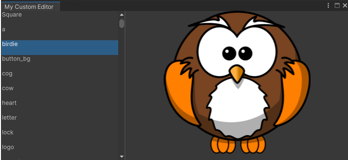
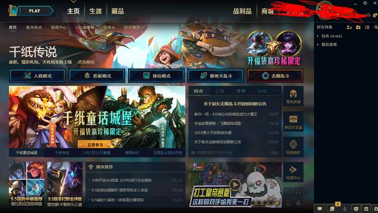
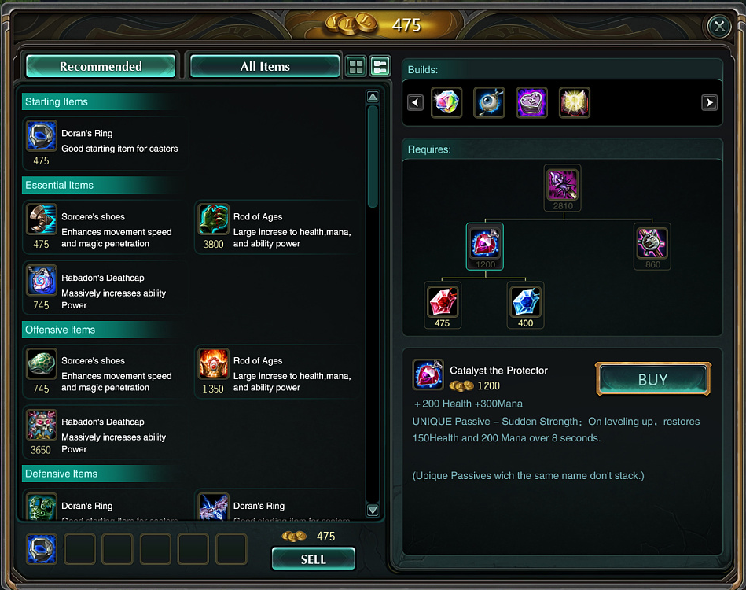
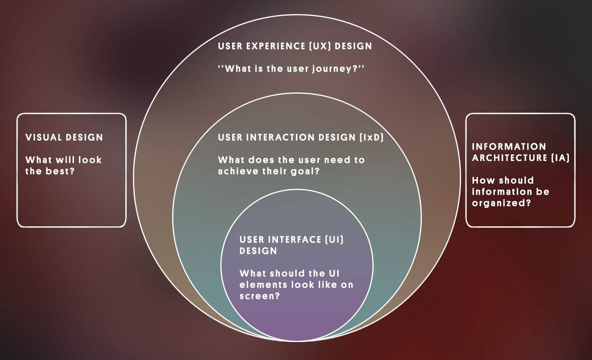

# User Interface 用户界面

## 1. 概念

### 1.1 User Interface

User Interface（UI） 是用户和软件（当然包括游戏）沟通的界面，通过 UI，用户可以将指令发给软件，也可以获取软件的反馈信息。

UI 通常包含：图片、文字、按钮、开关、滑动条、下拉列表、表格、分页 等等

- Unity 用户界面：  
   指的是 Unity 编译器的用户界面，unity 编译器本身就是开源的，也可以随意更改，添加功能，这也是 Unity 的一大特色
  

- Game（或用 Unity 创建的应用）起始界面：  
   开启游戏前的界面  
  

- 运行时（runtime）界面:  
  进入游戏后的游戏内操作界面  
  

### 1.2 和 UI 相关的职位

* User experience (UX) design 用户体验设计
    - Answers the question: 用户的使用经历
    - Goal: 确保一个产品从头到尾的使用体验.
* User interaction design (IxD) 用户交互设计
  - Answers the question: 如何满足用户的需求？
  - Goal: 确保用户通过最方便（舒适）的方式达到他们的目标. 
  - 用户交互设计是用户体验设计的一个子分支，包含在其中
* User interface (UI) design 用户界面设计
  - Answers the question: 屏幕上的UI元素应该如何布局和展示
  - Goal: 需要确保UI易懂易用，不能称为用户的负担（拦路石）.
  - 是用户交互设计的子元素.
* Information architecture 信息架构师
  - Answers the question: 信息如何组织，如何架构，是否需要用于交互等
  - Goal: 将内容结构化（分类分块，组织机构，相互链接），使用户可以很方便找到想要的信息
  - 影响上面三个职位，是其组织内容的基础.
* Visual design 视觉设计
  - Answers the question: 外观怎样看起来更好
  - Goal: 使产品外观更美观
  - 影响上面三个职位，是其组织外观的基础.

## 2. 最新 Unity 中的 3 大 UI 系统

### 2.1 UI 工具包

UI toolkit UI 工具包是 Unity 中最新的 UI 系统。它旨在优化跨平台的性能，并基于标准 Web 技术。您可以使用 UI 工具包为 Unity 编辑器创建扩展，并为游戏和应用程序创建运行时 UI（如果您安装了 UI 工具包软件包）。

Unity 打算让 UI 工具包成为新 UI 开发项目的推荐 UI 系统，但它仍然缺少 Unity UI (UGUI) 和 IMGUI 中的一些功能。

一句话总结：  
全能 UI 系统，而且是 unity 未来的 UI 发展方向，暂时还缺少部分功能，建议优先使用，遇到不足的，再选择别的 UI 系统补上

### 2.2 Unity UI 软件包 (UGUI)

Unity 用户界面 (Unity UI) 软件包（也称为 uGUI）是一个较旧的、基于游戏对象的 UI 系统，您可以使用它为游戏和应用程序开发运行时 UI。在 Unity UI 中，即可使用组件和 Game 视图来排列和定位用户界面并设置其样式。它支持高级渲染和文本功能。

现在使用 Unity 的公司，旧项目中大多数还在使用 UGUI ，甚至是它的前身 nGUI（第三方 ui），Ruby's Adventure 教程中，使用的还是 uGUI。

### 2.3 NGUI

第三方 UI 系统（[AssetStore 链接](https://assetstore.unity.com/packages/tools/gui/ngui-next-gen-ui-2413)），需付费（现价$95），除非入职公司旧系统中，还在使用 NGUI，否则不推荐学习，uGUI 是模仿 NGUI 做出来的，但现在据说已经比 NGUI 更好用，功能更强

### 2.4 IMGUI

立即模式图形用户界面 (IMGUI) 是一个代码驱动的 UI 工具包，它使用 OnGUI 函数以及实现它的脚本来绘制和管理用户界面。您可以使用 IMGUI 来创建脚本组件的自定义 Inspector，Unity 编辑器的扩展以及游戏内调试显示。不推荐用于构建运行时 UI。

纯代码 UI 系统，适合程序员做游戏内部测试系统、控制台的 UI

## 3. UI 系统的对比和选择

### 3.1 UI 系统对比：

对比请参考文档: [Unity 中 UI 系统的对比](https://docs.unity3d.com/cn/2021.2/Manual/UI-system-compare.html)

### 3.2 UI 系统选择依据建议

- 学习：  
  建议 unity 的三个都学习，首先掌握 UGUI（兼容旧项目），其次是 UI toolkit ，之后是 IMGUI；不建议再学 nGUI  

- 旧项目：  
  以保持原项目系统一至性为原则，使用 UGUI 或 NGUI
- 新项目：  
  根据自己需求选择使用 UGUI 或 Unity UI Toolkit，如果 UI Toolkit 够用，这个是 Unity 主推的方向，如果有它暂时不能实现的功能，再考虑使用 UGUI 或 IMGUI
- 游戏内测试系统（包括控制台）：  
  UNity UI Tookit 不能实现的话，就使用 IMGUI

## 4. UGUi 入门

UGUI（Unity UI） 是一组用于为游戏和应用程序开发用户界面的工具。 它是一个基于游戏对象的 UI 系统，它使用组件和游戏视图来排列、定位和设计用户界面。

> 注意：  
>  UGUI 不能在 Unity 编辑器中创建或更改用户界面。

UGUI 的优势：

- 所见即所得（WYSIWYG）设计工具
- 支持多模式、多摄像机渲染
- 面向对象的编程

### 4.1 UGUI 基本使用步骤

1. 创建 画布 Canves
2. 在 画布 Canves 中添加 UI 组件（文本、文本框、按钮等等）
3. 设置好布局、动画，以及摄像机、特效等
4. 需要的话，再添加交互事件

### 4.2 UGUI 对象的特点

* 所有的 UGUI 对象，都是 Canves 的子对象
* 所有 UGUI 对象，都是一个 2D 的矩形
* 所有 UGUI 对象，和其他 Unity 对象不同，Transform 组件会被替换为 Rect Transform 组件

## 5. 教程中的核心知识点

### 5.1 Rect Transform 矩形变换

矩形变换像常规变换一样具有位置，旋转和比例，但它还具有宽度和高度表示矩形的尺寸。

注意：因为UI是实际上是2D元素，所以进行变换是需要用矩形工具 

Rect Transform Inspector 中各属性值：

* Pos X ，Pos Y，Pos Z: anchor锚点靠在一起时，显示这些属性，表示 锚点 沿着X轴和Y轴、Z轴 到 pivot 轴心点的距离
*  Width、Height：UI空间所在矩形的宽和高
*  Left/Right,Top/Bottom:当锚点不靠在一起时，就没有PosX和PosY、Width、Height（比如 Button），而是用上下左右边距来定位，就是各个边和父对象的距离
*  Anchors Min：左下方锚点所在相对位置，取值百分比转换成的小数，相当于父元素位置的百分比
*  Anchors Max：右上方锚点所在相对位置，取值百分比转换成的小数，相当于父元素位置的百分比
*  Pivot ：轴心点所在的相对位置，取值百分比转换成的小数，相当于自身原点（矩形左下角）位置的百分比
*  Rotation ：旋转，一般只有以轴心，相对Z轴旋转的角度值
*  Scale ：缩放，一般不使用，会影响子对象设置时的计算。通常只用在动画或过场时。 
*  BluePrint Mode ：蓝图模式，旋转和缩放对于当前矩形将失效（但对UI元素显示还是有效的，就是不再影响定位），同时会开启自动停靠
*  Raw Edit Mode：原始编辑模式，调整锚点和轴心点时，当前对象会跟通过改变自己的大小来进行适配当前中心点和对应锚点的位置。

### 5.2 Pivot 枢轴（轴心）

蓝色的甜甜圈按钮就是轴心

旋转、大小和缩放修改都是围绕轴心进行的，因此轴心的位置会影响旋转、大小调整或缩放的结果。

如果想要调整轴心位置，可以直接在 Inspector 中更改值，或者先把 Scene 工具栏上的 Handle Rotation 的按钮，由 Center 改为 Pivot，就在场景中可以随意拖动 Pivot 了

### 5.3 Anchors 锚点

锚点在场景视图中显示为四个小三角形手柄（四叶花）。

每个叶子位置对应矩形的四个顶点（四个实心蓝色圆点 ）。当描点随父对象变换时，矩形的顶点与对应的锚点绝对距离必须保持不变。

例如，子项可以锚定到父项的中心，或锚定到一个角。

注意：

* 锚点可操作范围是父对象的矩形，而非当前对象的矩形。因为锚点就是用于子对象相对于父对象定位用的
* 锚点在一起，就不会在该方向上随着父对象缩放而缩放；反之则会。

### 5.4 遮罩

两个图像，一个是原图像，一个是遮罩图像，显示的是原图像，遮罩图像控制原图像的显示范围，只显示背遮罩区域的原图像。

所以可以通过更改遮罩图像的大小，来不失真地显示原图像的部分区域

### 5.5 静态成员

[菜鸟教程静态成员文档](https://www.runoob.com/csharp/csharp-class.html)

可以使用 static 关键字把类成员定义为静态的。当我们声明一个类成员为静态时，意味着无论有多少个类的对象被创建，只会有一个该静态成员，并且被所有类对象所共享。

 

 

>参考资料
>
> - [创建用户界面 UI（官方手册）](https://docs.unity3d.com/cn/2021.2/Manual/UIToolkits.html)
> - [UGUI 包文档](https://docs.unity3d.com/Packages/com.unity.ugui@1.0/manual/index.html)
> - [其他 UI 资料- UI 系统学习](https://pmlpml.github.io/unity3d-learning/09-ui.html)

配套视频教程：
[https://space.bilibili.com/43644141/channel/seriesdetail?sid=299912](https://space.bilibili.com/43644141/channel/seriesdetail?sid=299912)

文章也同时同步微信公众号，喜欢使用手机观看文章的可以关注

