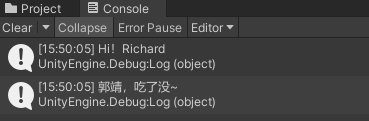
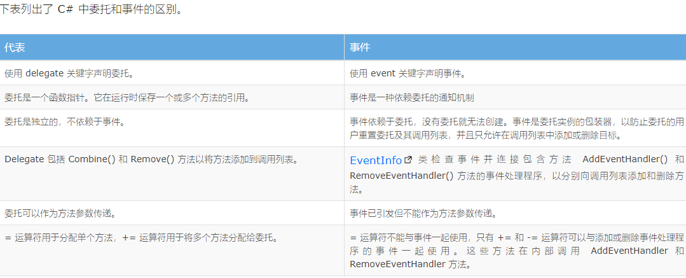

# C# 事件系统

## 1. 委托 delegate

delegate 是 C# 中的一种系统内置的对象类型，用来存储并指向特定格式的方法。

类似于 “指定格式方法的引用” 或 “存放特定格式方法的容器”，就像是基础数据类型定义的变量，但委托对象存储的不是数据，而是用来存储相同格式的方法

### 相同格式的方法

满足下面两个条件的方法，就可以称为“相同格式”的方法

* 返回值类型相同
* 参数列表相同：参数类型、个数、顺序必须都相同，但不要求参数名相同

### 1.1 委托的定义

在 C# 中，可以使用关键字 ： delegate 声明或定义一个委托类型

``` C#
// 委托定义格式
public delegate 方法返回值类型 委托类型名(参数列表);
```

### 1.2 委托的基本使用

C# 中委托的用途，就是来存储方法，跟普通变量的使用方式基本相同，但是要注意，委托是“引用类型”，而非“值类型”

``` C#
// 委托的使用

// 创建一个和委托同格式的方法

方法返回值类型 方法名(形参列表){
    方法内语句段....
}

// 委托对象赋值（单播 —— 类似方法指针）
委托类型名 委托对象名 = 具体的某个方法名;

// 委托对象赋值（多播 —— 观察者模式）
// 增加对委托的订阅
委托对象名 += 具体方法名;
// 移除对委托的订阅
委托对象名 -= 具体方法名;

// 使用委托执行方法
// 调用委托所存储（指向）的方法
委托对象名(实参列表);
// 更严谨的使用方式：
if(委托对象名!=null)
{
    委托对象名(实参列表);
}
// 语法糖版本
// 功能跟上面的 If 版本完全一样
委托对象名?.Invoke(实参列表);
```

### 1.3 委托基本使用具体实例

创建一个委托类型，用来引用两个对应类型的方法，并使用委托执行方法

``` C#
public class DelegateTest : MonoBehaviour
{
    //创建委托，用来存储（指向）打招呼用的方法
    public delegate void SayHiDelegate(string name);
    
    // Start is called before the first frame update
    void Start()
    {
        //使用委托类型创建委托对象，引用具体方法
        SayHiDelegate sayHi = SayHiInEn;
        //用委托对象执行所引用的方法
        sayHi("Richard");
        
        sayHi = SayHiInCn;
        sayHi("郭靖");
    }

    //自定义打招呼方法1，讲英文
    void SayHiInEn(string name)
    {
        Debug.Log($"Hi！{name}");
    }
    
    //自定义打招呼方法2，讲中文
    void SayHiInCn(string name)
    {
        Debug.Log($"{name}，吃了没~");
    }
}

```

Unity 中运行效果，在 控制台 窗口中可以看到




### 1.4 委托进阶使用

自然，委托对象也可以作为方法的参数来使用

这里，我们直接来看例子，上面的代码的进阶版：

``` C#
public class DelegateTest1 : MonoBehaviour
{
    //创建委托，用来存储（指向）打招呼用的方法
    public delegate void SayHiDelegate(string name);
    
    // Start is called before the first frame update
    void Start()
    {
        //委托对象作为参数，实参就是具体的方法（同格式）
        SayHi("Richard",SayHiInEn);
        
        SayHi("郭靖",SayHiInCn);
    }

    //创建一个方法，使用委托对象作为参数
    void SayHi(string name,SayHiDelegate method)
    {
        //使用委托调用引用的方法
        method(name);
    }

    //自定义打招呼方法1，讲英文
    void SayHiInEn(string name)
    {
        Debug.Log($"Hi！{name}");
    }
    
    //自定义打招呼方法2，讲中文
    void SayHiInCn(string name)
    {
        Debug.Log($"{name}，吃了没~");
    }
}
```

执行结果跟上面的相同，但这个代码结构显得更加简洁合理（所谓的——优雅 :stuck_out_tongue_winking_eye: ）

### 1.5 C# 委托实现方式（选读）

编译器在你使用 delegate 关键字时生成的代码会映射到调用 Delegate 和 MulticastDelegate 类的成员的方法调用。

类 Delegate 是委托类型的基类。 但是，只有系统和编译器才能从 Delegate 类或 MulticastDelegate 类显式派生。也就是说，我们无法创建自己定义的 Delegate 或 MulticastDelegate 的派生类。

类 Delegate 不被视为委托类型;它是用于派生委托类型的类。

### 1.6 Invoke & BeginInvoke（选读）

下面的知识牵扯到“多线程”，如果不了解的可以先跳过

* Invoke：同步 ，Invoke() 会调用已附加到特定委托实例的所有方法
* BeginInvoke / EndInvoke： 异步

委托的Invoke方法用来进行同步调用。同步调用也可以叫阻塞调用，它将阻塞当前线程，然后执行调用，调用完毕后再继续向下进行。

不必从 C# 中显式调用此方法，因为编译器会自动调用此方法。 当你想要查找委托类型的签名时， 可以在反射中使用Invoke方法。

BeginInvoke方法是从ThreadPool取出一个线程来执行这个方法，以获得异步执行效果的。也就是说，如果采用这种方式提交多个异步委托，那么这些调用的顺序无法得到保证。而且由于是使用线程池里面的线程来完成任务，使用频繁，会对系统的性能造成影响。


## 2. C# Event

### 2.1 C# Event 概念

.Net 中的事件基于委托（events are based on delegate model）。

并遵循“[观察者模式 Observer Pattern](https://learn.microsoft.com/zh-cn/dotnet/standard/events/observer-design-pattern)”，使订阅者 subscriber(事件接收方) 能够注册提供方 provider（事件发送方），并接收提供方发出的相关通知 notification。

event 虽然是对 delegate 的封装，但不像其他的扩展去增加功能，反而是减少了 delegate 的功能，在 delegate 的基础上加上了限制。

### 一句话：事件是功能受限的委托对象。

### 事件是基于委托的，在委托对象外加了一层封装，对委托加上了一些限制：在定义了事件的类之外，不允许进行直接赋值（=），只能用订阅或取消订阅（+=和-=）；也不允许在定义事件的类之外，用事件执行所引用的方法。

在某种程度上，事件只是一个委托的实例。即使您去掉 event 关键字并仅使用委托，程序代码也能正常工作。但是，使用 event 关键字，我们通过禁止使用 = 运算符，阻止订阅者重置委托，从而删除所有处理程序。

### 2.2 C# Event 定义&使用

#### 事件的定义方式：

``` C#
// event 为 C# 关键字，专门用来定义事件
访问修饰符（通常为 public ） event 委托类型 事件对象名称;
```

#### 事件的使用方式：

``` C#
// 增加订阅
事件对象 += 同格式的方法名;
// 删除订阅
事件对象 -= 同格式的方法名;
// 执行订阅事件的方法列表
事件对象(参数列表);
```

### 2.3 event 实例

举个栗子:point_up:，up 主发视频的这个动作，就是一个事件，粉丝们订阅了这个发视频的事件之后，一旦事件发生（发了新的视频），粉丝们就可以进行响应。

下面，分别在 Hierarchy 中创建三个空对象 Uper，FansA，FansB。

然后分别挂接下面三个脚本，来体验一下C#事件订阅的效果

#### 2.3.1 up 主对象要挂接的代码

``` C#
//可以被订阅，能够发视频的 up 主
public class Uper : MonoBehaviour
{
    //定义委托类，其对象可以用来引用粉丝们的不同响应方法
    public delegate void FansBehaviour(string msg);

    //基于上面的委托定义事件
    //事件和委托的不同在于，C#事件是实现了观察者模式的委托类的对象
    public static event FansBehaviour fansBehaviourEvent;

    private void Start()
    {
        if (fansBehaviourEvent != null)
        {
            fansBehaviourEvent("Up主更新视频了......");
        }
    }
}

```

#### 2.3.2 红粉 FansA 要挂接的代码

``` C#
public class FansA : MonoBehaviour
{
    //任意 start 执行之前被调用
    void Awake()
    {
        //注册事件，完成对事件的订阅
        Uper.fansBehaviourEvent += Like;
    }

    //红粉对up主更新这个事件的响应
    void Like(string msg)
    {
        Debug.Log($"{msg} 赶快去学习 & 一键三连~");
    }
}

```

#### 2.3.3 黑粉 FansB 要挂接的代码

``` C#
public class FansB : MonoBehaviour
{
    //任意 start 执行之前被调用
    void Awake()
    {
        //注册事件，完成对事件的订阅
        Uper.fansBehaviourEvent += Hate;
    }

    //黑粉对up主更新这个事件的响应
    void Hate(string msg)
    {
        Debug.Log($"{msg} 赶快去踩他~还黑不死他了！");
    }
}
```

最后，只要 Uper（事件提供方 provider） 那边执行了事件，关注了up主（或者说订阅了事件）的粉丝们（订阅者 subscriber）就会立刻相应，而且不同的订阅者，可以根据自己的需要，进行不同的相应。

比如：一个按钮对象的点击事件，可以被订阅，用来播放音乐，也可以同时更改一个图像的内容；游戏中的玩家被攻击，这个事件就可以被血条UI订阅，用来改动血条上的显示，同时可以被攻击数字系统订阅，用来显示在玩家头上，弹出的攻击量数字......

## 3. delegate 和 Event 的区别



## 4. 委托语法糖：Action & Func

C# 中，Action 和 Func 是用来简化创建委托对象语法的语法糖，可以用来创建强类型的委托

自然， Action 和 Func 也可以结合 event 关键字来创建事件，替代某个具体的委托类型。

### 4.1 Action

Action 关键字和泛型结合起来，代表一个返回值为空的 delegate 类型

``` C# 
// 用Action创建一个返回值为空委托
访问修饰符（通常为public）Action<参数类型列表> 委托对象名;

// 上面的代码相当于下面两句的组合：
访问修饰符（通常为public） delegate void 委托类型名( 和Action泛型列表中相同的参数列表 );
访问修饰符（通常为public） 委托类型名 委托对象名;

// 配合 event 关键字创建事件
访问修饰符 event Action<参数类型列表> 事件委托对象名；
```

### 4.2 Func

Action 代表无返回值的 delegate 快速创建语法糖，那自然要有个带返回值的跟他对应，那就是 Func

同样，Func 关键字和泛型结合起来，代表一个有指定返回值类型的 delegate 类型

``` C#
// 用Action创建一个返回值为空委托
访问修饰符（通常为public）Func<参数类型列表,返回值类型> 委托对象名;

// 上面的代码相当于下面两句的组合：
访问修饰符（通常为public） delegate 返回值类型 委托类型名( 和Func泛型列表中，去除最后一个类型的参数列表 );
访问修饰符（通常为public） 委托类型名 委托对象名;

// 配合 event 关键字创建事件
访问修饰符 event Func<参数类型列表,返回值类型> 事件委托对象名；
```

## 5. System.EventHandler 委托

System.EventHandler 是一种特定的委托类型(和 Action、Func 一样是委托语法糖)：

### 5.1 EventHandler 基本用法

``` C#

public delegate void EventHandler(object? sender, EventArgs e);


```

对应的方法，一般就是事件方法（比如 windows form 组件中的事件方法）：

* 返回值： void
* 参数一：具体执行的方法的发出者，通常都是订阅了事件的对象；
* 参数二：EventArgs 类型的对象，用来存储事件发生过程中的一些数据，可扩展，为自己的特殊事件设计专用的数据结构

微软官方文档示例：

``` C#
using System;

namespace ConsoleApplication1
{
    class Program
    {
        static void Main(string[] args)
        {
            Counter c = new Counter(new Random().Next(10));
            c.ThresholdReached += c_ThresholdReached;

            Console.WriteLine("press 'a' key to increase total");
            while (Console.ReadKey(true).KeyChar == 'a')
            {
                Console.WriteLine("adding one");
                c.Add(1);
            }
        }

        static void c_ThresholdReached(object sender, ThresholdReachedEventArgs e)
        {
            Console.WriteLine("The threshold of {0} was reached at {1}.", e.Threshold,  e.TimeReached);
            Environment.Exit(0);
        }
    }

    class Counter
    {
        private int threshold;
        private int total;

        public Counter(int passedThreshold)
        {
            threshold = passedThreshold;
        }

        public void Add(int x)
        {
            total += x;
            if (total >= threshold)
            {
                ThresholdReachedEventArgs args = new ThresholdReachedEventArgs();
                args.Threshold = threshold;
                args.TimeReached = DateTime.Now;
                OnThresholdReached(args);
            }
        }

        protected virtual void OnThresholdReached(ThresholdReachedEventArgs e)
        {
            EventHandler<ThresholdReachedEventArgs> handler = ThresholdReached;
            if (handler != null)
            {
                handler(this, e);
            }
        }

        public event EventHandler<ThresholdReachedEventArgs> ThresholdReached;
    }

    public class ThresholdReachedEventArgs : EventArgs
    {
        public int Threshold { get; set; }
        public DateTime TimeReached { get; set; }
    }
}
```

### 5.2 EventHandler<T> 泛型用法

因为 EventHandler 本身不能有返回值，所以也可以使用类似 Action<T> 的方式来使用泛型，来简化方法的参数列表表示

比如：
``` C#
public event EventHandler<string,int> eventHandler;
// 这个 eventHandler 委托对象，可以被 void (stirng, int) 格式的方法 订阅
```


## 6. 解除订阅的重要性


> 参考资料
>
> * [区分委托和事件](https://learn.microsoft.com/en-us/dotnet/csharp/distinguish-delegates-events)
> * [EventHandler 委托文档](https://learn.microsoft.com/zh-cn/dotnet/api/system.eventhandler?view=net-7.0)
> * [EventArgs 类文档](https://learn.microsoft.com/zh-cn/dotnet/api/system.eventargs?view=net-7.0)