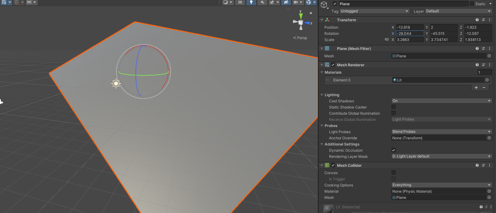

# 设置 Transform 重置快捷键

## 因

很多时候，我们在移动、或者误触游戏对象后，都想让游戏对象快速回归到世界原点或者父对象起始位，都需要在 inspector 中，将 Transform 组件中的所有值都重置会初始值。



但操作起来比较麻烦，最多要重置 9 个值；即使使用组件右侧的重置按钮，也要点好几下

所以，如果要有一个能够快速重置 Transform 组件的快捷键，会方便很多~

## 果

Unity 编辑器本身，是支持高度重构的，就是很多功能都可以通过代码自定义，包括快捷键。

你甚至可以把一些列常用功能步骤，综合在一起，用一个快捷键来绑定。

自然，也可以自定义一个快速重置 Transform 组件的快捷键。

代码如下：

``` C#
using UnityEngine;
using UnityEditor;

// reset transform position, rotation and scale

namespace UnityLibrary
{
    //不需要继承自任何其他类
    public class ResetGameObjectPosition
    {
        //添加自定义菜单，并绑定 alt + r 快捷键
        [MenuItem("GameObject/Reset Transform &r")]
        static public void MoveSceneViewCamera()
        {
            //获取在 Unity scene 或 Hierarchy 窗口中选中的游戏对象
            GameObject[] selectedObjects = Selection.gameObjects;

            //因为选中的可能不只一个，所以用遍历
            foreach (GameObject selected_object in selectedObjects)
            {
                //给出交互
                Undo.RegisterCompleteObjectUndo(selected_object.transform, "Reset game object to origin");

                // transform 3 属性
                Vector3 p_pos = Vector3.zero;
                Quaternion p_rot = Quaternion.identity;
                Vector3 p_scale = Vector3.one;

                //获取父对象起始位置
                if (selected_object.transform.parent != null)
                {
                    p_pos = selected_object.transform.parent.position;
                    p_rot = selected_object.transform.parent.rotation;
                    p_scale = selected_object.transform.parent.localScale;
                }

                //有父对象，回归父对象起始位
                //无父对象，回归世界原点
                //如果这个逻辑不适合你，也可以自行更改或拆分
                selected_object.transform.position = Vector3.zero + p_pos;
                selected_object.transform.rotation = Quaternion.identity * p_rot;
                selected_object.transform.localScale = Vector3.one;
            }
        }
    }
}

```

将此代码放入 Assets 文件夹内任意位置，会在 Unity 立即生效

有了这个思路，你也可以将一些常用步骤，都制作成自定义的快捷键来提升工作效率。

> 注意：
>
> * 快捷键定义时，一定要避免相互冲突。如果是跟 Unity 内部的快捷键冲突，Unity 会给出提示，一般换一个就行；
> * 但有些系统中安装的其他软件，也可能跟你新定义的快捷键冲突，那些软件如果设计的不够合理，很有可能并不提示，可能导致一些操作错误，请大家注意。

> 参考资料：
>
> * [Unity官方文档 —— MenuItem ](https://docs.unity3d.com/ScriptReference/MenuItem.html)
> * [https://forum.unity.com/threads/hotkey-to-reset-transform-on-game-object.601684/](https://forum.unity.com/threads/hotkey-to-reset-transform-on-game-object.601684/)