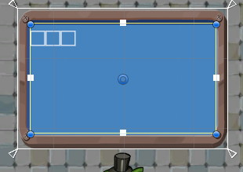
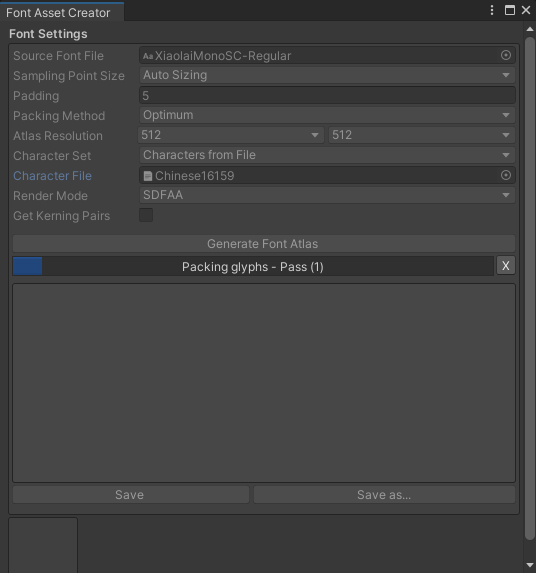
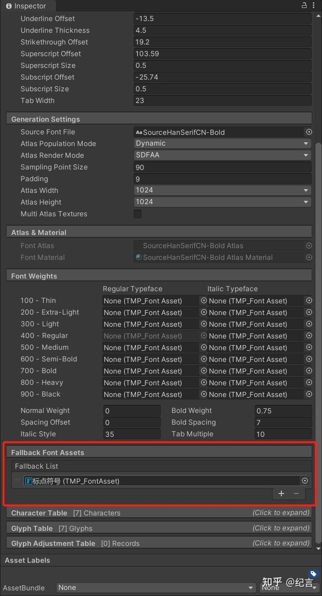

# 在 TextMeshPro 中使用中文

## 1. TextMeshPro 简介

> [TextMeshPro 包官方文档](https://docs.unity3d.com/Packages/com.unity.textmeshpro@4.0/manual/index.html) 最新版，请注意版本

## 2. 中文显示问题

Unity 的 TextMashPro 自带的几款字体都是英文字体，没有中文。

在 inspector 中设置中文，会显示成方块，无法正常使用

## 3. 问题解决方案

### 3.1 动态加载字体

- 步骤 1 ：  
  下载字体，最好是开源字体，未来在项目中可以商用

  [霞鹜自制开源字体下载](https://lxgw.github.io/2021/01/15/Lxgw-Opensource-Chinese-Fonts/)

- 步骤 2 ：  
  在 Unity project 窗口中，在 Assets 下新建 Fonts 文件夹，导入下载好的字体

* 步骤 3 ：
  创建动态字体：选择下载好的字体，右键-Create-TextMeshPro-Font Asset  
  创建好的动态字体，会根据你使用过的文字，自动存储到 Atlas 中。

### 3.2 静态字体

静态字体效率会比动态的高，适合文字较多时使用

- 步骤 1 ：  
  下载一个 “常用汉字” 的 txt 文件，必须用 Unicode 编码保存，比如 utf-8，将其导入 Unity
- 步骤 2 ：  
  在 Unity 菜单中，选择 Window -- TextMeshPro -- Font Asset Creator ，打开窗口
  - Source Font Flie，选择添加好的中文字体文件
  - Character Set：选中 Characters from File 从文件获取文字
  - Character File : 选中 txt 文件
  - Generate Font Atlas ：点击按钮，生成静态字体图集（比较慢的一个过程）
  - Save：保存生成的字体 asset

在我的云盘中，分享了 16159 中文和符号 txt ,以及已经转换好的静态字体文件

下载链接：https://pan.xunlei.com/s/VMovVwhBhUQOnMxDnufbrVqRA1 提取码：3986

### 3.3 字体后备 Font Fallback

某些动态字体，在使用中文标点符号和一些特殊文字符号的时候，依旧会出现方块，这个时候可以使用 TextMeshPro 的 Font Fallback。Font Fallback 可以从另一个 FontAsset 中获取不包含在当前 FontAsset 中的字符。

可以用 Font Fallback 来外挂一些低频使用、或者特殊的符号、字体。

  

 

> 参考资料：
>
> - [https://zhuanlan.zhihu.com/p/375889482](https://zhuanlan.zhihu.com/p/375889482)
> - [https://blog.csdn.net/weixin_42352178/article/details/108936994](https://blog.csdn.net/weixin_42352178/article/details/108936994)

 

 

配套视频教程：
[https://space.bilibili.com/43644141/channel/seriesdetail?sid=299912](https://space.bilibili.com/43644141/channel/seriesdetail?sid=299912)

文章也同时同步微信公众号，喜欢使用手机观看文章的可以关注

