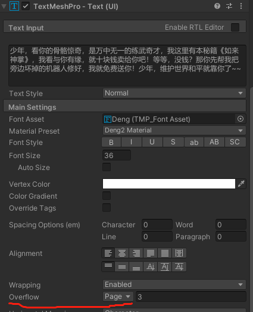

# TextMestPro 翻页

## 1. 逻辑

当显示区域一次放不下所有文字时，就需要翻页了。

我们可以通过在对话时，按一个按键，比如空格，激活翻页功能

- 在 update 方法中，通过 if 判断是否按下空格，最好使用 GetKeyUp，避免按一次键，事件多次触发；
- 设定一个变量，代表当前页码，还要知道总页数
- 每次按键，只要没到最后一页，都是当前页数加一；是最后一页，让其循环到第一页

## 2. 设置



TextMeshPro 组件的 Overflow 属性，需要设置为 Page，后面数字是当前显示的页数(当前显示的是第几页的内容)

## 3. 代码

```C#
public class NonPlayerCharacter : MonoBehaviour
{
    public float displayTime = 4.0f;
    public GameObject dialogBox;
    float timerDisplay;

    public GameObject dlgTxtProGameObject;
    TextMeshProUGUI _tmTxtBox;
    int _currentPage = 1;
    int _totalpages;
    // Start is called before the first frame update
    void Start()
    {
        dialogBox.SetActive(false);
        timerDisplay = -1.0f;
        _tmTxtBox = dlgTxtProGameObject.GetComponent<TextMeshProUGUI>();

    }

    // Update is called once per frame
    void Update()
    {
        _totalpages = _tmTxtBox.textInfo.pageCount;
        if (timerDisplay >= 0)
        {
            if (Input.GetKeyUp(KeyCode.Space))
            {

                if (_currentPage < _totalpages)
                {
                    _currentPage++;
                }
                else {
                    _currentPage = 1;
                }
                _tmTxtBox.pageToDisplay = _currentPage;

                Debug.Log($"space 被按下....... _totalPages= {_totalpages},  pageToDisplay = { _tmTxtBox.pageToDisplay}; _currentPage = {_currentPage}");
                Debug.Log($"_tmTxtBox = {_tmTxtBox.textInfo}");
            }
            timerDisplay -= Time.deltaTime;
        }
        else
        {
            dialogBox.SetActive(false);
        }
     }

    public void DisplayDialog() {

        timerDisplay = displayTime;
        dialogBox.SetActive (true);
        Debug.Log($"dialogBox :{dialogBox} , timerDisplay = {timerDisplay}");
    }

}
```

<br>
<hr>
<br>

配套视频教程：
[https://space.bilibili.com/43644141/channel/seriesdetail?sid=299912](https://space.bilibili.com/43644141/channel/seriesdetail?sid=299912)

文章也同时同步微信公众号，喜欢使用手机观看文章的可以关注


