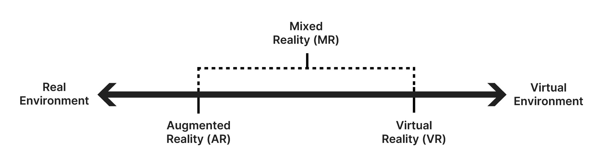

# What's AR

## 1. AR 技术简介

### 1.1 AR 概念

增强现实(Augmented Reality，AR)

>以下概念摘自 微软 Dynamics 365

增强现实是现实环境的增强交互式版本，采用全息技术通过数字视觉元素、声音和其他感官刺激而实现。

特点：
* 数字世界和现实世界的结合
* 实时进行的交互
* 虚拟对象和真实对象的准确 3D 标识

### 1.2 相关技术

* 增强现实 (AR) - 旨在通过有限的交互在现实环境视图上添加数字元素。
* 虚拟现实 (VR) - 一种沉浸式体验，通常通过专为此类活动设计的头戴显示设备和耳机，将用户从现实*环境抽离出来。
* 混合现实 (MR) - 融合了 AR 和 VR 元素，以便数字对象可以与现实环境交互，这意味着企业可以设计定位在现实环境中的元素。
* 扩展现实 (XR) - 涵盖用于增强我们的感觉的所有技术类型，包括前面提到的三种类型。

### 1.3 增强现实的类型

在确定需要为您的业务选择哪种类型的 AR 技术时，必须首先确定要使用哪种 AR。增强现实有两种类型：基于标记的和无标记的。

选择其中一种 AR，将决定您能够以何种方式显示图像和信息。但在一个应用中，通常还可以将各种技术混合使用，如何达到最佳效果，取决于使用技术的人

### 基于标记的 AR

使用图像识别技术创建，可标识已通过编程方式加入到您的 AR 设备或应用程序中的对象。当将这些对象作为参考点放置到视图中时，它们可以帮助您的 AR 设备确定相机的位置和方向。而实现这一功能的方法，通常是将相机切换到灰度图像并检测标记的位置，然后将该标记与信息库中的所有其他标记进行比较。在您的设备找到一个匹配项之后，它将使用这些数据以数学方法确定形态，并将 AR 图像放置到正确的位置。

* 2D 识别 ：基于2D图形的识别
* 3D 识别 ：基于3D模型的识别
* 人脸 等实体识别：基于机器学习、人工智能

### 无直接可视标记 AR（基于地理位置的 AR）

更为复杂，因为没有可供设备对焦的点。因此，您的设备必须在相关对象一出现在视图中时就将其识别出来。利用识别算法，设备将查找颜色、模式和相似特征以确定该对象是什么，然后使用时间、加速计、GPS 和指南针信息，对自身进行定位，并使用相机将所需内容的图像叠加在现实环境中。

### 1.4 增强现实的工作方式

尽管最常见的 AR 形式是通过眼镜或相机镜头呈现的，但随着社会对 AR 的关注度不断提高，很多企业在市场中推出了更多类型的镜头和硬件。AR 有五个重要的组成要素：

* AI 人工智能。大多数增强现实解决方案需要人工智能 (AI) 才能正常工作，并允许用户使用语音提示完成操作。此外，AI 还可以处理您的 AR 应用程序的信息。
* AR 软件。这些是用于访问 AR 的工具和应用程序。某些企业可以根据自己的要求创建相应形式的 AR 软件。
* 处理。您需要具备相应的处理能力才能使 AR 技术正常工作，通常可利用设备的内部操作系统。
* 镜头。您将需要镜头或图像平台来查看您的内容或图像。屏幕质量越好，显示的图像就越真实。
* 传感器。AR 系统需要获取有关其环境的摘要数据，以使现实世界与数字世界保持一致。当您的相机捕捉到信息时，它会通过软件发送信息以进行处理。

### 1.5 AR 适用行业

早在12年前，adidas 推出了和鞋相关的 AR 游戏：https://www.youtube.com/watch?v=FMncEo7mV9k

现金，更多的行业和领域已将 AR 用于业务流程，包括但不限于：

* 游戏：Pokemon go、一起来捉妖 https://www.youtube.com/watch?v=puXEvswTHo4 、集五福、https://www.youtube.com/watch?v=tQGRKKCjbhY
* 教育培训：AR 绘本、AR 字典、AR 教材等，现场实体 AR 演示
* 零售业：https://www.youtube.com/watch?v=Drt76l25ckY
* 制造业：员工培训、施工辅助、设计辅助
* 医疗保健：医疗培训、手术等操作辅助、医患沟通讲解辅助 等
* 军事：小到智能望远镜、大到 飞机、坦克、无人机等驾驶辅助&信息增强
* 汽车：驾驶辅助（如 AR 导航、危险提醒）、自动驾驶 AR 显示

### 1.6 AR 硬件

任何带有摄像头的电子产品，都可以作为 AR 硬件来使用

重点关注： AR 眼镜、MR 眼镜（头显）

**AR 眼镜的普及** 会成为一个新的技术转折点，成为可佩戴设备全面取代传统手持便携设备（手机、平板）的转折点。

这个过程的影响&冲击力可以参考：智能手机 替代 传统功能机 的过程

除了硬件替换外，所有的终端软件都需要更新换代，AR 应用开发会成为一个新的热门行业（类比10年左右的手机开发岗位热度，万元月薪、一人难求）。

* Google AR glass：https://www.youtube.com/watch?v=3lf0tzqHXMY
* MicroSoft Hololens 2 : https://www.youtube.com/watch?v=qKVKpvZym40
* Apple Vision Pro : https://www.youtube.com/watch?v=TX9qSaGXFyg
* xiaomi: https://www.youtube.com/watch?v=_B5Zgyq4EfM
* Nreal 
* 其他：https://www.youtube.com/watch?v=HLfcx7-_31s ， https://www.youtube.com/watch?v=HuOBRJmxhHk

## 2. AR 和 MR / XR 的关系

AR 是更广泛的扩展现实( XR )类别的一部分，扩展现实 XR 是一个涵盖 AR、VR（虚拟现实）和 MR（混合现实）的总称.

* VR用虚拟的视野取代了用户的整个视野​​。这与 AR 不同，在 AR 中，您仍然可以看到周围的环境，但顶部有虚拟内容。查看使用 Unity 制作的 VR 项目的一些示例。
* MR是这三个术语中最广泛的术语，因为它可以包含 AR 和 VR 的元素。最有帮助的做法是沿着现实-虚拟连续体来思考 AR、MR 和 VR，一端是真实的物理环境，另一端是完全虚拟的环境。

> 参考资料：
>
> [微软 Dynamics 365 Guides](https://dynamics.microsoft.com/zh-cn/mixed-reality/guides/what-is-augmented-reality-ar/)