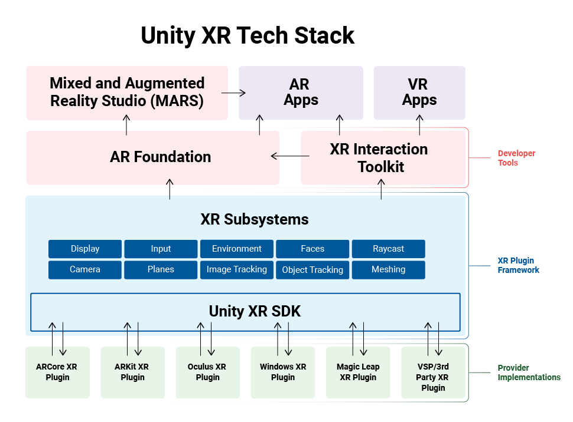
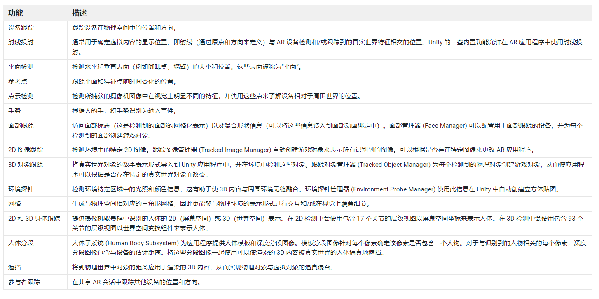

# Unity 中 AR 开发简介

## 1. Unity AR Foundation 

因为厂家不同，不同硬件、不同系统的底层 AR 库都不同，为了让自己的 AR 库支持更为广泛，Unity 设计了统一的接口，在原有各厂商的 AR 库之上，又增加了一层，称为：Unity AR Foundation 

AR Foundation (自 Unity 2019.3 加入) 允许您在 Unity 中以多平台方式使用增强现实平台。

## 2. 优缺点

### 优点

* 统一开发接口，易于学习
* 统一编程，尽可能少的改动后，就能发布到不同平台
* 支持主流硬件设备

### 缺点

* 多了不止一层抽象，性能上肯定比不了原生的

## 3. AR Foundation 功能列表

## 4. 各平台功能列表

AR Foundation 不会自行实现任何 AR 功能，是否能实现具体功能，还得看原生平台是否支持

## 5. Unity XR SDK

Unity XR SDK 面向想要开发自己的与 Unity 一起使用的 XR 提供程序的专业用户。

也就是说，如果你是硬件厂商，或者自己开发了一套面向底层硬件的 AR 库，可以通过 XR SDK 接入 Unity。以后用户就可以直接使用 Unity AR Foundation ，来创建针对你这套 AR 库以及相应硬件的 AR 应用了。

> 参考资料：
>
> * [Unity XR 官方文档](https://docs.unity3d.com/cn/2023.1/Manual/AROverview.html)