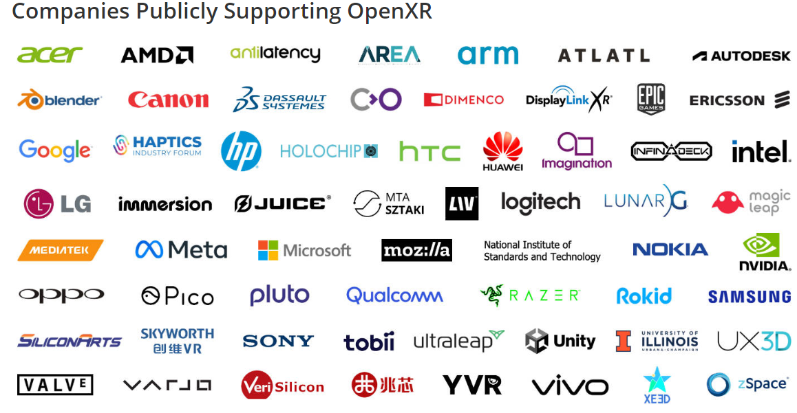

# 不支持ARCore的 Android 设备解决方案

## 1. 测试是否支持 ArCore

要测试您的设备是否支持ARCore，有两种方案：

* 可以从Google Play商店下载ARCore应用程序并在设备上运行它。该应用程序将告诉您您的设备是否与ARCore兼容。
  下载页面：[https://developers.google.com/ar/develop/downloads?hl=zh-cn](https://developers.google.com/ar/develop/downloads?hl=zh-cn)

  不能下载的小伙伴可以到我的网盘:https://pan.xunlei.com/s/VNWtb9_-frEIUtHkEdpmV72BA1?pwd=2d3a# 提取码：2d3a

* 也可以在ARCore网站上检查支持ARCore的设备列表。[https://developers.google.com/ar/devices?hl=zh-cn](https://developers.google.com/ar/devices?hl=zh-cn)

## 2. 使用替代库

可以使用的跨平台（Android/iOS 通用）替代库有很多，这里只列举出几个较为常用的作为示例

### 2.1 OpenAR / OpenXR 

官网：[https://www.khronos.org/openxr/](https://www.khronos.org/openxr/)

这个 SDK 不同于其他 SDK ，它是朝着行业规则的方向去的。类似于协议，比如 HTTP，ECMA Script (Javascript 的标准)

OpenXR“ OpenXR ” 旨在标准化各种 VR / AR 平台上的设备和应用程序之间的规范。它由 Khronos Group 制定，Khronos Group 是一个由 VR/AR 相关公司组成的组织.微软、HTC等多家公司都参与了，Valve（SteamVR）也在2021年2月支持。

OpenXR
“ OpenXR ” 旨在标准化各种 VR / AR 平台上的设备和应用程序之间的规范。

它由 Khronos Group 制定，Khronos Group 是一个由 VR/AR 相关公司组成的组织，

出现较早，本意是想最第三方标准组织一统江湖，但大公司并不买账

* 优点：支持的硬件厂商多，而且，只要是 OpenAR 中有的功能，基本上所有硬件都可以实现
* 缺点：因为要成为整个AR行业标准，兼容性为首选，所以发展较慢。特别是比如地理位置支持等，新特性收录较慢

### 2.2 Vuforia

据说是世界上企业用户量最高的 AR 技术服务商，公司最大，母公司PTC，技术体系架构最先进，商用工业化 AR SDK 首选（TO B）。

在跟踪功能上，世界顶尖，比如物体识别和扩展跟踪

### 2.3 HUAWEI AR Engine

官方文档：AR Engine是一款用于在HarmonyOS/Android上构建增强现实应用的引擎。包含AR Engine服务、AR Cloud服务与XRKit服务，其中XRKit是基于AR Engine提供场景化、组件化的极简AR解决方案，二者均可实现虚拟世界与现实世界的融合，带来全新的交互体验。

华为 AR Engine 虽然还未冲到世界前几位，不过根据最近的发展态势，未来可期

缺点：只支持华为和荣耀的硬件，其他品牌暂不支持；暂时还没有支持 unity AR Foundation 的包，只支持原生开发，虽然在两年前的 华为 ar engine 发布介绍中，就已经说要马上推出.....

不过现在 华为 VR Engine 倒是有 Unity 的支持包

### 2.4 EasyAR

国内的 AR SDK ，少部分开源，由最开始的全部开源到现在的部分开源 + 商业化云服务，发展势头很猛。也在和国内一些 AR 硬件厂商合作，作为Ardroid 设备上的 ARCore 替代方案，以免到时跟华为手机一样被 Google ban 了。

* 优点：国产
* 缺点：免费版限制太多，除了水印外，居然限制摄像头时间为 100 秒；另外，惨不忍睹的官方文档，增加太多的学习困难，对开发者十分不友好

### 2.5 Wikitude

高通的 AR 库，主要面向的是娱乐和用户应用（TO C），更专注于消费者用例

相较于 Vuforia，Wikitude 更注重图像识别和基于地理位置的 AR 服务

### 2.6 其他

AR 是未来发展趋势，从十几年前开始，就有成百上千家公司前赴后继冲入这个赛道，每个大公司就本上都有自己的 AR SDK，除了上面咱们列出的使用量较大的这几个之外，还有很多 AR SDK，不过就用户量来说，除非你接到对应的业务，暂时都没有学习的需要。

现在整个 AR 产业，还处于战国时代，等统一的规则出来后，才能迎来更大的发展。
