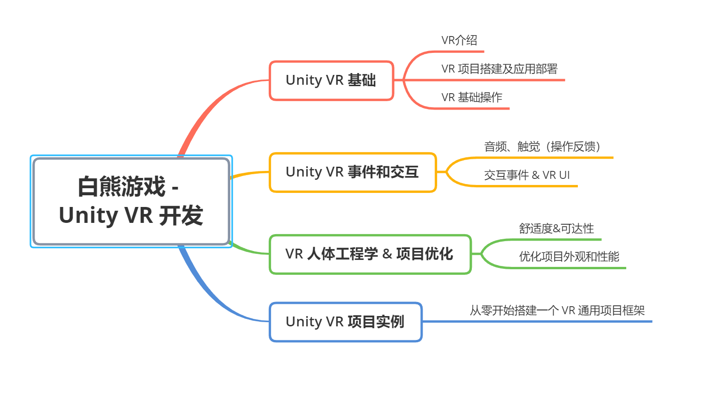
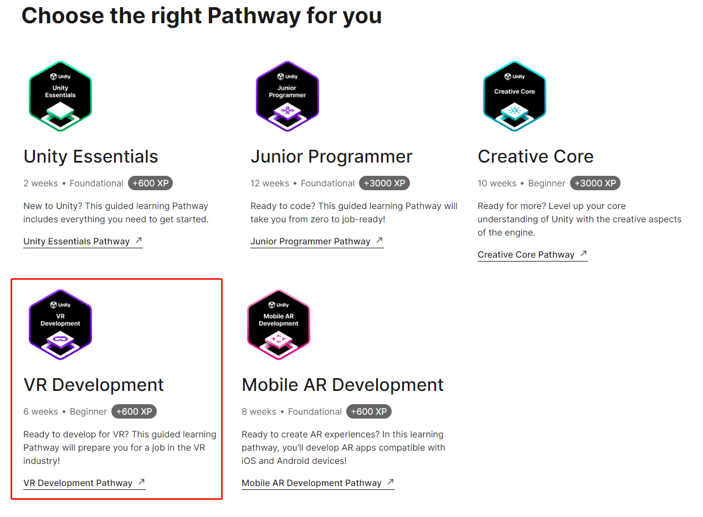

# 课程体系

## 0. 前置技能 & 前置课程

* 需要有 Unity 3D 游戏开发的基本能力
* 建议把入门系列看一遍：https://space.bilibili.com/43644141/channel/collectiondetail?sid=616419

## 1. 课程架构

见下图：

## 2. 设计方案及特点

* 结合官方 VR 学习路径
  
* 更新版本：官方教程中用的 Unity，以及 XR 库版本太旧，在此更新为最新的
* 提升内容质量：结合官方文档、官方教程、技术博客，以及其他网站的技术博客、YouTube 教程，力求内容做到最好

说白了，就是借鉴官方教程中，设计的非常合理的学习路线+知识点，但更换成更好、更新、更完善的内容。

## 3. 课程难度

* 入门级 + 中级前半段水平
* 学完后，能独立开发一个小型 VR 应用

## 4. 关于设备

课程中用到的设备，是很多同学关心的重点，我手头有两个，都会给大家讲。

另外，无VR设备的也不用怕，一样可以学习

* PICO 
* Quest 2 
* 没设备照样可以学，也可以测试，Unity 官方自带有模拟器，有电脑就行