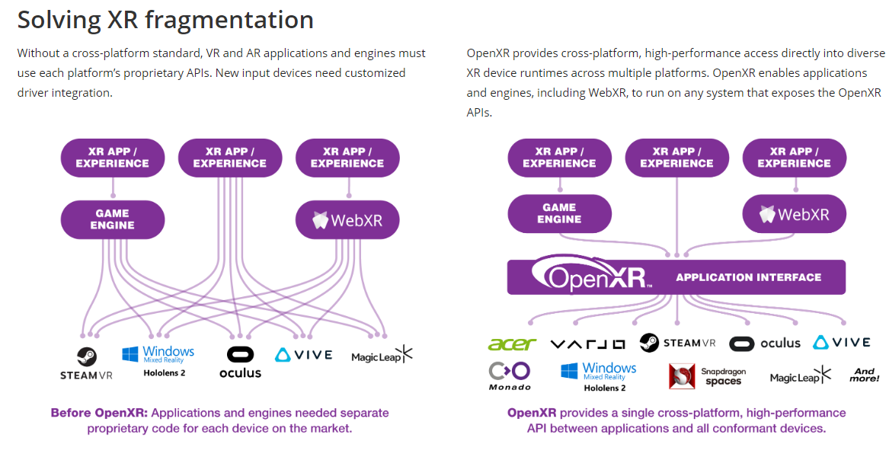
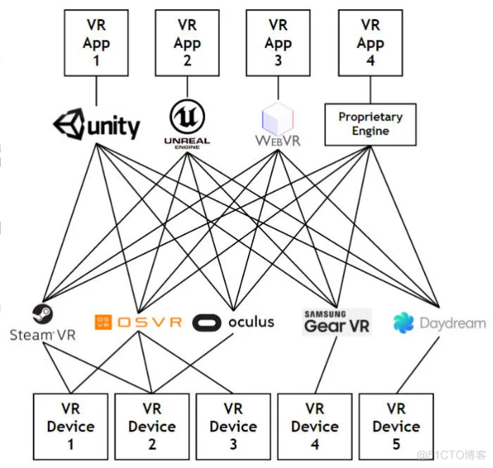
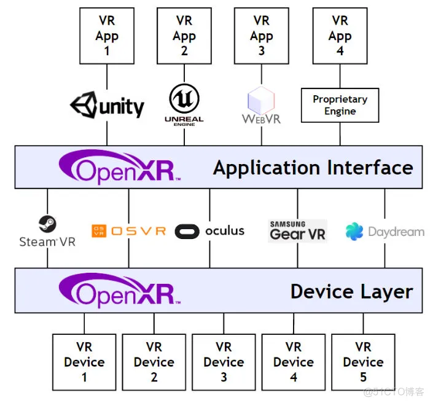

# VR 简介

## 1. 什么是 VR

虚拟现实（英语：virtual reality，缩写VR），简称虚拟环境，是利用电脑模拟产生一个三维空间的虚拟世界，提供用户关于视觉等感官的模拟，让用户感觉仿佛身历其境，可以即时、没有限制地观察三维空间内的事物。用户进行位置移动时，电脑可以立即进行复杂的运算，将精确的三维世界影像传回产生临场感。该技术集成了电脑图形、电脑仿真、人工智慧、感应、显示及网络并行处理等技术的最新发展成果，是一种由电脑技术辅助生成的高技术模拟系统。（摘自维基百科：[虚拟现实-维基百科](https://zh.wikipedia.org/zh-my/%E8%99%9A%E6%8B%9F%E7%8E%B0%E5%AE%9E)）

特点：沉浸体验

沉浸理论（Flow theory）在1975年由Csikszentmihalyi在其著作Beyond Boredom and Anxiety[20]中所提出，其书中解释为何当人们在进行某些日常活动时会完全投入情境中，并过滤掉所有不相关的感知与其它可能与外界产生的交互行为，此时参与者的感觉系统以一种与在真实环境中相同的方式来处理来自虚拟世界的视觉、听觉、触觉、嗅觉及味觉等感知行为。

有研究指出[21]人们常会运用五感来做为非语言的消息交流方式处理外界信息，而五感中的视觉约占83%、听觉约占11%、其他触觉、嗅觉及味觉则会小于6%，因此也造就许多虚拟游戏系统的硬件设备皆以视觉刺激来触发参与者的沉浸感为主。

目标：《头号玩家》中描述的技术

最新技术代表：Apple Vision Pro 2300万像素 单眼超 4K 刷新率 90Hz，3499 美元，将于 2024 年第一季度在 Apple 官网和全美 Apple Store 实体店发售。

影响 VR 体验效果的两个核心参数：分辨率（单眼12k+） & 刷新率（120 Hz 以上）

## 2. VR 开发

### 2.1 VR 相关岗位发展

* 所有和3D游戏/软件开发相关的岗位
* VR/MR 交互设计
* VR/MR 开发

未来的一个发展方向，AR / VR 开发之间的界限会越来越模糊，统一由 MR 替代，例如 Apple Vision Pro 的体验。

Apple Vision Pro 的推出，会极大刺激其他厂商，在 VR、AR、MR、XR 的人才争夺上，今年会是一个爆发点。

根据以前智能手机的崛起经历（2007年 apple 推出 iphone，之后到15年之前，各公司都在争抢 app 开发人员，16年才取向供需平衡），在这个方向，至少能火8-10年，人才才会取向供需平衡，在此之前，人才都会紧缺

### 2.2 VR 开发软硬件需求

现代 VR 设备，进行开发时需要3个重要元素：软件引擎（通常是游戏引擎，如 Unreal 、 unity ），VR 库（如 Open XR），以及头显设备（如 Oculus 等）

不过仅仅学习系列课程的话，没有 VR 眼镜照样也可以，只不过少了最终体验，整个开发过程并不受影响

## 3. Unity XR 架构 以及和 Open XR 的关系

### 3.1 What's Open XR

openxr官网：[https://www.khronos.org/openxr/](https://www.khronos.org/openxr/)

OpenXR是 XR 应用程序的 API（应用程序编程接口）。XR是指计算机通过人机交互生成的真实与虚拟组合环境的连续体，包括与虚拟现实（VR）、增强现实（AR）和混合现实（MR）相关的技术。

OpenXR是一套由Khronos Group发起，联合多家行业头部公司一起制定的开放标准，旨在解决XR平台碎片化的问题，同时简化AR/VR软件的开发。对于开发者来说，基于此标准进行XR应用程序的开发，能够使应用程序覆盖更广泛的硬件平台，同时无需移植或重新编写代码；而对于支持OpenXR的硬件平台厂商来说，能够在产品发布时即可拥有可运行在其上的大量内容。

下图左侧为引入OpenXR标准之前的行业现状——VR/AR应用程序和引擎必须使用每个平台独有的SDK和API，新的设备同样需要特定的驱动程序。而在引入OpenXR标准以后，将统一由OpenXR提供的跨平台高性能的应用程序接口与众多XR硬件平台进行交互，如下图右侧所示。

支持 OpenXR 的公司：

更详细一些的图：  
没有统一标准之前：  

有了 OpenXR 统一标准之后：  

好的行业标准：
* 拯救程序员
* 让行业发展更快

### 3.2 Unity XR 架构

下图说明了当前 Unity XR 插件框架结构以及它如何与平台提供商实现配合使用：

假如，你是三体人的软件工程师，要为三体人设计一个跟任何地球人沟通的应用，就可以套用 Unity XR 的技术架构：

* 从上到下，首先是三体人能够直接使用的心灵软件，对应的就是 VR Apps
* 三体人的心灵信息，通过交互工具，转换成三体人的电子设备能够理解的信息，这个交互转换工具就是第二层里的 XR Interaction Toolkit（主要管输入）
* 你的软件想要做的很好，就要具备全面的功能，不单可以转换三体人的心灵信息为文字，还能转换为声音、图像等，所以要有很多功能模块，来实现各自不同的需求，这个就相当于第三层： XR SubSystems
* 接下来，要有一个统一的语言驱动机制，将功能和最终的硬件项结合，使功能在硬件上实现，这个就是 Unity XR SDK （软件功能的硬件驱动）
* 据维基百科上的数据，人类有5000-7000种不同的语言，要想让你的软件能够在地球上畅通无阻，就要分别为不同的语言，设计不同的插件，然后统一接入 Unity XR SDK，来实现功能。这就是最后一层，对不同硬件的 XR Plugin(插件)

### 3.2.1 unity XR 子系统（XR SubSystem）

  定义了 XR 功能的通用接口。XR插件实现这些子系统接口以在运行时向子系统提供数据。您的 XR 应用程序可以通过 Unity 引擎和包 API 访问 XR 功能的数据。

  简单来说，XR SubSystem 包含了实现各种实际功能的通用接口，我们的 Unity XR 应用，在使用这些接口时，代码只需要书写一次，就可以发布到不同厂商的设备上

### 3.2.2 Unity XR SDK

XR SDK 包允许多个不同厂商硬件后端（称为“提供者”）在 Unity 中实现XR引擎的具体功能（称为“子系统”）。用户应用程序可以在运行时选择并激活提供程序（针对自己的应用要运行的不同硬件）。

### 3.2.3 Unity XR 提供者插件框架（XR provider plug-in framework）

  XR 提供程序插件是一种支持一个或多个 XR 设备平台的 Unity 插件。  
  
  例如：ARCore插件支持Android增强现实手持式 Android 设备上的平台，而 OpenXR 插件支持多个操作系统上的多个 XR 设备。

  XR 提供程序插件实现 Unity XR SDK 定义的接口。这些接口称为子系统。实现一个或多个子系统的插件称为提供者插件。通常，提供程序插件使用设备平台的本机库来为其设备实现 Unity 接口。

  Unity 使用子系统接口与各种平台的提供者进行通信，为应用程序的 XR 功能提供支持。由于这些接口，您可以在具有该功能提供程序的所有 XR 设备上重复使用应用程序中的相同功能代码。

Unity XR 系统架构中使用的接口，是按照 OpenXR 标准设定的，所以可以无缝衔接各个不同硬件厂商的产品

### 3.3 OpenXR unity plugin

OpenXR Plugin是Unity开发的符合OpenXR标准的工具包，旨在让Unity开发者尽可能高效地将内容部署到更加广泛的XR目标平台上。

通过 OpenXR Unity Plugin ，去管理、挂接不同公司 VR硬件 的驱动包。

最新版官方文档：[OpenXR Plugin official doc](https://docs.unity3d.com/Packages/com.unity.xr.openxr@1.8/manual/index.html)

> 参考资料：
> * [https://blog.51cto.com/yyyy/5262577](https://blog.51cto.com/yyyy/5262577)
> * [https://www.unitymake.com/archives/unity/unity_technologyshare/348](https://www.unitymake.com/archives/unity/unity_technologyshare/348)
> * [https://blog.csdn.net/qq_16206535/article/details/127258942](https://blog.csdn.net/qq_16206535/article/details/127258942)
> * [Unity XR 官方文档](https://docs.unity3d.com/2023.2/Documentation/Manual/XR.html)
> * [OpenXR 官方文档](https://www.khronos.org/openxr/)

