# PicoVR 项目搭建

## 0. unity 组件

一般来说，VR 一体机开发，只需要安装 Android 组件即可，如下：

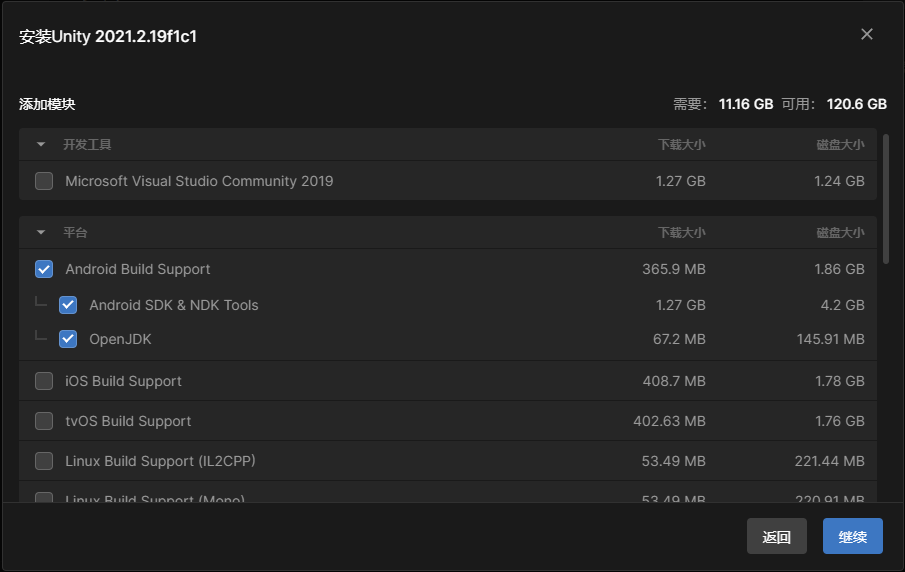

## 1. Pico 资源

在 Pico 官方网站上，进入开发者页面：[https://devcenter.pico-interactive.com/](https://devcenter.pico-interactive.com/)

* 可以在其中下载 SDK ，
* 也可以注册并称为开发者，
* 登录开发者管理平台，创建应用，并发布到 Pico 市场。

### 1.1 下载 SDK

SDK 下载页面 [https://developer.pico-interactive.com/sdk](https://developer.pico-interactive.com/sdk) ，有适合不同游戏引擎的各版本 SDK 以及一些开发工具的下载链接

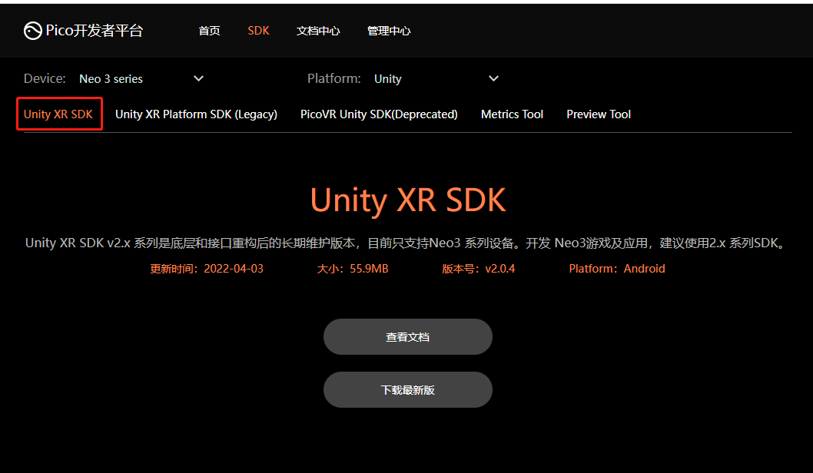

此页面中，还包含 SDK 文档链接

## 2. 新建项目并导入 SDK

* 新建普通3D项目即可，URP项目、VR项目也可以；
* 用 Package Manager 导入解压的 SDK 包
    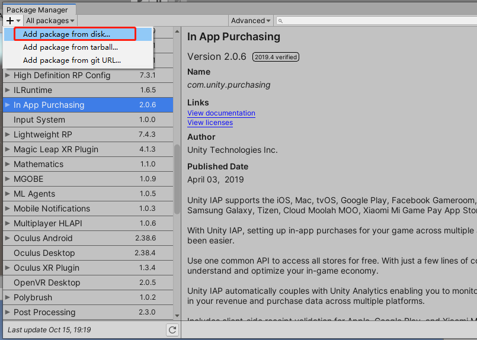

    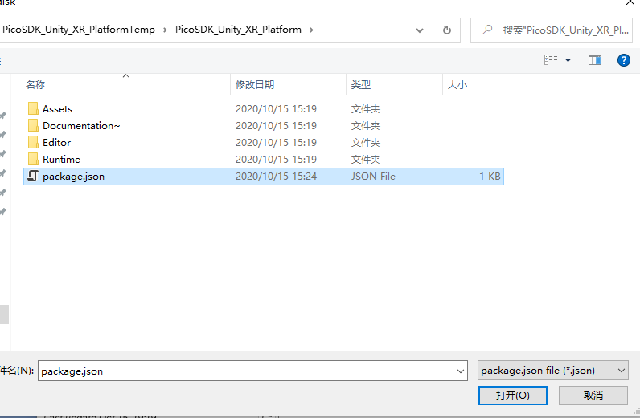

## 3. 项目设置

* 进入Project Settings页面， 在XR Plug-in Management页面选择PicoXR，在PC和Android分页上都要选择，一个用来开发，一个用来发布（测试）

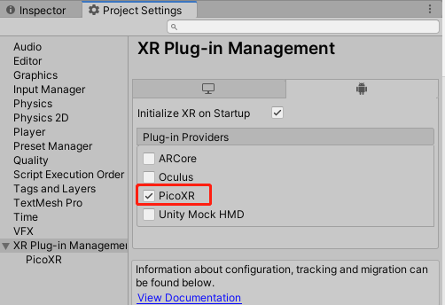

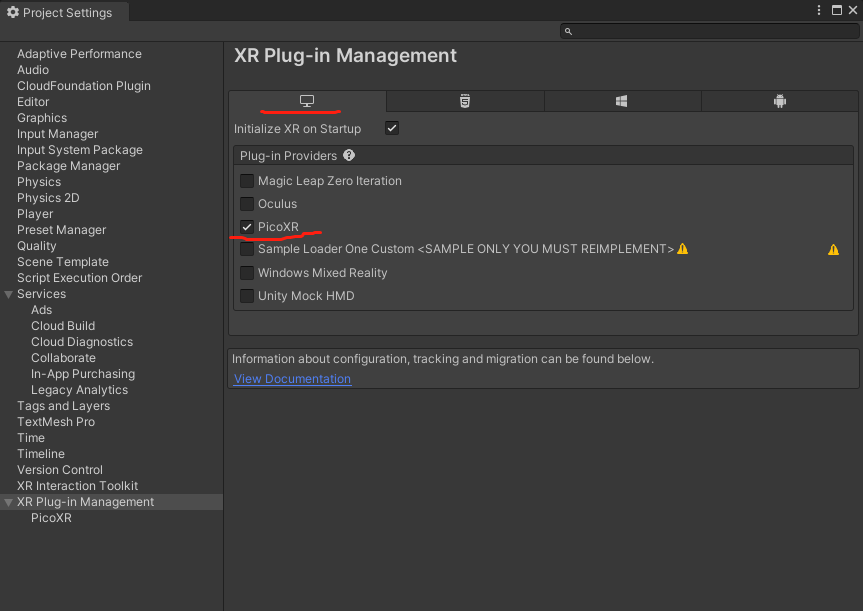

项目设置中，有一些要注意的点：

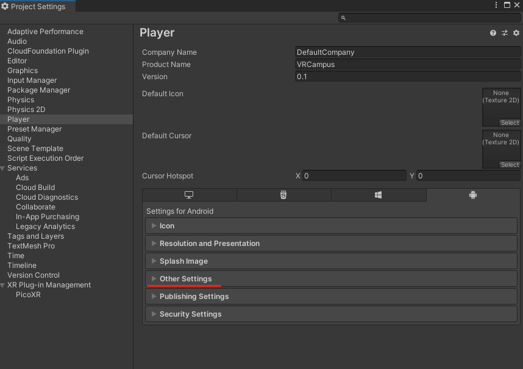

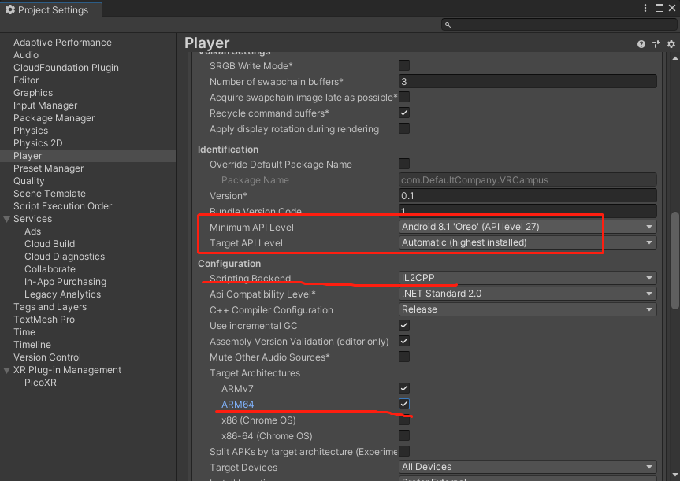

如果想要项目同时支持 Oculus，只需要在上面两个界面中，勾选 Oculus 复选框即可

## 4. 更新包

更新 XR Interaction Toolkit，并安装 sample

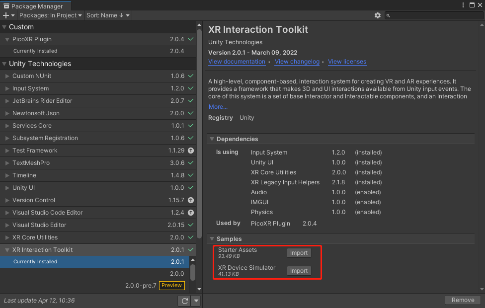

> 注意：
> * 如果不更新 XR Interaction Toolkit ，Pico UnityXR SDK 2.0.4 配套的 XR  Interaction Toolkit 版本仅为 0.94，太低了，很多功能比完善，而且还没有示例代码，许多东西要自己写，对初学者太不友好。关键是 pico sdk 的开发文档太TMD的差劲了，没有VR开发经验的用起来是两眼一抹黑

## 5. 输入相关设置

安装完 sample 后，可以在 Assets/Sample/版本号/XR Interaction Toolkit /Starter Assets/ 中找到已经设置好的输入设置文件（基于新版输入系统 inputsystem）

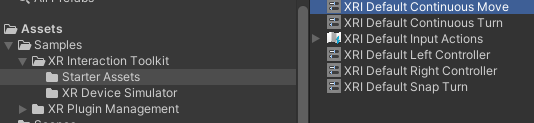

点选每一个输入预设置文件，点击 inspector 窗口中的 Add to ActionBased操作名称Provider Default ，即将当前输入设置指定为当前对应操作的默认输入设置。

五个都要依次点击：持续转向、持续移动、突然转向、左控制器、右控制器

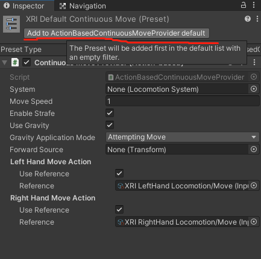

最后，要在 project settings/ Preset Manager 中，设置那个左右控制器的筛选名称：

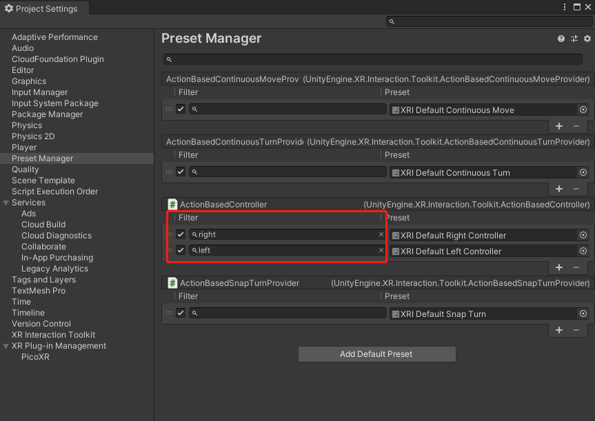

## 6. 添加基本操作对象

* 步骤1：添加一个平面，命名为 Ground，作为以后项目中的地平面
* 步骤2：添加一个 XR_Origin(Action Based)对象到 Hierarchy 中  
    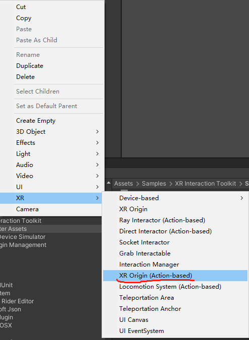

这将同时添加一个 XR Interaction Manager 到 Hierarchy 中， XR Origin 的子对象如图：  
  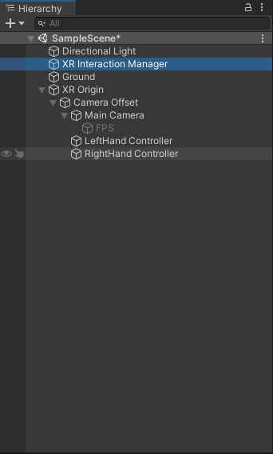

这样设置后，已经可以控制左右手柄（left & right controller）和头显（HMD）的移动了

## 7. 运行、测试

先进行编译设置： 

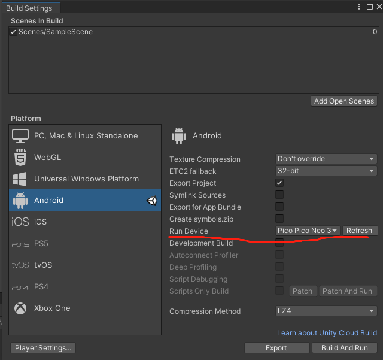

### 7.1 编译运行 build & run

首先必须进行Pico 眼镜和电脑的有线连接，然后：

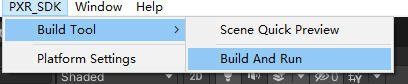

点击菜单栏 PXR_SDK > Build Tool > Build And Run 就可以进行编译并运行到 Pico 设备上。

缺点：时间较长，我的中档配置的 PC ,跑上面这个最基础的 VR 空项目，也需要5、6分钟

### 7.2 使用 Pico Preview Tool

为了弥补上面那种方式浪费时间的缺点，pico 退出了 Pico Preview Tool ，这个工具可以让 pc 和 HMD 互联，类似于 Oculus 的 linked，直接通过 Unity 中的运行按钮，就可以将测试应用直接发送并运行到 HMD 中，省去 Build 的时间。

官方下载地址：[Pico Preview Tool](https://developer.pico-interactive.com/sdk/index?id=17&device_id=1&platform_id=1)

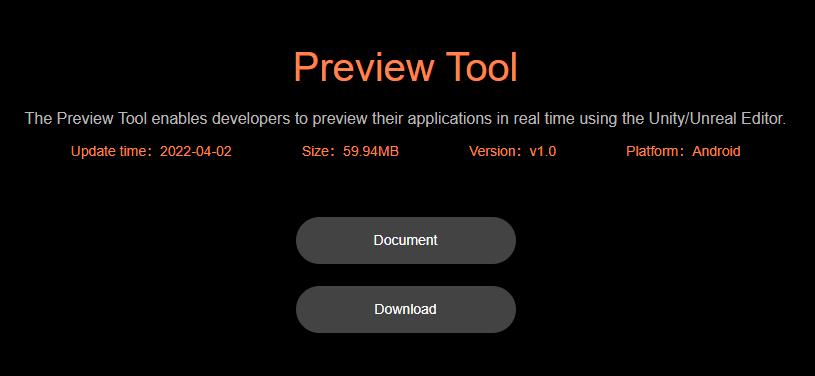

PC 端运行PC的（现阶段只有windows 版的），HDM 上安装运行 Android 的

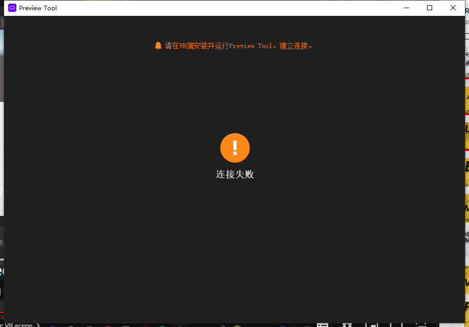

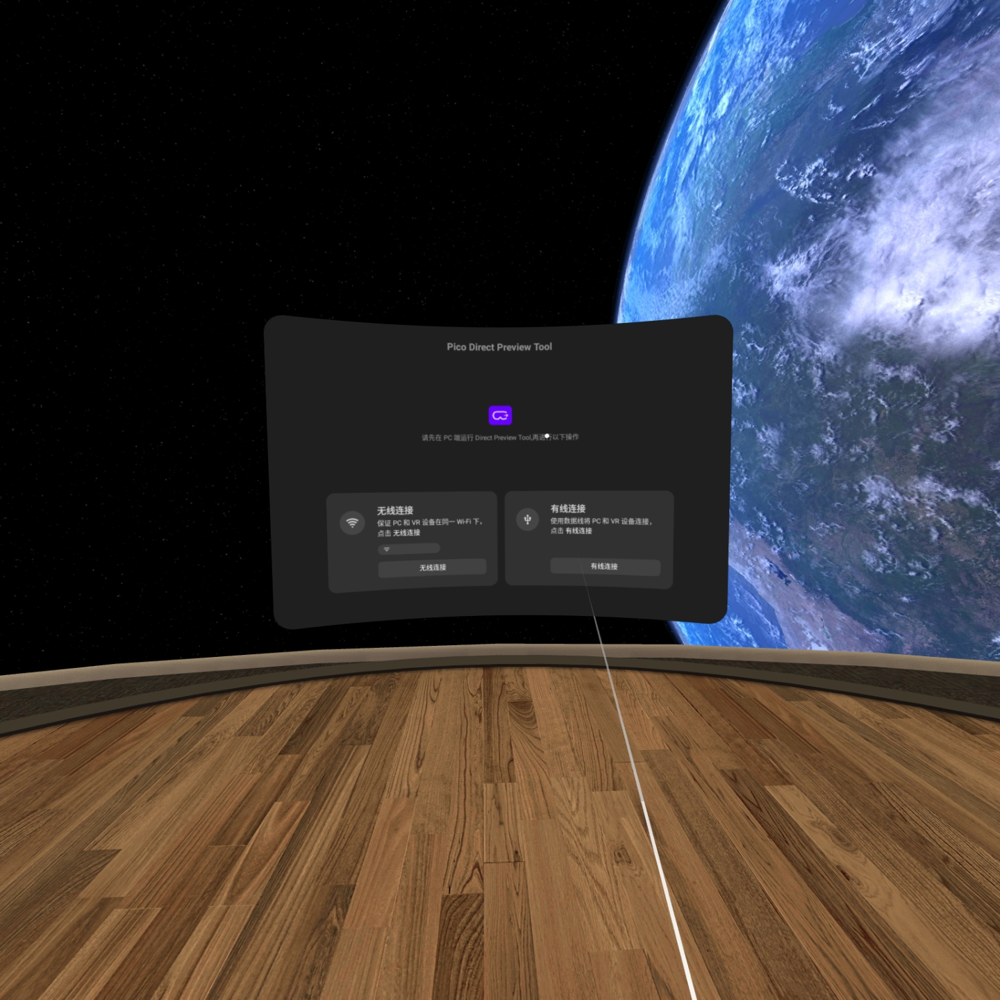

这个工具在我的机器上并不稳定，无法使用有线连接，但可以用无线连接

一旦连上，在 Unity 中，直接点击运行按钮，就可以在 Pico 眼镜上看结果了

当前项目只有两个控制器的红色射线，以及头显的移动控制。

> 参考资料：
>
> [Pico 官方文档](https://developer.pico-interactive.com/document/doc)