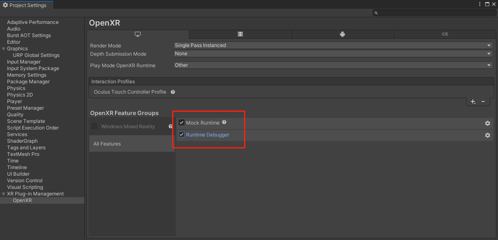

# Unity 中使用 VR 模拟操作

> 本篇分两部分：
> 1. 介绍如何从0开始搭建一个 Unity VR 项目
> 2. 如何通过鼠标键盘，模拟 VR 头显及手柄的操作，适合简单测试，或者手边暂时没有 VR 硬件设备的小伙伴

## 1. 从零开始搭建一个 Unity VR 项目

可以参考 Unity 官方教程 ：[Create a VR Starter Project from Scratch](https://learn.unity.com/tutorial/create-a-vr-starter-project-from-scratch)

### 1.1 创建一个 3D URP 项目

* 打开 Unity Hub
* 新建项目，填上项目名称，选择位置
* 不要启用版本管理，容易出错
* 选择 3D（URP）模板，如果没有，也可以使用 3D 模板，然后通过包管理器，安装 URP 包

### 1.2 安装 VR 开发需要的环境

* Edit > Project Settings.
* 在左下方选择  XR Plugin Management，打开面板，在右侧，选择 install XR Plugin Management
* 安装 OpenXR 包：
  
  会弹出警告，是否重启以安装新版的输入系统，选择 yes
* 重启后，还需要处理一下警告：
  
  在途中，点击 fix all 即可
* 左侧选中 open XR ,按图中指示，添加至少一个vr硬件品牌的交互档案：
  
  我们后面可以并不使用这个设备，但如果不添加的话，会一直报错
* 然后，将所有的 openxr feature groups 中的选项打开：
  

> 注意，如果使用其他的硬件设备，上面的步骤选择对应的品牌即可，方式一样。如果 unity 自带的那些 VR 硬件品牌没有你需要的，比如 PICO ，请看下一篇文章，我会单独介绍

如果出现一些不能解决的问题，可以先去查看官方文档 ：[OpenXR plugin](https://docs.unity3d.com/Packages/com.unity.xr.openxr@1.8/manual/index.html)
