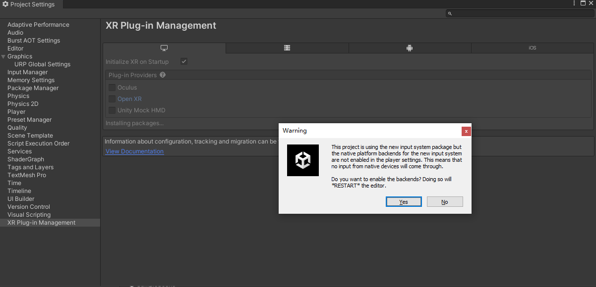
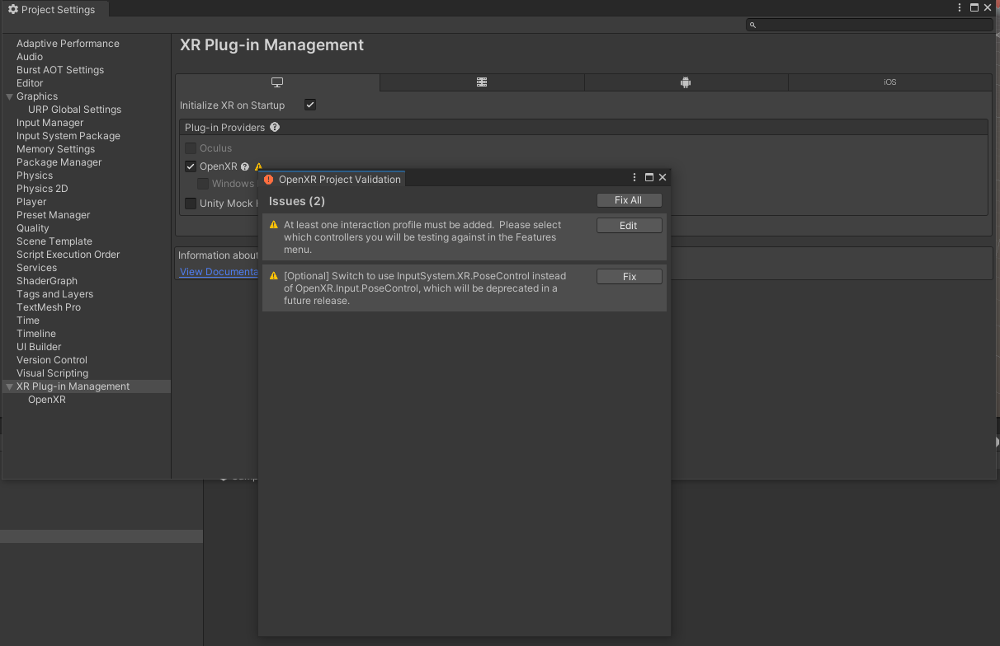
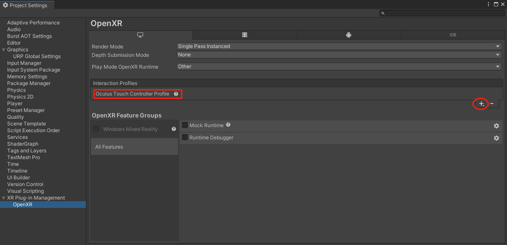
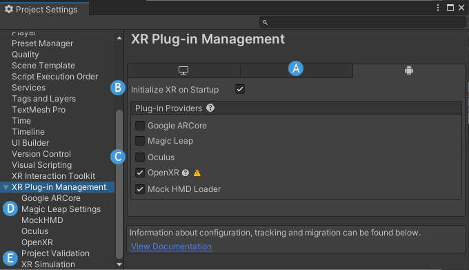
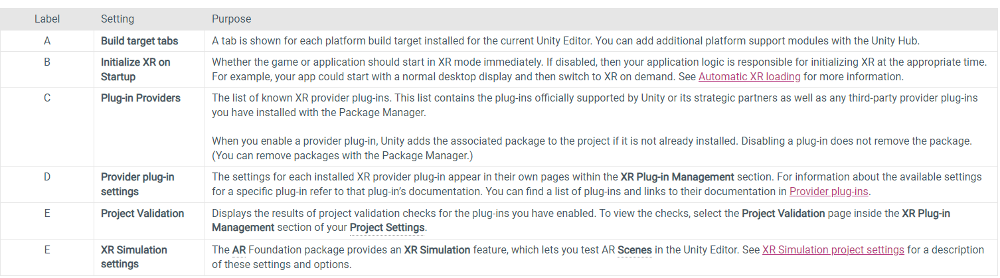
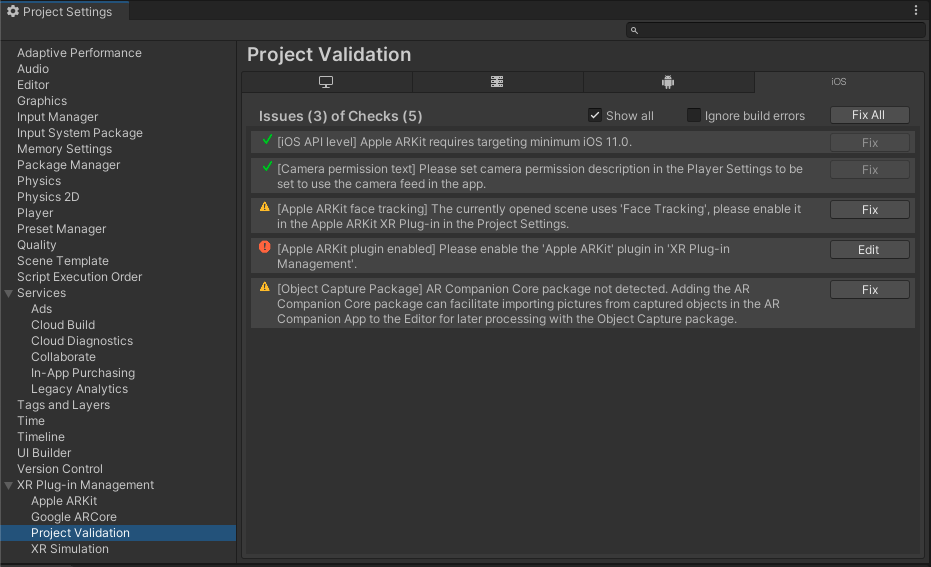
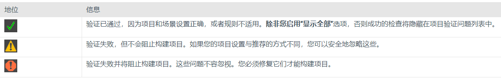
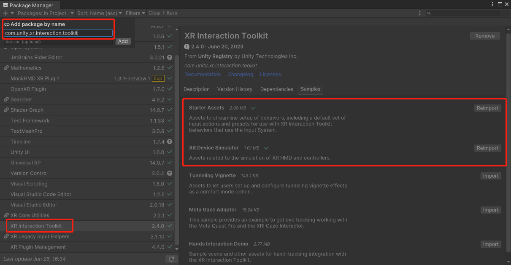

# Unity 中使用 VR 模拟操作

> 本篇分两部分：
> 1. 介绍如何从0开始搭建一个 Unity VR 项目
> 2. 如何通过鼠标键盘，模拟 VR 头显及手柄的操作，适合简单测试，或者手边暂时没有 VR 硬件设备的小伙伴

## 1. 从零开始搭建一个 Unity VR 项目

主要包含三大步骤：
* 使用 XR plugin Management 管理设置，用于启用和配置项目支持的 XR 设备和平台所需的插件
* 添加XR支持包，例如XR 交互工具包
* 创建场景，添加组件&游戏对象，设计游戏功能、逻辑

可以参考 Unity 官方教程 ：[Create a VR Starter Project from Scratch](https://learn.unity.com/tutorial/create-a-vr-starter-project-from-scratch)

### 1.1 创建一个 3D URP 项目

* 打开 Unity Hub
* 新建项目，填上项目名称，选择位置
* 不要启用版本管理，容易出错
* 选择 3D（URP）模板，如果没有，也可以使用 3D 模板，然后通过包管理器，安装 URP 包

### 1.2 安装 VR 开发需要的环境

* Edit > Project Settings.
* 在左下方选择  XR Plugin Management，打开面板，在右侧，选择 install XR Plugin Management
* 安装 OpenXR 包：
  
  会弹出警告，是否重启以安装新版的输入系统，选择 yes
* 重启后，还需要处理一下警告：
  
  在途中，点击 fix all 即可
* 左侧选中 open XR ,按图中指示，添加至少一个vr硬件品牌的交互档案：
  
  我们后面可以并不使用这个设备，但如果不添加的话，会一直报错

> 注意，如果使用其他的硬件设备，上面的步骤选择对应的品牌即可，方式一样。如果 unity 自带的那些 VR 硬件品牌没有你需要的，比如 PICO ，请看下一篇文章，我会单独介绍

### XR Plug-in Management 配置说明

### Project Validation 项目自检（检验）

项目验证系统可帮助您避免已安装的 XR 包的常见场景和项目配置问题。您安装的 XR 软件包可以包含验证系统的规则。当您进行构建时以及每当您打开“项目验证”窗口时，系统都会评估这些规则。要打开该窗口，请转到项目设置（菜单：编辑 > 项目设置），然后在XR 插件管理部分中选择项目验证。每个平台构建目标都会检查规则。某些规则可能会检查当前场景以验证项目设置是否支持该场景中使用的功能。

单个验证问题左侧的状态图标指示问题的状态和严重性。

如果出现一些相关 OpenXR 且不能解决的问题，可以先去查看官方文档 ：[OpenXR plugin](https://docs.unity3d.com/Packages/com.unity.xr.openxr@1.8/manual/index.html)

## 2. 安装和配置 VR 模拟环境

允许非稳定测试包：

Edit -> Project Settings -> Package Manager 

打开：Enable Pre-release Packages

### 2.1 安装 XR Interaction Toolkit and samples

* 打开 package Manager
* 选择+按钮并选择按名称添加项目，然后输入“com.unity.xr.interaction.toolkit”。安装  
  注：这种方式安装可以安装上最新版
* 安装示例（sample）以进行快速开发

  

安装 XR Interaction Toolkit，就可以使用键盘和鼠标模拟 并控制 VR 应用程序。即使手边没有 VR 硬件设备，也不妨碍测试（说实在的，还是操作稍显麻烦，不方便）

## 3. 在 Unity 中创建最基本的 VR 应用

### 3.1 创建场景

* 新建 Scene
* 删除 Main Camera，只保留 Directional Light 即可

### 3.2 通过 预制件 快速添加 XR 所需组件

* 将 Assets/Samples/XR Interaction Toolkit/版本号/Starter Assets/Prefabs/ 中的 XR Interaction Setup 拖入 Hierarchy
* 将 Assets/Samples/XR Interaction Toolkit/版本号/XR Device Simulator 中的 XR Device Simulator 拖入 Hierarchy
* 新建一个 3D GameObject Plane，作为地面参照物
* 新建一个 3D 任意形状对象，作为移动参照物
* 喜欢的话，再为地面和形状加上不同的材质，让场景更鲜活
* 点击 Play ，根据提示在 VR 模拟器中体验吧 matieral