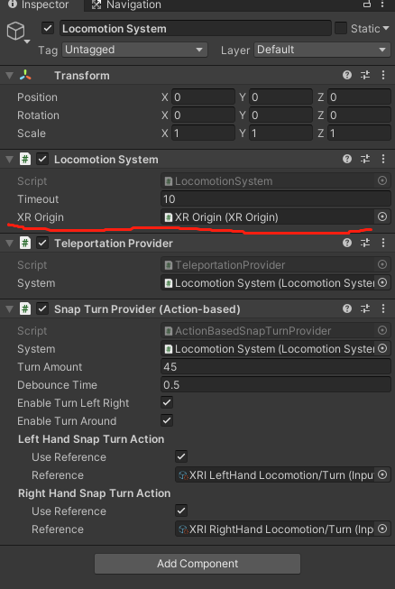

# 加入基础移动功能

## 1. 添加 Locomotion System （Action Based）

加入运动系统  Locomotion System ，而且必须是 Action Based，不带 Action Based 标注的，是原来旧的输入系统（input system），而我们当前项目所有的操作都是基于新的输入系统，所以必须注意这点。

> 操作：  
> * 拖拽  Locomotion System （Action Based） 到 Hierarchy 中，生成运动系统对象
> * 在 Inspector 中，为 Locomotion System 选择 XR Origin，将上节中创建的 XR Origin 对象拖拽过来
    

## 2. 将地面 Groud 设置为可传送

在 VR 移动系统中，通常有两种方式，一种是传送（瞬移），另一种是普通移动。

增加传送 Teleportation 的原因在于，一般在 VR 中的普通移动，会让人感到眩晕。

如果要增加传送移动，必须先为移动路径的表面增加 “可传送区域” 脚本，在本项目中，就直接为上节创建的地面 Ground 对象，增加可传送功能。

> 操作：
> * 选中 Ground 