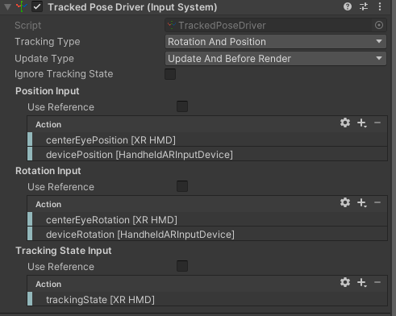

# 加入基础移动功能

## 0. Locomotion in Unity XR Interaction Toolkit

XR 交互工具包提供了一套运动组件，为在 XR 体验中在场景中移动提供了手段。这些组件包括

* XR Origin：代表用户头显设备、控制器、手和 XR 空间中其他可跟踪设备或物体的跟踪空间中心
* Locomotion System ：一个移动系统，用于控制对 XR Origin 的访问
* Teleport Provider：一个传送提供程序和传送交互程序
* Snap Turn Provider：可按固定角度旋转用户的快速旋转提供程序
* Continuous Turn Provider：一个连续旋转提供程序，可使用户随时间平滑旋转
* Continuous Move Provider：连续移动提供程序，可在一段时间内平稳移动用户
* Grab Move Provider：抓取移动提供程序，使用户的移动与控制器的移动相反
* Two Hand Grab Move Provider：双手抓取移动提供程序，可随控制器移动而移动、旋转和缩放用户
* Climb Provider：攀爬提供程序，可在用户选择攀爬交互方式时移动用户

## 1. 添加 Locomotion System （Action Based）

加入运动系统  Locomotion System ，而且必须是 Action Based，不带 Action Based 标注的，是原来旧的输入系统（input system），而我们当前项目所有的操作都是基于新的输入系统，所以必须注意这点。

> 操作：  
> * 拖拽  Locomotion System （Action Based） 到 Hierarchy 中，生成运动系统对象
> * 在 Inspector 中，为 Locomotion System 选择 XR Origin，将上节中创建的 XR Origin 对象拖拽过来
    

## 2. Turning 转向

### 2.1 HeadSet 转向

### 常用解决方案

HeadSet 转向是真实的**物理转向**，即 **“头部的真实运动和VR 中的视觉效果同步”**，不会产生 **“晕动症”**

所以，即使是用手柄来模拟转向，也不会关闭头显转向，通常如果玩家选择原地不动的姿势（坐姿或原地站立），最常用的解决方案是：手柄 snap turn （每次 45°）+ 头显转向（小范围真实物理转向）

### XRI 中关联组件

在 XRI 中，使用 **Tracked Pose Driver（Input System）** 实现头显的转向

它通常挂接在 XR Origin(XR Rig) - Camera Offset - Main Camera 主摄像头游戏对象上

在 Inspector 中显示如下：

他的功能是定位和驱动头显设备的移动和转向。

位置（Position）& 旋转（Rotation）输入（Input）：centerEyePosition[XR HMD]

Tracking State Input（跟踪输入）：trackingState [XR HMD]

## 2. 将地面 Groud 设置为可传送

在 VR 移动系统中，通常有两种方式，一种是传送（瞬移），另一种是普通移动。

增加传送 Teleportation 的原因在于，一般在 VR 中的普通移动，会让人感到眩晕。

如果要增加传送移动，必须先为移动路径的表面增加 “可传送区域” 脚本，在本项目中，就直接为上节创建的地面 Ground 对象，增加可传送功能。

> 操作：
> * 选中 Ground 