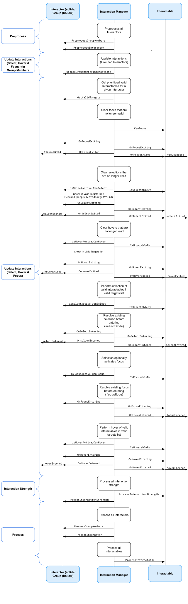

# Unity XR Interaction Toolkit 交互工具包

## 1. 概念

XR Interaction Toolkit包是一个基于组件的高级交互系统，用于创建VR和AR体验。

它提供了一个框架，通过Unity输入事件使3D和UI交互可用。

该系统的核心是一组基本的 Interactor 和 Interactable 组件，以及将这两种类型的组件联系在一起的 Interaction Manager。

它还包含一些用于移动和绘制视觉效果的组件。

### XR Interaction Toolkit包含一组支持以下交互任务的组件：

* 跨平台 XR控制器 输入组件系列：Meta Quest（Oculus）、OpenXR、Windows Mixed Reality等。
* 基本的对象悬停、选择和抓取
* 通过XR控制器提供触觉反馈
* 通过视觉反馈（着色/线条渲染）指示可能和活动的交互
* 使用XR控制器进行基本画布UI交互
* 与XR Origin进行交互的实用工具，用于处理固定和房间尺度的VR体验的VR相机设置

### 要在包中使用AR交互组件，您必须在项目中安装AR Foundation包。XR Interaction Toolkit提供的AR功能包括：

* AR手势系统将屏幕触摸映射到手势事件
* AR可交互组件可以在现实世界中放置虚拟对象
* AR手势交互器和可交互组件将手势（例如放置、选择、平移、旋转和缩放）转换为对象操作
* AR注释用于向用户提供有关放置在现实世界中的AR对象的信息

最后，如果您没有适用于您当前项目的硬件，或者只想在不戴头盔的情况下测试交互，您可以使用XR设备模拟器模拟所有交互。

### 1.1 核心组件

### Interactors 交互者 —— 动作发出者（主动）

  **An object in a scene that can select or move another object in that scene.**
  VR 场景中的一个对象，可以选择或移动场景中的其他对象（Interactable 可交互对象）

用于处理可交互对象的 Hover 和 Select 操作

该组件负责创建一个可交互对象列表（称为有效目标），这些可交互对象在每帧都可以响应 Hover 和 Select 操作。

可交互有效目标列表按照优先级排序。默认，最近的可交互对象具有最高优先级。可使用目标过滤器来更改或扩展此优先级标准。

### Interactables 可交互对象 —— 动作接收者（被动）

可交互对象是场景中的对象，交互者可以悬停、选择、聚焦和/或激活。

该组件负责定义这些交互状态的行为。

同一个交互者可以捡起和投掷球、射击枪支或按下键盘上的3D按钮。

### Interaction Manager 交互管理器

交互管理器充当交互者和可交互对象之间的中介。

该组件负责在其注册的交互者和可交互对象组中实际引起交互状态的变化。

典型的设置是拥有一个单独的交互管理器，所有可交互对象都可能受到所有交互者的影响。

您可以拥有多个互补的交互管理器，每个管理器都有自己的一组交互者和可交互对象，并通过打开和关闭来启用或禁用交互集。加载的场景集合中至少需要一个交互管理器才能使交互工作。

在启用时（在行为的OnEnable期间），交互者和可交互对象会自动向交互管理器注册。如果您在检查器窗口中不指定交互管理器，它们将使用找到的第一个交互管理器。在禁用时（在行为的OnDisable期间），交互者和可交互对象会从它们注册的交互管理器中注销。

### Interaction Groups 交互组

交互组是交互者的中介者。一个组包含多个成员交互者，按优先级排序，并且同一时间只允许一个交互者在组中交互（悬停或选择）。组首先优先连续选择——因此，如果一个成员交互者在上一帧进行交互并且可以在当前帧开始或继续选择，则该交互者将被选择进行交互，即使优先级更高的交互者试图进行交互也是如此。

交互组还可以在其成员的排序列表中包含其他组。组内的组在包含组优先处理交互时被视为单个交互者。在组内选择进行交互的交互者将被冒泡到下一个包含组，直到它最终被选择在顶级组中进行交互或像其他交互者一样被跳过。

交互组还向交互管理器注册。成员交互者或组必须与其包含组相同的交互管理器注册，以使成员作为组的一部分功能。组在行为的 Awake 期间首先向交互管理器注册。在被禁用时（在行为的 OnDisable 期间），组将从交互管理器注销。如果随后重新启用该组（在行为的 OnEnable 期间），它将再次向交互管理器注册。如果在运行时将交互者或组添加到组中，则它将从其交互管理器注销，然后重新注册，以便在更新循环中将其视为组成员。

### XR Controllers XR 控制器

XR Controller组件提供了一种抽象输入数据的方法，然后Interactors使用这些数据将其转化为交互状态，特别是用于选择和激活。输入动作绑定到被跟踪设备的控件，并且在每一帧中进行读取，然后Interactors查询这些输入动作以确定是否应该进行选择或激活。

当一个手部关联多个Interactors时，通常也会有多个与该手部关联的XR Controller组件。换句话说，并不需要只有一个XR Controller组件来表示手部的所有Interactors。例如，您可能希望为基于射线的传送交互器和用于抓取的近距离直接交互器使用不同的输入，而且两个Interactor组件可以引用不同的XR Controller组件，以从同一个被跟踪的控制器设备中读取不同的输入值。

该组件还负责读取被跟踪设备的位置和旋转，并将其应用于Transform组件。

### Controller Recorder

可以用来录制和回放输入数据，通常用来在无硬件设施情况下，进行测试

### 1.2 States 状态

交互系统 Interaction System 有三种状态：

* Hover 悬停：  
  悬停在一个可交互对象上，使其进入“Hover”状态，它可以被执行后续操作，但当前并不会更改该游戏对象的任何行为。但是可以通过外观或UI效果的变化（比如高亮或加上边框颜色），来提示用户，当前游戏对象已进入 Hover 状态

* Select 选择：  
  选择 “Select” 状态，通常需要用按键来触发。当可出发游戏对象（Interactable）在 “Select" 状态下时， Unity 认定触发它的触发者（Interactor）正在和其交互。例如：选择这种状态可以是 ———— 捡起一个可以被握住的对象、正在握着一个开关、准备推开一扇门

* Focus 聚焦  
  当一个可交互对象被 Selected 时，会进入 Focus 状态，正在被聚焦。这种效果会一直存在，直到别的可交互对象被选中（Select）或 任何对象都不被选中时结束。这是处理（Activate）一个可交互对象的预先状态。

* Activate 激活  
  Activation 激活是一种额外的操作，通常会映射到按钮或触发器上，从而影响当前选定的对象。这可以让用户进一步与所选对象进行交互。激活操作取决于可交互对象。例如，您可以使用 "激活 "来打开/关闭可抓取的手电筒或发射球。您可以使用 "检查器 "窗口中的 "可交互事件"（Interactable Events）挂钩现有的回调，然后通过 UnityEvents 添加到 "激活"（Activated）中，从而挂钩组件将 "激活"（Activate）处理为动作，而无需任何额外代码。

三种状态加载到不同种类的游戏对象上时，代表的意义通常也不一样

Hover 和 Select 可以类比传统 GUI 中的鼠标悬停和鼠标点击

Activate 则是 XR 中独有的概念，代表 Select 选中游戏对象的一个“激活”状态

## 2. Update loop 更新循环

交互管理器的更新循环查询交互器和可交互对象，并处理悬停、焦点和选择状态。

* 首先，它向交互器请求有效的目标列表（用于悬停和选择）。
* 然后，它检查交互器和可交互对象，看看它们现有的悬停、焦点和选择对象是否仍然有效。
* 在清除无效的先前状态之后（通过OnSelectExiting和OnSelectExited/OnHoverExiting和OnHoverExited/OnFocusExiting和OnFocusExited退出），它查询这两个对象以获取有效的选择、焦点和悬停状态，并通过OnSelectEntering和OnSelectEntered/OnHoverEntering和OnHoverEntered/OnFocusEntering和OnFocusEntered使对象进入新状态。

所有注册的可交互物体（Interactables）和交互者（Interactors）在交互状态改变前后都会被交互管理器（Interaction Manager）显式地更新，使用PreprocessInteractor、ProcessInteractor和ProcessInteractable方法。对于处理和状态改变，交互者总是在可交互物体之前被通知，而包含在交互组中的交互者总是在不包含在组中的交互者之前被通知。可交互物体和交互者不受限于使用正常的MonoBehaviour Update调用，但每帧逻辑通常应该在处理方法中完成，以便交互者能够在可交互物体之前更新。

### Interaction strength 交互强度

交互者和可交互物体可以报告一个变量（即模拟）选择交互强度，它是交互者执行的选择的归一化[0.0, 1.0]量。对于使用动作控制器输入的交互者，通常是模拟扳机或握持按下的程度。对于可以被戳的可交互物体，它可以基于戳击交互者的深度。

交互强度值在所有交互状态改变发生后由交互管理器显式地使用ProcessInteractionStrength方法进行更新。在这种情况下，可交互物体在交互者之前被通知，以便在收集交互者的整体交互强度之前计算戳击的深度。

 
 

 

>参考文档：
>
> * [Unity 官方文档](https://docs.unity3d.com/Packages/com.unity.xr.interaction.toolkit@2.4/manual/architecture.html)

 