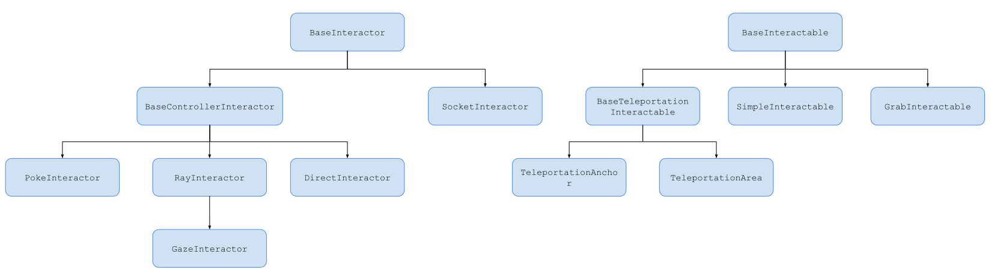
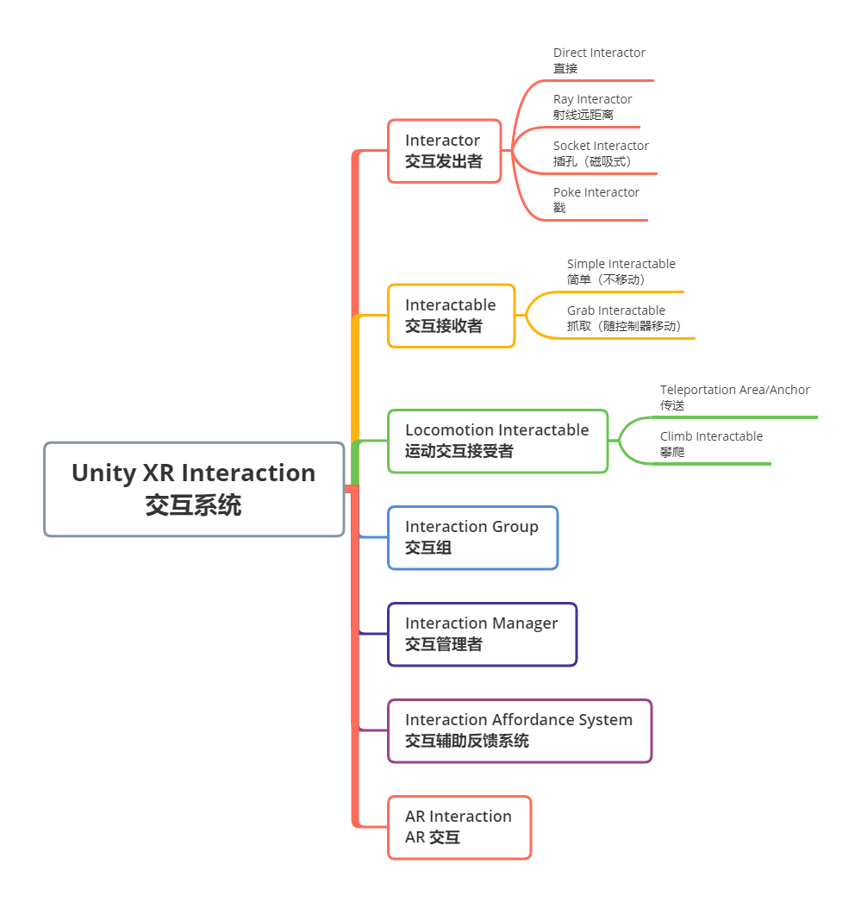
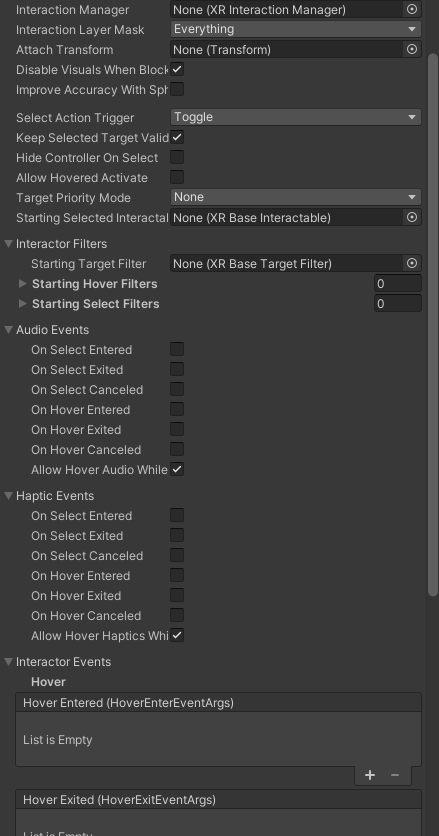
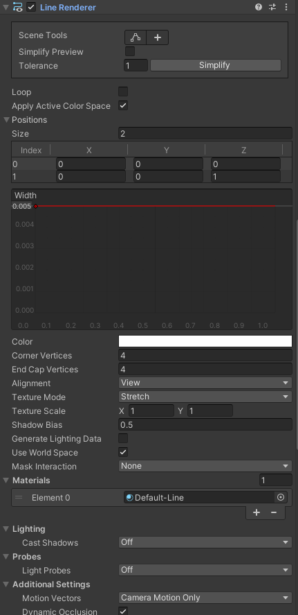
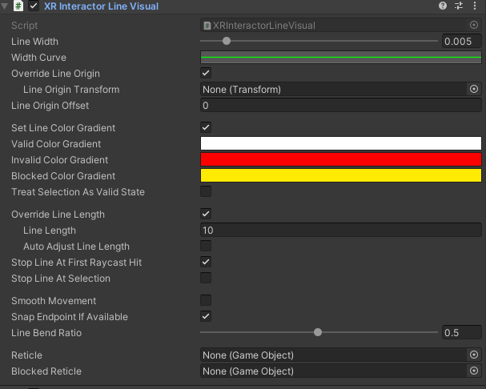
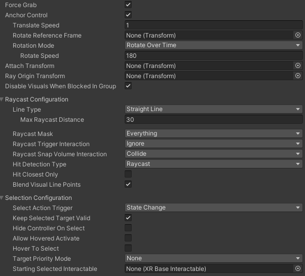
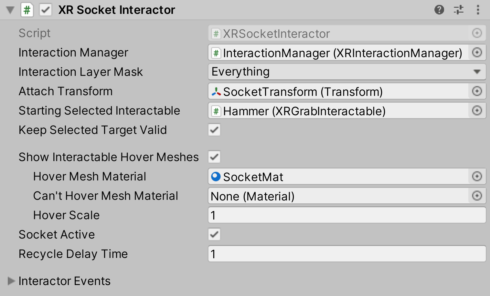

# XR Interaction System —— Unity XR 交互系统

## 1. 概念

Interaction System 是 Unity XRI 中的核心系统，用于实现将控制输入转换成交互操作的核心功能。

核心组件主要分为三组：

### 1.1 XR Interaction Manager 交互管理者： 

* Interactor 和 Interactable 之间的中介机构，实现二者间的通信。启用后，交互器和可交互项都会向一个有效的交互管理器注册。
* 加载的场景必须至少有一个交互管理器，这样交互器和交互对象才能进行通信。
* 如果Interactor 和 Interactable 中的 Interaction Manager 属性没有设置，Unity 会自动在当前场景中找到一个添加上，如果 Interaction Manager 有多个的话，必须指定。 允许多个交互管理器，管理各自的交互者和交互对象
* 交互器和交互对象上的许多方法都是由交互管理器调用的，而不是直接调用，以便保持交互事件两个目标之间的一致性。

所以说，虽然配置最简单，但 XR Interaction Manager 组件是整个交互系统中功能最重要的组件

### XR Interaction Manager 工作步骤

* 接收并监听 Interactor 和 Interactable 以及 Interactor Group 的注册和注销；并且可以挂接响应注册、注销事件的自定义操作
* 监听 Interactor 和 Interactable 的输入控制操作状态，有输入操作时，在二者之间传递消息。比如，Interaction Manager 每帧都会检测 Interactor 当前的 hover或select状态，并为所有Interactor生成目前 hover 和 select 的有效 Interactable 列表，同时通知 Interactor 和 Interactable 处理各自的事件方法；
* 每帧 检测所有的 Interactor 和 Interactor 所挂接 Interactable ，看他们之间是否还存在交互，如果没有的话，将无效对象清除

### 1.2 Interactor 

交互器，用于发出交互动作，通常和输入控制器 XR Controller 放到同一个游戏对象上，构建出 VR 的控制输入对象的完整功能

### 1.3 Interactable

交互对象，用于接收交互动作，作出响应。所以，一般要挂接到需要操作的对象上，比如武器、物品、机关等

### 1.4 类图

### 1.5 三种状态（三个操作）

在 02 XRI 介绍中，已经提到过这三种类型 VR 操作对应的三种状态，在此再强调一次

* Hover 悬停：  
  Interactor Ray 射线或 Collider 和 Interactable 碰撞时，处于 Hover 状态。不需要控制器按键，只需要控制器处于特定位置，使碰撞（射线碰撞或碰撞体碰撞）生效

* Select 选择：  
  通常发生在 Hover 前提之下，可以由 Hover 转换为 Select ，通常绑定的是控制器的 Grip 键。  
  当 Grip 键被按下，即 GripPressed 时触发。

* Activate 激活：  
  通常发生在 Select 前提之下，由 Select 转为 Activate ，通常绑定的是控制器的 Trigger 键。  
   当 Trigger 键被按下，即 TriggerPressed 时触发

三种状态，会对应 Interactor 和 Interactable 中的相应事件，每个状态对应两个或更多。在 Interactable 上，Interaction Event 两两成对，一个是 Entered ，一个是 Existed，对应状态的开始和结束；在 Interactor 上，Interaction Event 通常3个成一组，除了 Entered 和 Existed 外，还会多一个 Canceled 取消事件。

## 2. Interaction System 组件

见下图：

## 3. Interactor 交互器

### 3.1 交互器组件通用属性

下面这些属性是每个 Interactor 都具备的通用属性，需要先掌握

### Selection 配置

* Interaction Manager   
  交互管理器，连接交互器和交互对象的桥梁，所有交互操作都通过这里发出

* Interaction Layer Mask  
  设置专属的交互层，来对不同类型的交互分割开，同一层的交互层的 Interactor 和 Interactable 才能交互，不同层互不影响。注意，这个和普通的 Layer 无关

* Attach Transform  
  用作交互器和交互对象连接点位置设置，比如握枪的位置
  
* Disable Visuals When Blocked In Group  
  当该互动者是互动组的一部分，并且由于组内另一个互动者的积极互动而无法进行互动时，是否禁用视觉效果。

* Select Action Trigger  
  选择 Unity 如何解释来自控制器的选择输入操作。推荐使用默认选项 State Change  
    * State ：只要select 操作对应的按键处于激活状态，Unity 会认为输入处于活动状态。用户可以在可以进行交互之前按住按钮，但在可以进行交互时仍会触发交互。如果多个交互者选择了设置为 InteractableSelectMode.Single 的可交互对象，则可能会出现不希望出现的行为，即在每一帧中，可交互对象的选择在交互者之间来回传递。这也会导致每帧都触发选择交互事件。
    * State change：只有在按下按钮的那一帧，Unity 才会认为该输入处于激活状态，用户必须在可以进行交互时按下按钮才能触发交互。如果用户在可以进行交互之前就开始按下按钮，则不会触发交互。
    * Toggle：按下进入激活状态，直到第二次按键才能取消，比如玩家抓取一个物体后，不想一直按着 grip 键就能保持 selected 状态，就可以设定为这个选项
    * Sticky：按下进入激活状态，直到第二次按键松开才能取消

* Keep Selected Target Valid  
  在最初选择一个交互对象后，即使该对象不再是有效目标，是否仍要继续选择该对象。通常，在抓取操作时，设置为 true；在 传送操作时，设置位 false

* Hide Controller On Select  
   当前的 Interactor 在 处于选中状态时，是否隐藏控制器模型。设置位 TRUE 可以简化项目，省去手部动画

* Allow Hovered Activate  
  当前的 Interactor 在 Hovered 状态但是，没有处于 Selected 状态时，是否要发送 activate 和 deactivate 事件给 Interactable 对象。默认是只有处于 Selected 状态时，Interactor 才允许发送activate 和 deactivate 事件给 Interactable 对象。 

* Target Priority Mode  
  交互目标的优先模式，设定要监控的目标个数  
  * None： 不监控，选择这个模式时，Interactor 的 targetsForSelection 属性（Interactable 按优先级排序而成的 列表）不会被更新，消耗最低
  * HighestPriorityOnly：只监控优先级最高的目标，targetForSelection 列表将只更新优先级最高的目标，如果当前帧中没有可选择的目标，则该列表将为空。该选项的性能代价适中。
  * All：跟踪所有目标，targetForSelection 列表将更新为当前帧中可选择的所有交互对象。该选项的性能代价较高。

* Stating Selected Interactable  
  起始选中的交互对象 

### Interactor Filters 配置

目标过滤器用于扩展交互器如何优先处理和过滤可与之交互的交互对象的逻辑。

说白了，Interactor Filters 就是除了 Interaction Layer 交互层之外，更精细的一种交互操作是否响应、优先跟谁交互的筛选逻辑的实现方式。

> Interactor 负责创建一个列表（称为 "Valid Target list 有效目标列表"），其中包含它在一帧中有可能 Hover或 Select 中的那些 Interactables 交互对象。有效目标列表按优先级排序，默认情况下，距离最近的交互对象优先级最高。

> 每个 Interactable 可互动目标都可以有不同的距离计算方法，这可能会影响其在有效目标列表中的排序。

按距离对有效目标列表进行排序的默认标准可通过目标过滤器进行扩展或覆盖。这通常是通过 XRTargetFilter 组件完成的。

XRTargetFilter 组件是一个高度可配置的组件，用于过滤有效目标列表中的交互对象。它使用其评估器对象计算出的分数对该列表进行排序。

* Starting Target Filter ：设置过滤器
* Starting Hover Filters ：只针对 Hover 动作设置过滤器
* Staring Select Filters ：只针对 Select 动作设置过滤器

### XR unity events配置

* Audio Events  
  设置 unity XR Interacation 事件绑定播放指定音频  
  * AudioClip To Play : 挂接需要播放的声音片段文件

* Haptic Events  
   设置 unity XR Interacation 事件绑定控制器震动反馈  
   * Haptic Intensity: 震动强度
   * Duration：震动时长

* Interactor Events  
  设置 unity XR Interacation 事件绑定任意自定义的方法，一个事件可以同时挂接多个方法

### 3.2 Direct Interactor 直接交互器

需要直接触碰到交互对象的交互器，通过碰撞体实现交互的触发，所以必须给此交互器组件配套一个碰撞体。

尽可能不要用 Mesh Collider，容易出Bug，且性能不佳，通常添加碰撞体的经验如下：

* 手型交互器：附加 一个 0.1 单位大小 Sphere Collider 球状碰撞体
* 控制器模型交互器：附加一个 Box Collider

### Direct Interactor 特定属性

* Improve Accuracy With Sphere Collider  
  每帧使用优化的球状碰撞体来生成触点，而不是依赖固定更新上（FixedUpdate）的触点事件。禁用可强制使用触发事件(Trigger Event)。

### 3.3 Ray Iteractor 射线（间接）交互器

Ray Interactor 使用射线投射和 Interactable 的 Collider 碰撞，从而产生交互事件。所以它在使用时，必须配上能显示、并调整射线外观的配套组件：  
* Line Render 射线渲染器  
  Unity 中，设置线显示数据的组件。和大多数 Unity 中的渲染器组件类似，其中包含 材质、阴影设置、光探针 等相关渲染呈现所需要的元数据。  
  
* XR Interactor Line Visual 交互器射线显示配置组件  
  用来配置交互射线的一些外观属性。如 颜色、线宽等  
  

### XR Ray Iteractor 特定属性

XR Ray Iteractor 相较 Direct Interactor 而言，多了射线后，就多出了很多特定的属性:

* Force Grab ：  
  选中时，抓取的 Interactable 游戏对象会被握在手里；否则，将会出现在射线末端  
* Anchor Control :  
  允许用户使用操纵杆移动连接锚点。  
  * Translate Speed:  
    锚点平移的速度。仅在启用锚点控制时使用和显示  
  * Rotate Refernce Frame:  
    用于在旋转附加锚点时定义向上轴。未设置时，将围绕附加变换的本地向上轴旋转。  
  * Rotation Mode:  
    指定如何控制锚点旋转
    * Rotate Over Time:  
      "随时间旋转"，可在旋转输入激活时控制锚点随时间旋转。  
    * Match Direction: 
       "匹配方向"，以便将锚点旋转与二维旋转输入的方向相匹配。
  * Rotation Speed:  
    锚点旋转的速度。仅在启用锚点控制且旋转模式设置为随时间旋转时使用和显示。
* Ray Origin Transform  
  任何射线投射的起始位置和方向。  如果无，则在唤醒时自动实例化和设置，并使用 XRBaseInteractor.attachTransform 的姿势进行初始化。设置后不会自动销毁前一个对象。

### Raycast Configuration  射线类型和形状配置

射线根据 Line Type 分为三种，每种的属性和设置都不同

通用属性为：

* Raycast Mask ：  
  用于限制光线投射目标的图层蒙板。
* Raycast Trigger Interaction：  
  通过射线投射与触发碰撞器的交互类型。
* Raycast Snap Volume Interaction  ：
  即使射线投射已设置为忽略触发器，射线投射是否仍应包括或忽略对触发器碰撞器（即快速体积碰撞器）的命中。如果不使用凝视辅助或 XR 可交互快照体积组件，则应将此属性设置为忽略，以避免性能代价。
* Hit Detection Type：  
  射线碰撞类型，有以下三个选项：  
  * Raycast ：  
    使用物理 Raycast 检测碰撞。
  * Sphere Cast：  
    使用物理球形 Cast 检测碰撞。
  * Cone Cast：  
    使用锥形来检测碰撞。
* Hit Closest Only：  
  Unity 是否只将最近的交互对象视为有效的交互目标。  
  启用此选项可使只有最近的交互对象接收悬停事件。  
  否则，所有被击中的交互对象都将被视为有效目标，并且此交互对象将多重悬停。
* Blend Visual Line Points：  
  将 Unity 用于射线投射的线条采样点与控制器的当前姿势混合。使用此方法可使线条视觉效果与控制器保持连接，而不是滞后。  
  当控制器被配置为在渲染前直接采样跟踪输入以减少输入延迟时，控制器可能会处于相对于光线投射所用采样曲线起点的新位置或旋转位置。  
  如果值为 false，则视觉线将保持在固定的参考帧上，而不会向光线投射线的末端弯曲。

* Straight Line 直线  
  * Max Raycast Distance
* Projectile Curve 抛物线  
  * Reference Frame :
    仅在线条类型为抛物线或贝塞尔曲线时使用和显示。  用于定义地平面和向上的曲线参考框架。如果未在启动时设置，它将尝试查找 XROrigin.Origin 游戏对象，如果该对象不存在，它将默认使用全局向上和原点。  
    说白了就是定义曲线的原点的弯曲方向
  * Velocity ：  
    仅在线条类型为抛物线时使用和显示。初始速度。  
    增大该值会使曲线延伸得更远。
  * Acceleration ： 
    重力
  * Additional Ground Height：  
    在地面以下继续飞行的额外高度。  
    增加该值会使终点下降的高度降低。
  * Additional Flight Time：  
    降落到调整后的地面高度后的额外飞行时间。  
    增加该值会使终点高度降低。
  * Sample Frequency：  
    Unity 用于近似曲线路径的采样点数量。  
    数值越大，近似的质量越高，但由于射线投射的次数增多，性能会有所降低。  
    数值为 n 时，射线投射将产生 n - 1 个线段。
    说白了，就是数量越大，线越圆润，但越消耗资源
* Bezier Curve 贝塞尔曲线  
  * Reference Frame ：  
    同上
  * End Point Distance：  
    末端距离。  
    增大该值距离，可使曲线终点距离起点更远。
  * End Point Height：  
    末端高度。  
    减小该值可使曲线末端相对于起点下降得更低。
  * Control Point Distance：  
    增大该值可使曲线峰值离起点更远。
  * Control Point Height：  
    增加该值可使曲线峰值相对于起点更高。
  * Sample Frequency：  
    同上
  

### 3.4 Socket Interactor 插孔（磁吸式）交互器

顾名思义，插孔交互器 Socket Interactor 是用来做一个可以让交互对象 Interactable 插进去，快速定位用的特殊交互器。

举个栗子，比如：在玩家身上挂武器、在墙上或武器架上挂陈列的兵器，等等；挂接的位置是一个 Socket Interactor，武器就是 Interactable；又比如：钥匙的钥匙孔或电池的电池插座，都可以用 Socket Interactor 来实现

该组件的设计目的不是附加到控制器上（因此与 XRDirectInteractor 和 XRRayInteractor 不同，它不是从 XRBaseControllerInteractor 派生的），而是始终尝试选择悬停在其上的可交互对象（尽管不会对该可交互对象执行排他性选择）

### 独有属性

* Show Interactable Hover Meshes:  
  当交互对象悬停在交互器上时，是否显示交互器网格（交互器外观）
  * Hover Mesh Material：  
    悬停时，交互器所有材质
  * Can't Hover Mesh Material：  
    当插座中已有选定对象时，用于在悬停时渲染可交互网格的材质（如果没有提供材质，则将创建默认材质）。
  * Hover Scale：  
    悬停时缩放
* Hover Socket Snapping ：
  决定悬停时，交互对象是否应紧贴 socket Interactor 的附着变换 attach transform。  
  请注意，这会导致 hover mesh 视觉效果发生 Z 打架(z-fighting)，因此不建议同时使用这两个选项。  如果启用，则会禁用悬停回收延迟功能(hover recycle delay)。
* Socket Scale Mode:  
  缩放模式，用于计算悬停时应用于可交互对象的缩放因子
  * None : 不缩放
  * Fixed ： 设置具体的缩放比例，三个轴都可单独设置
  * Stretched to Fit Size : 当缩放模式设置为 "按尺寸拉伸 "时，用于计算应用于可交互对象的缩放因子的边界尺寸
* Socket Active : 插孔是否生效
* Recycle Delay Time:  
  设置对象移除后 socket 拒绝悬停的时间。如果已启用 Hover Socket Snapping 捕捉，则此属性不起任何作用。
  
### Socket Interactor 使用时注意点：

Socket Interactor 一般来说，在同一个GameObject 上，要搭配以下组件一同使用：
* Collider:  
  用来实现交互检测，但一定要设置为 Trigger。（Is Trigger 属性为 True）

### 3.5 Poke Interactor 戳（手指）交互器

## 4. Interactable 交互对象

交互对象必须同时再挂接碰撞体和刚体才能真正实现交互

碰撞体尽量用形状接近的集合碰撞体，Mesh 碰撞体比较吃性能，而且容易出 Bug（如果模型有瑕疵的话）

### 4.1 交互对象组件通用属性

* Interaction Manager   
  交互管理器，连接交互器和交互对象的桥梁，所有交互操作都通过这里发出

* Interaction Layer Mask  
  设置专属的交互层，来对不同类型的交互分割开，同一层的交互层的 Interactor 和 Interactable 才能交互，不同层互不影响。注意，这个和普通的 Layer 无关

* Colliders：   
  碰撞体。用来跟 Interactor 中碰撞体碰撞的组件，是实现交互的基础。碰撞体碰撞后，才会引发 Hover 状态的产生。如果当前游戏对象上有碰撞体，可以不填留空，Unity 会自动绑定

* Distance Calculation Mode
  设定计算与 Interactor 距离的算法模式，从最快到最精确。  
  如果当前 Interactable 使用 Mesh Collider，则碰撞体的体积仅当设定为 Convex 时才有效
  * Transform Position ：  
    直接使用 Interactable 的 Transform 中的属性来计算距离。  
    消耗最小。  
     但对某些对象而言，其距离计算精度可能较低。
  * Collider Position ：  
     使用 Interactable 对象上的 Colliders List ，分别计算每个碰撞体 跟 Interactor 的最短距离。   
     该选项的性能成本适中，对于大多数对象而言，距离计算的精确度也应适中。
  * Collider Volume ：  
    使用 Interactable 的 Colliders 列表计算距离，使用到每个对撞机最近点（表面或对撞机内部）的最短距离。  
    该选项的性能成本较高，但距离计算精度较高。

* Custom Reticle  
  自定义准星，这个投射在 Interaction 表面上的准星，一般设置位 2D 的图片

* Select Mode  
  表示 Interactable 的选择策略。它控制有多少个交互者可以选择该交互对象。  
  只有在尝试选择时，交互管理器才会读取该值，因此将该值从 "多个 "改为 "单个 "不会导致退出选择。
  * Single:  
  防止同时有多个互动者进行额外的同步选择。
  * Multiple:  
  允许同时从多个交互器中选择交互对象。
* Focus Mode
  指定此交互对象的焦点策略。
  * None: 
    将 "焦点模式 "设置为 "无 "可禁用可交互对象的 "焦点 "状态。
  * Single:
    允许单个交互组的交互者关注该交互对象。
  * Multiple:  
    允许多个交互组的交互者关注该交互对象。
* Gaze Configuration  
  是否允许瞳孔跟踪交互

### 4.2 Simple Interactable 简单交互对象

不能被拿起来，它的所有属性，Grab Interactable 里都有。

但存在的就是合理的，既然叫 Simple “简单”，功能上弱但性能上自然就更优。

可以用在一些固定不动的交互物体上

### 4.3 Grab Interactable 抓取交互对象

在交互操作的 Selected 状态下，能够被拿起的交互对象

“拿起” —— Grab ，这个操作会有两个阶段：

* 拿起时：
  被抓取对象 Interactable 会转换自己的 Position 和 Rotation 到抓取点位 Attach Transform。  
  大多数是 Interactor 模型位置，比如 手中；也可能是 射线的远端
* 丢下后：  
  在释放时，速度会跟着 Interactor 旋转并继承它的速度

除了 Simple Interactable 中相同的基本属性外，还有自己独有的属性：

* Movement Type:  
  指定该对象在被选中时的移动方式，可以通过设置刚体的速度、在固定更新时移动运动学刚体或在每帧直接更新变换。
  * Velocity Tracking (速度跟踪 —— 不穿模):  
   通过设置刚体的速度和角速度来移动可交互对象。  
   如果不想让交互物体跟随交互对象移动时，穿过其他没有设置刚体的碰撞器，可以使用这种方法.
   但这样做的代价是物体会显得滞后，无法像瞬时物体那样平滑移动。  
    * Angular Velocity Damping： 
       Unity 在跟踪 Interactor 旋转时抑制现有角速度的比例因子。数值越小，角速度衰减的时间越长。
    * Angular Velocity Scale：    
      统一缩放因子，用于在跟踪交互体旋转时更新刚体的跟踪角速度。
  * Kinematic （运动学 —— 穿模）:  
  通过向目标位置和方向移动 Kinematic Rigidbody 来移动可交互对象。  
  如果希望视觉效果与物理状态保持同步，并且希望物体在跟随交互对象移动时能够穿过其他不使用刚体的碰撞器，则可以使用此方法。 
  * Instantaneous（瞬时 —— 穿模）:  
  通过在每一帧设置 Transform 的位置和旋转来移动可交互对象。  
  如果您希望每帧都更新可视化表示，尽量减少延迟，则可以使用此方法，但当它跟随交互对象移动时，可以穿过其他不使用刚体碰撞器。
  
  
* Retain Transform Parent  
  启用时，在此对象被抛下后，使Unity能够将此对象的父对象重新设置为其最初的父对象。

* Track Position:  
  启用后，该对象在 Selected 时会跟随 Interactor 交互对象的位置移动。
  * Smooth Position:  
  启用后，会在跟随 Interactor 的位置移动时应用平滑处理。  
    * Smooth Position Amount：  
    缩放因子，用于在选中时跟随交互界面的位置进行平滑处理的程度。  
    该值越大，该对象就越接近互动者的位置。
    * Tighten Position：  
    减少使用平滑处理时的最大跟随位置差。  
    使用平滑处理时，平滑处理后的位置应与交互作用器位置保持多接近的分数。  
    数值范围从 0 表示平滑后的跟随距离没有偏差，到 1 表示实际上完全没有平滑。
* Track Rotation:  
  启用后，该对象在 Selected 时会跟随 Interactor 交互对象的转动。
  * Smooth Rotation:  
  启用后，会在跟随 Interactor 转动时应用平滑处理。  
    * Smooth Rotation Amount：  
    缩放因子，用于在选中时跟随交互器 Interactor 的旋转进行平滑处理的程度。  
    该值越大，该对象就越接近互动者的旋转。
    * Tighten Rotation：    
    减少使用平滑处理时的最大跟随旋转差。  
    使用平滑处理时，平滑处理后的旋转应与交互作用器旋转保持多接近的分数。  
    数值范围从 0 表示平滑后的跟随旋转没有偏差，到 1 表示实际上完全没有平滑。
* Track Scale:  
  启用后，该对象在 Selected 时会跟随 Interactor 交互对象的缩放。
  * Smooth Scale:  
  启用后，会在跟随 Interactor 缩放时应用平滑处理。  
    * Smooth Scale Amount：  
    缩放因子，用于在选中时跟随交互界面的缩放进行平滑处理的程度。  
    该值越大，该对象就越接近互动者的缩放。
    * Tighten Scale：    
    减少使用平滑处理时的最大跟随缩放差。  
    使用平滑处理时，平滑处理后的缩放应与交互作用器缩放保持多接近的分数。  
    数值范围从 0 表示平滑后的跟随距离没有偏差，到 1 表示实际上完全没有平滑。
* Throw On Detach：  
  启用后，该对象在释放时将继承 Interactor 的速度 velocity 。运动学刚体(kinematic Rigidbody)不支持此功能
  * Throw Smoothing Duration  
    该值表示采集的采样用于速度计算的时间（最多 20 个前帧，取决于平滑持续时间和帧频）。  
    例如，如果该值设置为 0.25，位置和速度值将取过去 0.25 秒的平均值。  
    这些值的权重（乘以）也是由投掷平滑曲线决定的。  
  * Throw Smoothing Curve  
    投掷时用于加权速度平滑的曲线（最近帧在右侧）。  
    默认情况下，该曲线的值为 1.0，因此在平滑持续时间内，所有平滑值都会被同等对待。
  * Throw Velocity Scale  
    投掷速度缩放：Unity 将在释放时应用于该对象从 Interactor 继承的速度缩放因子。
  * Throw Angular Velocity Scale  
    投掷角速度缩放：投掷时，Unity 将对该对象从交互作用器继承的角速度应用的缩放因子
* Force Gravity On Detach  
  强制此对象在释放时具有重力（如果此值为 false/未选中，则仍将使用抓取前的值）
* Attach Transform  
  在此 Interactable 上使用的抓握连接点（如果未设置，则使用此对象的位置）。
* Secondary Attach Transform  
  该 Interactable 上用于双手交互的第二个附着点。(如果不设置此属性，Unity 会使用第二个 Interactor 的 attach Transform）。
* Use Dynamic Attach  
  启用后，在选择时将根据 Interactor 的姿势(pose)来确定有效连接点。
  * Match Position:  
    在初始化抓取时，与 Interactor 的附着点位置相匹配。  
    这将覆盖当前组件 Attach Transform 属性。
  * Match Rotation:  
    在初始化抓取时，与 Interactor 的附着点旋转相匹配。  
    这将覆盖当前组件 Attach Transform 属性。 
  * Snap To Collider Volume:  
    调整动态连接点，使其位于此对象上的 collider 上或内侧。  
  * Reinitialize Every Single Grab:  
    当从多个抓取变回单个抓取时，重新初始化动态附着姿势。  
    如果您想在释放第二只手后保持对象的当前姿势，而不是恢复到最初抓取时的附着姿势，请使用此功能。
* Attach Ease In Time  
  当前对象被 Selected 时，缓和（eases in）的时间（以秒为单位）（数值为 0 表示不缓和）。
* Attach Point Compatibility Mode
  控制计算对象目标位置时使用的方法。  
  使用 AttachPointCompatibilityMode.Default 可使所有 XRBaseInteractable.MovementType 值之间的附着点保持一致。
  * Default(Recommended)
* Grab Transformers Configuration:  
  抓握 Transformers 设置
  * Add Default Grab Transform  
    如果 "单个抓取变换器 "或 "多个抓取变换器 "列表为空，Unity 是否会添加默认的抓取变换器集（default set of grab transformers）。
  * Starting Multiple Grab Transformers  
    此 Interactable 启动时自动链接的抓取变换器（可选，可能为空）。  
    用于选择多个交互对象。启动后，此属性将不再使用。  
    当需要处理多个抓取变换器并指定顺序时，该属性非常有用。
  * Starting Single Grab Transformers  
    此 Interactable 启动时自动链接的抓取变换器（可选，可能为空）。  
    用于单个交互对象的选择。启动后，此属性将不再使用。  
    当需要处理多个抓取变换器并指定顺序时，该属性非常有用。
### 4.4 Locomotion 系统中的交互对象

* 传送用：Teleportation Area/Anchor
* 攀爬用：Climb Interactable
  