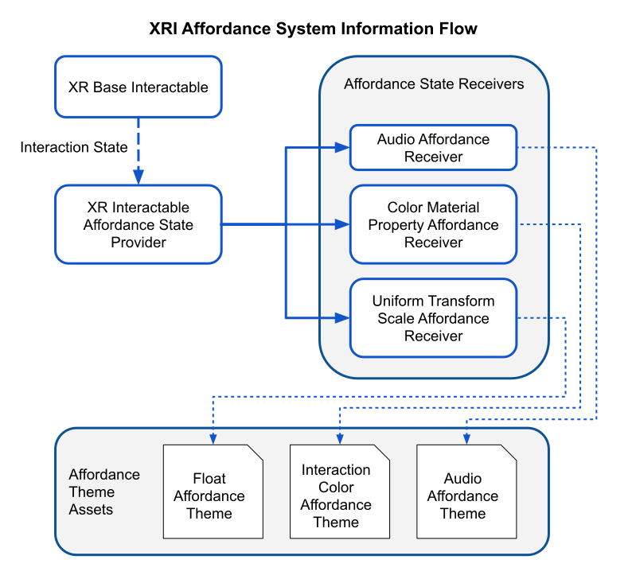
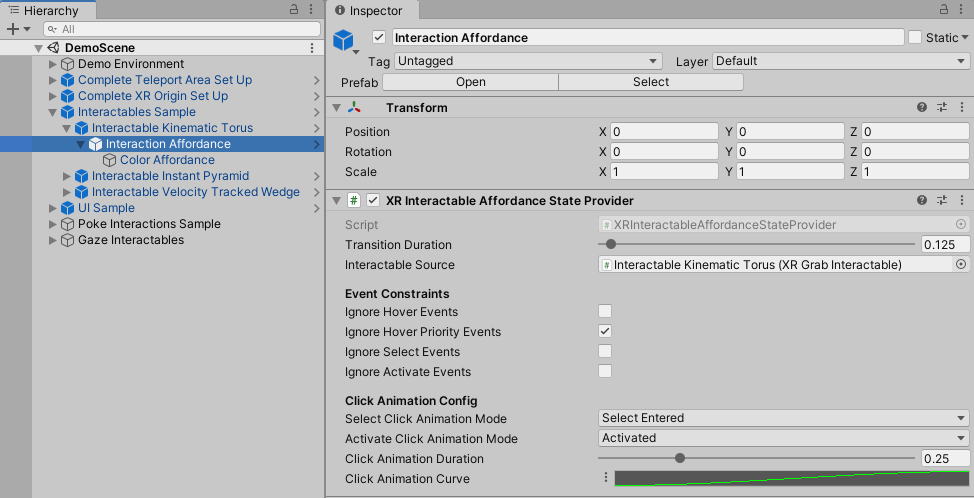
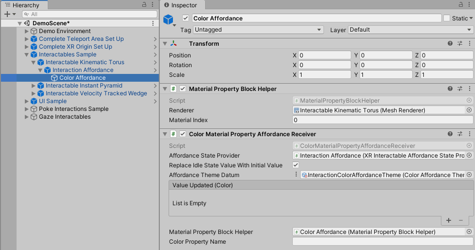
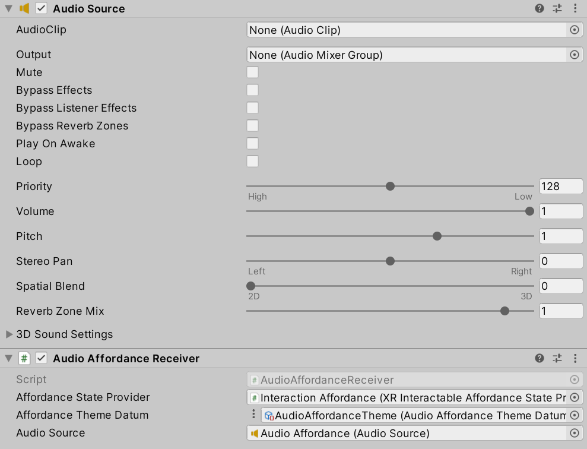
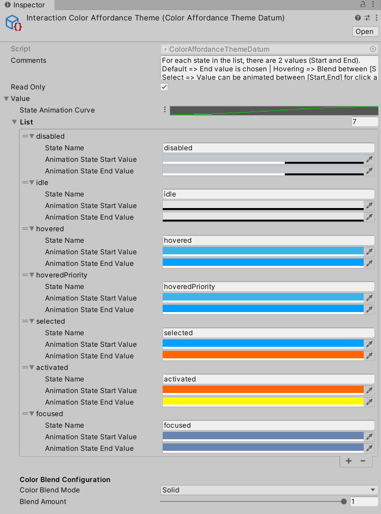

# XR Affordance system —— XR 启示（反馈）系统

## 1. Affordance system 启示（反馈）系统简介

### 1.1 概念

XR 交互工具包提供了一个 Affordance 系统，使用户能够为交互状态创建视觉和听觉反馈。

### 1.2 使用流程

* 首先是在场景（通常是一个可交互对象）中添加一个 "能力状态提供程序"（Affordance State Provider），并将其指向我们想要监控交互状态的可交互对象。
* 一旦读取到可交互对象的当前交互状态，它就会向任何订阅者或可交互对象接收者发送一个更通用的可承受状态事件。
* 然后，接收器会根据状态变化事件采取行动，并触发实惠效果，无论是材质颜色变化、变换比例，还是切换并播放音频片段。
  
### 1.3 注意点

接收器的配置来自引用的 Affordance 主题，但也可以在组件本身进行本地配置。

我们建议使用主题资产来帮助加快开发进程，并提高作品的一致性。您可以参考下图，帮助直观了解所有内容是如何连接在一起的：

## 2. Affordance state providers 状态提供者

XR 可交互能力状态提供程序会连接到可交互组件，并在交互状态发生变化（悬停、选择或激活）时读取交互状态，以确定并向订阅该特定提供程序的任何能力接收器提供适当的能力状态。也可以通过网络同步脚本等方式，直接从脚本中更新能力状态，而无需检查可交互元素的状态。此外，还可以编写自定义提供程序，从而扩展了在非交互对象中使用可负担性系统的可能性。

XR 交互式可承受状态提供程序连接到交互式组件，并在交互状态发生变化（悬停、选择或激活）时读取交互状态，以确定并向订阅该提供程序的任何可承受接收器提供适当的可承受状态。此外，如果与 XR 射线交互元件绑定，射线与 UGUI 画布的碰撞将触发悬停状态，而与悬停画布配对的相关选择输入也将触发选择状态。与实惠状态提供程序的可交互变体一样，也可以不检查交互程序而更新状态，不过如果使用 Ray Interactor UGUI 状态轮询，自定义状态将被覆盖。也可以用自定义提供程序来扩展该类。

请注意，如果在 "选定 "或 "激活 "状态下使用点击动画，则在动画完成后才会传播承受能力转换。

## 3. Affordance receivers 接受者

Affordance 接收器是接收 Affordance 状态变化事件的组件，然后使用引用的主题或配置执行特定的效果。许多 Affordance 接收器都能处理动画调整，以实现特定的视觉效果。针对不同的原始数据类型（如颜色、Vector3 或浮点数），有多种可承受性接收器组件。还可以根据您希望在给定对象上或其周围增强的属性，构建自定义承受能力接收器，以实现各种效果。

## 4. Affordance themes 主题

主题是一种封装特定类型 Affordance Receiver 配置的便捷方式。这样，您就可以轻松地为任何情境数据类型创建主题，并为项目打造统一的外观和感觉。它还允许您在一个地方调整设置，而不必担心根据这些更改更新每个游戏对象或预制件。在引擎盖下，Affordance 主题只是一个可脚本对象（ScriptableObject），旨在使用较新的 Datum 架构和一些编辑器代码，使其更易于可视化和配置。

该主题包含一系列可承受状态以及在交互过程中应混合的值。音频启示（反馈）主题包含状态进入（State Entered）或退出（State Exited）时的音频剪辑引用，Unity 将使用 AudioSource.PlayOneShot 播放这些音频剪辑。其他 Affordance Theme 类型（颜色、浮点数、矢量 2、矢量 3 和矢量 4）包含在两个值之间插值的类型值：起始值（动画状态起始值）和目标值（动画状态结束值）。状态列表上方是状态动画曲线。当 Affordance Receiver 触发每个动画时，都会使用这条曲线来确定动画值。曲线上的 0 代表起始值，1 代表结束值。这条动画曲线也可以由交互强度或自定义脚本驱动，从而为您提供更灵活的特效外观和感觉。

使用 "资产">"创建">"启示（反馈）主题 "菜单创建主题资产。

## 5. XR Affordance system VR项目中具体使用步骤

### 5.1 添加 XR 可交互 Affordance State Provider(状态提供者)

在场景中选择一个现有的 XR 可交互对象，然后创建一个空的子对象（"资产">"创建空对象"）。单击新创建的 GameObject，弹出 Inspector。单击 "添加组件"，然后导航至 "启示（反馈）系统">"XR 可交互启示（反馈）状态提供程序"。在新组件编辑器下，找到 "可交互源 "属性，并将父 XR 可交互对象拖入该属性。将该对象重命名为 "交互 Affordance "等有意义的名称。结果将如下所示：

### 5.2 添加 Affordance Receiver （接受者）

从这里开始，我们就可以添加可承受性接收器，根据可交互对象的状态为其添加效果。您可以将下一个组件添加到与之前相同的 GameObject 中，或者创建另一个空的子 GameObject。如果您创建了一个新的子对象，请单击该对象将其显示在检查器中。接下来，点击 "添加组件 "并导航至 "启示（反馈）系统">"渲染">"颜色材质属性启示（反馈）接收器"。这将添加一个额外的 "材质属性块辅助组件"，该组件将自动分配给 "颜色材质属性 Affordance Receiver "组件的 "材质属性块辅助组件 "属性。接下来，将上一节中的 GameObject 拖入 "颜色材质属性启示（反馈）接收器 "组件的 "启示（反馈）状态提供者 "属性中，并将适当的网格渲染器拖入 "材质属性块辅助器 "组件的 "渲染器 "属性中。最后，选中标有 "用初始值替换空闲状态值 "的复选框，以确保返回空闲状态时使用材质的原始颜色。结果将与下图相似。

### 5.3 声音反馈：Audio Affordance Receiver

使用音频功能接收器，可以在功能状态之间转换时添加音频效果。与其他可负担性接收器一样，您只需添加一个主题并连接可负担性状态提供者参考，但与其他主题不同的是，音频在状态之间转换时会播放一次性片段。由于目标值不会像其他接收器那样平滑混合，因此音频效果接收器需要额外考虑哪些状态正在进入和退出，以避免播放不该播放的片段。

实际上，当从悬停状态切换到选择状态时，选择状态被视为悬停状态的 "修改器"。这就意味着，在释放选择时，例如在按住一个对象时，如果之前选择的对象在释放时仍处于悬停状态，则悬停输入的音效将不会再次播放。同样，当从选择触发激活状态时，退出选择的音效也不会播放，因为它被视为激活的 "修饰符"。

最后，如 Affordance 状态提供程序部分所述，如果您在 "选定 "或 "激活 "状态下使用点击动画，那么重复激活的触发器会比点击动画持续时间更快，直到动画结束后才会触发 Affordance 音频片段。如果有这方面的顾虑，请禁用激活的点击动画。

### 5.4 添加样式主题 Adding a theme

接下来，我们将创建和设置主题资产。在 "项目 "窗口中，导航至希望存储主题的文件夹。打开 "资产 "菜单，导航至 "创建">"启示（反馈）主题">"色彩启示（反馈）主题"，创建新的可脚本对象资产。点击新创建的主题，弹出 "检查器 "窗口。默认情况下，所有颜色都将设置为黑色和透明。你可以根据自己的审美观随意设置颜色。下图是包含在入门资产中的已完全配置好的主题。

!

按照您的喜好配置好主题后，请返回到上一节创建的 "色彩材质属性 Affordance Receiver "组件。将色彩启示（反馈）主题资产拖入启示（反馈）主题基准属性。现在您已经准备好进行测试了。您还可以探索其他的 Affordance Receiver 类型，为您的可交互对象添加有用的效果，帮助玩家更轻松地发现它们。

 

 

> 参考资料：
>
> * [官方文档](https://docs.unity3d.com/Packages/com.unity.xr.interaction.toolkit@2.5/manual/affordance-system.html)