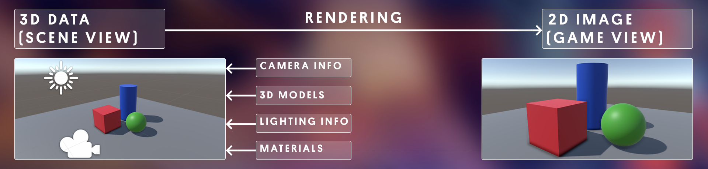
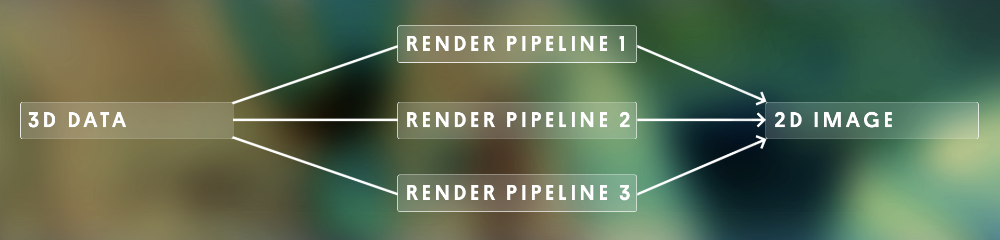
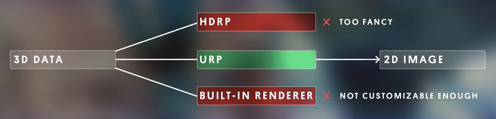
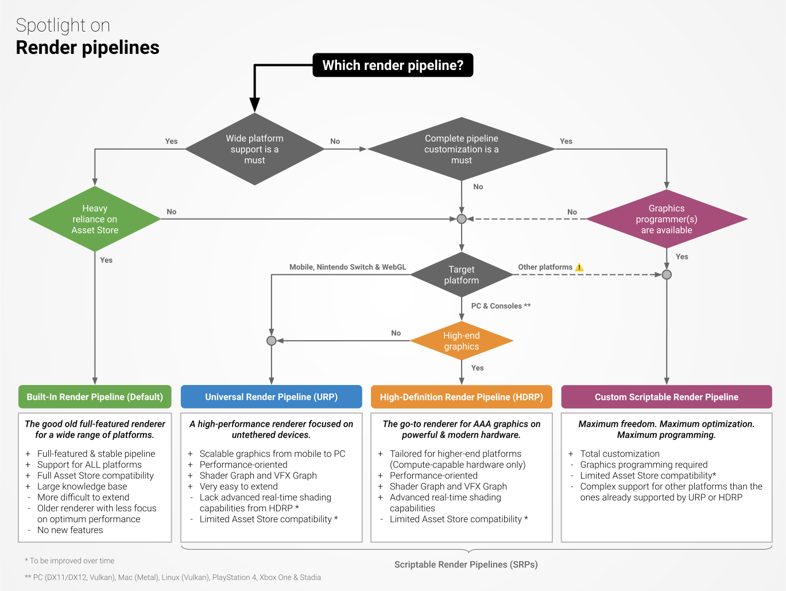

# Render 简介

## 1. 渲染 Render

渲染是获取三维 (3D) 数据并使用它为屏幕生成二维 (2D) 图像的过程。

详细来说，就是在整个 3D 空间中，截取在摄像机范围中的内容，并根据配置，生成最终屏幕图像的过程

在 Unity 中，实现 渲染 Render 的技术称为 渲染管线 Render pipline

## 2. 渲染管线概念

pip line 就是一个线型的路径，有起点，有终点，途径一个或多个中间节点。

如果渲染是从 A 点到 B 点（3D 数据到 2D 图像）的过程，那么您可以将渲染管道视为到达那里的不同方式。

由于每种渲染管线使用不同的技术和计算来生成最终屏幕上的图像，因此结果可能会有所不同，所以不同的渲染管线会产生不同的视觉效果。

## 3. 选择渲染管线

- Unity 的内置渲染管线：
  适用于所有平台，并且非常可靠。它很容易使用，但它是 Unity 内置的，所以它不是很可定制。这也不是最有效的。
- 通用渲染管道( URP ) ：
  非常适合移动、Web 和 VR 项目，因为它针对性能进行了高度优化。它的配置有点复杂，但它比内置渲染管道更具可定制性。它可以产生相当不错的图形。
- 高清渲染管线( HDRP )：
  旨在为具有强大处理能力的高端平台（如游戏机或游戏计算机）生成高质量图形。它的配置非常复杂，因此只能由具有大量图形经验的人使用。

URP 和 HDRP 都是 Scriptable Render Pipelines ( SRP )。SRP 是高度可定制的，甚至可以从头开始编写。由于编写渲染管道是一项较为复杂的任务，Unity 将这两个 SRP 作为模板提供，适合处理大多数项目

> 注意：
>
> - 内置渲染管线不允许对渲染管线进行自定义编程，只能通过选择不同的 Graphics tiers 图形层 来更改图形质量（共 3 层 Tier 1-3 自低到高）
> - 内置渲染管线虽不允许对渲染管线进行编程，但可以在图形层中，使用自定义的 Shader 着色器，着色器可以进行自定义开发（直接用代码，或者使用 shader graph ）
> - 使用 C# 对 Shader 进行编程的代码格式称为 High-level shader language (HLSL)，是微软公司对 DirectX 上的 shader 编程语言。（HLSL is the C-like high-level shader language that you use with programmable shaders in DirectX.）
> - CG 语言是 NVIDIA 的 Shader 开发语言
> - 另一种对 Shader 进行编程的代码格式是 GLSL 是 OpenGL 着色语言
> - OpenGL & DirectX 都是图形应用编程接口。 DirectX 是微软公司的图形 API 库，但它还声音, 输入, 网络等模块，是 windows 下游戏开发的首选库 OpenGL 是开源免费的跨平台 图形 API 库

## 4. Unity 开发首推 URP

现阶段，Unity 还是最适合做手机或平板类设备上的游戏。优先推荐使用 URP

选择 URP 而不是内置渲染管线和 HDRP 的原因：

- 移动设备性能限制，最好不要使用 HDRP，否则很多设备跑不动
- URP 比内置渲染器管线更具可定制性，允许您更加自由地设置效果
- 一些真正强大的新编辑器功能，如 Shader Graph 和 VFX Graph 仅与 URP 兼容，而不与内置渲染管道兼容
- URP 项目针对您想要定位的任何平台（Web、桌面、移动或 VR）上的性能进行了优化，所以性能上并不比内置管线差多少

简单来说就是 URP 虽然最为中庸，但也最合适，兼顾了性能和效果

如果你很了解计算机图形学，可以根据这个链接：[选择和配置渲染管线和光照解决方案](https://docs.unity3d.com/cn/2022.1/Manual/BestPracticeLightingPipelines.html)，来自己做决断

> 参考资料：
>
> - [解释基本的 3D 理论](https://developer.mozilla.org/zh-CN/docs/Games/Techniques/3D_on_the_web/Basic_theory)
> - [图形管线](https://juejin.cn/post/6844904069543247880)

 

 

配套视频教程：
[https://space.bilibili.com/43644141/channel/seriesdetail?sid=299912](https://space.bilibili.com/43644141/channel/seriesdetail?sid=299912)

文章也同时同步微信公众号，喜欢使用手机观看文章的可以关注

