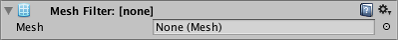
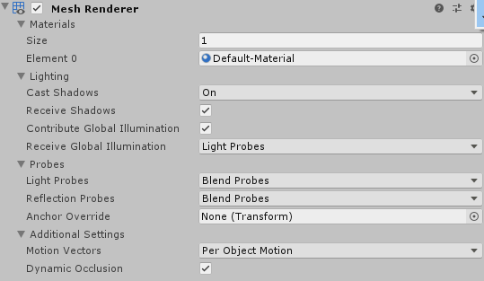
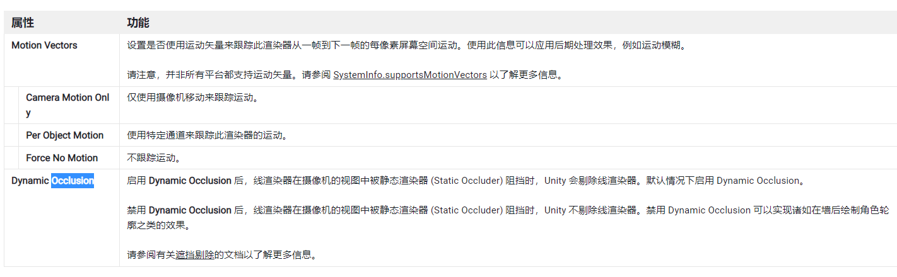
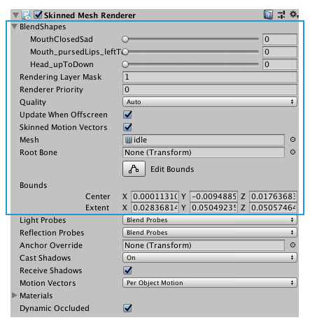

# Mesh 网格

Unity 中，3D 对象的模型（3D 几何图形）是由 Mesh 网格系统组成

## 1. 网格过滤器 (Mesh Filter)

网格过滤器 (Mesh Filter) 从资源中获取网格并将其传递给网格渲染器 (Mesh Renderer) 以便在屏幕上渲染。

导入网格资源时，如果网格带蒙皮，则 Unity 会自动创建带蒙皮的网格渲染器 (Skinned Mesh Renderer)，而如果网格不带蒙皮，则创建网格过滤器 (Mesh Filter) 及网格渲染器 (Mesh Renderer)。

## 2. 网格渲染器 (Mesh Renderer)

网格渲染器从网格过滤器 (Mesh Filter) 获取几何体，然后在游戏对象的变换组件所定义的位置渲染该几何体.

Mesh Renderer 组件包含四组核心属性：

### 2.1 Materials 材质属性组

设置在网格 Mesh 上使用的材质 Material

> 注意：
>
> - 材质可以设置多个，会按照顺序依次排列；
> - 后添加的材质会覆盖前面的材质，
> - 如果后添加的是不透明材质，则前面添加的材质将完全看不到，没有任何意义，只会造成性能上的浪费

### 2.2 Lighting 光照属性组

Lighting 部分包含有关此 Mesh Renderer 如何与 Unity 中的光照交互的属性。

### 2.3 Probes 探针属性组

Probes 部分包含与光照探针 (Light Probes) 和反射探针 (Reflection Probes) 有关的属性。

### 2.4 Additional Setting 扩展设置属性组

## 3. 带蒙皮的网格渲染器 (Skinned Mesh Renderer)

Unity 使用**带蒙皮的网格渲染器 (Skinned Mesh Renderer)** 组件来渲染骨骼动画；此类动画中的网格形状由动画骨骼进行变形。这种技术对于关节弯曲的角色和其他对象（与关节更像铰链的机器相反）非常有用。

**骨骼**是蒙皮网格内的不可见对象，会影响网格在动画过程中的变形方式。骨骼连接在一起形成分层的“骨架”，并通过旋转骨架的关节使骨架移动来定义动画。每个骨骼都附着在周围网格的一些顶点上。播放动画时，顶点会随着它们所连接的一个或多个骨骼移动，因此“皮肤”也跟随骨架移动。在简单的关节（例如肘部）处，网格顶点受到在此处相交的两个骨骼的影响，当关节弯曲时，网格将逼真地伸展和旋转。在更复杂的情况下，两个以上的骨骼会影响网格的特定区域，从而产生更微妙的移动。

 

 

配套视频教程：
[https://space.bilibili.com/43644141/channel/seriesdetail?sid=299912](https://space.bilibili.com/43644141/channel/seriesdetail?sid=299912)

文章也同时同步微信公众号，喜欢使用手机观看文章的可以关注

