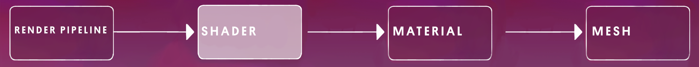
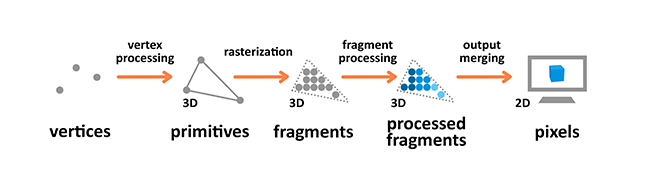
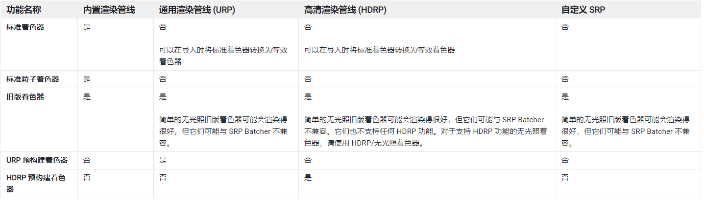
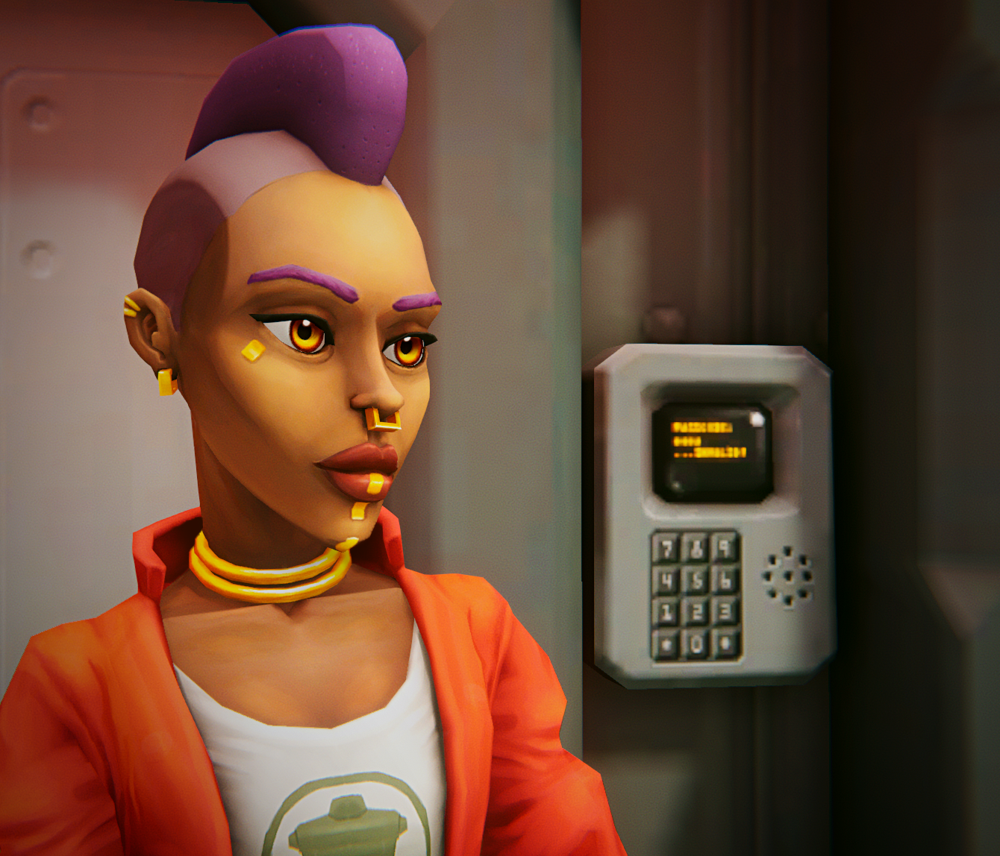
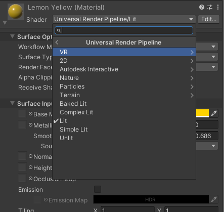

# shader 着色器

## 1. 概述

3D 模型本质上是称为顶点的 3D 坐标的集合。它们连接在一起形成三角形。每个顶点可以包含信息，例如颜色、指向的方向（称为法线）和一些用于将纹理映射到其上的坐标（称为 UV 数据）。

没有材质就无法渲染模型。材质是包含着色器及其属性值的包装器。因此，不同的材质可以共享相同的着色器，并为其提供不同的数据。

着色器是一段脚本程序，在 GPU 上运行。

每个着色器都是为特定的渲染管道编写的，也就是说，shader 绑定 render pip line，不能在不同的渲染管线上是使用。

您使用的着色器取决于您的渲染管道。在 Unity 中，每个模板都带有专门为模板中使用的渲染管道设计的着色器。

着色器可以变化很大，提供可以应用于项目的各种视觉样式。

## 2. 分类

### 2.1 基本功能分类

1. 片元着色 fragment shading:  
   也称为像素着色，是表示网格表面以产生二维图像中每个像素的颜色的着色。

2. 顶点着色 vertex shading:  
   作用于网格的顶点，通常改变它们的位置以使表面移动或变换。

### 2.2 Unity 中使用方式分类

在 Unity 中，着色器根据使用方式不同，分为三大类。每个类别的用途不同，使用方式也不同。

1. 内嵌着色器：  
   作为图形管线一部分的着色器是最常见的着色器类型。它们执行一些计算来确定屏幕上像素的颜色。在 Unity 中，通常是通过 Shader 对象使用这种类型的着色器。
2. 计算着色器：  
   在常规图形管线之外，在 GPU 上执行计算。
3. 光线追踪着色器：  
   执行与光线追踪相关的计算。

## 3. 相关术语：

- 着色器或者着色器程序 - 在 GPU 上运行的程序。除非另有说明，否则这意味着着色器程序是图形管线的一部分。
- Shader 对象 - Shader 类的一个实例。Shader 对象是着色器程序和其他信息的封装器。
- ShaderLab - 一种用于编写着色器的 Unity 特定语言。
- Shader Graph - 一种无需编写代码即可创建着色器的工具。
- 着色器资源 - Unity 项目中扩展名为 .shader 的文件。即使用代码定义的一个 Shader 对象。
- Shader Graph 资源 - Unity 项目中的 Shader Graph 文件。即使用 Shader Graph 定义的一个 Shader 对象。

## 4. Shader 使用过程（着色器加载）

### 4.1 默认加载过程

默认情况下，Unity 的运行时着色器加载行为如下：

1. 当 Unity 加载场景或使用在运行时加载资源功能加载内容时，它会将所有需要的 Shader 对象加载到 CPU 内存。
2. Unity 第一次需要使用着色器变体渲染几何体时，它将该变体的数据传递给图形驱动程序。图形驱动程序在 GPU 上创建该变体的表示，并执行平台所需的任何其他工作。

- 优点:  
   这种行为的好处是着色器变体没有前期的 GPU 内存使用或加载时间
- 缺点：  
  第一次使用变体时可能会出现明显的停顿，因为图形驱动程序必须在 GPU 上创建着色器程序并执行任何额外的工作。

### 4.2 预热着色器变体

为避免在性能开销大时出现明显的停顿，Unity 可以要求图形驱动程序在首次需要着色器变体之前创建它们的 GPU 表示形式。这称为预热。

> 注意：  
> 警告：在选择如何执行预热之前，请查看有关图形 API 支持的说明。在 DX12、Vulkan 和 Metal 等现代图形 API 上，只有实验性的 ShaderWarmup API 完全支持，因为它允许您指定顶点格式。使用其他方法可能会导致浪费工作和 GPU 内存，而不会避免停顿。

## 5. 内置着色器

Unity 内置的着色器，可以直接配置后使用，不用从零开始编程

不同的渲染管线需要使用不同的内置着色器。

> 注意：  
> 着色器必须与项目的渲染管线兼容。如果新建了一个空项目，却导入了使用不同渲染管线旧项目，很大几率会造成兼容性错误，所有 3D 模型外观将成为紫色。

## 6. Physically Based Shading 基于物理着色

### 6.1 物理着色 PBS

- PBS ： Physically Based Shading 基于物理着色
- PBR ： Physically Based Rendering 基于物理渲染

基于物理着色 (PBS) 以一种模仿现实的方式模拟材质和光照之间的相互作用。

PBR 模拟现实世界的物理原理和光，以在 3D 表面上生成逼真的阴影、反射、环境光和其他光效果。

在下图中，每个表面的外观随着场景中光线的变化而变化。每个图像中表面的属性都是相同的——只是光的颜色和方向发生了变化。

### 6.2 non-Physically Based Rendering 非物理着色 NPBS

渲染的颜色、阴影和反射要么在没有 PBR 科学的情况下进行近似，要么只是不渲染。

非 PBR 通常看起来不像 PBR 那样逼真，但对于风格化效果可能更理想。使 3D 场景中的表面看起来像 2D 卡通的卡通着色器是一种非 PBR 着色器。

## 7. 在 URP 中使用 Shader

在 3D 对象的 Material 属性面板上，可以选择要是用的 shader

### 很多着色器的名称中都有 Lit 或 Unlit 。

- Lit：光照着色器响应场景中的光线，而无光照着色器则不会。
- Unlit：无光照着色器对于某些艺术效果或通过不使用光照更有效地运行的优化项目很有用。

> 注意：
> 一般不建议更改已创建材质的着色器。应该在创建材质时，选定 shader ，之后就不再改动，否则很容易出错

### Universal Render Pipeline 中的着色器分类：

- 2D > Sprite-Lit-Default ：专为 2D 项目设计，此着色器仅适用于平面对象，并将任何 3D 对象渲染为 2D。作为光照着色器，它将根据场景中到达对象的光线进行渲染。
- Particles > Lit、Simple Lit 和 Unlit：这些着色器用于视觉效果 (VFX)
- Terrain > Lit：此着色器针对 Unity 中的 Terrain 工具进行了优化
- Baked Lit 烘焙光照：此着色器会自动应用于光照贴图
- 复杂光照 Complex Lit、光照 Lit 和简单光照 Simple Lit：这些都是通用的、基于物理的光照着色器的变体。
- Unlit：如上所述，不使用灯光的着色器。

 

 

配套视频教程：
[https://space.bilibili.com/43644141/channel/seriesdetail?sid=299912](https://space.bilibili.com/43644141/channel/seriesdetail?sid=299912)

文章也同时同步微信公众号，喜欢使用手机观看文章的可以关注

