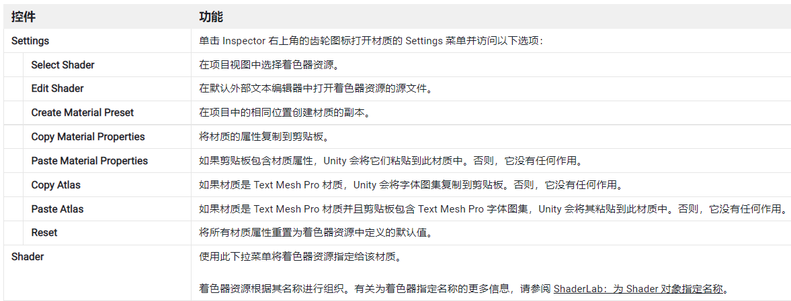
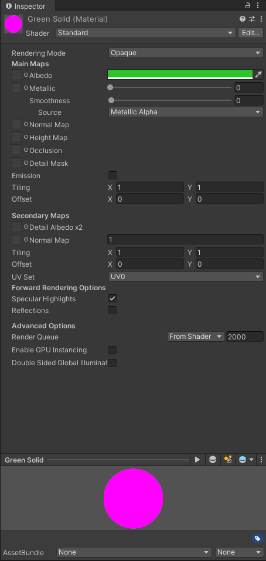
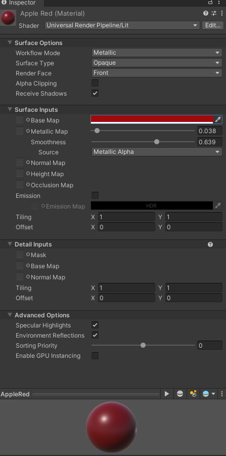

# Material 材质

## 1. 概述

材质是包含定义网格外观的颜色、图像和其他属性的资产（与您的项目一起存储并在项目文件夹中管理）。

在 Unity 中，可以同时使用材质和着色器来定义场景的外观。

材质包含对 Shader 对象的引用。如果 Shader 对象定义材质属性，则材质还可以包含数据（如颜色或纹理参考等）。

Material 类表示 C# 代码中的材质。有关信息，请参阅在 C# 脚本中使用材质。

材质资源是扩展名为 .mat 的文件。它表示 Unity 项目中的材质。

## 2. 创建材质

### 创建材质资源并为其分配着色器

1. 要在项目中创建新材质资源，请从主菜单或 Project 视图上下文菜单中选择 Assets > Create > Material。
2. 要将着色器分配给材质资源，请在 Inspector 窗口中使用 Shader 下拉菜单。

## 3. 使用材质

### 使用材质渲染游戏对象：

1. 添加一个从 Renderer 继承的组件。MeshRenderer 是最常见的，适用于大多数用例，但如果游戏对象有特殊要求，SkinnedMeshRenderer、LineRenderer 或 TrailRenderer 可能更合适。
2. 将材质资源分配给组件的 Material 属性。

### 使用材质渲染内置粒子系统中的粒子系统：

1. 添加一个渲染器模块到粒子系统。
2. 将材质资源分配给渲染模块的 Material 属性。

> 注意：
>
> 1. Material 材质是一种 Unity 资源，可以像文件一样复制粘贴，在不同项目间移动使用
> 2. 在对象的 Material 组件上，可以直接对材质本身进行编辑，更改后的材质，会影响到所有使用该材质的对象，要慎重

## 4. 材质组件

### 4.1 材质组件设置：

### 4.2 材质组件属性：

不同渲染管道的材质，有不同的材质属性面板

#### 内置渲染管道材质属性面板：

#### URP 材质属性面板：

 

 

配套视频教程：
[https://space.bilibili.com/43644141/channel/seriesdetail?sid=299912](https://space.bilibili.com/43644141/channel/seriesdetail?sid=299912)

文章也同时同步微信公众号，喜欢使用手机观看文章的可以关注

