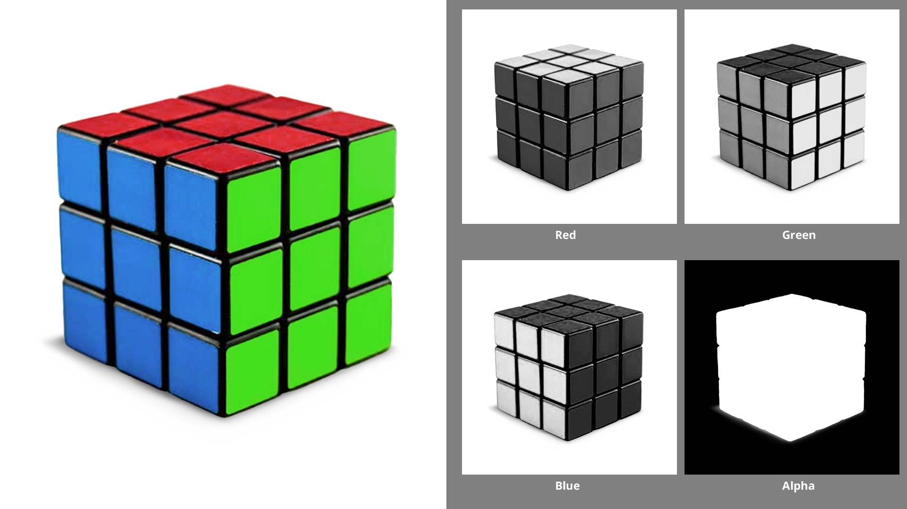
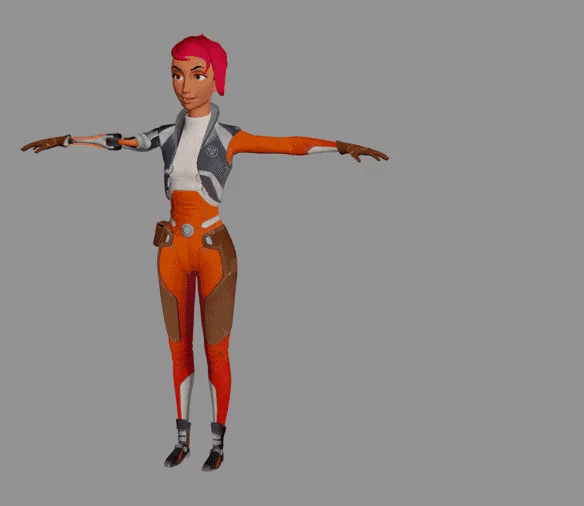
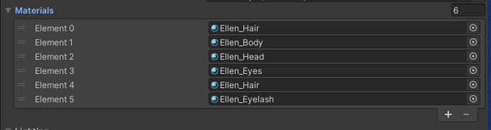

# Map & Texture 贴图和纹理

纹理是环绕 3D 对象的 2D 贴图，以创建颜色、反射率和其他属性的变化

## 1. 贴图

均匀的纯色物体表面，最容易模拟，只需要在 材质的 Base Map 属性上，设置对应的颜色即可。

- 漫反射颜色：上面所说的纯色
- 贴图颜色：设置了贴图用的纹理后，纹理图片会替代漫反射颜色，可以将这种使用了纹理的颜色，称为贴图颜色

大多数现实世界的物体没有均匀的反射率和平滑度。Unity 以及所有的 3D 模型处理软件中，使用贴图 Map 来模拟 3D 物体的表面

贴图 Map 是围绕游戏对象的 2D 图像，就像一张纸一样，用于设置网格中的颜色、镜面反射或金属度、物理纹理和其他属性。

贴图所使用的图像文件称为纹理。

## 2. 纹理

纹理，就是我们非常熟悉的的位图文件。

Unity 支持的纹理格式有： BMP、EXR、GIF、HDR、IFF、PICT、TGA、PSD、PICT、TIFF、PNG 和 JPG。

### 双通道和三通道、四通道

- 灰度图像：
  图像文件中的数据被组织成通道。黑白图像，也称为灰度图像，只有一个通道来指示每个像素中的灰度阴影。
- 彩色图像：
  需要三个通道，红色、绿色和蓝色 (RGB)，它们结合起来可以创建您在计算机显示器上看到的颜色。
- 四通道：  
   某些图像文件格式有四个通道：红色、绿色、蓝色和 alpha (RGBA)。Alpha 通道通常包含透明度数据。
  

### 通道

图像文件的每个通道本身就是一个数字矩阵。在材料中，这些数字可以指示除了颜色或透明度之外的其他属性——例如平滑度、镜面反射度或金属度——甚至是每个像素面对的方向以创建物理特征的外观。

### 纹理文件的来源

艺术家通常在 3D 建模软件（例如 Blender® 和 Adob​​e® Substance 3D Painter®）中创建纹理及其模型。将网格和纹理导入 Unity 后，他们使用纹理创建材质。

此外，常规的 2D 图像可以成为纹理。您甚至可以拍摄现实世界中的表面照片来构建自己的纹理！

## 3. 使用纹理

### 3.1 在 Base Map 上使用纹理改变物体表面颜色

Base Map Texture （也称为漫反射或反照率）是一个常规 RGB 或 RGBA 彩色图像文件，用于定义对象表面的漫反射（即颜色）。

使用时，将纹理资源文件，拖拽或选择到 Base Map 属性左侧方框中即可。

可以使用到 Base Map 上的纹理资源文件，通常命名时，名称中会包含诸如 albedo、diffuse 或 base 之类的词，作为前缀或后缀

### 3.2 平铺纹理

一些纹理可以用来像瓦片一样，在物体表面进行平铺（多次重复自身）贴图。

比如，本次课程示例中 Tiled Textures 文件夹中的纹理。

> 注意：平铺和偏移设置适用于网格上的所有贴图。
>
> - 平铺是网格表面上每单位的平铺数量。数字越大，图案越小。
> - 偏移提供偏移量。例如，0.5 的 X 偏移将平铺偏移纹理宽度的一半。

### 3.3 UV 贴图

由 Autodesk® 3ds Max® 和 Maya® 或 Blender® 等建模应用程序制作的网格会生成它们自己的称为 UV 坐标的 2D 坐标集。UV 坐标类似于常规 2D 空间中的 XY 坐标，但它们被称为 UV 以将它们与环境坐标系 (XYZ) 区分开来。UV 坐标相对于网格，而不是场景中的 3D 空间。

UV 映射是展开 3D 模型的表面以创建平面，然后对其应用 2D 纹理贴图的过程。在此过程中，建模应用程序生成 UV 坐标，允许将纹理回绕到模型上。

建模可以产生复杂的对象，比如我们的角色艾伦。Ellen 由多个网格组成，称为子网格，每个网格都有自己的材质。但是 Ellen 只有几个子网格——从颈部以下的所有东西都是一个子网格，需要一种材料。

UV 映射允许艺术家在不使用大量网格数据或单独的纹理来提供细节的情况下对其对象的表面进行建模。

### 3.4 用纹理改变反射特性

可以将贴图用于镜面反射/金属反射率和平滑度，以在网格上创建比其他区域更亮或更平滑的特定区域。

在 Textures Exhibit 中展示的第二个纹理，Ellen 的金属贴图。

由于 Ellen 的身体材质使用的是 Metallic 工作流程，所以这张贴图是灰度的。虽然金属数据在纹理文件的 R、G 和 B 通道中，但着色器只读取 R 通道。

平滑度贴图（在我们的展示中显示为第三个纹理）存储在纹理文件的 Alpha 通道中。您可以在这里看到 Ellen 身体模型上许多不同类型的表面的各种平滑度。

> 参考资料
>
> - [贴图材质 官方教程](https://learn.unity.com/tutorial/map-materials-with-textures)
> - [纹理官方文档](https://docs.unity3d.com/cn/2022.1/Manual/Textures.html)

> 资源网站:
>
> - [https://ambientcg.com/ 免费 PBR 纹理资源](https://ambientcg.com/)
> - [https://www.myfreetextures.com/](https://www.myfreetextures.com/)
> - [https://pixabay.com/images/search/texture/](https://pixabay.com/images/search/texture/)

 

 

配套视频教程：
[https://space.bilibili.com/43644141/channel/seriesdetail?sid=299912](https://space.bilibili.com/43644141/channel/seriesdetail?sid=299912)

文章也同时同步微信公众号，喜欢使用手机观看文章的可以关注

