# Shader Graph 简介

> 建议：
>
> 对 Shader 概念不太清楚的同学，先回顾一下前面的 [03-Shader 着色器](https://gitee.com/chutianshu1981/AwesomeUnityTutorial/blob/main/%E5%9B%BE%E5%BD%A2-%E6%8A%80%E6%9C%AF%E7%BE%8E%E5%B7%A5%E7%9B%B8%E5%85%B3/03-Shader%E7%9D%80%E8%89%B2%E5%99%A8.md) 这一节文档。

## 1. 什么是 Shader Graph

Shader Graph 就是图形化 Shader 编程工具。类似于 Blender 中的 Shader Editor

Shader Graph 可以帮助您使用类似流程图的图形来构建着色器。在创建图表时，您可以实时查看着色器的材质效果，这让您可以轻松进行实验。

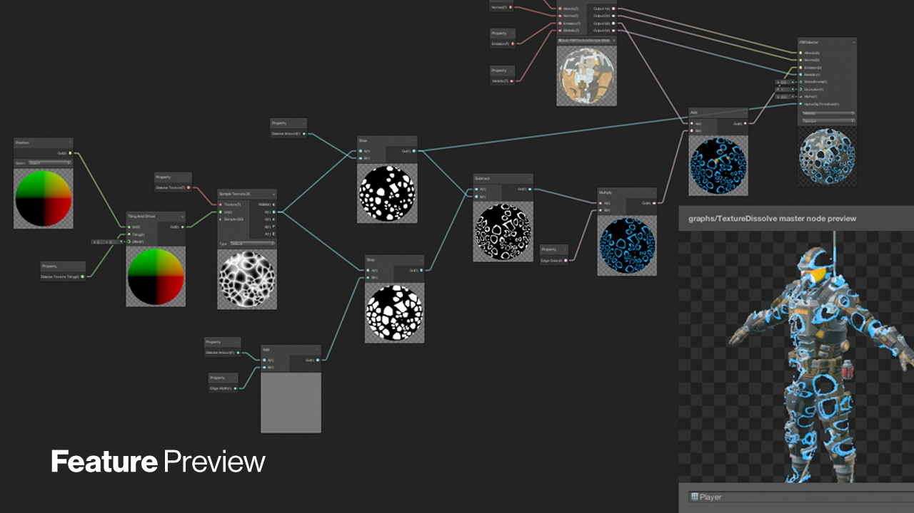

Shader Graph 能够让您直观地构建着色器。您可以在图形框架中创建并连接节点，而不必手写代码。

使用 Shader Graph 可以极大地降低 Shader 开发的难度，对于没有 Shader 编程开发经验的初学者，以及非程序员非常友好。

Shader 可以用于渲染管线，也可以用于制作特效。

下图中使用了 Shader Graph 创建的着色器，请看效果：

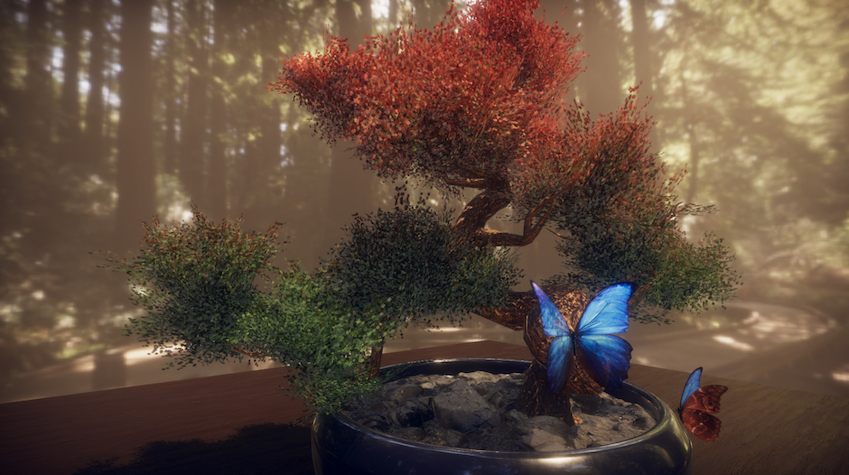

> 注意：
>
> - 内置渲染管线虽不允许对渲染管线进行编程，但可以在图形层中，使用自定义的 Shader 着色器，着色器可以进行自定义开发（直接用代码，或 使用 shader graph ）。
> - 自定义的渲染管线，不支持 Shader Graph

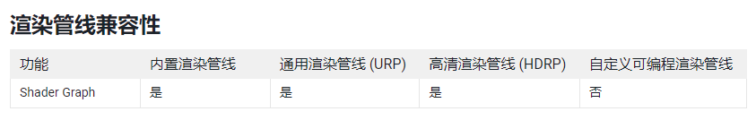

## 2. 获取 Shader Graph

着色器图可通过 Unity 编辑器支持版本中的包管理器窗口获得。

如果您安装 Scriptable Render Pipeline (SRP)，例如 Universal Render Pipeline (URP)或 High Definition Render Pipeline (HDRP)，Unity 会自动在您的项目中安装 Shader Graph。

Unity Engine 2018.x 上的 Shader Graph 包版本为预览版，不接受错误修复和功能维护。要使用受积极支持的 Shader Graph 版本，请使用 Unity Engine 2019.1 或更高版本。

## 3. 创建 Shader Graph

右键单击 Project 窗口，在上下文菜单中找到 Create > Shader Graph，然后选择所需的 Shader Graph 类型。

下图是 URP 项目中创建 Shader Graph 的截图：

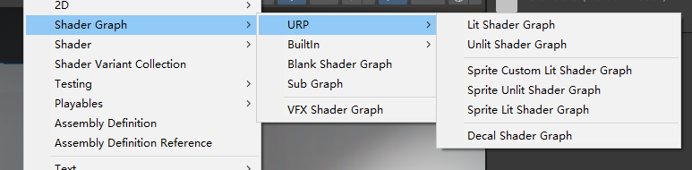

这会在指定文件夹下，生成一个后缀名为 .shadergraph 的文件，保存 Shader 的信息。


可用的 Shader Graph 类型取决于项目中存在的渲染管道。根据渲染管道，某些选项可能存在也可能不存在。所以如果到了 HDRP 项目中，肯定和上面截图中不同，不会有 URP 选项，而是换成 HDRP。

不过，以下选项始终可用：

- Blank Shader Graph：一个完全空白的着色器图。没有选择目标，也没有块被添加到主堆栈。
- Sub Graph: 一个空白的子图资产。

## 4. Shader Graph 界面

### 4.1 Shader Graph 窗口

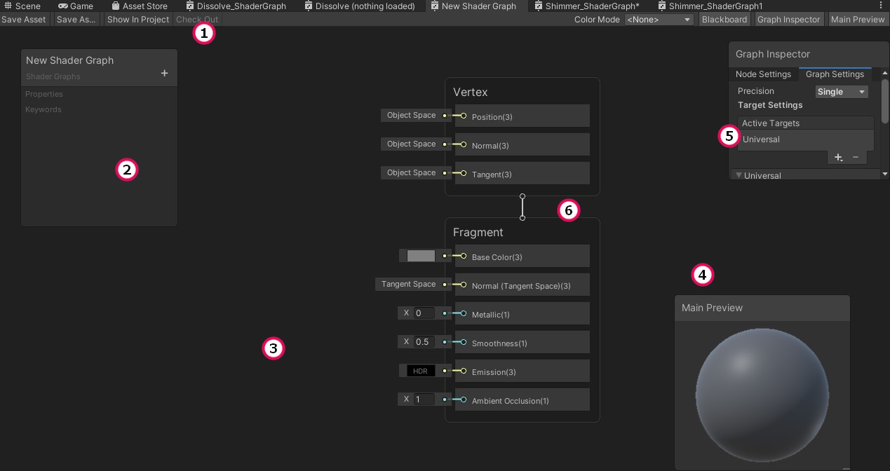

- Shader Graph 工具栏 (1): 是您保存着色器资源的地方。

* Blackboard 黑板(2): 包含可供使用此着色器创建材质所使用的属性（可以在 Unity 的 Inspector 窗口中进行值配置）。可以在此处对图表中的属性和关键字进行定义、排序和分类。在 Blackboard 中，您还可以编辑所选 Shader Graph Asset 或 Sub Graph 的路径。
* 工作区 (3): 将在其中创建着色器的节点图。
* Main Preview 主预览窗口 (4): 将为您提供着色器外观及其行为方式的实时更新。
* Graph Inspector 图形检查器窗口 (5): 将显示您选择的任何节点的当前设置、属性和值。
* Master Stack 主堆栈 (6): 是定义着色器最终表面外观的着色器图的终点，一个 Shader 中有且只有一个。它列出了顶点着色器和片段（片元）着色器的主要着色器属性，并为您提供了插入必要值的末端节点。
* Internal Inspector：包含与用户当前单击的任何内容相关的信息的区域。这是一个默认情况下自动隐藏的窗口，只有在选择了用户可以编辑的内容时才会出现。使用内部检查器显示和修改属性、节点选项和图形设置。


### 4.2 Shader Graph 窗口操作方式

- 平移：单击鼠标中键并拖动，或按住 Alt (Windows) 或 Option (macOS) 并单击并拖动。
- 缩放：旋转滚轮或使用触控板缩放。
- 聚焦和放大：选择一个元素并按 F 键。
- 适合窗口：按 A 键。
- 空格键：创建节点，打开创建节点菜单

## 5. 使用 Shader Graph 编辑 Shader 通用步骤

虽然不同的 Shader ，需要使用不同的编写方式，但在使用 Shader Graph 编辑 Shader，大体上都会遵循下面的步骤：

1. 创建节点；
2. 配置节点；
3. 连接节点：
4. 输出结果到主堆栈（Master Stack）
5. 保存图表
6. 创建材质，选择编辑好的 Shader，并挂接到游戏对象，这一步，也可以放到第二步，这样可以随时在 Unity 中观察 Shader 在游戏对象上的效果

> 注意：  
> Shader Graph 的 Shader Editor 中，Ctrl + s 无效（Unity 2022.1 之前版本），想要保存的话，需要点击工具栏中的 Save 按钮。

## 6. Node 节点

### 6.1 节点概述

Shader Graph 中和新元素是 Node 节点，每种节点功能各不相同。

每个节点都包含多个端口 Port，每个端口都有确定的数据类型，这些 Port 端口可以用来输入（在节点左侧）、输出（在节点右侧）。

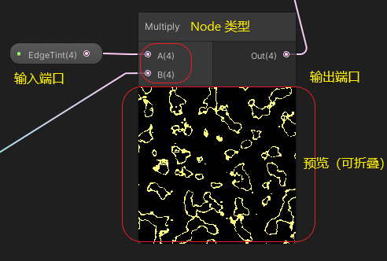

通过 边 Edge 可以将节点连接起来，组成完整的 Shader Graph。

只有一个 Edge 可以连接到任何输入端口，但多个 Edge 可以连接到输出端口。

### 6.2 节点分类

不同版本 Shader Graph 中，包含的节点种类不同，在最新的 2022.1 版本的 Unity 中，对应的 Shader Graph 为 14.0.0，其中已经包含了近百种不同类型的 Node 。

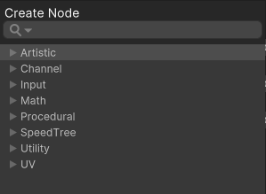

在 Shader 编辑器中，按照 Create Node 菜单，将其分为八大类，大类中还有子类的细分

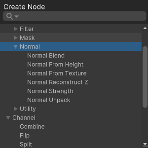

在此无法一一细说，就像类库中的类一样，用到时再讲

## 7. 主堆栈 Master Stack

### 7.1 主堆栈

主堆栈是定义着色器最终表面外观的着色器图的终点，一个 Shader Graph 中 有且只有一个。

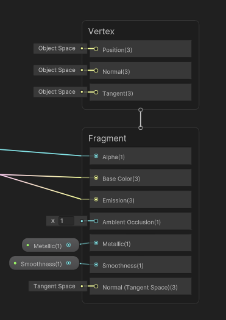

主堆栈的内容可能会根据您选择的图表设置而改变，主堆栈由包含 Block Node 块节点的上下文 Context 组成

### 7.2 Context 上下文

主堆栈包含两个上下文：顶点 Vetext 和片段(片元) Fragment 。这些代表着色器的两个阶段。

连接到顶点上下文中块的节点成为最终着色器顶点函数的一部分。您连接到片段上下文中的块的节点成为最终着色器的片段（或像素）函数的一部分。

如果您将任何节点连接到两个上下文，它们将执行两次，一次在顶点函数中，然后再次在片段函数中。您不能剪切、复制或粘贴上下文。


### 7.3 Block Node 块节点

块节点是主堆栈的特定类型的节点。Block Node 表示 Shader Graph 在最终着色器输出中使用的单个表面（或顶点）描述数据。

特定于某个渲染管道的 Block Node 块节点仅可用于该管道，例如，Universal Block 节点仅适用于 Universal Render Pipeline (URP)，High Definition Block 节点仅适用于 High Definition Render Pipeline (HDRP)。

## 8. 示例中用到的节点

配套视频教程中，制作了一个散发着流动微光的透明 Shader，其中用到的节点，在下面一一介绍一下

### 8.1 Gradient Noise Node 梯度噪声节点

此节点属于代码生成类节点（Procedural），其特点是，用于 Shader 的数据来自于代码（算法）生成。

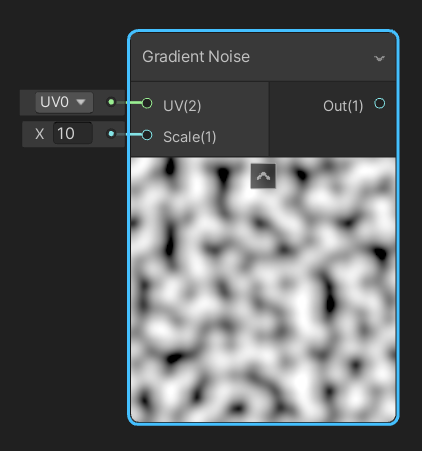

根据输入 UV（float2 类型值）生成梯度或 Perlin 噪声。生成噪声的比例由输入 Scale 控制，Scale 值越大，噪声斑纹越小。

梯度噪声产生的纹理具有连续性，所以经常用来模拟<font color=red>山脉、云朵、水</font>等具有连续性（波状）的物质，该类噪声的典型代表是 Perlin Noise。

其它梯度噪声还有 Simplex Noise 和 Wavelet Noise，它们也是由 Perlin Noise 演变而来。

下图显示了各种不同的噪声算法对应的灰度图：

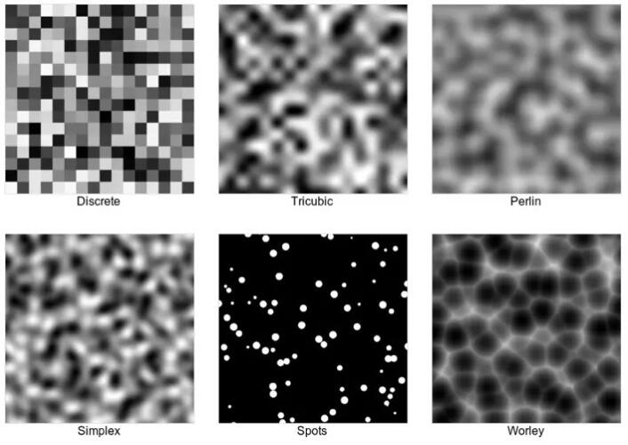

> 扩展阅读：[图形噪声](https://huailiang.github.io/blog/2021/noise/)

### 8.2 属性节点 Property Node

属性节点，就是 Blackboard 黑板 中创建的属性值节点，使用步骤：

1. 在 Blackboard 中创建属性；  
   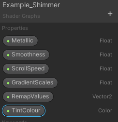
2. 将属性拖拽到 Shader 里，用于输入；  
   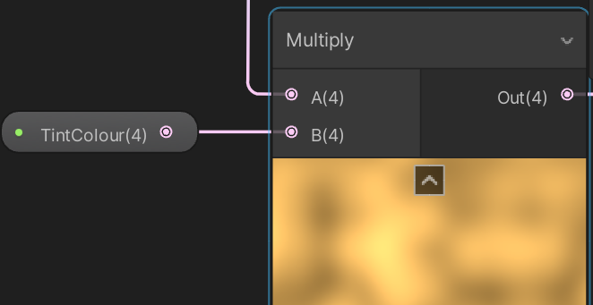
3. 在 Shader Editor 的 Graph Inspector 的 Node Settings 中，可以对属性设置进行更改  
   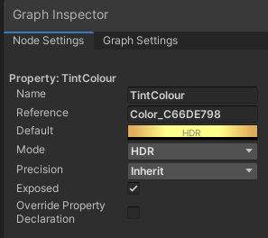
4. 在 unity Inspector 中，可以随时更改属性值  
   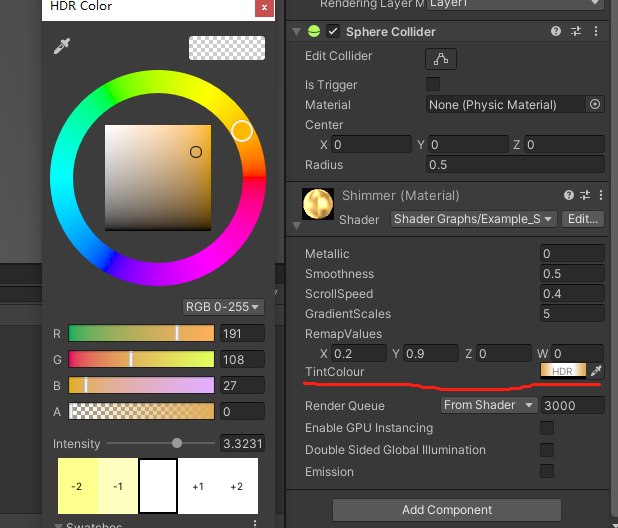

### 8.3 算术节点 Math Node

顾名思义，是用作算术运算的节点，比如最基础的加减乘除

本节例子中，用到了乘法 Multiply 和除法 Divide

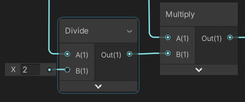

### 8.4 平铺和偏移节点 Tilling and Offset Node

为 UV 输入，提供平铺和偏移设置，输出新的处理过的 UV。

- 平铺 Tilling ：一个 float2 （x,y）类型的值，默认 x=1,y=1 表示保持原始大小。X=0.5，y=0.5，表示在原先一个单位区域，现在只能放下 1/4，纹理会被拉伸；x=2,y=2，表示原先一个单位空间，将放入 4 个，纹理会被缩小
- 偏移 Offset ：一个 float2 值（x,y），设置通道的偏移量，默认 x= 0,y=0。设置后，会在指定坐标轴产生偏移。

这通常用于细节贴图和随时间滚动的纹理。

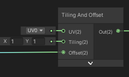

### 8.5 重映射节点 Remap Node

将输入的值映射到另一个范围之中，如下图是将 -1~1 映射到 0~1

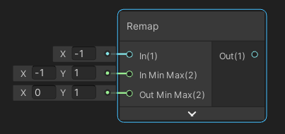

左侧输入：

- In ：输入的值
- In Min Max ：输入值的范围
- Out Min Max : 输出值的范围

右侧输出：

- out ：输入值根据输入输出值范围，重新映射后，得到的值

### 8.6 时间节点 Time Node

该节点属于 Input - Basic 分类，所以是一种基础的数据输入类节点，用来提供随时间变化的动态值，作为其他节点的输入

该节点是 Shader Graph 中，实现动态效果的不二之选。

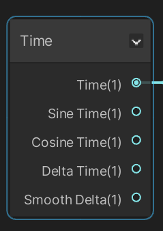

```C#
float Time_Time = _Time.y; // 随时间增大的浮点值
float Time_SineTime = _SinTime.w;//正弦时间，随时间在（-1，1）之间变化
float Time_CosineTime = _CosTime.w;//余弦时间
float Time_DeltaTime = unity_DeltaTime.x;//当前帧时间，从前一帧，到后一帧所用的时间
float Time_SmoothDelta = unity_DeltaTime.z;//平滑后的当前帧时间
```

### 8.7 分支节点 Branch Node

类似于 if 判断语句，当 Predicate 为真时，输出的值是 True 输入端口的值；当 Predicate 为假时，输出值等于 False 输入端口对应的值

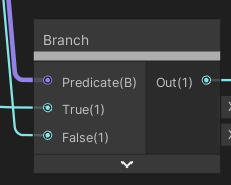

### 8.8 Step Node

如果输入 In 的值大于或等于输入 Edge 的值，则返回 1 ，否则返回 0。

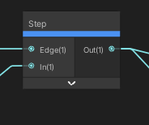

<br>

<br>

> 注意：
>
> - 学习这些和较为复杂算法相关的节点时，不需要把注意力放在算法上，只需要记住节点的用途即可，也就是节点能做出的效果。
> - 学习 Shader Graph 注重积累，学习过程更像是背单词，一类 Shader 效果对应一套流程；学这个不是靠原理和逻辑，更多是经验的积累，由量变到质变

<br>

<hr>
<br>

> 参考资料：
>
> - [官方文档-着色器](https://docs.unity3d.com/cn/current/Manual/Shaders.html)
> - [创意核心教程-初学 ShaderGraph](https://learn.unity.com/tutorial/get-started-with-shader-graph)
> - [Shader Graph 官方文档](https://docs.unity3d.com/Packages/com.unity.shadergraph@14.0/manual/index.html)
> - [图形噪声](https://huailiang.github.io/blog/2021/noise/)
> - [Unity 之 ShaderGraph Procedural 节点解析汇总](https://blog.csdn.net/Czhenya/article/details/119900293)
> - [Gabriel Aguiar Prod. 特效教程](https://www.youtube.com/c/GabrielAguiarProd/videos)
> - [How to Use All 200+ Nodes in Unity Shader Graph youtube](https://www.youtube.com/watch?v=84A1FcQt9v4)

配套视频教程：
[https://space.bilibili.com/43644141/channel/seriesdetail?sid=299912](https://space.bilibili.com/43644141/channel/seriesdetail?sid=299912)

文章也同时同步微信公众号，喜欢使用手机观看文章的可以关注


